# Workflow Diagrams for Functional Areas

This document provides detailed workflow diagrams for all 21 functional areas in the Autonomy Platform. Each diagram shows the step-by-step process, user roles involved, decision points, and system interactions.

**Legend:**
- 🟦 **User Action**: Action performed by a user
- 🟨 **System Process**: Automated system processing
- 🟩 **Decision Point**: User approval or choice required
- 🟥 **Multi-User Interaction**: Requires coordination between multiple users
- ⚡ **AI Agent**: AI-powered automation available

---

## Table of Contents

### Strategic Planning
1. [Network Design](#1-network-design)
2. [Demand Forecasting](#2-demand-forecasting)
3. [Inventory Optimization](#3-inventory-optimization)
4. [Stochastic Planning](#4-stochastic-planning)

### Tactical Planning
5. [Master Production Scheduling (MPS)](#5-master-production-scheduling-mps)
6. [Lot Sizing Analysis](#6-lot-sizing-analysis)
7. [Capacity Check](#7-capacity-check)
8. [Material Requirements Planning (MRP)](#8-material-requirements-planning-mrp)

### Operational Planning
9. [Supply Plan Generation](#9-supply-plan-generation)
10. [Available-to-Promise / Capable-to-Promise (ATP/CTP)](#10-available-to-promise--capable-to-promise-atpctp)
11. [Sourcing & Allocation](#11-sourcing--allocation)
12. [Order Planning](#12-order-planning)

### Execution & Monitoring
13. [Order Management](#13-order-management)
14. [Shipment Tracking](#14-shipment-tracking)
15. [Inventory Visibility](#15-inventory-visibility)
16. [N-Tier Visibility](#16-n-tier-visibility)

### Analytics & Insights
17. [Supply Chain Analytics](#17-supply-chain-analytics)
18. [KPI Monitoring](#18-kpi-monitoring)
19. [Scenario Comparison](#19-scenario-comparison)
20. [Risk Analysis](#20-risk-analysis)

### AI & Multi-Agent Orchestration (Phase 4)
22. [AI Multi-Agent Decision-Making](#22-ai-multi-agent-decision-making-phase-4)
23. [Agent Mode Switching](#23-agent-mode-switching)
24. [A/B Testing for Learning Algorithms](#24-ab-testing-for-learning-algorithms)

### Other
21. [Group Admin User Management](#21-group-admin-user-management)

---

## 1. Network Design

**Purpose**: Design and configure supply chain network topology with nodes, lanes, and products.

**Primary Users**: Supply Chain Architect, Network Planner

**Multi-User**: Yes - Requires approval from SC Director

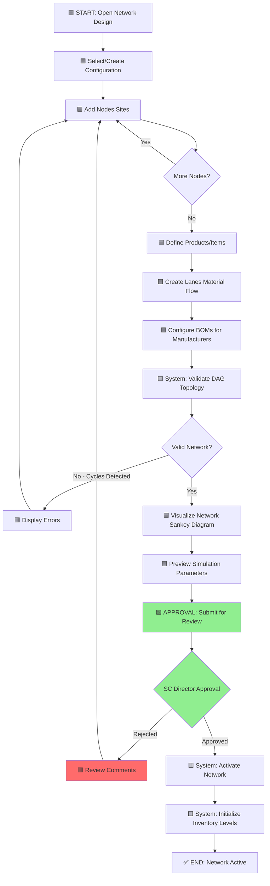

**Key Multi-User Interactions**:
1. **Network Architect** → Designs topology
2. **Data Analyst** → Validates historical data alignment
3. **SC Director** → Approves network for production use

---

## 2. Demand Forecasting

**Purpose**: Generate statistical and ML-based demand forecasts with confidence intervals.

**Primary Users**: Demand Planner, Data Scientist

**Multi-User**: Yes - Collaboration with Sales for consensus planning

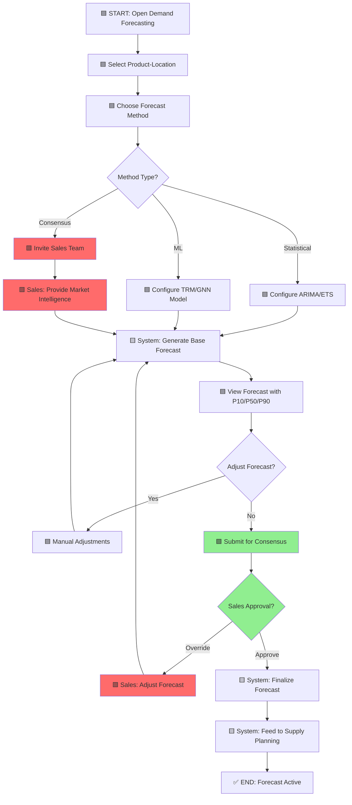

**Key Multi-User Interactions**:
1. **Demand Planner** → Generates statistical forecast
2. **Sales Team** → Provides market intelligence and overrides
3. **Supply Planner** → Consumes forecast for supply planning

---

## 3. Inventory Optimization

**Purpose**: Calculate optimal safety stock and reorder points using 4 policy types.

**Primary Users**: Inventory Analyst, Supply Planner

**Multi-User**: No - Individual planner workflow

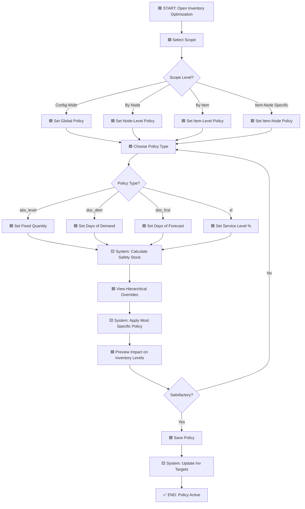

**Hierarchical Override Logic**:
```
Item-Node (most specific)
  ↓
Item
  ↓
Node
  ↓
Config (least specific/default)
```

---

## 4. Stochastic Planning

**Purpose**: Run Monte Carlo simulations with probabilistic inputs for risk-aware planning.

**Primary Users**: Risk Analyst, Strategic Planner

**Multi-User**: No - Individual analyst workflow

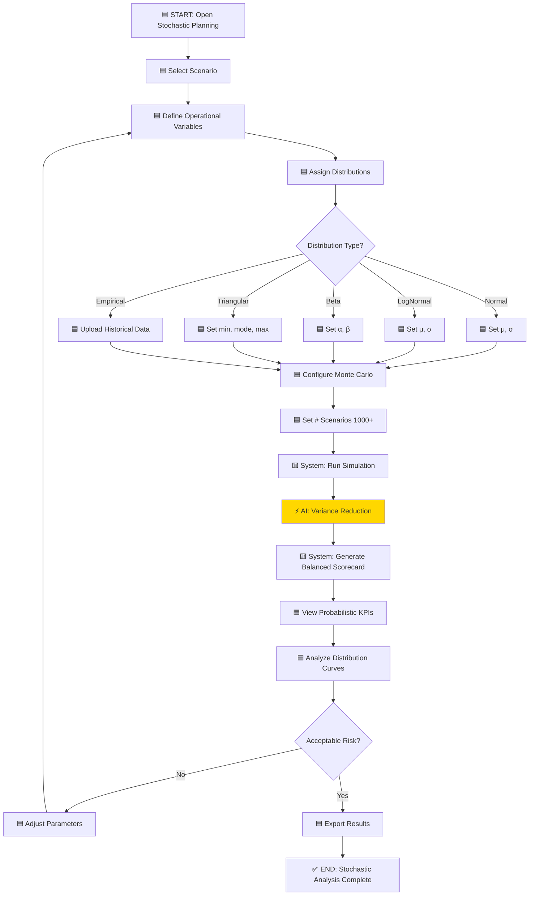

**Probabilistic Balanced Scorecard**:
- **Financial**: E[Total Cost], P(Cost < Budget), P10/P50/P90
- **Customer**: E[OTIF], P(OTIF > 95%), Fill Rate Distribution
- **Operational**: E[Inventory Turns], E[DOS], Bullwhip Ratio
- **Strategic**: Flexibility Scores, CO2 Emissions Distribution

---

## 5. Master Production Scheduling (MPS)

**Purpose**: Create strategic production plans with rough-cut capacity checks.

**Primary Users**: Master Scheduler, Production Planner

**Multi-User**: Yes - Collaboration with capacity planner and approval from operations manager

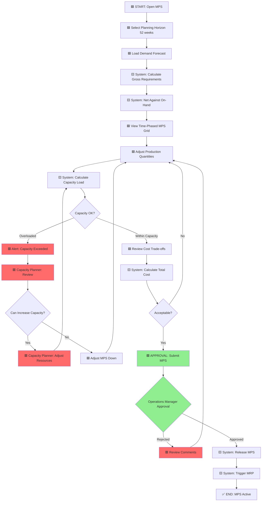

**Key Multi-User Interactions**:
1. **Master Scheduler** → Creates MPS plan
2. **Capacity Planner** → Validates capacity constraints
3. **Operations Manager** → Approves for execution

---

## 6. Lot Sizing Analysis

**Purpose**: Analyze EOQ, POQ, and LFL lot sizing methods with cost trade-offs.

**Primary Users**: Inventory Analyst, Purchasing Manager

**Multi-User**: No - Individual analyst workflow

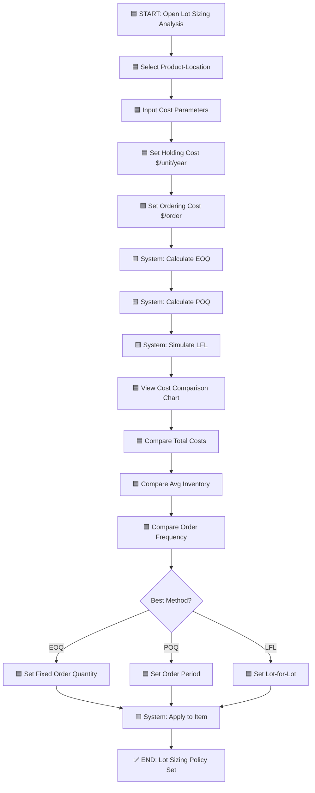

**Cost Trade-off Analysis**:
- **EOQ**: Balances ordering cost vs holding cost
- **POQ**: Fixed period ordering
- **LFL**: Minimal inventory but high ordering frequency

---

## 7. Capacity Check

**Purpose**: Validate resource capacity against production requirements.

**Primary Users**: Capacity Planner, Operations Manager

**Multi-User**: Yes - Requires operations manager approval for capacity expansion

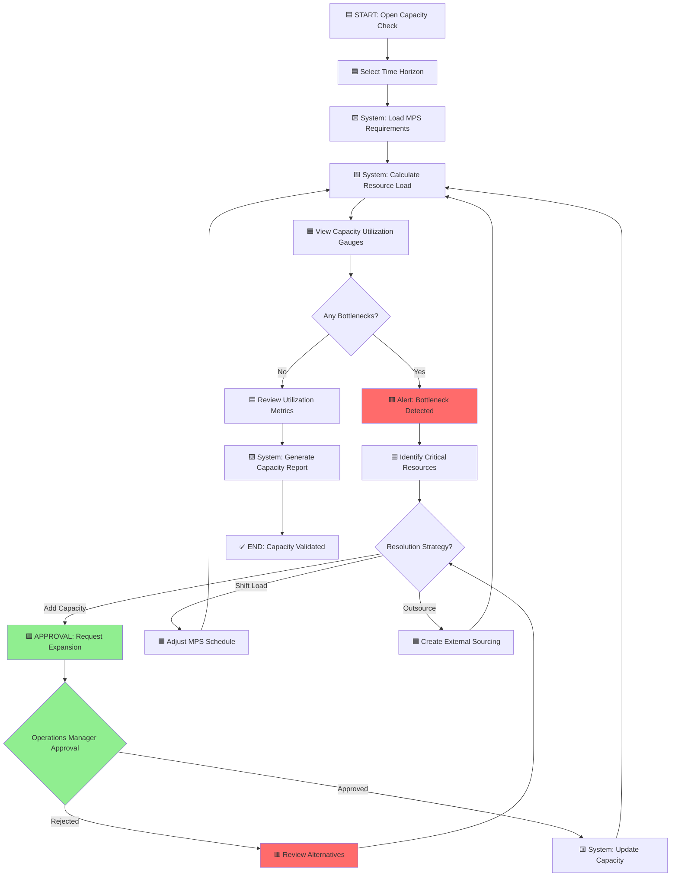

**Key Multi-User Interactions**:
1. **Capacity Planner** → Analyzes utilization
2. **Operations Manager** → Approves capacity expansion requests
3. **Finance** → Validates capex budget for new resources

---

## 8. Material Requirements Planning (MRP)

**Purpose**: Explode BOM and calculate time-phased component requirements.

**Primary Users**: Material Planner, Buyer

**Multi-User**: No - Individual planner workflow with AI agent support

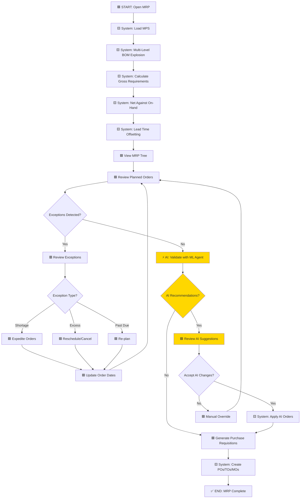

**AI Agent Support**:
- TRM Agent can validate MRP orders and suggest optimizations
- Reduces manual exception handling by 30-40%

---

## 9. Supply Plan Generation

**Purpose**: Generate comprehensive supply plan with PO/TO/MO recommendations.

**Primary Users**: Supply Planner, Procurement Manager

**Multi-User**: Yes - Requires procurement manager approval before release

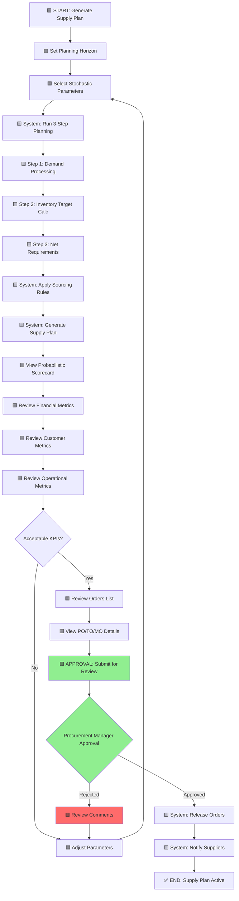

**Key Multi-User Interactions**:
1. **Supply Planner** → Generates plan
2. **Procurement Manager** → Approves order release
3. **Suppliers** → Receive PO notifications

---

## 10. Available-to-Promise / Capable-to-Promise (ATP/CTP)

**Purpose**: Real-time inventory availability and production capability checks for sales orders.

**Primary Users**: Order Fulfillment Specialist, Sales Rep

**Multi-User**: No - Real-time query workflow

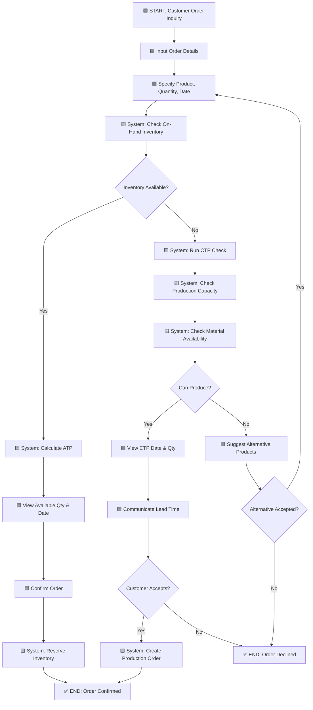

**Real-Time Checks**:
1. **ATP**: On-hand + scheduled receipts - allocated
2. **CTP**: Production capacity + material availability

---

## 11. Sourcing & Allocation

**Purpose**: Configure multi-sourcing rules with priorities and allocate inventory across demand.

**Primary Users**: Sourcing Manager, Supply Planner

**Multi-User**: No - Configuration workflow

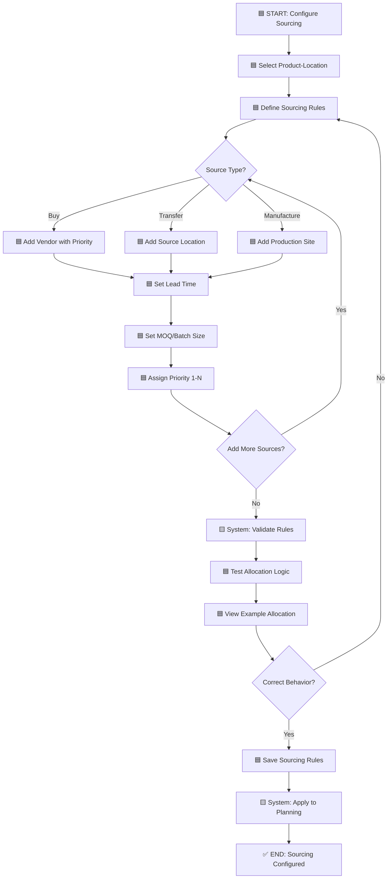

**Multi-Sourcing Logic**:
1. Sort sources by priority (1 = highest)
2. Allocate to highest priority until capacity exhausted
3. Overflow to next priority level

---

## 12. Order Planning

**Purpose**: Plan and track purchase orders, transfer orders, and manufacturing orders.

**Primary Users**: Buyer, Material Planner

**Multi-User**: No - Individual planner workflow

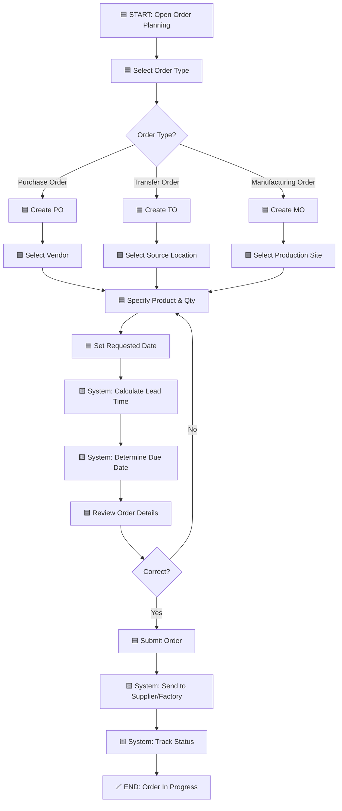

---

## 13. Order Management

**Purpose**: Manage lifecycle of purchase and transfer orders from creation to receipt.

**Primary Users**: Buyer, Receiving Clerk

**Multi-User**: Yes - Requires buyer and receiving clerk collaboration

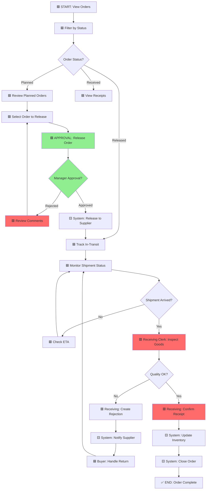

**Key Multi-User Interactions**:
1. **Buyer** → Releases orders and handles exceptions
2. **Receiving Clerk** → Inspects goods and confirms receipt
3. **Manager** → Approves order release

---

## 14. Shipment Tracking

**Purpose**: Track inbound and outbound shipments with real-time status updates.

**Primary Users**: Logistics Coordinator, Customer Service Rep

**Multi-User**: No - Individual tracking workflow

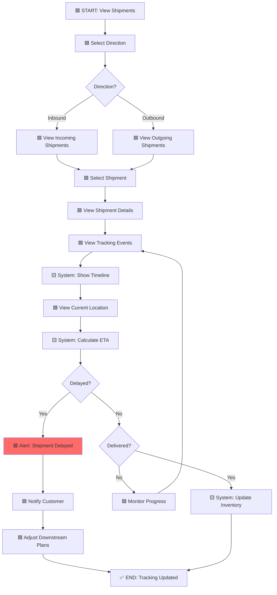

---

## 15. Inventory Visibility

**Purpose**: View real-time inventory levels across all nodes in the supply chain.

**Primary Users**: Inventory Controller, Supply Planner

**Multi-User**: No - Read-only visibility workflow

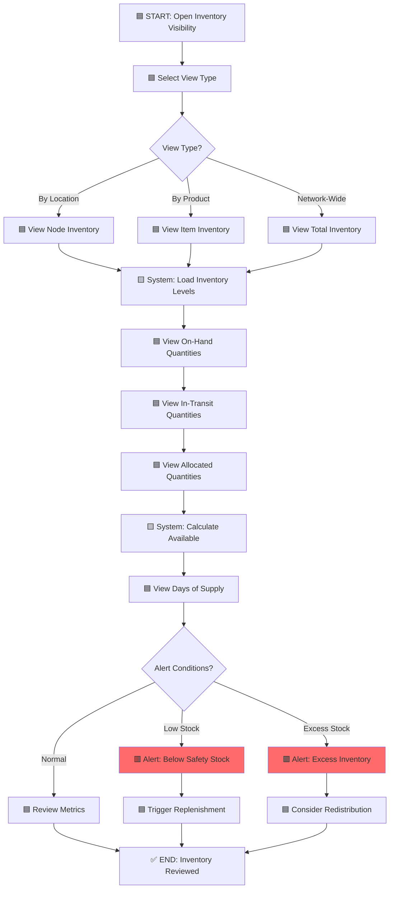

---

## 16. N-Tier Visibility

**Purpose**: View multi-tier supply chain visibility including suppliers' suppliers.

**Primary Users**: Supply Chain Risk Manager, Procurement Manager

**Multi-User**: No - Visibility and monitoring workflow

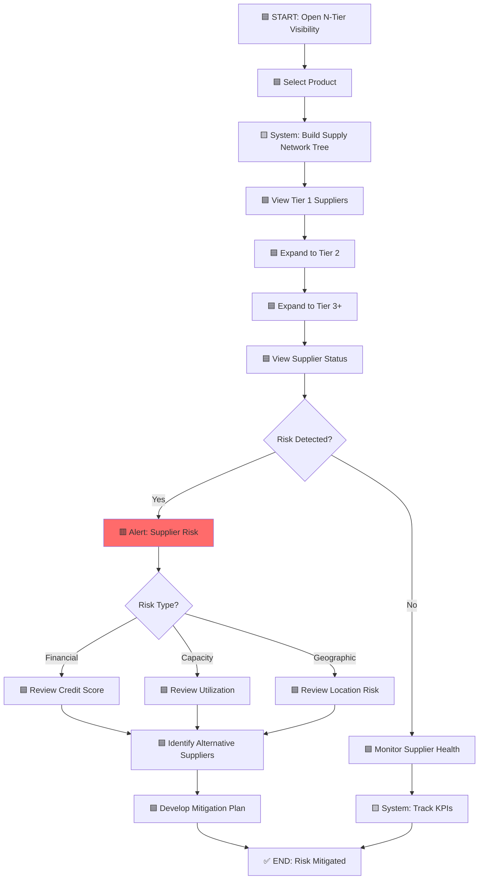

---

## 17. Supply Chain Analytics

**Purpose**: Comprehensive analytics dashboard for SC KPIs and performance metrics.

**Primary Users**: SC Analyst, SC Director

**Multi-User**: No - Read-only analytics workflow

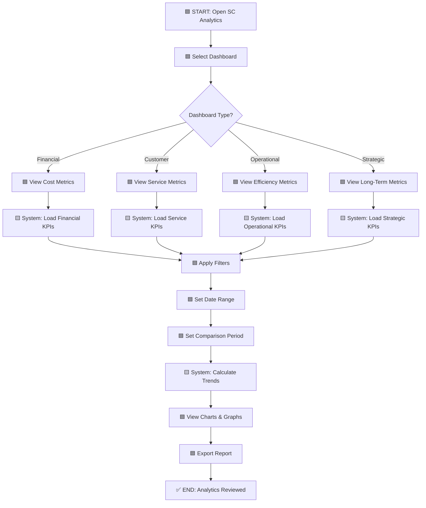

**Key KPIs**:
- **Financial**: Total Cost, Cost per Unit, Inventory Carrying Cost
- **Customer**: OTIF %, Fill Rate %, Perfect Order %
- **Operational**: Inventory Turns, DOS, Lead Time
- **Strategic**: Carbon Footprint, Supplier Diversity, Resilience Score

---

## 18. KPI Monitoring

**Purpose**: Real-time KPI monitoring with alerts and threshold-based notifications.

**Primary Users**: Operations Manager, SC Director

**Multi-User**: No - Monitoring workflow

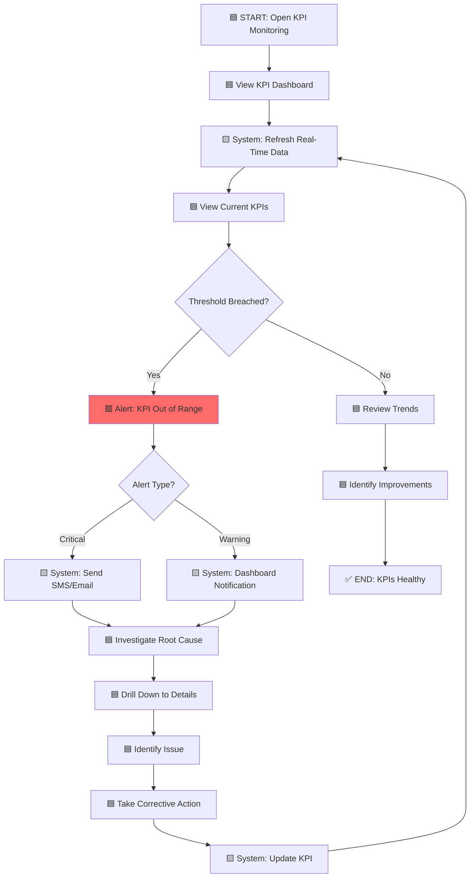

**Alert Thresholds**:
- **Critical**: Requires immediate action (service level < 85%)
- **Warning**: Attention needed (service level 85-95%)
- **Normal**: No action required (service level > 95%)

---

## 19. Scenario Comparison

**Purpose**: Compare multiple planning scenarios side-by-side to evaluate alternatives.

**Primary Users**: Strategic Planner, SC Director

**Multi-User**: Yes - Requires director approval for scenario selection

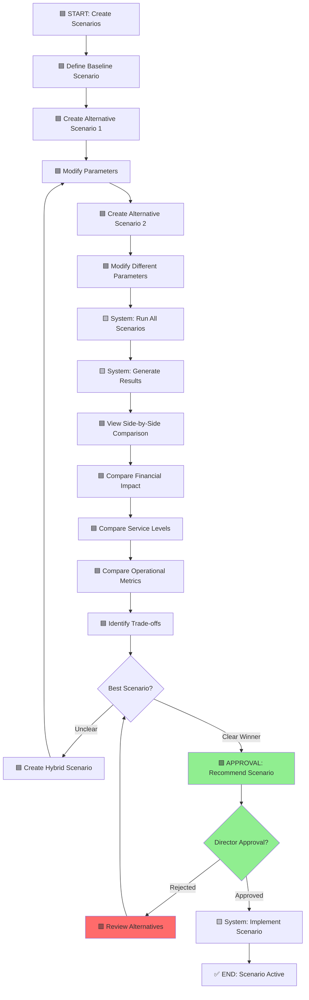

**Key Multi-User Interactions**:
1. **Strategic Planner** → Designs and analyzes scenarios
2. **SC Director** → Selects winning scenario for implementation

---

## 20. Risk Analysis

**Purpose**: Identify and quantify supply chain risks with mitigation strategies.

**Primary Users**: Risk Manager, SC Director

**Multi-User**: Yes - Cross-functional risk assessment team

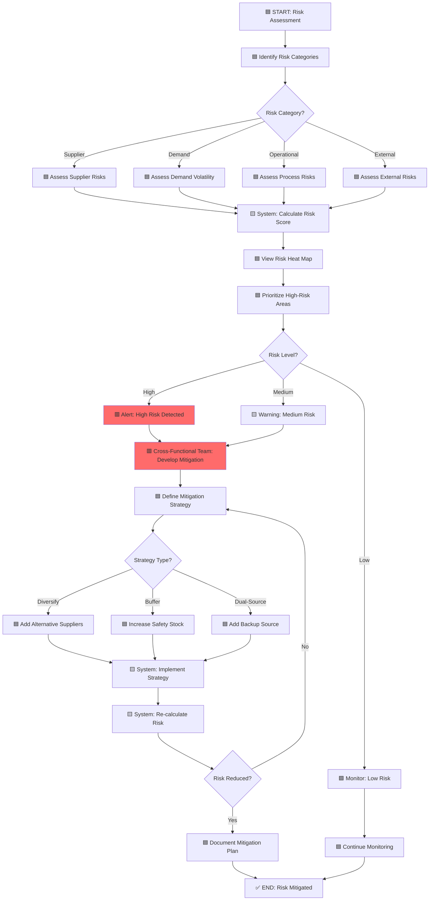

**Key Multi-User Interactions**:
1. **Risk Manager** → Identifies and assesses risks
2. **Procurement** → Develops supplier diversification strategies
3. **Operations** → Implements buffering and dual-sourcing
4. **SC Director** → Approves mitigation budgets

---

## 21. Group Admin User Management

**Purpose**: Manage users within a group and assign granular functional area capabilities.

**Primary Users**: Group Admin

**Multi-User**: No - Administrative workflow

```mermaid
graph TD
    A[🟦 START: Open User Management] --> B[🟦 View Users List]
    B --> C{Action?}
    C -->|Create| D[🟦 Click Create User]
    C -->|Edit| E[🟦 Select User to Edit]
    C -->|Delete| F[🟦 Select User to Delete]

    D --> G[🟦 User Editor: Basic Info Tab]
    E --> G

    G --> H[🟦 Enter Email Required]
    H --> I[🟦 Enter Username Optional]
    I --> J[🟦 Enter Full Name]
    J --> K[🟦 Enter Password]
    K --> L[🟦 Select User Type]
    L --> M{Creating New?}
    M -->|Yes| N[🟨 System: Validate Email]
    M -->|No| O[🟦 Switch to Capabilities Tab]

    N --> P{Email Valid?}
    P -->|No| Q[🟥 Error: Invalid/Duplicate Email]
    Q --> H
    P -->|Yes| O

    O --> R[🟦 View Capability Tree]
    R --> S[🟦 Expand Functional Area]
    S --> T{Select Method?}
    T -->|Category| U[🟦 Check Category Box]
    T -->|Individual| V[🟦 Check Individual Capabilities]
    T -->|Bulk| W[🟦 Click Select All]

    U --> X[🟨 System: Select All in Category]
    V --> Y[🟦 View Selection Count]
    W --> Z[🟨 System: Select All 59 Capabilities]

    X --> Y
    Z --> Y

    Y --> AA{Satisfied with Selection?}
    AA -->|No| S
    AA -->|Yes| AB[🟦 Click Save]

    AB --> AC[🟨 System: Validate Form]
    AC --> AD{Valid?}
    AD -->|No| AE[🟥 Show Validation Errors]
    AE --> G
    AD -->|Yes| AF[🟨 System: Save User]
    AF --> AG[🟨 System: Create/Update RBAC Entries]
    AG --> AH[🟨 System: Refresh User List]
    AH --> AI[✅ END: User Saved]

    F --> AJ[🟨 System: Confirm Delete]
    AJ --> AK{Confirm?}
    AK -->|No| B
    AK -->|Yes| AL[🟨 System: Delete User]
    AL --> AH

    style Q fill:#FF6B6B
    style AE fill:#FF6B6B
```

**Capability Categories (59 Total)**:
1. **Strategic Planning** (8): Network Design, Demand Forecasting, Inventory Optimization, Stochastic Planning
2. **Tactical Planning** (9): MPS, Lot Sizing, Capacity Check, MRP
3. **Operational Planning** (9): Supply Plan, ATP/CTP, Sourcing, Order Planning
4. **Execution** (8): Order Management, Shipment Tracking, Inventory Visibility, N-Tier
5. **Analytics** (7): SC Analytics, KPI Monitoring, Scenario Comparison, Risk Analysis
6. **AI & Agents** (8): AI Agents, TRM Training, GNN Training, LLM Agents
7. **Gamification** (5): View Games, Create Games, Play Games, Manage Games, Analytics
8. **Administration** (5): View Users, Create Users, Edit Users, Manage Permissions, Manage Groups

---

## Implementation Notes

### Workflow Execution Patterns

**Synchronous Workflows** (Real-time response):
- ATP/CTP checks
- Inventory visibility queries
- KPI monitoring dashboards
- Shipment tracking

**Asynchronous Workflows** (Background processing):
- Supply plan generation (can take 5-10 minutes)
- Monte Carlo simulation (1000+ scenarios)
- MRP explosion (large BOMs)
- Stochastic planning (high computational load)

**Multi-User Collaboration Patterns**:
1. **Sequential Approval Chain**: User A → Manager B → Director C
2. **Parallel Review**: Multiple stakeholders review simultaneously
3. **Consensus Planning**: Sales + Demand Planner collaborate on forecast
4. **Exception Handling**: Receiving Clerk escalates to Buyer

### AI Agent Integration Points

The following workflows can be enhanced with AI agents:

1. **Demand Forecasting** - TRM/GNN agents provide ML-based forecasts
2. **MRP** - Validate planned orders and suggest optimizations
3. **Risk Analysis** - Predict supplier failures and recommend mitigations
4. **Capacity Planning** - Optimize resource allocation
5. **Order Planning** - Automated order quantity optimization
6. **Multi-Agent Orchestration** (Phase 4) - LLM + GNN + TRM ensemble with adaptive weight learning

---

## 22. AI Multi-Agent Decision-Making (Phase 4)

**Purpose**: Generate AI-recommended actions through multi-agent consensus with adaptive weight learning and RLHF.

**Primary Users**: Supply Planner, Operations Manager

**Multi-User**: No - Agent orchestration with human oversight (copilot mode)

```mermaid
graph TD
    A[🟦 START: Decision Required] --> B[🟨 System: Load Current Agent Weights]
    B --> C{Agent Weights Source?}
    C -->|Game| D[🟨 Load from game context]
    C -->|Production| E[🟨 Load from company context]
    C -->|New| F[🟨 Initialize equal weights 33%/33%/33%]

    D --> G[⚡ LLM Agent: Analyze & Recommend]
    E --> G
    F --> G

    G --> H[⚡ GNN Agent: Analyze & Recommend]
    H --> I[⚡ TRM Agent: Analyze & Recommend]

    I --> J[🟨 System: Apply Consensus Method]
    J --> K{Consensus Method?}
    K -->|Voting| L[🟨 Majority vote with confidence]
    K -->|Averaging| M[🟨 Weighted average decision]
    K -->|Confidence-Based| N[🟨 Highest confidence wins]
    K -->|Median| O[🟨 Median value selected]

    L --> P[🟨 System: Calculate Agreement Score]
    M --> P
    N --> P
    O --> P

    P --> Q{Operating Mode?}
    Q -->|Autonomous| R[🟨 System: Execute Decision]
    Q -->|Copilot| S[🟦 Human: Review Recommendation]
    Q -->|Manual| T[🟦 Human: Full Manual Decision]

    R --> U[🟨 System: Execute Action]

    S --> V[🟦 View All 3 Agent Recommendations]
    V --> W[🟦 View Ensemble Consensus]
    W --> X[🟦 View Confidence & Agreement]
    X --> Y{Human Decision?}
    Y -->|Accept| U
    Y -->|Modify| Z[🟦 Human: Override with Reasoning]
    Y -->|Reject| AA[🟦 Human: Full Override]

    Z --> AB[🟨 System: Record RLHF Data]
    AA --> AB
    AB --> AC[🟨 System: Store AI vs Human Decision]
    AC --> U

    T --> AD[🟦 Human: Manual Decision]
    AD --> U

    U --> AE[🟨 System: Track Performance Metrics]
    AE --> AF{Round Complete?}
    AF -->|No| AG[✅ END: Decision Executed]
    AF -->|Yes| AH[🟨 System: Calculate Outcome Metrics]

    AH --> AI[🟨 System: Evaluate Agent Performance]
    AI --> AJ{Learning Enabled?}
    AJ -->|Yes| AK[🟨 System: Update Agent Weights]
    AJ -->|No| AG

    AK --> AL{Learning Algorithm?}
    AL -->|EMA| AM[🟨 Exponential Moving Average Update]
    AL -->|UCB| AN[🟨 Upper Confidence Bound Exploration]
    AL -->|Thompson| AO[🟨 Bayesian Sampling Update]
    AL -->|Performance| AP[🟨 Direct Performance Mapping]
    AL -->|Gradient| AQ[🟨 Gradient Descent Optimization]

    AM --> AR[🟨 System: Persist New Weights]
    AN --> AR
    AO --> AR
    AP --> AR
    AQ --> AR

    AR --> AS{Weights Converged?}
    AS -->|Yes| AT[🟨 System: Mark Converged]
    AS -->|No| AU[🟨 System: Continue Learning]

    AT --> AV{Transfer to Production?}
    AU --> AG

    AV -->|Yes| AW[🟨 System: Deploy to Production Context]
    AV -->|No| AG
    AW --> AG

    style G fill:#FFD700
    style H fill:#FFD700
    style I fill:#FFD700
    style AB fill:#FFD700
    style AK fill:#FFD700
```

**Multi-Agent Ensemble Process**:
1. **LLM Agent**: Strategic reasoning, complex trade-offs, natural language explanations
2. **GNN Agent**: Temporal pattern recognition, demand prediction, network dependencies
3. **TRM Agent**: Fast inference (<10ms), consistent policies, base-stock optimization

**Adaptive Weight Learning (5 Algorithms)**:
- **EMA**: Smooth gradual updates based on performance
- **UCB**: Multi-armed bandit with exploration bonus
- **Thompson Sampling**: Bayesian probabilistic exploration
- **Performance-Based**: Direct mapping from performance to weights
- **Gradient Descent**: Cost function optimization with gradients

**RLHF (Reinforcement Learning from Human Feedback)**:
- Records all human overrides in copilot mode
- Captures AI suggestion, human decision, reasoning, game state
- Tracks outcomes: who was right (AI vs. human)?
- Preference labels: PREFER_AI, PREFER_HUMAN, NEUTRAL
- Builds training dataset for future agent fine-tuning (50,000+ examples)

**Weight Evolution Example**:
```
Initial:   LLM: 33%, GNN: 33%, TRM: 33%  (equal start)
Round 10:  LLM: 30%, GNN: 42%, TRM: 28%  (GNN performing best)
Round 20:  LLM: 38%, GNN: 41%, TRM: 21%  (LLM improving)
Round 30:  LLM: 45%, GNN: 38%, TRM: 17%  (CONVERGED)
```

**Transfer Learning (Games → Production)**:
1. Train weights in games (100+ games, synthetic demand)
2. Validate statistical significance (p < 0.05, A/B testing)
3. Deploy learned weights to production (context_type: company)
4. Continue adapting to real demand (lower learning rate)

**Context-Agnostic Design**:
- Same code works for games and production
- Only difference: context_type (game, company, config) + time scale + demand source
- Agent weights learned in games transfer to production with pre-optimization

---

## 23. Agent Mode Switching

**Purpose**: Dynamically switch between Manual, Copilot, and Autonomous agent modes during gameplay or operations.

**Primary Users**: Supply Planner, Operations Manager

**Multi-User**: No - Individual mode switching workflow

```mermaid
graph TD
    A[🟦 START: Current Mode Active] --> B{Current Mode?}
    B -->|Manual| C[🟦 Human: Full Control]
    B -->|Copilot| D[🟦 Human: Review AI Recommendations]
    B -->|Autonomous| E[⚡ AI: Full Automation]

    C --> F{Switch Request?}
    D --> F
    E --> F

    F -->|No| G[Continue in Current Mode]
    G --> H[✅ END: Mode Active]

    F -->|Yes| I[🟦 Human: Select New Mode]
    I --> J{New Mode?}

    J -->|To Copilot| K[🟩 CONFIRM: Enable AI Assistance]
    J -->|To Autonomous| L[🟩 CONFIRM: Enable Full Automation]
    J -->|To Manual| M[🟩 CONFIRM: Disable AI]

    K --> N[🟨 System: Switch to Copilot]
    L --> O[🟨 System: Switch to Autonomous]
    M --> P[🟨 System: Switch to Manual]

    N --> Q[🟨 System: Record Mode Change]
    O --> Q
    P --> Q

    Q --> R{Trigger Type?}
    R -->|Manual Request| S[🟨 Reason: user requested]
    R -->|Confidence Threshold| T[🟨 Reason: agent confidence low]
    R -->|Override Rate| U[🟨 Reason: high human override rate]
    R -->|System Suggestion| V[🟨 Reason: system recommended]

    S --> W[🟨 System: Update agent_mode_history]
    T --> W
    U --> W
    V --> W

    W --> X[🟨 System: Activate New Mode]
    X --> H
```

**Mode Switch Triggers**:
1. **Manual Request**: User explicitly switches mode
2. **Confidence Threshold**: Agent confidence < 70% → switch from Autonomous to Copilot
3. **Override Rate**: >30% human overrides → switch from Copilot to Manual
4. **System Suggestion**: AI suggests mode change based on performance

**Mode Switching History Tracking**:
- All mode changes recorded in `agent_mode_history` table
- Tracks: player_id, game_id, round_number, previous_mode, new_mode, reason, timestamp
- Analytics: mode switching frequency, mode dwell time, optimal mode per player

---

## 24. A/B Testing for Learning Algorithms

**Purpose**: Compare different weight learning algorithms and consensus methods through statistical A/B testing.

**Primary Users**: Data Scientist, AI Engineer

**Multi-User**: No - Automated testing workflow

```mermaid
graph TD
    A[🟦 START: Create A/B Test] --> B[🟦 Define Test Configuration]
    B --> C[🟦 Set Test Name & Type]
    C --> D{Test Type?}
    D -->|Learning Algorithm| E[🟦 Select Algorithms to Compare]
    D -->|Consensus Method| F[🟦 Select Methods to Compare]
    D -->|Manual vs Adaptive| G[🟦 Configure Weight Strategies]
    D -->|Agent Comparison| H[🟦 Select Agent Types]

    E --> I[🟦 Define Control: EMA]
    F --> I
    G --> I
    H --> I

    I --> J[🟦 Define Variant A: UCB]
    J --> K[🟦 Define Variant B: Thompson Sampling]
    K --> L[🟦 Set Success Metric: total_cost]
    L --> M[🟦 Set Min Samples: 30 games per variant]
    M --> N[🟦 Set Confidence Level: 95%]

    N --> O[🟨 System: Create A/B Test]
    O --> P[🟨 System: Start Test]

    P --> Q[🟨 System: Assign Next Game to Variant]
    Q --> R{Assignment Method?}
    R -->|Round Robin| S[🟨 Rotate: Control → A → B → Control...]
    R -->|Random| T[🟨 Random assignment]

    S --> U[🟨 System: Run Game with Assigned Config]
    T --> U

    U --> V[🟨 System: Record Observation]
    V --> W{Minimum Samples Met?}
    W -->|No| X[🟨 Continue Assigning Games]
    X --> Q

    W -->|Yes| Y[🟨 System: Analyze Results]
    Y --> Z[🟨 Calculate Mean & StdDev per Variant]
    Z --> AA[🟨 Perform Statistical Test]
    AA --> AB{p-value < 0.05?}

    AB -->|No| AC[🟥 Result: No Significant Difference]
    AC --> AD[🟦 Data Scientist: Review & Iterate]
    AD --> AE[✅ END: Test Inconclusive]

    AB -->|Yes| AF[🟩 Result: Statistically Significant]
    AF --> AG[🟨 Determine Winner]
    AG --> AH{Best Variant?}

    AH -->|Control| AI[🟨 Winner: EMA baseline]
    AH -->|Variant A| AJ[🟨 Winner: UCB 8% better]
    AH -->|Variant B| AK[🟨 Winner: Thompson 12% better]

    AI --> AL[🟦 Data Scientist: Review Results]
    AJ --> AL
    AK --> AL

    AL --> AM{Deploy Winner?}
    AM -->|Yes| AN[🟨 System: Deploy to Production]
    AM -->|No| AO[🟦 Run Additional Tests]

    AN --> AP[🟨 Update Default Learning Algorithm]
    AP --> AQ[✅ END: Algorithm Deployed]

    AO --> AD

    style AF fill:#90EE90
    style AC fill:#FF6B6B
```

**A/B Test Configuration Example**:
```
Test Name: "EMA vs UCB Learning Algorithm"
Test Type: learning_algorithm
Control: EMA (learning_rate=0.1)
Variant A: UCB (exploration_factor=2.0)
Success Metric: total_cost (lower is better)
Min Samples: 50 games per variant (100 total)
Confidence Level: 95% (p < 0.05)
```

**Statistical Analysis**:
- **Mean Cost**: Average total cost per variant
- **Standard Deviation**: Measure of variance
- **p-value**: Probability difference is due to chance
- **Improvement %**: (Control - Variant) / Control * 100
- **Confidence Intervals**: P10/P50/P90 cost distribution

**Test Results Example**:
```
Control (EMA):  $52,340 ± $8,200  (50 games)
Variant A (UCB): $48,120 ± $9,100  (50 games)
p-value: 0.003 (< 0.05, statistically significant)
Winner: UCB with 8.1% cost reduction
Recommendation: Deploy UCB to production
```

### Frontend Component Mapping

Each workflow maps to specific frontend components:

| Workflow | Primary Page | Key Components |
|----------|-------------|----------------|
| Network Design | /planning/network-design | SupplyChainConfigForm, D3-Sankey |
| Demand Forecasting | /planning/demand | ForecastChart, ConfidenceBands |
| MPS | /planning/mps | MPSGrid, CapacityGauge |
| Supply Plan | /planning/supply | SupplyPlanGenerator, BalancedScorecard |
| Order Management | /planning/orders | OrderTable, StatusTimeline |
| User Management | /admin/group/users | UserEditor, CapabilitySelector |

---

## Revision History

| Date | Version | Changes |
|------|---------|---------|
| 2026-01-22 | 1.0 | Initial workflow diagrams for all 21 functional areas |
| 2026-01-28 | 1.1 | Added Phase 4 Multi-Agent Orchestration workflows (#22-24): AI Multi-Agent Decision-Making, Agent Mode Switching, A/B Testing for Learning Algorithms |

---

**End of Workflow Diagrams Document**
