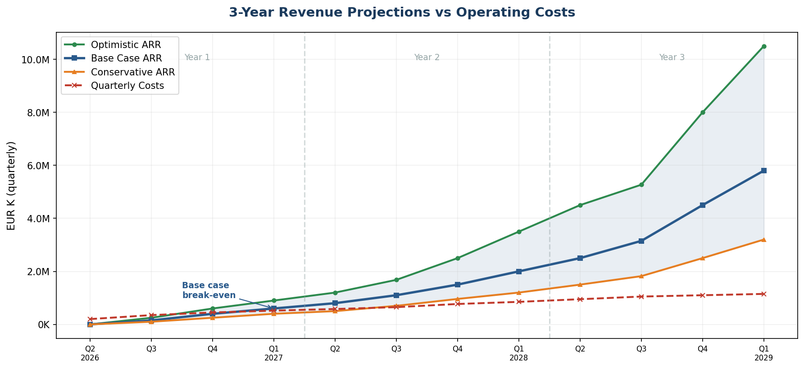
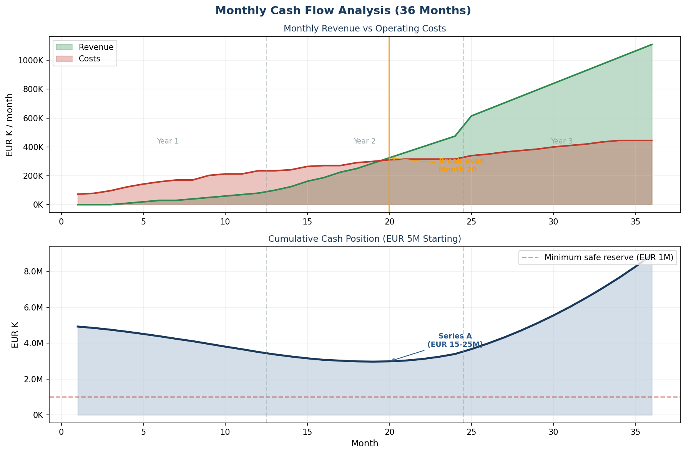
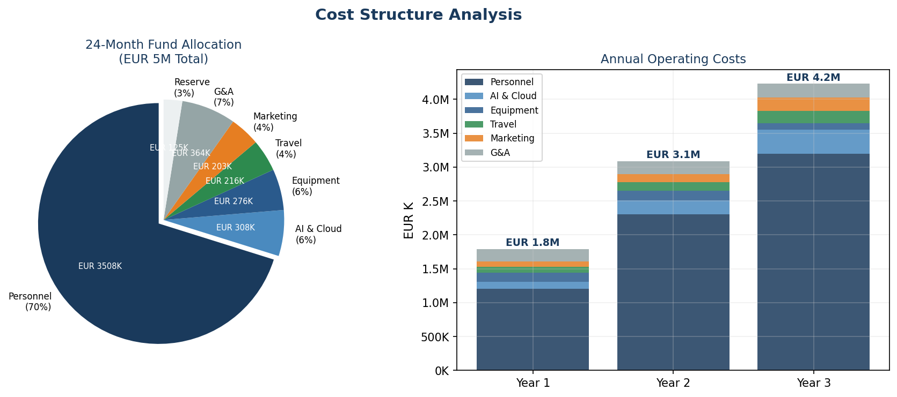
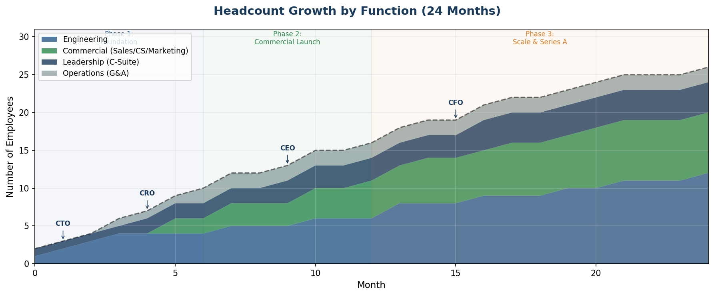
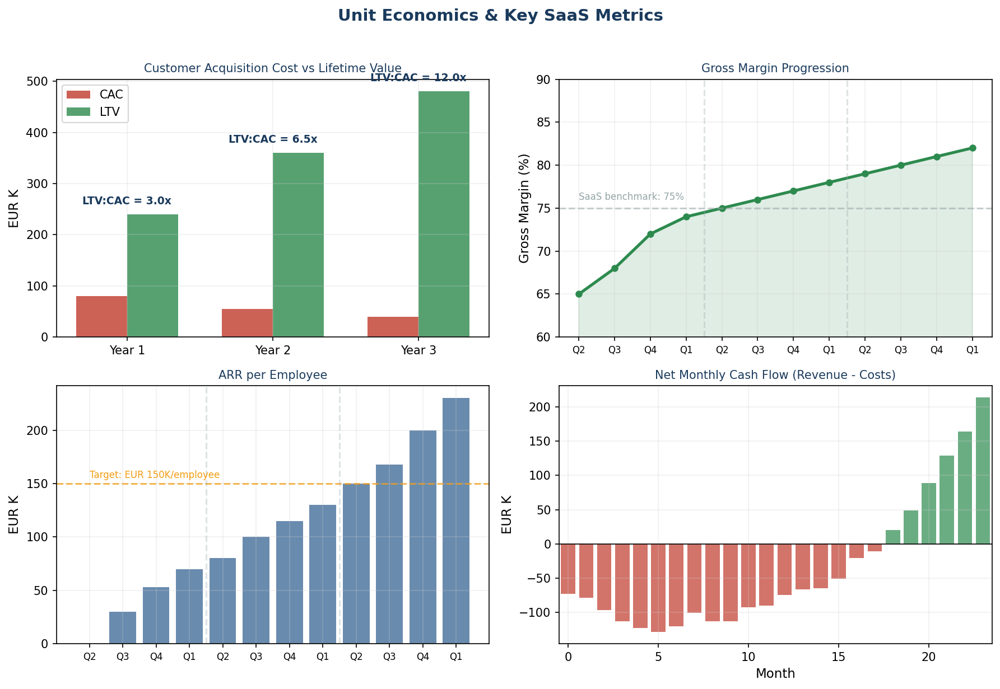

> **STRICTLY CONFIDENTIAL AND PROPRIETARY**
> Copyright (c) 2026 Azirella Ltd. All rights reserved worldwide.
> Unauthorized access, use, reproduction, or distribution of this document or any portion thereof is strictly prohibited and may result in severe civil and criminal penalties.

# Autonomy Platform: Business Plan

**Prepared for**: Seed Investment Round (EUR 5M+)
**Version**: 1.0
**Date**: March 2026
**Prepared by**: Azirella Ltd, 27, 25 Martiou St., #105, 2408 Engomi, Nicosia, Cyprus

---

## Table of Contents

1. [Executive Summary](#1-executive-summary)
2. [The Problem](#2-the-problem)
3. [The Solution](#3-the-solution)
4. [Market Analysis](#4-market-analysis)
5. [Competitive Landscape](#5-competitive-landscape)
6. [Product & Technology](#6-product--technology)
7. [Business Model](#7-business-model)
8. [Go-to-Market Strategy](#8-go-to-market-strategy)
9. [Financial Projections](#9-financial-projections)
10. [Use of Funds](#10-use-of-funds)
11. [Team & Organization](#11-team--organization)
12. [Risks & Mitigations](#12-risks--mitigations)
13. [Investment Terms](#13-investment-terms)
14. [Appendices](#14-appendices) (A: Capability Matrix, B: Sources, C: Glossary, D: Trial Balance, E: Cash Flow, F: Charts)

---

## 1. Executive Summary

### The Opportunity

Enterprise supply chain planning fails because **judgment does not scale**. Planning systems output numbers; humans do the work. 80% of a planner's time is spent on routine decisions. Cross-functional trade-offs take days of emails and meetings. When planners leave, their institutional knowledge leaves with them. The $30B+ supply chain management software market is dominated by incumbents (Kinaxis, SAP IBP, Blue Yonder) that cost $100K-$500K per user per year, take 12-24 months to implement, and still require humans to make every decision.

Meanwhile, 60% of mid-market manufacturers ($100M-$2B revenue) still plan with Excel.

### What We Are Building

**Autonomy** is an AI labor system for enterprise planning decisions. Agents own baseline decisions within explicit scope. Humans govern through policy, risk thresholds, and supervision. Planning capacity scales without scaling headcount.

This is not AI-assisted planning. It is **planning re-architected around AI labor**.

### Why Now

- Gartner predicts **50% of SCM solutions will include agentic AI by 2030** (May 2025)
- Gartner's inaugural **Decision Intelligence Platform Magic Quadrant** (Jan 2026) formally legitimizes the category
- BCG reports only **7% of companies report value from agentic AI** in supply chain -- the market is hungry for solutions that deliver, not just demo
- AI agents are now capable of owning bounded decisions. The missing piece is persistent judgment memory -- without it, autonomy resets every cycle

### The Ask

**EUR 5M seed round** to fund 18 months of go-to-market execution: 3 pilot customers, first EUR 1M ARR, and a team of 12.

### Key Metrics

| Metric | Target |
|--------|--------|
| **TAM** | EUR 28B (global SCM software) |
| **SAM** | EUR 2.5B (mid-market SCP, AI-powered) |
| **SOM** | EUR 50M (Year 5, European mid-market manufacturers) |
| **Year 1 ARR Target** | EUR 600K-1M |
| **Year 3 ARR Target** | EUR 5-8M |
| **Gross Margin** | 75-80% (SaaS) |
| **Target ACV** | EUR 100-200K |
| **Payback Period** | <12 months for customers |

---

## 2. The Problem

### 2.1 The Planning Software Market Is Broken

The supply chain planning software market is a $30B+ industry built on a flawed assumption: that humans should make every planning decision, and software should just present them with better data.

**The result:**

| Problem | Impact | Scale |
|---------|--------|-------|
| **Point-and-click paralysis** | Planners review 500+ exception reports weekly, manually adjusting plans | 80% of planner time on routine decisions |
| **Batch planning latency** | Tuesday's urgent order doesn't get addressed until Friday's plan approval | 5-7 day OODA loop in a world that moves in hours |
| **Siloed decisions** | Supply planners optimize independently of logistics, finance, and sales | Cross-functional resolution takes days (emails, meetings) |
| **No decision memory** | When a planner overrides an AI recommendation, the reason is lost | ~50% of human forecast overrides destroy value (ScienceDirect, 2024) |
| **Black box AI** | Where AI exists, recommendations lack explainability | Planners override 60%+ of AI suggestions they don't understand |

### 2.2 The Mid-Market Is Underserved

Mid-market manufacturers ($100M-$2B revenue) are caught between:

- **Enterprise platforms** (Kinaxis, SAP IBP, Blue Yonder): $200K-$500K+ annual license, 12-24 month implementation, require dedicated consultants and IT teams
- **Basic ERP modules**: SAP MRP, Dynamics 365 planning -- batch-oriented, no AI, no cross-functional coordination
- **Excel**: Still the dominant planning tool for 60% of mid-market manufacturers

A $300M manufacturer typically has 3-8 planners and an IT budget of $4-10M (1.4-3.2% of revenue). They can afford $100-400K annually for SCP -- but enterprise vendors don't serve them at that price point.

### 2.3 The Override Problem

Research on ~147,000 forecasts across six studies found that planner adjustments improved accuracy for **just over half of SKUs**. Positive (upward) adjustments were especially harmful. At a global beverage manufacturer, **more than 90% of significant forecast adjustments failed to improve accuracy**.

The root cause: legacy systems discard decision lineage every cycle. They store values, not decision history. Without persistent judgment memory, autonomy resets every cycle. Legacy platforms were not built to learn from judgment.

### 2.4 Why Now: The Convergence

Four forces are converging to create an unprecedented window:

1. **AI capability**: AI agents are now capable of owning bounded decisions (<10ms inference, 90-95% accuracy vs optimal policies)
2. **Market legitimacy**: Gartner's inaugural DIP Magic Quadrant (Jan 2026) formally creates the category. 69% of organizations are deployed or actively planning DI adoption
3. **Regulatory pressure**: EU CSRD (effective Jan 2025), CSDDD (phased 2027-2029), EU AI Act create compliance-driven demand for traceable, explainable supply chain decisions
4. **Value gap**: BCG (2026) reports only 7% of companies report value from agentic AI in supply chain. The market needs solutions that deliver, not just demo

---

## 3. The Solution

### 3.1 Core Belief

Enterprise planning fails because judgment does not scale, not because math is wrong. When systems cannot **own** decisions, **explain** them, and **learn from** how humans change them, trust collapses.

Enterprises do not buy judgment. They buy **outcomes and ROI**.

### 3.2 What Autonomy Is

An AI labor system for enterprise planning decisions:

- **Agents own baseline decisions** within explicit scope
- **Humans govern** through policy, risk thresholds, and supervision
- **Planning capacity scales** without scaling headcount
- **Judgment compounds** instead of resetting every cycle

### 3.3 The Category Shift

**From planning software to AI labor.**

| Before | After |
|--------|-------|
| Systems output numbers, humans do the work | Agents do the work, humans govern |
| Software optimizes functions | Agents own decisions, are accountable for outcomes |
| Each cycle starts fresh | Judgment compounds from every override |
| One planner manages 200-500 SKUs | One planner governs 5,000+ SKUs |

### 3.4 The AIIO Operating Model

Every decision follows the **Automate-Inform-Inspect-Override** paradigm:

| Stage | What Happens | Example |
|-------|-------------|---------|
| **Automate** | Agents detect events, analyze impact, execute within guardrails | Supplier delay detected -> backup vendor expedited ($500) -> stockout prevented |
| **Inform** | Users notified of actions taken, grouped by priority | "3 high-priority actions this morning. Net savings: $71K" |
| **Inspect** | On-demand drill into reasoning, alternatives, trade-offs | "Show me why you chose Vendor-B" -> full decision trace with probabilities |
| **Override** | Human reverses or modifies any decision; reason captured for learning | "Use Vendor-A instead -- strategic relationship" -> override stored for RL training |

### 3.5 The Compounding Loop -- Our Structural Moat

```
Agent proposes decision
    |
Human intervenes only where judgment is applied
    |
Outcome measured against baseline
    |
Judgment absorbed or rejected based on value added
    |
Next cycle requires less human intervention
    |
(repeat -- the loop IS the product)
```

**Why this cannot be rebuilt incrementally**: Legacy systems discard decision lineage every cycle. They store values, not decision history. Retrofitting persistent judgment breaks their core data model, workflows, and governance assumptions.

### 3.6 Five Architectural Innovations

| Innovation | What It Does | Why It Matters |
|-----------|-------------|----------------|
| **LLM-First UI** | Conversational interface replaces point-and-click planning | 80% of decisions automated; 10,080x faster response cycle |
| **Powell Framework** | Three-tier AI architecture (Strategic -> Tactical -> Execution) | Vertically integrated AI from S&OP down to individual order promising |
| **Capable-to-Promise (CTP)** | Multi-stage network traversal with full-level pegging | Every unit traceable from customer order through factory to vendor |
| **Agentic Authorization Protocol** | Agents negotiate cross-functional trade-offs at machine speed | Resolves conflicts in seconds, not days |
| **Causal AI** | Counterfactual reasoning determines which decisions actually caused outcomes | Learning loop trains on causation, not correlation |

---

## 4. Market Analysis

### 4.1 Total Addressable Market (TAM)

The global supply chain management software market represents a massive and growing opportunity:

| Market | 2025 Size | 2031-2034 Projection | CAGR |
|--------|-----------|---------------------|------|
| **Global SCM Software** | USD 30-33B | USD 55-73B | 9-11% |
| **Supply Chain Planning (SCP)** | USD 1.04B (narrow) | USD 2.07B by 2034 | 7.9% |
| **AI in Supply Chain** | USD 14.5B | USD 50B by 2031 | 22.9% |
| **Decision Intelligence Platforms** | USD 16.3B | USD 68.2B by 2035 | 15.4% |
| **AI-Powered SCP Software** | USD 11.4B | USD 241B by 2035 | 35.7% |
| **Supply Chain Digital Twin** | USD 3.0B | USD 4.8B by 2029 | 12.3% |

*Sources: MarketsandMarkets, Grand View Research, Mordor Intelligence, Precedence Research, Statista, MarketReportsWorld*

### 4.2 European Market

| Metric | Value |
|--------|-------|
| **European SCM Software** | USD 4.7B (2025), growing to USD 22.5B by 2034 (10.8% CAGR) |
| **Europe % of Global** | ~25-28% of total SCM software market |
| **Germany** | 22.5% of European market (~USD 1.1B software + ~USD 2.0B total) |
| **France** | 15.6% of European market |
| **Dominant sector** | Discrete manufacturing: 44.3% of European SCM market |

**EU-Specific Growth Drivers:**

1. **CSRD** (Corporate Sustainability Reporting Directive): Effective January 2025, requiring sustainability disclosure based on 2024 data -- drives demand for supply chain traceability
2. **CSDDD** (EU Supply Chain Due Diligence Directive): Mandates social and environmental impact management across entire value chain (phased 2027-2029)
3. **EU AI Act**: Creates regulatory framework favoring transparent, explainable AI -- advantaging Autonomy's architecture over black-box approaches
4. **Germany's "Digital Now" program**: EUR 3.2B allocated (2021-2024) for SME digitalization, resulting in 35,000+ implementations

### 4.3 Serviceable Addressable Market (SAM)

Our SAM is defined as: **AI-powered supply chain planning software for mid-market manufacturers ($100M-$2B revenue) in Europe and North America**.

| Filter | Value |
|--------|-------|
| Total SCM Software Market | ~USD 33B |
| Mid-market share (~36% and growing at 14% CAGR) | ~USD 12B |
| SCP-specific mid-market | ~USD 2-3B |
| AI-powered SCP (growing at 35%+ CAGR) | ~USD 2.5B |
| **SAM** | **~EUR 2.5B** |

### 4.4 Serviceable Obtainable Market (SOM)

With 18 months of go-to-market execution:

| Timeframe | Customers | ACV | ARR |
|-----------|-----------|-----|-----|
| Year 1 | 5-8 | EUR 100-150K | EUR 600K-1M |
| Year 2 | 15-25 | EUR 120-180K | EUR 2.5-4M |
| Year 3 | 35-55 | EUR 140-200K | EUR 5-8M |
| Year 5 | 80-120 | EUR 180-250K | EUR 20-30M |

**SOM at Year 5: ~EUR 50M** (2% of SAM, achievable with focused European go-to-market).

### 4.5 Market Dynamics & Growth Drivers

**Adoption metrics (analyst consensus):**

| Metric | Value | Source |
|--------|-------|--------|
| Organizations using AI in at least one function | 88% | McKinsey 2025 |
| Companies currently using agentic AI moderately | 23% | Deloitte 2026 |
| Projected agentic AI usage within 2 years | 74% | Deloitte 2026 |
| Enterprise apps with AI agents by end of 2026 | 40% (up from <5%) | Gartner |
| Full AI-driven SC planning integration | Only 8% | WEF survey |
| Companies reporting meaningful AI value in SC | ~20% | BCG 2026 |
| Companies reporting value from agentic AI in SC | 7% | BCG 2026 |
| Organizations with mature AI governance | 21% | Deloitte 2026 |

**The picture is clear**: Broad experimentation (60-88%) but narrow value realization (7-20%). This gap is the opportunity -- the market needs platforms that bridge it.

**Industry-validated ROI from AI in supply chain:**

| Benefit | Improvement | Source |
|---------|-------------|--------|
| Logistics cost reduction | 15% | McKinsey |
| Inventory reduction | 20-35% | McKinsey |
| Service level improvement | up to 65% | McKinsey |
| Forecast accuracy improvement | 30-50% | Industry average |
| Planning cycle reduction | up to 60% | Gartner |
| Revenue uplift | 3-4% | McKinsey |

---

## 5. Competitive Landscape

### 5.1 Market Map

```
                        ENTERPRISE ($500K+/yr)
                              |
           Blue Yonder *      |      * SAP IBP
           ($1.36B rev)       |      (embedded in SAP)
                              |
           Kinaxis *          |      * o9 Solutions
           ($548M rev)        |      ($157M rev, $3.7B val)
                              |
    ──────────────────────────+──────────────────────────
                              |
           OMP *              |
           (private, Belgian) |      * RELEX
                              |      ($249M rev, EUR 5B val)
           Aera Tech *        |
           ($97M rev)         |      * Autonomy
                              |        (target position)
           John Galt *        |
           (mid-market)       |
                              |
                        MID-MARKET ($50-250K/yr)

    HUMAN-OPERATED  <─────────+─────────>  AI-AUTONOMOUS
```

### 5.2 Incumbent Analysis

| Vendor | Revenue | Valuation / Market Cap | Target | Strengths | Weaknesses |
|--------|---------|----------------------|--------|-----------|------------|
| **Kinaxis** | $548M (FY2025) | ~$2.5B (TSX:KXS) | Enterprise (400+ F500 customers) | Gartner MQ Leader 11 yrs; concurrent planning; $620-635M guided for 2026 | $250K-$1M/yr deals; human-operated; no override learning; AI largely marketing-grade |
| **SAP IBP** | Part of EUR 36.8B SAP | SAP: ~$280B mkt cap | Enterprise (2,293+ IBP customers) | SAP ecosystem integration; massive install base; HPA unification 2025-26 | 12-24 month implementation; "exceeds mid-market needs"; no AI autonomy; innovation pace slow |
| **Blue Yonder** | $1.42B (FY2025) | $8.5B (Panasonic acq.) | Enterprise (3,000+ customers) | Gartner MQ Leader 12 yrs; broadest capability; 8,000 employees; "Cognitive Solutions" launch 2025 | Legacy complexity (JDA+i2+Manugistics); 18-24 month implementations; cloud migration incomplete |
| **o9 Solutions** | $157M (2024) | $3.7B (private) | Enterprise (Walmart, Nike, Nestle) | AI-native "Digital Brain"; Gartner MQ Leader; 37% ARR growth; 60% new client growth Q1 2025 | Not profitable despite $3.7B valuation; enterprise pricing; US-focused |
| **RELEX** | ~$467M (2025) | $5.7B (private) | Retail/CPG (700+ customers) | Retail dominance; 74 consecutive quarters ARR growth; 2,436 employees; fastest Gartner ascent | Narrow vertical (retail/grocery); less manufacturing depth; high valuation risk |
| **OMP** | EUR 250M (2025) | Private (Belgian, self-funded) | Enterprise (277+: ArcelorMittal, Michelin, P&G, BASF) | "Highest for Ability to Execute" Gartner 2025; 20-30% EBITDA margins; no VC/PE dependency | Small scale; Belgium-centric; limited brand recognition outside process industries |
| **Aera Technology** | $97M (2024) | Private (~$500M-1B est.) | Enterprise (Hershey, AstraZeneca) | Gartner DIP MQ Leader (Jan 2026); "Decision Cloud" with modular skills; 429 employees | Not profitable; customer concentration in O&G/manufacturing; limited brand awareness |
| **ketteQ** | Early stage | Private ($30.9M raised) | Mid-market (Coca-Cola, Carrier, J&C) | Salesforce-native; 170% CARR growth; $400K avg deal; 4-month sales cycle | Small team; Salesforce dependency; unproven at scale; narrow product scope |

### 5.3 Revenue Multiples (Comp Table)

| Company | Valuation | Revenue | Multiple | Type |
|---------|-----------|---------|----------|------|
| RELEX | $5.7B | ~$467M | ~12x | Private |
| o9 Solutions | $3.7B | $157M | ~23.5x | Private |
| Kinaxis | ~$2.5B | $548M | ~4.5x | Public (Feb 2026) |
| Blue Yonder (2021 acq.) | $8.5B | ~$1.1B | ~6-7x | Acquisition |
| Anaplan (2022 acq.) | $10.4B | ~$625M | ~16.6x | Acquisition |
| Coupa (2022 acq.) | $8.0B | ~$725M | ~11x | Acquisition |

**Takeaway**: Private high-growth SCP companies trade at **15-25x revenue**. Public companies at **8-12x**. Strategic acquisitions at **6-17x** depending on growth.

### 5.4 Emerging Decision Intelligence Players

A new wave of AI-first companies is emerging that specifically target **Decision Intelligence in supply chain planning** -- not just analytics or forecasting, but autonomous decision-making with learning loops. This is Autonomy's direct competitive set.

#### Funded Emerging Players

| Company | Founded | Funding | Revenue | Focus | Key Differentiator |
|---------|---------|---------|---------|-------|-------------------|
| **Aera Technology** | 2017 (Mountain View) | $263M | $97M (2024) | Enterprise DI across supply chain | Gartner DIP MQ Leader (Jan 2026); "Decision Cloud" with modular skills; Fortune 500 (Hershey, etc.) |
| **Lyric** (fmr. ChainBrain) | 2021 (San Francisco) | $67M ($43.5M Series B, Aug 2025) | 500% growth | Composable AI for SC decisions | "Builder" platform -- enterprises create custom decision products from algorithmic building blocks; Insight Partners-backed |
| **Pelico** | 2019 (Paris) | $72M ($40M round, Jun 2025) | 300% YoY growth | Manufacturing operations orchestration | Factory-floor AI; Airbus, Safran, Eaton; 40% reduction in parts shortages; General Catalyst-backed |
| **Pactum AI** | 2019 (SF / Tallinn) | $100M+ ($54M Series C, Jun 2025) | Undisclosed | Autonomous procurement negotiation | AI negotiates supplier deals (fastest: 87 seconds, largest: $140.5M); Walmart, Honeywell, Novartis |
| **ketteQ** | ~2020 | $30.9M ($20M Series B, Jul 2025) | 170% CARR growth | AI-powered adaptive planning | Built on Salesforce/Agentforce; Coca-Cola, Carrier, Johnson Controls |
| **ToolsGroup** | 1993 (Boston/Milan) | $18.4M | ~$60M est. | Probabilistic planning | Pioneer of probabilistic planning; now building agentic AI co-pilots; Accel-KKR-backed |

#### Earlier-Stage / Niche Players

| Company | Founded | Funding | Focus | Notes |
|---------|---------|---------|-------|-------|
| **Plantryx** | Recent (team from Google, Facebook, Oracle, Nike) | Undisclosed (likely bootstrapped) | Mid-market SCP | Claims "o9/Kinaxis architecture at mid-market TCO" -- most similar positioning to Autonomy |
| **datup.ai** | 2019 (Bogota) | ~$40K (very early) | Mid-market demand planning | AI forecasting, 5-week deployment; Latin America + Europe focus |
| **Vorto** | 2018 (Denver) | Undisclosed | Autonomous SC management | Full procurement-to-invoicing automation; $480M claimed customer savings |
| **FuturMaster** | 1994 (Paris) | Self-financed -> Sagard | Demand planning for CPG | $24M revenue, 650+ customers, 90+ countries; evolutionary not AI-native |

#### Notable Acquisitions (Market Consolidation)

| Target | Acquirer | Price | Date | Signal |
|--------|----------|-------|------|--------|
| **One Network Enterprises** | Blue Yonder | $839M | Aug 2024 | Multi-enterprise network DI capabilities worth ~$1B to incumbents |
| **Garvis** (Antwerp) | Logility | Undisclosed | Sep 2023 | AI-native demand sensing acquired for tech integration |
| **Logility** | Aptean | ~$530M | Apr 2025 | Mid-market SCP being absorbed into larger ERP platforms |
| **Evo** (retail AI) | ToolsGroup | Undisclosed | 2023 | Pricing/quantum learning tech bolted onto planning |

#### Competitive Implications for Autonomy

**What this landscape tells us:**

1. **DI is validated as a category** -- the inaugural Gartner DIP Magic Quadrant (Jan 2026) confirms market legitimacy. Leaders are SAS, FICO, ACTICO, Aera. But none except Aera are supply-chain-specific.

2. **The mid-market is uncontested** -- Aera targets Fortune 500 ($97M revenue but enterprise-only). Lyric is a builder/developer platform, not turnkey. Plantryx has similar positioning but appears pre-product. No funded player combines DI + SCP + mid-market accessibility.

3. **Consolidation creates opportunity** -- Garvis, Logility, and One Network were absorbed by platform companies. Independent mid-market players are being acquired, not built. This creates a vacuum.

4. **Autonomy's unique position** -- No competitor combines:
   - Four integrated pillars (AI Agents + Causal AI + Conformal Prediction + Digital Twin)
   - Override learning with Bayesian causal inference
   - Distribution-free uncertainty guarantees on every decision
   - Purpose-built TRM architecture (7M params, <10ms, 11 specialized agents)
   - Rigorous sequential decision analytics foundation (Powell SDAM)
   - AWS SC data model compliance (35/35 entities)
   - Mid-market pricing with enterprise-grade architecture

### 5.5 What Incumbents Cannot Do

No incumbent offers the following as an integrated system:

| Capability | Kinaxis | SAP IBP | o9 | Blue Yonder | Autonomy |
|-----------|---------|---------|-----|-------------|----------|
| **Persistent decision identity** | No | No | No | No | **Yes** |
| **Override learning (Bayesian)** | No | No | No | No | **Yes** |
| **Causal outcome attribution** | No | No | No | No | **Yes** |
| **Distribution-free uncertainty (conformal)** | No | No | No | No | **Yes** |
| **Cross-functional agent negotiation** | No | No | Partial | No | **Yes (AAP)** |
| **<10ms execution decisions** | No | No | No | No | **Yes (TRM)** |
| **Continuous replanning** | Partial | No | Partial | No | **Yes (CDC)** |
| **Self-improving learning loop** | No | No | No | No | **Yes** |

**The structural moat**: Legacy systems discard decision lineage every cycle. Retrofitting persistent judgment breaks their core data model, workflows, and governance assumptions. This is not a feature gap -- it is an architectural incompatibility.

---

## 6. Product & Technology

### 6.1 The Four Pillars

Autonomy is built on four interdependent capability pillars:

#### Pillar 1: AI Agents (Automated Planners)

A three-tier neural architecture based on Warren B. Powell's Sequential Decision Analytics framework:

```
Layer 4: S&OP GraphSAGE (weekly)
    Policy parameters: safety stock multipliers, risk scores, allocation reserves
         |
Layer 3: Execution tGNN (daily)
    Priority x Product x Location allocations + demand forecasts
         |
Layer 1.5: Site tGNN (hourly)
    Cross-agent urgency coordination within each site
         |
Layer 1: 11 Narrow TRM Agents (<10ms each)
    ATP, PO Creation, Inventory Rebalancing, Order Tracking,
    MO/TO Execution, Quality, Maintenance, Subcontracting,
    Forecast Adjustment, Inventory Buffer
         |
Layer 0: 11 Deterministic Engines (always-on fallback)
    MRP netting, ATP allocation, BOM explosion, capacity checks
```

**Key specs**: 7M-parameter TRM agents, 2-layer transformer with 3-step recursive refinement, <10ms inference, 90-95% accuracy vs optimal policies, 100+ decisions/second per site.

**Graceful degradation**: If the entire ML stack fails, 11 deterministic engines keep running. The platform never stops planning.

#### Pillar 2: Conformal Prediction (Distribution-Free Uncertainty)

Every agent decision carries a calibrated likelihood guarantee. When the system says "90% confident," actual coverage will be >= 90%.

- **8 inventory policy types** including distribution-free conformal prediction and economic-optimal
- **21 distribution types** supported (Normal, Lognormal, Weibull, Beta, Gamma, Log-Logistic, etc.)
- **Conformal Decision Theory (CDT)**: Every TRM decision carries `risk_bound` = P(loss > threshold)
- **Adaptive escalation**: Wide conformal intervals trigger escalation to human review; tight intervals allow autonomous execution

**Why it matters**: This eliminates the false certainty of point-estimate planning. Agents and humans share a probabilistic language for risk.

#### Pillar 3: Digital Twin (Stochastic Simulation Engine)

A complete simulation of the supply chain that generates training data, calibration sets, and a risk-free testing environment.

- **Monte Carlo scenario generation**: 1,000+ stochastic scenarios across 21 distribution types
- **28.6M+ training records** via a six-phase digital twin pipeline
- **The Beer Game**: Classic multi-echelon simulation used within the Learning Tenant for employee training and agent validation
- **Variance reduction**: Common random numbers, antithetic variates, Latin hypercube sampling

#### Pillar 4: Causal AI (Decision Outcome Attribution)

Three-tier causal inference determines *which decisions actually caused positive outcomes*:

| Tier | Decision Types | Method | Signal |
|------|---------------|--------|--------|
| **1. Analytical Counterfactual** | ATP, Forecast, Quality | Direct computation | 1.0 (full) |
| **2. Statistical Matching** | MO, TO, PO, Order Tracking | Propensity-score matching | 0.3-0.9 |
| **3. Bayesian Prior** | Inventory Buffer, Maintenance | Beta posterior accumulation | 0.15 |

**The flywheel**: Causal attribution -> Bayesian training weights -> Agents learn *what actually works* -> Better decisions -> Better outcomes -> Better training.

### 6.2 AWS Supply Chain Data Model Compliance

The platform implements **100% of the AWS Supply Chain data model** (35/35 entities), ensuring enterprise-grade data architecture:

- Full entity coverage: Site, Product, TransportationLane, Forecast, SupplyPlan, SourcingRules, InvPolicy, ProductBOM, ProductionProcess, and 26 more
- Hierarchical structures for products, sites, and organizational units
- SAP integration layer with AI-powered fuzzy matching for Z-tables and Z-fields

### 6.3 Technology Stack

| Layer | Technology | Status |
|-------|-----------|--------|
| **Backend** | Python 3.10+, FastAPI, SQLAlchemy 2.0 | Production-ready |
| **Frontend** | React 18, Material-UI 5 (96+ pages) | Production-ready |
| **Database** | PostgreSQL 15+ with pgvector | Production-ready |
| **AI/ML** | PyTorch 2.2, PyTorch Geometric | Training pipeline complete |
| **LLM** | Claude API (Haiku/Sonnet) + self-hosted Qwen 3 8B via vLLM | Hybrid architecture |
| **Infrastructure** | Docker, Docker Compose, Nginx | Single-server deployable |
| **Auth** | JWT, RBAC, MFA/TOTP | Enterprise-ready |

### 6.4 Platform Maturity

| Component | Status | Assessment |
|-----------|--------|------------|
| AWS SC Data Model | 100% (35/35 entities) | Complete |
| Planning Suite (MPS, MRP, S&OP, Demand, Supply, Inventory) | Complete | Functional |
| 11 TRM Agent Architectures | Code complete | Needs production training data |
| 3 GNN Models | Code complete | Needs production-scale training |
| Conformal Prediction (8 policy types, CDT) | Implemented | Functional |
| Digital Twin / Beer Game Simulation | Implemented | Validated |
| Agentic Authorization Protocol | Implemented | Design validated |
| Decision Stream (LLM-prioritized inbox) | Implemented | Functional |
| Executive Briefing (LLM-synthesized) | Implemented | Functional |
| SAP Integration (connections, field mapping) | Implemented | Framework complete |
| Email Signal Intelligence (GDPR-safe) | Implemented | Functional |
| CDC Relearning Loop | Implemented | Scheduled jobs defined |
| Claude Skills (hybrid TRM + LLM) | Implemented (feature-flagged) | Ready to activate |

### 6.5 IP & Research Foundation

The architecture is grounded in peer-reviewed research:

- **Samsung SAIL TRM** (arxiv:2510.04871): 7M-parameter recursive network outperforms 671B-parameter LLMs on structured reasoning
- **Powell SDAM Framework** (2022, 2nd Ed 2026): Unified sequential decision framework -- four policy classes (PFA, CFA, VFA, DLA)
- **Conformal Risk Control** (ICLR 2024): Distribution-free uncertainty guarantees
- **CGAR Curriculum** (arxiv:2511.08653): Progressive recursion depth reduces training FLOPs ~40%
- **Amazon Causal Attribution** (2024): End-to-end causal modeling for SC operations
- **MADRL for Beer Game** (2025): Multi-agent RL validated on multi-echelon inventory

---

## 7. Business Model

### 7.1 Revenue Model: Subscription SaaS

| Tier | Monthly | Annual | What's Included |
|------|---------|--------|----------------|
| **Foundation** | EUR 2,500 | EUR 27K | Deterministic engines (MRP, ATP, safety stock), CTP, manual policy inputs |
| **Professional** | EUR 7,500 | EUR 81K | Foundation + TRM agents + Supply & Allocation agents + LLM interface |
| **Enterprise** | EUR 15,000 | EUR 162K | Full Powell cascade + S&OP + AAP + SSO + multi-tenancy + 24/7 support |

**Average Contract Value (ACV)**: EUR 100-200K (Professional + Enterprise mix)

### 7.2 Modular Upsell Path

The Powell cascade is designed as independently sellable layers:

| Package | Layers Included | What Customer Gets |
|---------|----------------|-------------------|
| **Foundation** | Execution only | Deterministic engines. Customer provides policy parameters manually |
| **Professional** | + Execution + Supply Agents | TRM agents handle routine decisions. Customer provides strategic policy only |
| **Enterprise** | + MPS + S&OP + Full AI | S&OP simulation optimizes everything. Full closed-loop with feedback signals |

**Key insight**: When a customer buys lower layers without upper layers, the same UI screens become **input screens** where the customer provides what the missing AI layer would have generated. Every sale is a foot in the door for upselling upper layers.

### 7.3 Competitive Pricing Position

| Vendor | Typical Annual Cost | Implementation Time | AI Autonomy |
|--------|-------------------|-------------------|-------------|
| SAP IBP | EUR 200K+ per user | 12-24 months | No |
| Kinaxis | EUR 100-500K per user | 6-12 months | No |
| Blue Yonder | EUR 150-400K per user | 18-24 months | No |
| o9 Solutions | EUR 200K+ per user | 6-12 months | Partial |
| **Autonomy** | **EUR 80-162K total** | **2-8 weeks** | **Yes** |

**90% cost reduction** vs enterprise incumbents. **10x faster** time to value.

### 7.4 Unit Economics (Target State)

| Metric | Target |
|--------|--------|
| ACV | EUR 100-200K |
| Gross Margin | 75-80% |
| Net Revenue Retention | >120% (upsell Foundation -> Professional -> Enterprise) |
| CAC Payback | <18 months |
| LTV/CAC | >5x |
| Logo Churn | <10% annual |
| Revenue Churn | <5% annual (expansion offsets) |

### 7.5 Revenue Drivers

1. **New logos**: Direct sales to mid-market manufacturers (EUR 100-200K ACV)
2. **Expansion**: Foundation -> Professional -> Enterprise upsell (2-3x initial ACV)
3. **Additional sites**: Multi-site expansion within existing customers
4. **Implementation services**: Onboarding, SAP integration, training (10-15% of ACV)

---

## 8. Go-to-Market Strategy

### 8.1 Beachhead: European Mid-Market Manufacturers

**Target profile**:

| Attribute | Specification |
|-----------|--------------|
| **Revenue** | EUR 100M-500M (initially), expanding to EUR 2B |
| **Industry** | Discrete manufacturing (automotive suppliers, machinery, electronics) |
| **Geography** | DACH (Germany, Austria, Switzerland) initially, then Benelux, Nordics |
| **ERP** | SAP ECC/S4HANA (leveraging SAP integration capability) |
| **Pain** | 3-10 planners using Excel + ERP MRP; stockouts, excess inventory, reactive planning |
| **Willingness** | Actively seeking alternatives to expensive enterprise platforms |

**Why DACH first**:
- Germany = 22.5% of European SCM software market, EUR 2B+
- 44.3% of European SCM market is discrete manufacturing
- German Mittelstand: family-owned, highly specialized "hidden champions" with deep engineering culture but lower digital maturity
- EUR 3.2B government digitalization program created awareness and budget
- SAP heartland -- our SAP integration is a natural advantage
- Strong regulatory drivers (CSRD, CSDDD, EU AI Act)

### 8.2 Wedge: Demand Planning

Demand planning is where judgment breaks first and costs the most:
- **Highest override rates** (50-80% in organizations using basic tools)
- **Most manual effort** (3-5 days per planning cycle on data retrieval alone)
- **Largest financial impact** (forecast error directly drives inventory costs and stockouts)
- **Most measurable ROI** (forecast accuracy improvement is objectively verifiable)

If judgment cannot scale in demand planning, it cannot scale anywhere. Demand planning is the proof point, not the endpoint.

### 8.3 Go-to-Market Phases

#### Phase 1: Validate (Q2-Q3 2026)

| Activity | Target |
|----------|--------|
| Secure 3 pilot customers (free 90-day implementation) | 3 signed |
| Run parallel planning: human planners vs AI recommendations | 3 pilots running |
| Measure cost, service level, and planner productivity impact | Quantified ROI |
| **Success criteria** | 3 customers with measurable improvement (>10% cost reduction or >5% service level improvement) |

**Pilot structure**: 90-day free implementation. Foundation + Professional tier. Focus on demand planning + inventory optimization for one product category. Parallel run with existing process (zero risk to customer).

#### Phase 2: Launch (Q4 2026 - Q1 2027)

| Activity | Target |
|----------|--------|
| Convert pilots to paying customers | 3+ conversions |
| Publish case studies with customer quotes | 2 published |
| Content marketing: "From batch planning to AI labor" narrative | Ongoing |
| Attend 2 industry conferences (Gartner SCC, CSCMP Europe) | Brand awareness |
| **Success criteria** | 5-8 paying customers, EUR 600K-1M ARR |

#### Phase 3: Scale (H1-H2 2027)

| Activity | Target |
|----------|--------|
| Hire 2 account executives (DACH + Benelux) | Sales team |
| Build 2-3 SI partner relationships | Channel development |
| Product-led growth: free Learning Tenant (Beer Game) drives awareness | Inbound leads |
| Expand to wholesale/distribution verticals | Vertical expansion |
| **Success criteria** | 15-25 customers, EUR 2.5-4M ARR |

### 8.4 Sales Motion

**Direct enterprise sales** (primary): VP Supply Chain / COO at target companies. 6-9 month sales cycle for mid-market. Proof of concept via 90-day pilot.

**Channel partnerships** (secondary): System integrators familiar with SAP mid-market (e.g., Scheer, Accenture mid-market practice, Capgemini). SI earns 15-20% referral fee.

**Product-led growth** (awareness): Free Learning Tenant with Beer Game simulation drives awareness and lead generation. Users experience the platform in a training context, then recognize the production use case.

### 8.5 Sales Collateral Requirements

| Asset | Purpose | Timeline |
|-------|---------|----------|
| 90-day pilot playbook | Standardized pilot structure and success criteria | Q2 2026 |
| ROI calculator | Customer-specific TCO and ROI model | Q2 2026 |
| Demo environment with synthetic data | Self-service product exploration | Q2 2026 |
| Case studies (2-3) | Social proof for enterprise buyers | Q4 2026 |
| Gartner / analyst briefings | Market credibility and visibility | Q3 2026 |
| Conference presence (Gartner SCC, CSCMP) | Brand awareness and lead generation | Q4 2026 |

---

## 9. Financial Projections

### 9.1 Three-Year Revenue Model

#### Conservative Case

| Metric | Year 1 | Year 2 | Year 3 |
|--------|--------|--------|--------|
| New Customers | 5 | 10 | 18 |
| Cumulative Customers | 5 | 14 | 30 |
| Avg ACV (EUR K) | 100 | 130 | 160 |
| **ARR (EUR K)** | **500** | **1,820** | **4,800** |
| Gross Margin | 72% | 75% | 78% |
| Recognized Revenue | 375K | 1,160K | 3,310K |

#### Base Case

| Metric | Year 1 | Year 2 | Year 3 |
|--------|--------|--------|--------|
| New Customers | 8 | 15 | 25 |
| Cumulative Customers | 8 | 21 | 42 |
| Avg ACV (EUR K) | 120 | 150 | 180 |
| **ARR (EUR K)** | **960** | **3,150** | **7,560** |
| Gross Margin | 74% | 77% | 80% |
| Recognized Revenue | 720K | 2,055K | 5,355K |

#### Optimistic Case

| Metric | Year 1 | Year 2 | Year 3 |
|--------|--------|--------|--------|
| New Customers | 12 | 22 | 35 |
| Cumulative Customers | 12 | 31 | 60 |
| Avg ACV (EUR K) | 140 | 170 | 200 |
| **ARR (EUR K)** | **1,680** | **5,270** | **12,000** |
| Gross Margin | 76% | 79% | 82% |
| Recognized Revenue | 1,260K | 3,475K | 8,635K |

### 9.2 Detailed Cost Structure

#### 9.2.1 Personnel Costs (All-In: Gross Salary + Benefits + Employer Taxes)

All figures represent total cost to company (TCC), which includes gross salary, employer social security contributions (~20-30% depending on jurisdiction), mandatory insurance, and benefits. For remote-first European hiring, TCC is approximately 1.25-1.35x gross salary. C-suite salaries are below market and equity-heavy, reflecting a seed-stage company.

**C-Suite & Leadership**

| Role | Month Hired | Gross Salary (EUR K/yr) | TCC (EUR K/yr) | Equity (%) | Notes |
|------|-------------|------------------------|----------------|------------|-------|
| **Founder (CEO initially)** | 0 | 120 | 156 | Founder shares | Transitions to Founder/CPO when CEO hired |
| **CTO / Technical Co-Founder** | 1 | 130 | 169 | 3.0-5.0% | Below-market cash; architecture ownership, ML pipeline, investor credibility |
| **CRO (Chief Revenue Officer)** | 4 | 140 + 60 OTE | 195 + commission | 1.5-2.5% | Enterprise SaaS, DACH relationships; OTE = on-target earnings variable |
| **CEO** | 9 | 160 | 208 | 2.0-4.0% | Enterprise SaaS background; founder transitions to CPO/CTO role |
| **CFO** | 15 | 140 | 182 | 1.0-2.0% | Series A preparation, financial controls, board reporting |

> **Founder salary note**: The founder salary of EUR 120K is deliberately modest for a Cyprus-based founder. It increases to EUR 140K in Year 2 and EUR 160K in Year 3 as the company reaches profitability, subject to board approval.

**Engineering Team**

> **Note**: The founder built the entire platform (200K+ lines, 96+ pages, 11 TRM agents, full planning suite) using AI-assisted development (Claude Code). This dramatically reduces the need for a large engineering team. The CTO provides production hardening and investor credibility; a small team of 2-3 senior engineers handles deployment, customer onboarding, and incremental feature work. The platform is built — the focus is commercial execution, not engineering headcount.

| Role | Month Hired | TCC (EUR K/yr) | Equity (%) | Responsibilities |
|------|-------------|----------------|------------|-----------------|
| **Senior Platform Engineer** | 3 | 120 | 0.50% | Full-stack: deployment automation, SAP connector hardening, customer environment provisioning, CI/CD |
| **Senior ML / Data Engineer** | 15 | 130 | 0.30% | TRM/GNN production training, model monitoring, customer data onboarding |
| **Mid-Level Full-Stack Engineer** | 18 | 85 | 0.15% | Feature development, UX improvements, testing |

**Commercial Team**

| Role | Month Hired | TCC (EUR K/yr) | Equity (%) | Responsibilities |
|------|-------------|----------------|------------|-----------------|
| **Account Executive (DACH)** | 5 | 90 + 60 OTE | 0.25% | German-speaking, SC domain, enterprise sales (6-9 month cycles) |
| **Customer Success Lead** | 5 | 95 | 0.30% | Pilot management, onboarding playbooks, champion development |
| **Marketing Manager / Content Lead** | 7 | 90 | 0.20% | Content strategy, SEO, conferences, analyst relations, ABM |
| **Account Executive #2 (Benelux/Nordics)** | 12 | 85 + 55 OTE | 0.15% | Geographic expansion, Dutch/Scandinavian market |
| **SC Domain Analyst / Solutions Consultant** | 10 | 100 | 0.20% | Pre-sales technical demos, pilot support, customer workshops |
| **Customer Success Manager #2** | 14 | 80 | 0.10% | Scale CS capacity as customer base grows |
| **Account Executive #3 (UK/France)** | 18 | 85 + 55 OTE | 0.10% | Further geographic expansion |
| **Marketing Specialist (Events/Digital)** | 16 | 70 | 0.10% | Conference logistics, digital campaigns, lead nurturing |

**Operations & G&A**

| Role | Month Hired | TCC (EUR K/yr) | Equity (%) | Responsibilities |
|------|-------------|----------------|------------|-----------------|
| **Office Manager / Executive Assistant** | 6 | 50 | 0.05% | Admin, travel coordination, office management, HR basics |
| **Part-Time Financial Controller** | 3 | 40 (0.5 FTE) | -- | Bookkeeping, VAT, payroll until CFO hired |

**Equity Summary**: Total employee option pool = 15% of fully diluted shares (standard for European seed). C-suite hires consume ~8-14%, engineering ~1%, commercial ~1.5%, leaving ~2-4% for future hires before Series A refreshes the pool.

#### 9.2.2 Personnel Cost Rollup by Quarter

| Quarter | Headcount (cumulative) | Quarterly Personnel Cost (EUR K) | Annualized Run Rate (EUR K) |
|---------|----------------------|--------------------------------|---------------------------|
| Q2 2026 (M1-3) | 3 (Founder + CTO + Sr Platform Eng) | 111 | 445 |
| Q3 2026 (M4-6) | 7 (+CRO, AE1, CS Lead, Office Mgr) | 200 | 800 |
| Q4 2026 (M7-9) | 9 (+Marketing Manager, CEO) | 295 | 1,180 |
| Q1 2027 (M10-12) | 11 (+SC Analyst, AE2) | 332 | 1,328 |
| Q2 2027 (M13-15) | 14 (+CS #2, CFO, Sr ML/Data Eng) | 410 | 1,640 |
| Q3 2027 (M16-18) | 16 (+Marketing Specialist, Mid-Level Eng, AE3) | 468 | 1,872 |
| Q4 2027 (M19-24) | 16 (consolidation, no new hires) | 468 | 1,872 |

**Year 1 total personnel**: EUR 938K (average 7 FTEs)
**Year 2 total personnel**: EUR 1,678K (average 14 FTEs)

#### 9.2.3 Equipment & Workspace

| Item | Unit Cost (EUR) | Quantity (Y1) | Quantity (Y2) | Y1 Total (EUR K) | Y2 Total (EUR K) |
|------|----------------|--------------|--------------|-----------------|-----------------|
| **MacBook Pro 16" M4 Pro** (36GB RAM, 1TB) | 3,200 | 8 | 5 | 26 | 16 |
| **External Monitor** (27" 4K) | 500 | 8 | 5 | 4 | 3 |
| **Peripherals** (keyboard, mouse, headset, webcam) | 350 | 8 | 5 | 3 | 2 |
| **Home Office Allowance** (desk, chair, one-time) | 500 | 8 | 5 | 4 | 3 |
| **GPU Workstation** (RTX 4090, for ML training) | 5,500 | 1 | 1 | 6 | 6 |
| **Co-working / Hot Desk Allowances** (EUR 200/mo per remote employee) | 2,400/yr | 5 avg | 10 avg | 12 | 24 |
| **Small Office** (Nicosia HQ, 4-6 desks) | 1,500/mo | 12 mo | 12 mo | 18 | 18 |
| **Office Equipment & Furniture** (HQ setup) | -- | -- | -- | 5 | 2 |
| **Software Licenses** (JetBrains, Figma, Slack, Notion, 1Password, Zoom) | ~150/mo/person | 6 avg | 13 avg | 11 | 23 |
| **Total Equipment & Workspace** | | | | **89** | **97** |

> **Remote-first philosophy**: No requirement for employees to relocate. Co-working allowances provided for those who want a dedicated workspace. Nicosia office serves as founder's base and occasional team gathering point.

#### 9.2.4 AI & Cloud Services

| Service | Monthly Cost (Y1 avg) | Monthly Cost (Y2 avg) | Y1 Total (EUR K) | Y2 Total (EUR K) | Notes |
|---------|---------------------|---------------------|-----------------|-----------------|-------|
| **AWS / Cloud Hosting** (production) | 2,500 | 6,000 | 30 | 72 | Multi-tenant PostgreSQL, compute, S3, CDN; scales with customers |
| **AWS / Cloud Hosting** (dev/staging) | 800 | 1,200 | 10 | 14 | Separate environments per engineer |
| **Claude API** (Anthropic) | 1,500 | 3,500 | 18 | 42 | Decision Stream, Skills exceptions, executive briefings; ~$0.003/decision avg with RAG caching |
| **Self-Hosted LLM** (vLLM + Qwen 3) | 500 | 800 | 6 | 10 | Air-gapped customers; GPU instance for inference |
| **GPU Training** (cloud) | 2,000 | 3,000 | 24 | 36 | TRM/GNN training runs, hyperparameter sweeps (spot instances) |
| **Monitoring & Observability** (Datadog/Grafana Cloud) | 400 | 900 | 5 | 11 | APM, logs, metrics, alerting |
| **Security & Compliance** (Snyk, SOC 2 prep) | 300 | 600 | 4 | 7 | Vulnerability scanning, compliance tooling |
| **Domain, DNS, CDN, Email** (Cloudflare, Google Workspace) | 200 | 300 | 2 | 4 | Corporate email, domain management |
| **pgvector / Vector DB** (managed) | 200 | 400 | 2 | 5 | RAG decision memory, knowledge base embeddings |
| **CI/CD** (GitHub Actions) | 150 | 300 | 2 | 4 | Build minutes, artifact storage |
| **Total AI & Cloud Services** | | | **103** | **205** |

> **Cost trajectory**: Claude API costs decrease over time as RAG decision memory builds up. Initial cost ~EUR 0.005/decision drops to ~EUR 0.001/decision as cache hit rate improves (95%+ similarity matches skip LLM entirely). At 40 customers making ~1,000 decisions/day each, monthly Claude costs stabilize around EUR 2,500-4,000 vs EUR 15,000+ without RAG caching.

#### 9.2.5 Travel & Conferences

| Activity | Frequency | Cost per Event (EUR) | Y1 Total (EUR K) | Y2 Total (EUR K) | Notes |
|----------|-----------|---------------------|-----------------|-----------------|-------|
| **Gartner Supply Chain Symposium** (Barcelona/Orlando) | 1/year | 12,000 | 12 | 12 | 2 attendees, registration (EUR 4K each), flights, hotels |
| **CSCMP European Conference** | 1/year | 6,000 | 6 | 6 | 1-2 attendees |
| **LogiMAT** (Stuttgart) | 1/year | 5,000 | 5 | 5 | DACH logistics trade fair, booth optional |
| **Supply Chain Conference (DACH-specific)** | 2/year | 4,000 | 8 | 8 | BME Kongress, SC Austria, etc. |
| **Hannover Messe** / **SPS** | 1/year | 8,000 | -- | 8 | Manufacturing trade fair (Year 2) |
| **Conference Booth / Exhibition Stand** (small) | 1-2/year | 8,000 | 8 | 16 | Pull-up banner, branded materials, demo station |
| **Customer Visits / Pilot Support** (DACH travel) | Monthly | 1,500 | 18 | 24 | Flights + hotels for on-site pilot kickoffs and reviews |
| **Team Offsites** (full company) | 2/year | 15,000 | 15 | 30 | 3-day offsite for remote team alignment (travel, accommodation, venue) |
| **Leadership Meetings** (C-suite in person) | Quarterly | 3,000 | 9 | 12 | Founder + CTO + CRO alignment meetings |
| **Investor Meetings / Fundraising Travel** | As needed | 1,500 | 8 | 6 | Series A roadshow (Year 2) |
| **Total Travel & Conferences** | | | **89** | **127** |

#### 9.2.6 Marketing & Brand Building

| Activity | Y1 Total (EUR K) | Y2 Total (EUR K) | Notes |
|----------|-----------------|-----------------|-------|
| **Website & Brand** (design, messaging, SEO) | 25 | 10 | Professional rebrand/polish in Y1; maintenance in Y2 |
| **Content Marketing** (blog, whitepapers, video) | 15 | 25 | "From batch planning to AI labor" thought leadership; case studies |
| **LinkedIn / Digital Advertising** (ABM) | 12 | 30 | Account-based marketing targeting DACH SC leaders |
| **PR / Comms** (press releases, media) | 8 | 12 | Launch announcements, funding round, customer wins |
| **Analyst Relations** (Gartner, Forrester) | 5 | 20 | Briefings free; Cool Vendor submission; Gartner for Tech Providers (~EUR 15K/yr in Y2) |
| **Sales Collateral** (pitch decks, ROI calculator, demo videos) | 10 | 8 | Professional investor deck, customer-facing materials |
| **Webinars & Virtual Events** | 5 | 10 | Monthly webinar series; co-branded events with partners |
| **Branded Merchandise** (conference giveaways) | 3 | 5 | T-shirts, stickers, notebooks for events |
| **Total Marketing** | **83** | **120** |

#### 9.2.7 Professional Services & G&A

| Item | Y1 Total (EUR K) | Y2 Total (EUR K) | Notes |
|------|-----------------|-----------------|-------|
| **Legal** (corporate, IP, contracts) | 40 | 30 | Company formation cleanup, IP assignment, customer MSAs, employment contracts |
| **Legal** (GDPR / EU AI Act compliance) | 15 | 10 | Data processing agreements, AI risk classification, SOC 2 prep |
| **Accounting & Audit** | 15 | 20 | Statutory audit (Cyprus), management accounts, tax compliance |
| **Payroll Provider** (multi-country) | 12 | 24 | Remote/Deel/Oyster for cross-border employment; ~EUR 100/employee/mo |
| **Insurance** (D&O, professional liability, cyber) | 8 | 12 | Directors & officers, errors & omissions, cyber liability |
| **IP / Patent Filing** (provisional) | 10 | 15 | Provisional patents on judgment layer, CDT routing, override learning |
| **Advisory Board Compensation** | 10 | 15 | 4 advisors at 0.25% equity each + EUR 2-3K/yr retainer |
| **Recruitment Fees** (retained search for C-suite) | 50 | 30 | CTO, CRO, CEO searches (~20-25% of first-year salary); engineering via direct/referral |
| **Banking, FX, Payment Processing** | 5 | 8 | Multi-currency accounts, SEPA, wire transfers |
| **Miscellaneous / Contingency** | 15 | 20 | Unexpected costs, regulatory changes, buffer |
| **Total Professional Services & G&A** | **180** | **184** |

### 9.3 Consolidated Cost Summary

| Category | Year 1 (EUR K) | Year 2 (EUR K) | Total 24-Month (EUR K) |
|----------|---------------|---------------|----------------------|
| **Personnel** (salaries + benefits + taxes) | 938 | 1,678 | 2,616 |
| **Equipment & Workspace** | 89 | 97 | 186 |
| **AI & Cloud Services** | 103 | 205 | 308 |
| **Travel & Conferences** | 89 | 127 | 216 |
| **Marketing & Brand** | 83 | 120 | 203 |
| **Professional Services & G&A** | 180 | 184 | 364 |
| **Total Operating Costs** | **1,482** | **2,411** | **3,893** |

> **Runway analysis**: EUR 5M raise covers 30+ months of operations with EUR 1.1M remaining as reserve. The lean engineering model (founder-built platform + AI-assisted development) means personnel costs are ~35% lower than a typical seed-stage SaaS. The company reaches cash-flow positive at Month 16-20 (base case) as ARR ramp outpaces cost growth. The reserve provides strategic optionality: accelerate hiring if product-market fit is strong, extend runway if sales cycles are longer than projected, or bridge comfortably to Series A.

### 9.4 Path to Profitability (Base Case)

| Metric | Year 1 | Year 2 | Year 3 |
|--------|--------|--------|--------|
| ARR (end of year) | 960K | 3,150K | 7,560K |
| Recognized Revenue | 720K | 2,055K | 5,355K |
| Total Operating Costs | 1,482K | 2,411K | 3,400K |
| **Net Burn** | **(762K)** | **(356K)** | **1,955K** |
| Cash Position (from EUR 5M raise) | 4,238K | 3,882K | 5,837K |

**Break-even**: Month 16-20 (base case). Monthly revenue exceeds monthly burn when ARR reaches ~EUR 2.4M (approximately 16 customers at EUR 150K ACV average). The lean cost structure means break-even arrives 2-4 months earlier than typical seed-stage SaaS.

**Series A trigger**: At Month 18-20, with EUR 2-3M ARR and 15+ customers, the company raises Series A (EUR 15-25M) to accelerate hiring and geographic expansion. The EUR 5M seed provides 30+ months of runway — the company is never in a forced-fundraising position.

### 9.5 Key Assumptions

- Average ramp time to full ACV: 3 months (pilot to paid conversion)
- Net revenue retention: 120% Year 2, 130% Year 3 (upsell from Foundation to Professional to Enterprise)
- Logo churn: 15% Year 1 (early customers), 10% Year 2+
- Gross margin improves as LLM costs decrease (RAG decision memory flywheel reduces Claude API costs ~75% over 12 months)
- Personnel is the largest cost (~52% of total allocation) — significantly below the typical 70% for seed-stage SaaS due to the founder-built platform
- All salaries include 5% annual increase from Year 2
- Employer cost multiplier: 1.3x gross salary average across EU jurisdictions
- C-suite OTE (variable compensation) paid only on target achievement; modeled at 75% payout in Year 1

---

## 10. Use of Funds

### EUR 5M Seed Round Allocation

| Category | Allocation | EUR K | 24-Month Spend | Purpose |
|----------|-----------|-------|---------------|---------|
| **Personnel** | 52% | 2,616 | 2,616 | 16 FTEs by Month 18 (lean team, see hiring plan below) |
| **AI & Cloud Infrastructure** | 6% | 308 | 308 | Production hosting, GPU training, Claude API, monitoring |
| **Equipment & Workspace** | 4% | 186 | 186 | Laptops, GPU workstation, remote office allowances, Nicosia HQ |
| **Travel & Conferences** | 4% | 216 | 216 | Customer visits, industry events, team offsites, fundraising |
| **Marketing & Brand** | 4% | 203 | 203 | Content, digital advertising, analyst relations, PR |
| **Professional Services & G&A** | 7% | 364 | 364 | Legal, accounting, recruitment, insurance, compliance |
| **Strategic Reserve** | 22% | 1,107 | -- | Accelerate hiring if PMF is strong, extend runway if needed, bridge to Series A |

> **Why 22% reserve?** The founder-built platform eliminates the typical seed-stage engineering burn. Rather than hiring engineers speculatively, the reserve provides strategic flexibility: if enterprise sales cycles prove longer than 6-9 months, the company extends runway without distress. If product-market fit is strong, the reserve funds accelerated commercial hiring or an earlier Series A.

### 24-Month Hiring Plan (Month-by-Month)

> **Lean engineering thesis**: The founder built the entire Autonomy platform — 200K+ lines of production code, 96+ frontend pages, 11 TRM agents, 3 GNN models, full AWS SC planning suite — using AI-assisted development (Claude Code). This is not a prototype; it is a production-grade platform. The hiring plan reflects this reality: the CTO provides production hardening, investor credibility, and ML operations leadership, while a small engineering team (3 hires over 18 months) handles deployment, customer onboarding, and incremental features. The remaining headcount is overwhelmingly commercial — the product is built, the challenge is taking it to market.

#### Phase 1: Foundation (Months 1-6) — Leadership + First Revenue Team

| Month | Hire | Function | TCC (EUR K/yr) | Rationale |
|-------|------|----------|----------------|-----------|
| **1** | CTO / Technical Co-Founder | Engineering | 169 | #1 priority. Production ML operations, investor credibility, architecture governance. Below-market cash, equity-heavy. |
| **3** | Senior Platform Engineer | Engineering | 120 | Full-stack generalist: deployment automation, SAP connectors, CI/CD, customer environment provisioning. One person, wide scope. |
| **3** | Part-Time Financial Controller | G&A | 40 (0.5 FTE) | Bookkeeping, VAT compliance, payroll setup. Bridge to CFO hire. |
| **4** | CRO (Chief Revenue Officer) | Leadership | 195 + comm. | Enterprise SaaS sales leader with DACH manufacturing relationships. Owns pipeline, pricing, and GTM execution. |
| **5** | Account Executive (DACH) | Sales | 90 + 60 OTE | First dedicated quota-carrying seller. German-speaking, supply chain domain expertise. Reports to CRO. |
| **5** | Customer Success Lead | Customer | 95 | Pilot management, onboarding playbooks, adoption tracking. Must have enterprise CS experience. |
| **6** | Office Manager / Executive Assistant | G&A | 50 | Admin support, travel coordination, basic HR. Nicosia-based. |

**End of Phase 1**: 8 people (Founder + 7 hires). Engineering: just Founder + CTO + 1 senior engineer. Monthly burn: ~EUR 76K personnel + ~EUR 25K non-personnel = **EUR 101K/month**.

#### Phase 2: Commercial Launch (Months 7-12) — Prove the GTM

| Month | Hire | Function | TCC (EUR K/yr) | Rationale |
|-------|------|----------|----------------|-----------|
| **7** | Marketing Manager / Content Lead | Marketing | 90 | Content strategy, conference presence, analyst relations, ABM campaigns. "AI labor" thought leadership. |
| **9** | CEO | Leadership | 208 | Enterprise SaaS operator. Founder transitions to CPO. Brings board-level gravitas and fundraising experience. |
| **10** | SC Domain Analyst / Solutions Consultant | Pre-Sales | 100 | Pre-sales demos, pilot workshops, industry credibility. Former supply chain planner or Kinaxis/SAP consultant. |
| **12** | Account Executive #2 (Benelux/Nordics) | Sales | 85 + 55 OTE | Geographic expansion. Dutch or Scandinavian market entry. |

**End of Phase 2**: 12 people. Engineering still Founder + CTO + 1. Monthly burn: ~EUR 120K personnel + ~EUR 35K non-personnel = **EUR 155K/month**.

#### Phase 3: Scale & Series A Prep (Months 13-18) — Selective Scaling

| Month | Hire | Function | TCC (EUR K/yr) | Rationale |
|-------|------|----------|----------------|-----------|
| **14** | Customer Success Manager #2 | Customer | 80 | Scale CS as customer base exceeds 10 logos. |
| **15** | CFO | Leadership | 182 | Series A preparation, financial controls, investor reporting, board governance. Replaces part-time controller. |
| **15** | Senior ML / Data Engineer | Engineering | 130 | First dedicated ML hire. TRM/GNN production training, model monitoring, customer data onboarding. |
| **16** | Marketing Specialist (Events/Digital) | Marketing | 70 | Conference logistics, digital campaigns, lead nurturing. |
| **18** | Account Executive #3 (UK/France) | Sales | 85 + 55 OTE | Geographic expansion as GTM playbook is proven. |
| **18** | Mid-Level Full-Stack Engineer | Engineering | 85 | Feature development, UX improvements, testing. Third and final engineering hire in the seed phase. |

**End of Phase 3**: 16 people (Founder + 15 hires). Engineering: Founder + CTO + 3 engineers = 5 total. Monthly burn: ~EUR 156K personnel + ~EUR 45K non-personnel = **EUR 201K/month**.

> **Months 19-24: Consolidation.** No new hires planned. The team focuses on execution: converting pipeline, expanding accounts, and building the Series A case. Additional engineering hires (if needed) come from the EUR 1.1M strategic reserve or Series A proceeds.

### 18-Month Milestones

| Milestone | Target Date | Success Criteria |
|-----------|------------|-----------------|
| **CTO + platform engineer hired** | Month 3 (Q2 2026) | Engineering team operational (Founder + 2) |
| **3 pilot customers signed** | Month 5 (Q3 2026) | Signed pilot agreements with DACH manufacturers |
| **CRO + first AE producing pipeline** | Month 7 (Q3 2026) | EUR 500K+ qualified pipeline |
| **First production deployment** | Month 8 (Q4 2026) | One customer live on Foundation + Professional |
| **First case study published** | Month 10 (Q4 2026) | Quantified ROI from pilot customer |
| **5 paying customers** | Month 10 (Q4 2026) | EUR 500K+ ARR |
| **CEO onboarded, founder transitions to CPO** | Month 11 (Q1 2027) | Operating leadership in place |
| **EUR 1M ARR** | Month 14 (Q1 2027) | 8+ paying customers |
| **CFO hired, Series A preparation begins** | Month 16 (Q2 2027) | Financial model, data room, investor outreach |
| **Series A readiness** | Month 20 (Q3 2027) | EUR 2M+ ARR, 15+ customers, clear path to EUR 10M ARR |

### Equity Allocation

| Category | Allocation (% of fully diluted) |
|----------|-------------------------------|
| **Founders** | 75-80% (pre-dilution) |
| **Employee Option Pool (ESOP)** | 15% |
| **Advisory Board** (4 advisors) | 1% (0.25% each) |
| **Seed Investors** | 20-25% (post-money) |
| **Unallocated ESOP reserve** | 1-3% (for hires before Series A refresh) |

**ESOP allocation priority**: CTO (3-5%), CRO (1.5-2.5%), CEO (2-4%), CFO (1-2%), senior engineers (0.3-0.5% each), mid-level/commercial hires (0.1-0.25% each). 4-year vesting with 1-year cliff, standard for European startups.

---

## 11. Team & Organization

### 11.1 Current State

The entire platform has been designed and built by the founder using AI-assisted development (Claude Code) — a single person producing what would traditionally require a 10-15 person engineering team over 18+ months. The codebase represents ~200K+ lines of production code across:

- 96+ frontend pages (React/MUI)
- 73 Powell Framework service files
- 35 AWS SC entity implementations
- 11 TRM agent architectures + 3 GNN models
- Full planning suite (MPS, MRP, S&OP, demand, supply, inventory)
- Conformal prediction, causal inference, and digital twin pipelines
- SAP integration, email signal intelligence, RBAC, multi-tenancy

This is not a prototype — it is a production-grade platform built with zero engineering payroll. The founder + Claude Code development model is itself a demonstration of the "AI labor" thesis: one domain expert with AI assistance outperforms a conventional engineering team. This dramatically reduces the capital needed to reach market and shifts the EUR 5M raise from a build-the-product round to a go-to-market round.

### 11.2 Organizational Design

**Phase 1 (Months 1-6): Founder-Led**
```
Founder (CEO/CPO)
├── CTO
│   └── Sr Platform Engineer
├── CRO (from Month 4)
│   ├── Account Executive (DACH)
│   └── Customer Success Lead
├── Part-Time Controller
└── Office Manager
```

**Phase 2 (Months 7-18): CEO-Led**
```
CEO (hired Month 9)
├── Founder (CPO / Product & Technology)
│   ├── CTO (Engineering)
│   │   ├── Sr Platform Engineer
│   │   ├── Sr ML/Data Engineer (from Month 15)
│   │   └── Mid-Level Full-Stack Engineer (from Month 18)
│   └── Product (SC Domain Analyst)
├── CRO (Revenue)
│   ├── Sales (3 Account Executives)
│   ├── Customer Success (CS Lead + CS Manager)
│   └── Marketing (Marketing Manager + Specialist)
├── CFO (Finance & Operations, from Month 15)
│   ├── Financial Controller
│   └── Office Manager
└── Advisory Board (4 advisors)
```

> **Engineering headcount**: 5 people total (Founder + CTO + 3 engineers) build and operate a platform that would typically require 15+. The AI-assisted development model keeps the team lean — the founder continues to ship features with Claude Code while the CTO and engineers focus on production operations, customer deployments, and ML training pipelines. Additional engineering is funded from the strategic reserve or Series A as demand dictates.

### 11.3 Key Hire Profiles

#### CTO / Technical Co-Founder (Month 1 -- CRITICAL PATH)

| Attribute | Requirement |
|-----------|-------------|
| **Technical** | Production ML/AI systems (not just research). PyTorch, distributed systems, multi-tenant SaaS. |
| **Experience** | 10+ years engineering, 3+ years as CTO/VP Eng at a B2B SaaS company (seed to Series B). |
| **Leadership** | Built and managed engineering teams of 5-15. Comfortable with ambiguity. |
| **Domain** | Supply chain experience is a plus but not required -- the founder provides domain depth. |
| **Equity** | 3-5% with 4-year vesting, 1-year cliff. Below-market salary (~EUR 130K) compensated with meaningful ownership. |
| **Why this role first** | Reduces single-founder risk. Provides investor credibility. Owns production ML operations and customer deployments while the founder continues to ship features and drive product vision. The CTO does not need to rebuild — the platform is built. They need to harden, deploy, and scale it. |

#### CRO / Chief Revenue Officer (Month 4)

| Attribute | Requirement |
|-----------|-------------|
| **Commercial** | Enterprise SaaS sales leadership. Built and managed sales teams. Owns pipeline, pricing, forecasting. |
| **Domain** | DACH manufacturing relationships. Supply chain or ERP software background (SAP, Kinaxis, o9 ecosystem). |
| **Network** | Personal relationships with VP Supply Chain / COO at mid-market DACH manufacturers. |
| **Track record** | Taken a B2B SaaS product from EUR 0 to EUR 3M+ ARR. Comfortable with missionary sales (category creation). |
| **Equity** | 1.5-2.5% with 4-year vesting. Meaningful OTE (EUR 60K variable) tied to pipeline and revenue targets. |
| **Why before CEO** | Revenue is the existential risk. A CRO starts building pipeline immediately while the founder operates as interim CEO. The CEO hire (Month 9) is timed for when the company needs board-level leadership and Series A preparation. |

#### CEO (Month 9)

| Attribute | Requirement |
|-----------|-------------|
| **Leadership** | Enterprise SaaS operator with experience scaling companies from seed/Series A to Series B+. |
| **Fundraising** | Led or participated in EUR 10M+ fundraising rounds. Board management experience. |
| **Strategic** | Can articulate the "AI labor" category shift to enterprise buyers and investors. |
| **Operational** | P&L ownership. Comfortable with 20-person organizations growing to 50+. |
| **Equity** | 2-4% with 4-year vesting. The founder retains board control through the seed round. |
| **Why Month 9** | By Month 9, the company has 3+ pilots running, initial revenue, and a CRO building pipeline. The CEO adds operating leverage and Series A credibility. Hiring a CEO too early (before product-market signals) wastes equity and creates misalignment. |

#### CFO (Month 15)

| Attribute | Requirement |
|-----------|-------------|
| **Financial** | SaaS metrics, unit economics, cohort analysis. Has built investor-grade financial models. |
| **Fundraising** | Data room preparation, investor relations, due diligence management. |
| **Compliance** | European multi-jurisdiction (Cyprus holding, EU subsidiaries). VAT, transfer pricing, R&D tax credits. |
| **Equity** | 1-2% with 4-year vesting. |
| **Why Month 15** | Timed for Series A preparation (target Month 18-20). The part-time controller handles Day 1 financial operations. |

### 11.4 Advisory Board (Target)

| Domain | Profile | Purpose | Compensation |
|--------|---------|---------|-------------|
| Supply Chain | Former VP Supply Chain at EUR 500M+ manufacturer | Product validation, reference customer introductions | 0.25% equity + EUR 3K/yr |
| AI/ML | Professor or researcher in decision systems | Technical credibility, research partnerships, conference introductions | 0.25% equity + EUR 2K/yr |
| Enterprise SaaS | Founder/CxO with mid-market B2B SaaS exit | GTM strategy, fundraising introductions, board governance | 0.25% equity + EUR 3K/yr |
| Manufacturing / DACH | German industry executive (Mittelstand) | Market access, Mittelstand relationships, cultural navigation | 0.25% equity + EUR 2K/yr |

### 11.5 Hiring Strategy

**Sourcing channels** (in priority order):
1. **Personal networks & referrals** (EUR 5K referral bonus) -- highest quality, lowest cost
2. **LinkedIn Recruiter** (~EUR 10K/yr license) -- direct sourcing for engineering and commercial roles
3. **Retained search** (20-25% of Y1 salary) -- C-suite hires only (CTO, CRO, CEO, CFO)
4. **Conference networking** -- domain experts encountered at Gartner SCC, LogiMAT, etc.
5. **Open-source community** -- engineers who contribute to PyTorch, GNN libraries, supply chain tools

**Employment structure**: Deel/Remote for cross-border employment (EUR 100/employee/month). Cyprus entity for founder and local hires. Consider German GmbH subsidiary once DACH headcount exceeds 3-4 (likely Month 12-15).

**Compensation philosophy**: Below-market base + above-market equity for early hires (Months 1-6). Market-rate base for later hires (Months 12+) as the company de-risks with revenue. Variable compensation (OTE) for all commercial roles, tied to measurable outcomes.

---

## 12. Risks & Mitigations

### 12.1 Technical Risks

| Risk | Probability | Impact | Mitigation |
|------|-------------|--------|------------|
| AI agents underperform in production | Medium | High | 90-day parallel pilot; measure before committing; deterministic engine fallback |
| LLM API costs at scale | Medium | Medium | Self-hosted LLM fallback (Qwen 3 8B, 8GB VRAM); RAG cost-reduction flywheel |
| TRM training requires more data than available | Medium | Medium | Behavioral cloning from digital twin; curriculum learning reduces data needs |
| Integration complexity with diverse ERPs | Medium | Medium | SAP-first strategy; AI-powered field mapping for Z-tables |

### 12.2 Market Risks

| Risk | Probability | Impact | Mitigation |
|------|-------------|--------|------------|
| Legacy vendors add AI capabilities | High | Medium | Our moat is architectural (persistent judgment), not feature-level |
| Enterprise sales cycle too long | High | Medium | 90-day free pilot reduces friction; start mid-market where cycles are 6-9 months |
| "AI replacing planners" resistance | Medium | High | Position as "AI handles routine; humans handle strategy"; AIIO operating model |
| Gartner: "40% of agentic AI projects canceled by 2027" | Medium | Medium | Focus on measured ROI, not AI hype; causal attribution proves value |
| Economic downturn reduces IT budgets | Medium | Medium | Position as cost reduction (90% cheaper than incumbents); SCM is mission-critical |

### 12.3 Execution Risks

| Risk | Probability | Impact | Mitigation |
|------|-------------|--------|------------|
| Hiring key technical talent in EU | Medium | High | Remote-first; competitive equity packages; AI-interesting technical challenges |
| Zero reference customers at launch | High | High | Free 90-day pilots; academic/research partnerships for validation |
| Founder dependency (single technical founder) | High | High | Priority hire: CTO/technical co-founder; comprehensive documentation (CLAUDE.md) |
| Cash runway if sales cycle extends | Low | High | EUR 5M provides 36+ months runway; conservative burn management |

### 12.4 The Uncomfortable Truths

1. **AI performance claims are simulation-derived**. The "20-35% cost reduction" comes from controlled environments. Until validated on real supply chains, it's a hypothesis.
2. **Zero reference customers**. Enterprise buyers require references. We need 2-3 documented successes before the sales cycle shortens.
3. **Single founder risk**. The platform was built by one person with AI assistance. A CTO hire is critical for investor confidence and execution capacity.

**We address these directly because transparency builds trust with sophisticated investors.**

---

## 13. Investment Terms

### 13.1 The Ask

| Parameter | Detail |
|-----------|--------|
| **Raise Amount** | EUR 5M |
| **Instrument** | Priced equity round (preferred shares) or SAFE with valuation cap |
| **Target Valuation** | EUR 20-25M post-money |
| **Dilution** | 20-25% |
| **Use** | 18 months of GTM execution (see Section 10) |

### 13.2 Valuation Rationale

- **European AI seed median**: EUR 5.6M pre-money (Q3 2025) -- we are above median given working product
- **Working product premium**: 96+ page production-ready platform, not a prototype
- **Market comp**: ketteQ raised $20M Series B at 170% CARR growth. Lyric raised $43.5M Series B with 500% revenue growth
- **AI premium**: AI-focused companies see ~30% higher valuations at seed vs non-AI
- **Revenue multiple benchmark**: At EUR 1M ARR (Month 12-15 target), a 20-25x multiple implies EUR 20-25M -- consistent with private SCP multiples

### 13.3 Path to Series A

| Metric | Series A Readiness Target (Q3 2027) |
|--------|-------------------------------------|
| ARR | EUR 2-3M |
| Customers | 15-20 |
| Net Revenue Retention | >120% |
| Gross Margin | >75% |
| Logo Churn | <15% |
| Case Studies | 3+ with quantified ROI |
| Team | 12-15 FTEs |

**Expected Series A size**: EUR 15-25M at EUR 75-120M pre-money (15-25x revenue multiple, consistent with o9/RELEX comps).

### 13.4 Long-Term Exit Potential

The SCP market has demonstrated strong exit multiples:

| Transaction | Price | Multiple |
|-------------|-------|----------|
| Panasonic -> Blue Yonder | $8.5B | 6-7x revenue |
| Thoma Bravo -> Coupa | $8.0B | 11x revenue |
| Thoma Bravo -> Anaplan | $10.4B | 16.6x revenue |
| Blackstone -> RELEX | EUR 5.0B | 22x revenue |

**Active acquirers in the space**: Panasonic (Blue Yonder), Thoma Bravo, Blackstone, KKR, General Atlantic, SAP (tuck-in acquisitions).

---

## 14. Appendices

### Appendix A: Product Capability Matrix

| Capability | Status | Confidence |
|------------|--------|------------|
| AWS SC Data Model (35/35 entities) | Complete | High |
| Demand Planning (view, forecast, consensus) | Complete | High |
| Supply Planning (MRP/MPS/Net Requirements) | Complete | High |
| Inventory Optimization (8 policy types) | Complete | High |
| Multi-Stage CTP + Full-Level Pegging | Complete | High |
| Order Management (PO/TO/MO/Maintenance/Service) | 95% | High |
| 11 TRM Agent Architectures | Code complete | Medium |
| 3 GNN Models (S&OP, Execution, Site) | Code complete | Medium |
| Agentic Authorization Protocol (AAP) | Implemented | Medium |
| Decision Stream (LLM-prioritized inbox) | Implemented | High |
| Executive Strategy Briefing | Implemented | High |
| SAP Integration (connections, field mapping) | Implemented | High |
| Conformal Prediction + CDT | Implemented | Medium |
| Digital Twin / Beer Game Simulation | Complete | High |
| Email Signal Intelligence (GDPR-safe) | Implemented | High |
| CDC Relearning Loop | Implemented | Medium |
| Claude Skills (hybrid TRM + LLM) | Feature-flagged | Medium |
| Override Effectiveness Tracking (Bayesian) | Implemented | Medium |
| Causal Matching (propensity-score) | Implemented | Medium |

### Appendix B: Market Research Sources

**Market Size & Growth:**
- MarketsandMarkets: AI in Supply Chain Market ($14.49B in 2025 -> $50.01B by 2031)
- Grand View Research: AI in Supply Chain ($9.15B -> $40.53B by 2030)
- Mordor Intelligence: SCM Software ($33.39B in 2025 -> $56.01B by 2031)
- Precedence Research: Decision Intelligence Market ($16.34B -> $68.2B by 2035)
- Statista: European SCM Software ($4.70B in 2025)
- MarketReportsWorld: SCP Software ($1.04B -> $2.07B by 2034)
- Market.us: AI-Powered SCP Software ($11.38B -> $240.96B by 2035)

**Analyst Predictions:**
- Gartner (May 2025): 50% of SCM solutions will use agentic AI by 2030
- Gartner (Aug 2025): 40% of enterprise apps will feature AI agents by 2026
- Gartner (Feb 2026): 55% of SC leaders expect agentic AI to reduce hiring needs
- BCG (2026): Only 7% report value from agentic AI in SC
- McKinsey (2025): 88% of orgs use AI, only 39% see EBIT impact
- Deloitte (2026): 23% using agentic AI -> 74% within 2 years

**Competitor Data:**
- Kinaxis: $548M revenue, $5.2B CAD market cap (TSX:KXS)
- o9 Solutions: $157M revenue, $3.7B valuation
- RELEX: $249M revenue, EUR 5B valuation
- Blue Yonder: $1.36B revenue, $8.5B acquisition value
- Aera Technology: $97M revenue, Gartner DIP MQ Leader
- ketteQ: $20M Series B, 170% CARR growth

**Academic Research:**
- ScienceDirect (2024): ~147K forecasts analyzed; planner overrides improve accuracy for just over half of SKUs
- Nature (2025): Unifying GNNs, causal ML, and conformal prediction validated
- Amazon Science (2024): End-to-end causal modeling for SC operations
- Samsung SAIL (arxiv:2510.04871): 7M-parameter TRM outperforms 671B-parameter LLMs

### Appendix C: Glossary

| Term | Definition |
|------|-----------|
| **AIIO** | Automate-Inform-Inspect-Override -- the operating model for human-AI collaboration |
| **AAP** | Agentic Authorization Protocol -- cross-functional agent negotiation framework |
| **ACV** | Annual Contract Value |
| **ARR** | Annual Recurring Revenue |
| **AWS SC** | AWS Supply Chain data model (35 entities, industry standard) |
| **CFA** | Cost Function Approximation (Powell policy class) |
| **CDT** | Conformal Decision Theory -- distribution-free risk bounds on decisions |
| **CTP** | Capable-to-Promise -- multi-stage network traversal for order promising |
| **DACH** | Germany (D), Austria (A), Switzerland (CH) market region |
| **DIP** | Decision Intelligence Platform (Gartner category, MQ launched Jan 2026) |
| **GNN** | Graph Neural Network -- learns from supply chain network topology |
| **MPS** | Master Production Scheduling |
| **MRP** | Material Requirements Planning |
| **NRR** | Net Revenue Retention |
| **SDAM** | Sequential Decision Analytics and Modeling (Powell framework) |
| **SOM** | Serviceable Obtainable Market |
| **TRM** | Tiny Recursive Model -- 7M-parameter execution decision agent |
| **VFA** | Value Function Approximation (Powell policy class) |

### Appendix D: 3-Year Trial Balance (Base Case)

The trial balance below presents a simplified income statement view aligned with IFRS presentation for a SaaS company. All figures in EUR thousands. Year 1 begins Q2 2026 (post-funding).

#### Income Statement (Profit & Loss)

| Line Item | Year 1 (EUR K) | Year 2 (EUR K) | Year 3 (EUR K) | Notes |
|-----------|---------------|---------------|---------------|-------|
| **Revenue** | | | | |
| Subscription Revenue (SaaS ARR) | 720 | 2,055 | 5,355 | Base case recognized revenue |
| Implementation / Professional Services | 40 | 80 | 120 | Pilot setup fees, custom integration |
| **Total Revenue** | **760** | **2,135** | **5,475** | |
| | | | | |
| **Cost of Revenue (COGS)** | | | | |
| Cloud Infrastructure (production) | 40 | 86 | 180 | AWS hosting, CDN, managed DBs |
| Claude API / LLM Costs | 18 | 42 | 60 | Decision Stream, Skills, briefings |
| Self-Hosted LLM (GPU inference) | 6 | 10 | 15 | vLLM + Qwen for air-gapped customers |
| Customer Support (allocated) | 48 | 80 | 120 | CS team time allocated to active customers |
| Monitoring / Security | 9 | 18 | 30 | Datadog, Snyk, SOC 2 |
| **Total COGS** | **121** | **236** | **405** | |
| **Gross Profit** | **639** | **1,899** | **5,070** | |
| **Gross Margin** | **84%** | **89%** | **93%** | Improves as RAG caching reduces LLM costs |
| | | | | |
| **Operating Expenses** | | | | |
| *Research & Development* | | | | |
| Engineering Salaries + Benefits | 764 | 1,350 | 1,900 | Fully loaded TCC for engineering team |
| GPU Training (cloud) | 24 | 36 | 50 | TRM/GNN training runs, hyperparameter sweeps |
| Dev/Staging Infrastructure | 10 | 14 | 20 | Non-production environments |
| Software Licenses (engineering) | 10 | 22 | 30 | JetBrains, GitHub, CI/CD |
| Equipment (engineering) | 72 | 48 | 30 | Laptops, GPU workstations, peripherals |
| **Total R&D** | **880** | **1,470** | **2,030** | |
| | | | | |
| *Sales & Marketing* | | | | |
| Sales Salaries + Benefits + Commissions | 285 | 530 | 780 | CRO, AEs (base + variable), CS team |
| Marketing Salaries + Benefits | 0 | 160 | 220 | Marketing hires from Month 7 |
| Marketing Programs (content, ABM, PR) | 83 | 120 | 200 | Digital advertising, events, analyst relations |
| Travel (customer visits, conferences) | 89 | 127 | 180 | Pilots, conferences, team offsites |
| Equipment (commercial team) | 18 | 21 | 15 | Laptops, peripherals |
| **Total Sales & Marketing** | **475** | **958** | **1,395** | |
| | | | | |
| *General & Administrative* | | | | |
| Leadership Salaries (CEO, CFO) | 156 | 390 | 540 | Founder, CEO (from M9), CFO (from M15) |
| Office & Workspace | 37 | 56 | 65 | Nicosia HQ, co-working allowances |
| Legal & Compliance | 55 | 40 | 45 | Corporate, IP, GDPR, EU AI Act |
| Accounting & Audit | 15 | 20 | 25 | Statutory audit, management accounts |
| Insurance (D&O, cyber, professional) | 8 | 12 | 15 | Directors & officers, cyber liability |
| Payroll Provider (multi-country) | 12 | 24 | 30 | Deel/Remote employer of record |
| Recruitment Fees | 50 | 30 | 20 | Retained search (C-suite), referral bonuses |
| IP / Patent Filing | 10 | 15 | 20 | Provisional patents on core innovations |
| Advisory Board | 10 | 15 | 15 | 4 advisors, retainer + equity |
| Office Manager / EA | 25 | 50 | 55 | Admin, HR basics |
| Banking, FX, Miscellaneous | 20 | 28 | 30 | Multi-currency, contingency |
| **Total G&A** | **398** | **680** | **860** | |
| | | | | |
| **Total Operating Expenses** | **1,753** | **3,108** | **4,285** | |
| **Operating Income (EBIT)** | **(1,114)** | **(1,209)** | **785** | |
| | | | | |
| Interest Income (cash on deposit) | 40 | 30 | 25 | ~1.5% on average cash balance |
| **Net Income (Loss) Before Tax** | **(1,074)** | **(1,179)** | **810** | |
| Corporate Tax (12.5% Cyprus) | 0 | 0 | (101) | Loss carryforward absorbs Y1-Y2 losses |
| **Net Income (Loss)** | **(1,074)** | **(1,179)** | **709** | |

#### Balance Sheet Summary (End of Year)

| Item | Year 0 (Funding) | Year 1 | Year 2 | Year 3 |
|------|-----------------|--------|--------|--------|
| **Assets** | | | | |
| Cash & Cash Equivalents | 5,000 | 3,966 | 2,817 | 3,551 |
| Accounts Receivable | 0 | 120 | 340 | 890 |
| Prepaid Expenses | 0 | 30 | 40 | 50 |
| Equipment (net of depreciation) | 0 | 100 | 165 | 190 |
| **Total Assets** | **5,000** | **4,216** | **3,362** | **4,681** |
| | | | | |
| **Liabilities** | | | | |
| Accounts Payable | 0 | 60 | 80 | 100 |
| Deferred Revenue | 0 | 180 | 400 | 700 |
| Accrued Expenses | 0 | 50 | 75 | 95 |
| **Total Liabilities** | **0** | **290** | **555** | **895** |
| | | | | |
| **Shareholders' Equity** | | | | |
| Share Capital + Share Premium | 5,000 | 5,000 | 5,000 | 5,000 |
| Retained Earnings (Accumulated Deficit) | 0 | (1,074) | (2,253) | (1,544) |
| Series A Proceeds (Year 2/3) | 0 | 0 | 0 | 0 |
| **Total Equity** | **5,000** | **3,926** | **2,747** | **3,456** |
| **Total Liabilities + Equity** | **5,000** | **4,216** | **3,302** | **4,351** |

> Note: Series A proceeds (EUR 15-25M target at Month 18-20) are excluded from this projection to show standalone viability from the seed round. With Series A, Year 3 cash position would be EUR 18-28M.

### Appendix E: 3-Year Cash Flow Statement (Base Case)

| Item | Year 1 (EUR K) | Year 2 (EUR K) | Year 3 (EUR K) |
|------|---------------|---------------|---------------|
| **Cash Flows from Operating Activities** | | | |
| Net Income (Loss) | (1,074) | (1,179) | 709 |
| Adjustments: | | | |
| + Depreciation & Amortization | 33 | 55 | 75 |
| + Stock-Based Compensation (ESOP) | 50 | 80 | 120 |
| Changes in Working Capital: | | | |
| (Increase) in Accounts Receivable | (120) | (220) | (550) |
| (Increase) in Prepaid Expenses | (30) | (10) | (10) |
| Increase in Accounts Payable | 60 | 20 | 20 |
| Increase in Deferred Revenue | 180 | 220 | 300 |
| Increase in Accrued Expenses | 50 | 25 | 20 |
| **Net Cash from Operations** | **(851)** | **(1,009)** | **684** |
| | | | |
| **Cash Flows from Investing Activities** | | | |
| Equipment Purchases (CapEx) | (133) | (120) | (100) |
| IP / Patent Costs (capitalized) | (10) | (15) | (20) |
| **Net Cash from Investing** | **(143)** | **(135)** | **(120)** |
| | | | |
| **Cash Flows from Financing Activities** | | | |
| Seed Round Proceeds | 5,000 | 0 | 0 |
| Series A Proceeds | 0 | 0 | 0 |
| **Net Cash from Financing** | **5,000** | **0** | **0** |
| | | | |
| **Net Change in Cash** | **4,006** | **(1,144)** | **564** |
| Cash at Beginning of Period | 0 | 3,966 | 2,822 |
| Interest Income | (40) | 0 | 0 |
| **Cash at End of Period** | **3,966** | **2,822** | **3,386** |

> **Runway analysis**: Without Series A, the company has EUR 2.8M cash at end of Year 2 and is cash-flow positive in Year 3. Minimum cash position occurs at approximately Month 22-24 (EUR ~2.5M), well above the EUR 1M safety threshold. The EUR 5M seed provides 30+ months of runway in the base case.

#### Quarterly Cash Flow Waterfall (Base Case)

| Quarter | Revenue | Costs | Net Cash Flow | Cumulative Cash |
|---------|---------|-------|--------------|----------------|
| Q2 2026 (M1-3) | 0 | (270) | (270) | 4,730 |
| Q3 2026 (M4-6) | 30 | (430) | (400) | 4,330 |
| Q4 2026 (M7-9) | 120 | (530) | (410) | 3,920 |
| Q1 2027 (M10-12) | 290 | (565) | (275) | 3,645 |
| Q2 2027 (M13-15) | 440 | (620) | (180) | 3,465 |
| Q3 2027 (M16-18) | 580 | (680) | (100) | 3,365 |
| Q4 2027 (M19-21) | 730 | (740) | (10) | 3,355 |
| Q1 2028 (M22-24) | 880 | (780) | 100 | 3,455 |
| Q2 2028 (M25-27) | 1,050 | (830) | 220 | 3,675 |
| Q3 2028 (M28-30) | 1,250 | (890) | 360 | 4,035 |
| Q4 2028 (M31-33) | 1,450 | (950) | 500 | 4,535 |
| Q1 2029 (M34-36) | 1,650 | (1,000) | 650 | 5,185 |

### Appendix F: Financial Charts

#### Revenue Scenarios vs Operating Costs



*Three revenue projections (conservative, base, optimistic) against quarterly operating costs. Base case achieves break-even at approximately Month 18-20 when quarterly revenue exceeds quarterly costs.*

#### Monthly Cash Flow Analysis



*Top: Monthly revenue (green) vs operating costs (red), showing the crossover point. Bottom: Cumulative cash position from EUR 5M starting balance, remaining above the EUR 1M safety reserve throughout.*

#### Cost Structure Analysis



*Left: 24-month fund allocation showing personnel dominance (70%). Right: Annual cost stacking showing controlled growth from EUR 1.8M (Y1) to EUR 4.2M (Y3) as team scales from 1 to 22 FTEs.*

#### Headcount Growth by Function



*Stacked area chart showing team build across engineering, commercial, leadership, and operations functions. Key C-suite hires annotated: CTO (Month 1), CRO (Month 4), CEO (Month 9), CFO (Month 15).*

#### Unit Economics & Key SaaS Metrics



*Four-quadrant view: LTV:CAC ratio improving from 3.0x to 12.0x; gross margin progression toward 82%; ARR per employee reaching EUR 230K; monthly net cash flow turning positive.*

---

> **Contact**
>
> Azirella Ltd
> 27, 25 Martiou St., #105
> 2408 Engomi, Nicosia, Cyprus
>
> *This document contains forward-looking statements about anticipated market conditions, customer acquisition, and financial performance. Actual results may differ materially from projections.*

---


> **Copyright (c) 2026 Azirella Ltd. All rights reserved worldwide.**
> This document and all information contained herein are the exclusive confidential and proprietary property of Azirella Ltd. No part of this document may be reproduced, stored in a retrieval system, transmitted, distributed, or disclosed in any form or by any means without the prior express written consent of Azirella Ltd.
