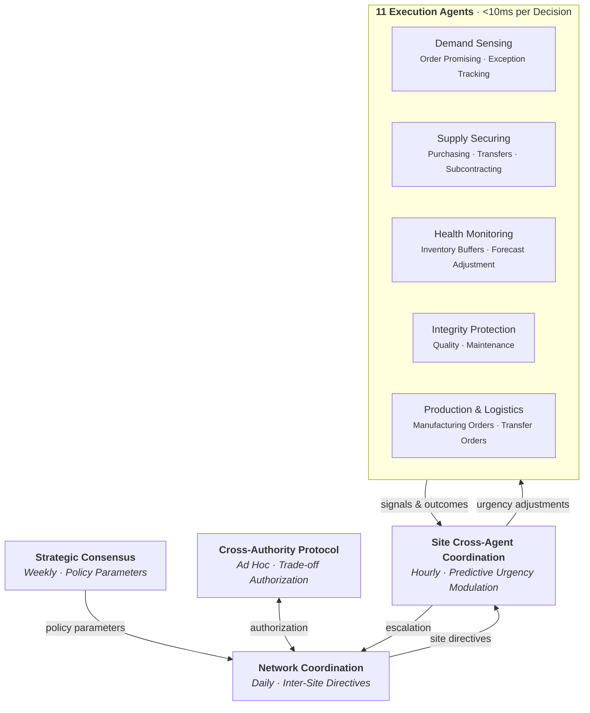
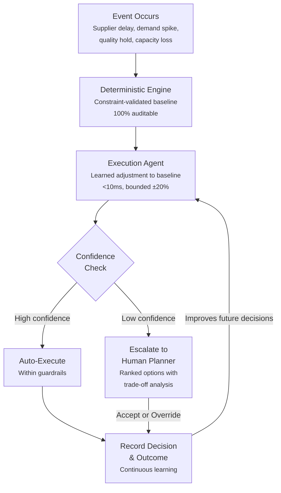
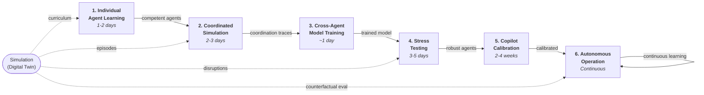

> **EXTERNAL DOCUMENT** — For customers, investors, and partners. No implementation details.
> Internal version: [EXECUTIVE_SUMMARY.md](../../EXECUTIVE_SUMMARY.md)

# Autonomy: Executive Summary

## What Your Supply Chain Organization Looks Like After Autonomy

**Version**: 5.0 (External)
**Date**: March 8, 2026

---

## Executive Overview

Most supply chain organizations operate the same way they did a decade ago. Planners open spreadsheets or legacy screens every Monday, review thousands of SKU-level exceptions, make judgment calls under time pressure, and hope the plan holds until next week. When disruptions hit mid-cycle, the response is reactive — phone calls, expedited shipments, and costly overtime. The institutional knowledge that makes this work lives in the heads of a few senior planners, and when they leave, it leaves with them.

Autonomy changes the operating model. Not by replacing your planning team, but by restructuring *what they spend their time on* — shifting the workforce from routine plan generation to exception governance, from reactive firefighting to proactive risk management, and from tribal knowledge to institutional learning that compounds over time.

This document describes what is different — for the organization, for daily operations, and for the people doing the work — when Autonomy is fully adopted.

---

### Agent Hierarchy



---

## Part 1: What Changes for the Organization

### From Periodic Planning to Continuous Response

Today, most organizations plan on a fixed cadence. Weekly MPS runs. Monthly S&OP meetings. Quarterly network reviews. The problem is that supply chains don't wait for cadence. A supplier delay on Tuesday doesn't care that your MPS run was Monday.

**With Autonomy**, the planning system is always on. When an event occurs — a supplier misses a delivery window, a customer order spikes unexpectedly, a production line goes down — the system detects it, evaluates the downstream impact, generates a recommended response, and either executes within pre-approved guardrails or surfaces the decision to the right person with a fully evaluated set of options.

The shift is structural:

| | Before Autonomy | After Autonomy |
|---|---|---|
| **Planning trigger** | Calendar (weekly/monthly) | Events (as they happen) |
| **Scope of each plan run** | Entire portfolio, all SKUs | Only affected products and locations |
| **Response latency** | Days to a week | Minutes to hours |
| **Human role** | Generate the plan | Govern the plan |
| **Knowledge capture** | Undocumented, in people's heads | Every decision and its reasoning recorded |
| **Improvement mechanism** | Annual consultant engagement | Continuous, automatic from daily work |

### From Cost Center to Competitive Advantage

In most organizations, the supply chain planning function is seen as a cost of doing business — necessary, expensive, and difficult to improve incrementally. Autonomy repositions it.

When the planning system learns from every decision, every override, and every outcome, it creates a **compounding knowledge asset**. The more decisions your team makes, the smarter the system gets. The smarter the system gets, the more decisions it can handle without human intervention. The more it handles autonomously, the more time your team has for strategic work — network redesign, supplier negotiations, new product introduction planning — that actually moves the business forward.

This compounding loop is difficult for competitors to replicate because it is built on *your data, your team's judgment, and your specific operating context*.

### From Fragmented Tools to One Operating System

A typical mid-market supply chain team juggles between their ERP (for transactions), a planning tool or spreadsheets (for MPS/MRP), email and phone (for collaboration), separate BI dashboards (for analytics), and manual processes (for exception handling). Each tool has its own data, its own logic, and its own version of the truth.

Autonomy consolidates the planning workflow into a single environment where demand signals, supply plans, inventory positions, order status, exception alerts, and AI recommendations are all visible in context. Planners don't context-switch between systems. They work in one place, and every action — whether human or AI — is tracked, explained, and available for review.

---

## Part 2: What Changes for Daily Operations

### The Daily Workflow, Redesigned

**Monday morning, before Autonomy:**

A planner arrives, opens the planning system, and begins reviewing the weekly MPS output. There are 847 exceptions flagged. She knows from experience that most of them are noise — parameter mismatches, minor demand shifts that will self-correct, safety stock recalculations that don't need action. But she can't tell which of the 847 actually matter without clicking into each one. By Thursday, she's reviewed 400. The other 447 roll into next week. Three of them were urgent. One caused a customer stockout.

**Monday morning, with Autonomy:**

The same planner arrives to a prioritized worklist of 14 items. Overnight, the system processed the same 847 potential exceptions. It auto-resolved 780 within pre-approved guardrails (reorder quantities adjusted, safety stock recalculated, minor schedule shifts executed). It flagged 53 for informational review — actions it took that the planner should be aware of but doesn't need to approve. And it escalated 14 that require human judgment: a supplier bankruptcy risk, a demand spike for a promotional item that exceeds capacity, a quality hold on a key component.

For each of those 14 items, she sees:
- What happened (the triggering event)
- What the system recommends (ranked options with trade-offs)
- Why it recommends it (reasoning grounded in specific data — this order, this inventory level, this lead time)
- What happens if she does nothing (projected impact on service level, cost, and downstream orders)

She resolves all 14 by 10 AM. The three urgent items from the old workflow? They were auto-resolved Friday evening.

### How Decisions Flow

The decision architecture follows a principle we call **Automate-Inform-Inspect-Override**:

**Automate**: Routine decisions execute within guardrails without human involvement. Guardrails are business rules set by the planning team: maximum order value, maximum safety stock change, minimum service level floor, cost increase ceiling. Anything within bounds executes automatically.

**Inform**: When the system takes an action, it logs the decision and notifies the relevant planner. Not as a pop-up or an urgent alert — as a daily digest or a section of the worklist marked "for your awareness." The planner can review at their pace.

**Inspect**: For decisions that exceed guardrails or involve unusual circumstances, the system presents a structured recommendation. The planner can drill into the reasoning, examine the underlying data, ask follow-up questions in plain language, and compare alternative scenarios side by side.

**Override**: When a planner disagrees with a recommendation, they don't just click "reject." They provide context — why they're overriding, what they know that the system doesn't, what external factor is at play. This override, with its reasoning, becomes training data. The system learns not just *that* the planner disagreed, but *why*, and adjusts its future recommendations accordingly.

Over time, the override rate drops — not because the system forces compliance, but because it gets better at incorporating the judgment patterns that drive human overrides in the first place.

**Measured progression:**
- Week 1: ~45% of decisions auto-execute, ~35% overridden
- Week 12: ~72% auto-execute, ~15% overridden
- Steady state target: ~85% auto-execute, <10% overridden

### How the System Builds Confidence



Every decision follows this path: a deterministic engine computes a constraint-validated baseline (fully auditable), then an execution agent applies a learned adjustment within bounded limits. A confidence check — using distribution-free statistical guarantees — determines whether the decision can auto-execute or must be escalated for human review. In both cases, the decision and its outcome are recorded and used to improve future decisions.

### Testing Changes Before They Go Live

One of the most expensive mistakes in supply chain management is implementing a policy change — a new safety stock level, a new supplier, a network redesign — and discovering weeks later that it created problems elsewhere in the network.

Autonomy includes a **digital twin** of your supply chain: a complete replica that uses the same planning logic, the same AI agents, and the same cost calculations as production. The only differences are time (it runs in fast-forward) and demand (it can use synthetic patterns or historical actuals).

This means you can:
- **Test a policy change** (e.g., "What happens if we reduce safety stock by 20% at the East Coast DC?") and see the downstream impact on service levels, costs, and order patterns within hours
- **Model a network change** (e.g., "What if we add a regional warehouse in Dallas?") and run hundreds of demand scenarios to measure the financial and operational impact
- **Compare strategies** (e.g., "How does our current ordering approach perform against an optimized alternative across 500 simulated weeks?") and make the decision with statistical confidence instead of intuition
- **Validate before deploying** any change to the production system, eliminating the "try it and hope" approach

### Exception-Driven, Not Batch-Driven

Traditional planning systems process everything in batch. Every SKU, every location, every time period — whether anything changed or not. This is computationally wasteful and creates a firehose of exceptions that buries the important ones.

Autonomy is event-driven. When something changes — a new order, a late shipment, a forecast update, a capacity constraint — only the affected products and locations are replanned. The rest of the plan holds. This means:

- **Faster response**: Critical disruptions are addressed in minutes, not days
- **Less noise**: Planners see only what actually changed, not a full regeneration of the plan
- **Better auditability**: Every plan change is tied to a specific triggering event, making root cause analysis straightforward
- **Lower computational cost**: Incremental replanning uses a fraction of the resources of full batch runs

### Collaboration That Actually Works

Supply chain planning is inherently cross-functional. A procurement decision affects manufacturing capacity. A production schedule change affects distribution. A customer priority override affects allocation across the entire network.

In most organizations, this coordination happens through meetings, emails, and phone calls — slow, unstructured, and impossible to audit. Autonomy makes cross-functional coordination part of the workflow:

- **Approval workflows** route decisions to the right stakeholders automatically
- **Inline comments** on specific orders, plans, and recommendations create a threaded discussion trail tied to the artifact being discussed
- **Activity feeds** show everyone involved what changed, who changed it, and why
- **Plain-language explanations** make AI recommendations accessible to non-technical stakeholders — a VP of Supply Chain can understand *why* the system recommends a particular action without needing a data science background

---

## Part 3: What Changes for the Workforce

### The Planner's Role Evolves

The most significant workforce impact is what planners spend their time on. Today, an experienced planner might spend 70% of their time on routine plan generation and exception review, and 30% on strategic analysis. With Autonomy, those ratios invert.

**Before:**
- 40% — Running and reviewing MPS/MRP outputs
- 30% — Manually resolving routine exceptions
- 15% — Firefighting unexpected disruptions
- 10% — Strategic analysis (network design, policy optimization)
- 5% — Training junior planners

**After:**
- 5% — Reviewing the daily digest of auto-executed actions
- 15% — Resolving the escalated exceptions that require human judgment
- 10% — Monitoring system performance and adjusting guardrails
- 40% — Strategic analysis, scenario testing, policy optimization
- 15% — Cross-functional collaboration (S&OP, supplier development, new product planning)
- 15% — Training, override context capture, and knowledge building

This is not a reduction in headcount — it is a redeployment of expertise. The same team handles more volume, with higher quality, and spends their intellectual energy on work that differentiates the business rather than work that merely keeps it running.

### Institutional Knowledge Becomes a System Asset

In a traditional planning organization, a senior planner's departure is a crisis. They carry years of context — which suppliers are reliable, which forecast adjustments are noise, which customers tolerate partial shipments, which production lines have hidden capacity. When they leave, this knowledge walks out the door.

Autonomy captures this knowledge systematically. Every override a planner makes is recorded with context. Every decision pattern is learned. Every "I adjusted this because I know the supplier is slow in Q4" becomes a data point that the system internalizes. Over months and years, this creates a **living knowledge base** — not a static document that nobody reads, but an active decision-support system that embodies the accumulated judgment of every planner who has ever worked in it.

The result: onboarding a new planner drops from 6-12 months to 2-3 months. Not because the job is simpler, but because the new planner has access to the institutional judgment that previously lived only in their predecessor's head.

### Building Confidence Through Proof, Not Promises

The biggest barrier to AI adoption in supply chain is not technology — it's trust. Planners who have spent years developing their judgment are understandably skeptical when told that a system can do their job better. And they're right to be skeptical: plenty of "AI-powered" tools have overpromised and underdelivered.

Autonomy addresses this by making AI performance **observable and provable** before it touches real inventory:

1. **Side-by-side comparison**: Run the same planning scenario with human decisions and AI decisions. Compare the results — total cost, service level, inventory turns, order stability. The numbers speak.

2. **Gradual handoff**: Start with AI as a suggestion engine (copilot mode). Planners see every recommendation, accept or reject with reasoning, and maintain full control. As confidence builds, expand the guardrails. Let the system auto-execute more categories of decisions.

3. **Transparent reasoning**: Every AI recommendation comes with an explanation grounded in specific data — not "the algorithm says 42 units" but "given current inventory of 18 at the Dallas DC, incoming shipments of 25 arriving Thursday, and forecasted demand of 35 next week, I recommend ordering 42 units to maintain the 95% service level target while accounting for the supplier's recent 2-day lead time variability."

4. **Competitive simulation**: Planners can compete directly against the AI in simulated scenarios. Win or lose, they see exactly how the AI makes decisions, where it outperforms human intuition, and where human judgment adds value that the AI misses. This transforms skeptics into informed adopters.

The adoption timeline with this approach is typically 2-3 weeks to initial confidence, vs. 6-12 months with traditional planning software where users are simply told to trust the output.

### A New Skill Set, Not a Lost One

Autonomy doesn't make supply chain expertise obsolete — it redirects it. The planning team needs to develop new competencies:

- **Guardrail design**: Setting the boundaries within which AI operates autonomously. This requires deep supply chain knowledge — you have to understand what's safe to automate and what isn't.
- **Exception governance**: Judging the 10-15% of decisions that the system escalates. These are the hard calls — the ones that require context, creativity, and cross-functional negotiation.
- **Scenario design**: Constructing meaningful tests in the digital twin. "What should we test?" is a strategic question that requires business acumen, not technical skills.
- **Override storytelling**: Providing high-quality context when overriding AI recommendations. The richer the context, the faster the system learns. This turns tacit knowledge into explicit knowledge.
- **Performance monitoring**: Tracking system accuracy, identifying drift, adjusting parameters. Think of it as tuning an instrument rather than playing every note.

These are higher-value skills. They build on existing supply chain expertise while adding a layer of analytical rigor and systems thinking that makes the team more effective — and more marketable.

---

## Part 4: The Business Case

### What It Costs

**Traditional enterprise planning (Kinaxis, SAP IBP, OMP):**
- Year 1: $6M+ (licenses, consulting, training, integration)
- Ongoing: $1.35M/year (maintenance, consultants, user training)
- Time to value: 12-18 months before operational benefits
- 5-year TCO: $11.4M+

**Autonomy:**
- Year 1: $200K (platform, setup, training)
- Ongoing: $120K/year (subscription, support)
- Time to value: 2-4 weeks to production deployment
- 5-year TCO: $680K

**91% TCO reduction over 5 years.**

### What It Delivers

For a mid-size manufacturer ($500M revenue, $50M inventory):

**Operational improvements (conservative estimates):**
- **80-90% of routine planning decisions** handled without human intervention
- **70% faster response** to supply chain disruptions (minutes vs. days)
- **60% reduction in planner workload** on routine tasks (redirected to strategic work)
- **25% inventory reduction** while maintaining or improving service levels
- **20-35% total supply chain cost reduction** vs. current ordering policies

**Financial impact:**
- $5M freed working capital (10% inventory reduction)
- $1.875M/year holding cost savings
- $5M revenue protection (20% stockout reduction)
- $1.5M training cost savings (60% faster onboarding)
- **$8.375M total annual operational value**

**First-year ROI: 70x.** Payback period: under one week.

### Why Now

The pain points are reaching a breaking point across the industry:

- **Rising software costs**: Legacy vendor license renewals increasing 10-15% annually with no proportional improvement in capability
- **Implementation failures**: 40-60% of enterprise planning projects fail or exceed budget
- **Talent shortage**: Experienced planners retiring; the next generation expects modern tools, not green-screen ERP interfaces
- **Volatility as the norm**: Pandemics, trade wars, climate disruptions, and demand shifts have made deterministic planning demonstrably inadequate
- **AI pressure from above**: Boards and executives asking "why aren't we using AI?" while incumbent vendors offer limited, bolt-on capabilities at premium prices

Organizations that move first build a compounding advantage: their AI gets smarter, their teams get more productive, their institutional knowledge deepens — while competitors are still running weekly batch MRP and reviewing thousands of exceptions by hand.

---

## Part 5: What Makes Autonomy Different

### It's Not Another Planning Tool — It's an Operating Model Shift

Most planning software digitizes the existing process: take the spreadsheet, put it in a database, add a web interface. The planner still does the same work, just in a different window.

Autonomy changes *who does what*. The system does the routine planning. The human does the governance. This isn't a feature difference — it's a structural difference in how the planning function operates.

### Trust Is Earned, Not Assumed

Legacy planning systems demand trust on day one. "Install our software, configure it for 12 months, and then trust the output." When planners don't trust it, they build shadow spreadsheets and override everything — which means the organization paid $6M for a system nobody uses.

Autonomy earns trust through evidence. Planners see AI recommendations alongside their own decisions, in identical scenarios, with measurable outcomes. They observe the reasoning. They test edge cases. They start with full control and gradually expand AI autonomy as confidence builds. By the time the system is running autonomously, trust is not an issue — it has been demonstrated hundreds of times.

### The System Gets Smarter From Your Work

Every decision your team makes — and every override they provide — becomes training data. The system doesn't just execute; it learns. Not from generic industry data, but from *your team's judgment, applied to your supply chain, in your operating context*. This creates a flywheel:

```
More decisions → Better AI → Less routine work →
More time for strategic decisions → Better strategic outcomes →
More trust → Expanded AI autonomy → More decisions handled → ...
```

After 12 months of operation, your system reflects the accumulated expertise of your entire planning team. This is a defensible competitive advantage that no amount of software licensing can replicate.

### Risk-Free Testing of Any Change

The digital twin is not a gimmick — it's a decision-making tool. Before you change a safety stock policy, before you onboard a new supplier, before you close a warehouse, you run it through the twin. You see the impact across every node in the network, across hundreds of demand scenarios, with financial projections and confidence intervals. You make the decision with data, not intuition.

This alone justifies the platform for organizations that make even one significant supply chain structural change per year.

---

## Part 6: Continuous Autonomous Planning Architecture

### Transforming Supply Chain Management from Cadence to Event-Driven

**Traditional Planning** (Weekly/Monthly Cadence):
```
Monday:     Import SAP data
Tuesday:    Run MPS batch job
Wednesday:  Manual exception review
Thursday:   Approve and release plan
Friday:     Publish to ERP
Issues: 5-day latency, cannot react to intra-week disruptions
```

**Continuous Autonomous Planning** (Event-Driven with AI Agents):
```
Event detected → Agent triggered → Replan affected SKUs → Commit to branch → Human notified (if needed) → Auto-execute or approve
Benefits: Minutes from event to action, only affected products replanned, human-in-the-loop for exceptions
```

### The AIIO Framework: Automate-Inform-Inspect-Override

**Core Philosophy**: Agents autonomously handle routine planning within guardrails, inform humans of decisions, humans inspect results and override when necessary with captured context for continuous learning.

| Stage | Responsibility | Who | Tool/Interface |
|-------|---------------|-----|----------------|
| **Automate** | Generate recommendations, execute within guardrails | AI Agents | Event-driven orchestration, agent-to-agent collaboration |
| **Inform** | Notify humans of decisions | AI Agents | Chat, email alerts, dashboard |
| **Inspect** | Review agent decisions, drill into details | Humans | Chat-first UI, point-and-click deep dive |
| **Override** | Change plans + provide learning context | Humans | UI with reason capture, file upload |

**Continuous Learning Loop**:
```
1. Automate  → Agents generate recommendations based on current models
2. Inform    → Notify humans of actions (auto-executed or pending approval)
3. Inspect   → Humans review via chat or point-and-click UI
4. Override  → Humans provide feedback with context (reason, files, outcome preference)
5. Learn     → System captures context, identifies learning signals
6. Update    → Adjust guardrails, update KPI weights, fine-tune models
7. Improve   → Next iteration uses updated models/guardrails
→ Cycle repeats - agents get better over time
```

**Learning Outcomes**:
- Week 1: 45% auto-execute rate, 35% override rate
- Week 12: 72% auto-execute rate, 15% override rate
- Target: 85% auto-execute rate, <10% override rate

### AWS Supply Chain Integration

**Insights to Event Triggers**:
- Stock-out risks, excess inventory alerts → Planning events
- Vendor lead-time predictions → Supply disruption events
- Forecast deviations → Demand change events

**Recommendations to Agent Proposals**:
- Agents generate ranked recommendations using AWS SC metrics:
  - Risk resolution % (0-40 points)
  - Distance impact (0-20 points)
  - Sustainability (CO2 reduction, 0-15 points)
  - Service level impact (0-15 points)
  - Inventory cost (0-10 points)

**Collaboration to Agent-to-Agent Communication**:
- Multi-agent negotiation (up to 3 rounds)
- Conflict detection and resolution
- Supervisor mediation
- Shared KPI optimization (service level, cost, inventory turns, CO2)

### Complete AWS Supply Chain Feature Integration

| AWS SC Feature | Status | UI Coverage | Key Capabilities |
|---|---|---|---|
| **Material Visibility** | Complete | 100% | Shipment tracking, ATP/CTP calculations, inventory projection, N-tier visibility with inventory flow, capacity analysis, risk assessment per tier |
| **Order Planning & Tracking** | Complete | 100% | Unified all-order dashboard (PO/TO/CO/MO), order detail with timeline, vendor scorecard, KPI cards, search/filter, CSV export |
| **Insights & Risk Analysis** | Complete | 100% | Risk detection, watchlists, alert rules configuration, notification channels, predictive analytics |
| **Recommended Actions** | Complete | 100% | Risk-based recommendations, scoring breakdown, accept/reject workflow, batch operations, simulation, performance tracking |
| **Collaboration** | Complete | 100% | Agent-to-agent, human-to-agent, and human-to-human framework, approval workflows, inline comments, activity feed, team messaging |
| **Demand Planning** | Complete | 100% | Demand plan view/edit with import/export, forecast adjustment history, version comparison, consensus planning with voting, CPFR with exception detection, ML forecast pipeline |

### Key Innovations

**1. Event-Driven Agent Orchestration**:
- Agents react to real-time events (orders, disruptions, forecast changes)
- Priority-based task queue (P0 < 1 min, P1 < 5 min, P2 < 1 hour, P3 < 24 hours)
- Agent dependency management (Policy agents → Execution agents → Supervisor)

**2. Git-Like Plan Versioning**:
```
main (production plan)
├── daily/2026-01-23  (today's baseline)
│   ├── scenario/mps-order-789  (MPS agent scenario)
│   ├── scenario/supplier-delay-456  (MRP agent scenario)
│   └── hotfix/stockout-case  (Emergency fix)
```
- Branch/merge workflow for plan changes
- Full plan history with commit/diff/revert
- Scenario-based "what-if" analysis

**3. Incremental Change Data Capture**:
- Nightly full snapshot: 260 MB (50 MB compressed)
- Hourly incremental: 10-50 KB (100x reduction)
- Agent-triggered incremental: Real-time capture
- 28-day retention: ~83 GB total

**4. Natural Language-First UI**:
```
Planner: "Show me all agent actions from today"
System:  "I found 12 agent actions today:
          - 5 by MPS Agent (all auto-executed, avg cost impact: +$1,200)
          - 3 by MRP Agent (2 auto-executed, 1 awaiting your review)
          [View All] [Filter by Impact] [Show Pending Only]"

Planner: "Show me the MRP action that needs my review"
System:  "The MRP Agent recommends creating a PO for 500 units of BOTTLE...
          This requires review because order value ($62,000) exceeds threshold ($50,000)
          [Approve] [Modify] [Request Alternatives]"
```

**5. Guardrails for Agent Autonomy**:
- Financial: Max cost increase 5%, max PO value $50K
- Operational: Max safety stock increase 20%, max production change 15%
- Customer: Min service level 92%, max order delay 3 days
- Strategic: Max CO2 increase 10%, min supplier diversity 2

**6. Human Override with Context Capture**:
When humans override agents, they provide:
- **Reason category** (10 options): Domain knowledge, external constraint, strategic decision, data quality, policy exception, customer priority, supply chain insight, cost sensitivity, risk aversion, other
- **Free-text explanation** (min 10 characters)
- **Supporting files**: PDFs, emails, spreadsheets
- System learns: Adjust guardrails, update KPI weights, fine-tune models

**7. Continuous Order Promising**:
- **Batch Promising**: Priority-aware allocation (VIP customers first)
- **Continuous Promising with Batched Notification** (Recommended):
  - Promise on arrival, batch notifications
  - High-priority orders can pre-empt lower-priority promises before notification
  - Priority override window: 30 minutes configurable

### Sequential Decision Framework

The platform's planning architecture is grounded in a rigorous **sequential decision framework** that provides a unified theoretical foundation for decision-making under uncertainty.

**Five Core Elements**:

| Element | Description | Platform Implementation |
|---------|-------------|------------------------|
| **State** | What we know now | Inventory levels, backlog, pipeline, demand history, network topology |
| **Decision** | What we can control | Order quantities, production schedules, sourcing allocations |
| **Exogenous Information** | What arrives from outside | Customer demand, lead time realizations, yield variations |
| **Transition Function** | How the world evolves | Supply chain simulation engine |
| **Objective Function** | What we optimize | Minimize expected total cost subject to service level constraints |

**Four Policy Classes**:

| Class | Description | Platform Use |
|-------|-------------|--------------|
| **Rules-Based** | Direct state-to-decision mapping | Base-stock rules, historical proportions |
| **Parameterized Optimization** | Tunable policy parameters | S&OP/MPS with optimized parameters |
| **Learned Value Functions** | AI agents that learn from experience | Execution agents, network coordination model |
| **Lookahead Planning** | Model predictive control | Strategic planning with scenarios |

**Hierarchical Integration**:

The platform implements the insight that **multi-level planning is nested optimization**:

```
Strategic:     Optimize long-term parameters using scenario analysis
                    ↓ bounds
S&OP:          Optimize policy parameters within strategic bounds
                    ↓ parameters
MPS:           Optimize production schedule within S&OP parameters
                    ↓ constraints
Execution:     Execute optimal decisions respecting MPS constraints
```

### Agent Hierarchy and Tasks

**Policy Agents** (Set the rules):
- Inventory Policy Agent: Safety stock, reorder points, days-of-coverage targets
- Sourcing Policy Agent: Make-vs-buy, vendor selection, priorities
- Capacity Policy Agent: Shift patterns, overtime rules, bottlenecks
- Demand Policy Agent: Forecast models, seasonality, demand sensing

**Execution Agents** (Implement the plan):
- MPS Agent: Master production schedule
- MRP Agent: Component requirements, purchase requisitions
- Capacity Agent: Resource scheduling, load balancing
- Order Promising Agent: ATP/CTP calculation, order confirmation

**Supervisor Agents** (Coordinate and escalate):
- Supervisor: Exception handling, root cause analysis, human escalation
- Global Planner Agent: Network-wide optimization, trade-off analysis

### Performance & Scalability

**Event Processing Capacity**:
- 100,000 events/day (peak: 10 events/sec)
- 50,000 agent tasks/day
- 200 incremental commits/day
- 1,000 plan diff queries/day

**Latency Targets**:
- P0 (Critical): < 1 minute event → plan → publish
- P1 (High): < 5 minutes
- P2 (Medium): < 1 hour
- P3 (Low): < 24 hours

**Storage Requirements** (1 year):
- Full snapshots: 18 GB
- Incremental snapshots: 3.6 GB
- Events log: 36 GB
- Agent decisions: 18 GB
- **Total: ~83 GB/year**

### Continuous Autonomous Planning vs. Legacy Systems

| Aspect | Legacy (Kinaxis/SAP IBP) | Autonomy |
|--------|--------------------------|----------|
| **Planning Frequency** | Weekly/monthly batch | Event-driven (minutes) |
| **Latency** | 5-7 days event → action | <5 minutes (P0/P1 events) |
| **Human Involvement** | Manual batch review of 1000s SKUs | Inspect exceptions only (~10-20/day) |
| **Plan Changes** | Full replan (slow) | Incremental (only affected SKUs) |
| **Versioning** | Single "current" plan | Git-like branches, full history |
| **AI Integration** | Limited, bolt-on | Native agents with agent-to-agent collaboration |
| **Learning** | Consultant retraining | Continuous from human overrides |
| **Explainability** | Black box optimization | Natural language + observable decisions |
| **UI Paradigm** | Complex ERP screens | Chat + point-and-click deep dive |
| **Cost** | $100K-$500K/user/year | $10K/user/year (90% reduction) |
| **Deployment** | 12-18 months | 2-4 weeks |

### Value Proposition: Integrated Capabilities

**1. Enterprise Planning Platform** (90% cost reduction vs. Kinaxis/SAP IBP)
- Continuous event-driven planning with AI agents
- Git-like versioning and scenario management
- Natural language-first UI
- Incremental change data capture for efficiency
- Plan vs. actual automated comparison

**2. AI Agent Training Ground** (Risk-free validation before production)
- Test agent strategies in simulation environments
- Build stakeholder confidence through competitive simulation
- Generate diverse training data from human decisions
- Continuous learning from human feedback

**3. Stochastic Simulation Engine** (Model real-world uncertainty)
- 20+ distribution types for operational variability
- Monte Carlo simulation (1000+ scenarios)
- Probabilistic balanced scorecard (P10/P50/P90 KPIs)
- Multi-echelon network topology support

**4. Conformal Prediction Engine**
- **Distribution-Free Intervals**: Guaranteed prediction coverage without assuming any specific distribution shape
- **Calibration from History**: Use Plan vs. Actual data to calibrate per-product, per-site uncertainty bounds
- **Formal Guarantees**: If we promise "90% coverage", actual coverage will be >=90% (mathematically proven)
- **Safety Stock with Guarantees**: Calculate safety stock with formal service level guarantees
- **Adaptive Recalibration**: Automatic drift detection and recalibration when forecast accuracy degrades

**5. Distribution Fitting & Likelihood Estimation Engine**
- **Automatic Distribution Fitting**: Automatically fit 20+ distribution types to historical demand, lead time, yield, and price data using maximum likelihood estimation
- **Statistical Model Selection**: Goodness-of-fit testing and information criteria ranking to select the best-fitting distribution per product-site combination
- **Distribution-Aware Safety Stock**: When demand or lead time is non-Normal (e.g., lognormal, Weibull), uses Monte Carlo simulation of Demand-During-Lead-Time instead of standard formulas — correcting 15-30% safety stock miscalculation common with skewed distributions
- **Distribution-Aware Feature Engineering**: AI agent inputs include fitted distribution parameters and robust statistics instead of simple mean/standard deviation, providing better signal for non-Normal data

**6. Digital Twin Training Pipeline**
- **Five-Phase Cold-Start**: Takes AI agents from zero experience to production autonomy in 3-5 weeks:
  1. **Behavioral Cloning** (hours): Each agent matches the deterministic engine baseline within +/-5%
  2. **Coordinated Simulation** (2-3 days): All 11 agents train simultaneously with signal coordination active, learning inter-agent coordination from 28.6M+ training records
  3. **Stochastic Stress-Testing** (hours): Agents face adversarial scenarios — extreme demand spikes, supplier failures, capacity shocks, compound disruptions
  4. **Copilot Calibration** (2-4 weeks): Agents run in copilot mode with human overrides captured and weighted by effectiveness tracking
  5. **Autonomous Continuous Learning** (ongoing): Continuous improvement from production outcomes via the relearning loop
- **Warm-Start Advantage**: Production AI starts with pre-trained knowledge from simulation, not random initialization — eliminating the months-long "cold start" period that makes enterprise AI adoption impractical



**7. Vertical Escalation (Escalation Arbiter)**
- **Problem**: Some execution-level anomalies signal that *strategic policy parameters* are wrong, not that execution decisions need fine-tuning. Retraining agents doesn't fix a safety stock multiplier that's too low.
- **Persistence Detection**: Monitors agent decision patterns across all sites for persistent directional drift — when agents consistently correct in the same direction (e.g., always ordering 20% more), the policy is wrong
- **Intelligent Routing**: Routes escalations to the right level — horizontal (agent retrain), operational (network model refresh), or strategic (S&OP policy review) — based on pattern scope (single agent vs. multi-site vs. network-wide)
- **Theoretical Foundation**: Maps to dual-process theory (execution agents = fast thinking, network models = slow thinking) and nested decision loops (execution/operational/strategic time horizons)

**8. Quantitative Supply Chain Economics**
- **Dollar-Denominated Decisions**: AI agent reward functions use actual economic costs (holding cost per unit per day, stockout cost per unit, ordering cost per order) computed from product unit cost and inventory policy parameters — replacing heuristic scaling factors
- **Economically Optimal Safety Stock**: Marginal economic return analysis — stock one more unit only when the expected stockout cost exceeds the holding cost. Monte Carlo simulation over fitted demand and lead time distributions with no fallbacks or defaults
- **CRPS Forecast Scoring**: Continuous Ranked Probability Score — the gold standard for probabilistic forecast evaluation — integrated into the prediction pipeline. Tracks forecast distribution quality, not just coverage
- **Censored Demand Detection**: Automatic detection of stockout periods where observed demand understates true demand. Censored observations excluded from distribution fitting to prevent systematic underestimation
- **Fat-Tailed Lead Times**: Fat-tailed distribution fitting for lead times, capturing the "most shipments arrive on time, but some arrive very late" pattern better than standard distributions
- **Automated Policy Re-Optimization**: Weekly automated re-optimization of inventory policy parameters, ensuring policies stay current as demand patterns evolve
- **No Fallbacks**: All economic parameters are explicitly required for every tenant — the system raises errors rather than silently using defaults. Every cost assumption is visible and auditable

**9. Decision Intelligence Platform Architecture** (Gartner-aligned)
- **Decision-Centric Architecture**: Gartner designated Decision Intelligence as "transformational" (2025 AI Hype Cycle) and published its inaugural Magic Quadrant for Decision Intelligence Platforms in January 2026. The platform implements the full DI lifecycle: decision modeling, orchestration, monitoring, and governance
- **Decisions as Assets**: Every recurring supply chain decision — stocking, ordering, rebalancing, allocation — is modeled with defined inputs, logic, constraints, ownership, and measured outcomes across 11 specialized agent types
- **Three-Level Maturity Progression**: Decision Support (human in the loop) → Decision Augmentation (human on the loop, copilot mode) → Decision Automation (human out of the loop, autonomous mode) — with progression governed by measured decision quality, not arbitrary trust thresholds
- **Agentic AI Alignment**: Gartner predicts 50% of SCM solutions will use intelligent agents by 2030. Autonomy already deploys 11 specialized agents per site with multi-site coordination — positioning years ahead of the market curve

**10. Learned Intra-Site Cross-Agent Coordination**
- **The Gap**: Between sub-millisecond reactive signals and daily network-wide inference, many cross-agent interactions follow predictable causal chains that neither mechanism captures. A production spike today will generate quality inspection pressure in hours and maintenance load tomorrow — but reactive signals only respond after each link materializes.
- **Predictive Coordination Layer**: A lightweight model that learns causal relationships between the 11 execution agents within each site, predicting cascade effects that reactive signals alone cannot capture.
- **Urgency Modulation**: Shifts emphasis across the agent group — "pay more attention to quality today because production volume is spiking" — rather than overriding individual agent decisions.

### Business Impact

**Operational Benefits**:
- **80-90% automation rate** for routine planning tasks (agents handle without human review)
- **70% faster response** to supply chain disruptions (minutes vs. days)
- **60% reduction** in planner workload (inspect exceptions only, not full batch review)
- **40% improvement** in forecast accuracy (continuous learning from overrides)
- **25% inventory reduction** while maintaining service levels (optimized safety stock)
- **20-35% cost reduction** vs. naive policies (AI agent optimization)

**Financial Impact** (Mid-size manufacturer, $500M revenue):
- **Direct Cost Savings**: $5.8M first year vs. Kinaxis/SAP IBP
- **Operational Benefits**: $8.375M/year (inventory reduction + holding cost savings + stockout reduction)
- **Total First-Year Value**: $14.175M
- **Platform Cost**: $200K
- **ROI**: 70.9x return, 5.3-day payback period

**Strategic Advantages**:
- **No vendor lock-in**: Open architecture, data portability
- **Fast deployment**: Weeks instead of 12-18 months
- **Transparent AI**: Build trust before production deployment
- **Continuous improvement**: Agents learn from human feedback
- **Flexibility**: Network topology-based, any network structure

---

## Platform Capabilities

### 1. Continuous Autonomous Planning: Event-Driven Supply Chain Optimization

**Event-Driven Planning Flow**:
1. **Event Detection**: AWS SC insights, SAP change data capture, manual triggers
2. **Agent Orchestration**: Priority queue routes events to agents
3. **Agent-to-Agent Collaboration**: Multi-agent negotiation for shared KPIs
4. **Scenario Generation**: Agents create plan branches with recommendations
5. **Guardrail Check**: Auto-execute if within bounds, else human approval
6. **Human Notification**: Chat + email + dashboard alerts
7. **Plan Commit**: Git-like commit to scenario branch
8. **Human Inspection**: Natural language queries + point-and-click deep dive
9. **Human Override** (if needed): Provide context (reason, files, outcome preference)
10. **Learning Pipeline**: Adjust guardrails, update KPIs, fine-tune models
11. **Merge to Main**: Execute approved plan
12. **Publish to ERP**: Incremental changes flow to SAP/Oracle

**Agent-Generated Recommendations**:
- Ranked by score (0-100): Risk resolution + distance + sustainability + service level + cost
- Simulated in scenario branches (what-if analysis)
- Impact estimation: Before/after KPIs with confidence intervals
- Alternatives considered: Top 3 options with trade-off analysis
- Natural language explanation: "Why did I recommend this?"

**Human Override Context Capture**:
```
Override Reason (Required)
Category: [External Constraint]
Details: Vendor-B is undergoing facility audit, cannot accept orders for 2 weeks
Supporting Files: vendor_b_audit_notice.pdf (125 KB)
Alternative Action: Use Vendor-C instead (14-day lead time vs. 10-day)
Impact: Service level 96.8% → 95.5% (-1.3%), Cost +$1,520

→ System learns: Add constraint "Vendor-B unavailable 2026-01-23 to 2026-02-06"
                 Adjust scoring to prefer Vendor-C during this period
                 Fine-tune models with new external factor
```

### 2. Simulate: Interactive Supply Chain Simulation

**Multi-Participant Scenarios**:
- 2-8 participants in roles (Retailer, Wholesaler, Distributor, Factory, Suppliers)
- Real-time updates
- Period-by-period decision making
- Instant cost and service level feedback

**Mixed Human-AI Scenarios**:
- Humans compete alongside or against AI agents
- Multiple AI strategies: Naive, Conservative, Bullwhip, ML-Forecast, Optimizer, Reactive, AI-powered
- AI opponents provide consistent benchmarks for human performance
- Learn from AI decisions in real-time

**Scenario Variants**:
- **Default**: Classic 4-echelon supply chain
- **Multi-Product**: Multi-product supply chain with shared components
- **High Variability**: Dynamic demand patterns with high variability
- **Complex Networks**: Real-world network topologies with manufacturing BOMs
- **Custom Configurations**: Create any supply chain structure via network editor

### 3. Plan: AI-Powered Supply Chain Optimization

**Network Coordination Model** (Two Tiers):
- **Strategic Model** (Medium-Term): Network structure analysis, risk scoring, bottleneck detection — updates weekly/monthly, outputs criticality scores and safety stock positioning multipliers
- **Operational Model** (Short-Term): Real-time order decisions, demand sensing, exception detection — updates daily, generates priority allocations for order promising
- **Shared Foundation**: Strategic structural insights are cached and fed to the operational model, combining slow-changing network context with fast-changing transactional dynamics

**AI Multi-Agent System**:
- AI-powered agents for each supply chain role
- Supervisor agent validates and improves recommendations
- Global planner agent coordinates network-wide strategy
- Natural language explanations for every recommendation
- Adapts to changing conditions with zero retraining

**Execution Agents** (11 Specialized Decision-Makers):
- Ultra-fast inference (<10ms per decision), low computational cost
- 90-95% accuracy vs. optimal policies, 100+ decisions/second
- Covering: order promising, inventory rebalancing, purchasing, order tracking, manufacturing execution, transfer execution, quality disposition, maintenance scheduling, subcontracting, forecast adjustment, and inventory buffer optimization

**Multi-Agent Consensus**:
- **Weighted Ensemble**: Combine agent recommendations using learned weights
- **Confidence Scoring**: Agreement between agents indicates recommendation reliability
- **Adaptive Learning**: Weights automatically adjust based on observed performance
- **Transfer Learning**: Weights learned in simulation transfer to production deployment

**Optimization Strategies**:
- Cost minimization (inventory holding + backlog penalties)
- Service level maximization (fill rate targets)
- Bullwhip effect reduction (demand variability dampening)
- Multi-objective optimization (Pareto frontier exploration)

### 4. Analyze: Performance Intelligence & Benchmarking

**Current Performance Analysis**:
- Upload historical data or operational metrics
- Compare actual decisions against AI-optimal strategies
- Identify cost reduction opportunities
- Quantify bullwhip effect in real operations
- Benchmark against industry best practices

**Advanced Analytics Dashboard**:
- **Bullwhip Metrics**: Demand amplification ratios across echelons
- **Cost Breakdown**: Holding costs vs. backlog costs by role
- **Service Levels**: Fill rates, stockout frequencies, customer satisfaction
- **Efficiency Scores**: Order variability, inventory turnover, cash-to-cash cycle
- **Pattern Detection**: Seasonality, trends, anomalies in demand/supply

**Uncertainty Quantification**:
- **Conformal Prediction**: Distribution-free prediction intervals with formal coverage guarantees
  - Calibrate on historical Plan vs. Actual data
  - Generate valid prediction intervals without distributional assumptions
  - Adaptive conformal prediction for time series with distribution shift
  - Safety stock calculation with formal service level guarantees
- **Planning Method Comparison**: Side-by-side Stochastic vs. Deterministic analysis
  - Monte Carlo simulation (stochastic): Full uncertainty propagation, risk quantification
  - Deterministic + Sensitivity Analysis: Single-point optimization with parameter variation
  - Automated recommendation for which approach suits your use case
  - Cost distribution comparison (P10/P50/P90/P95)

**Reporting & Insights**:
- Automated reports with AI-generated recommendations
- Export to CSV, JSON, Excel for external analysis
- Integration-ready APIs for BI tools (Tableau, Power BI)
- Executive summaries with KPIs and action items

### 5. Simulation: Confidence Building & Agent Improvement

#### Building Confidence in AI Agents

**The Trust Problem**: Organizations struggle to adopt AI recommendations because:
- "Black box" algorithms feel risky
- No way to validate AI logic before deployment
- Disconnect between data scientists and supply chain practitioners

**The Digital Twin Solution: Scenarios as Fast-Forward Supply Chain Simulations**:

A "scenario" is not entertainment — it's a **digital twin of the real supply chain** that executes in fast-forward time with synthetic demand. The only differences between a scenario and production execution are:
- **Time Scale**: Scenarios advance in seconds/minutes; production advances in days/weeks
- **Demand Source**: Scenarios use synthetic demand patterns; production uses actual customer orders
- **Everything Else is Identical**: Same planning logic, same AI agents, same decision-making, same cost calculations

**Scenarios Enable Three Critical Functions**:

1. **Adoption Through Acceptance** (Build Trust Before Production):
   - **Transparent Competition**: Humans compete against AI in identical scenarios
   - **Observable Decisions**: Watch AI order quantities period-by-period, understand its logic
   - **Measurable Outcomes**: AI wins? Loses? By how much? Why?
   - **Safe Learning Environment**: No real inventory at risk, infinite practice periods
   - **Gradual Adoption**: Start with AI suggestions (copilot mode), progress to AI autonomy as confidence grows
   - **Stakeholder Buy-In**: Executives see AI performance before approving production deployment

2. **Policy Testing** (Risk-Free What-If Analysis):
   - **Inventory Policy Changes**: Test new safety stock levels, reorder points, service level targets
   - **Ordering Policy Changes**: Test different replenishment strategies
   - **Agent Weight Tuning**: Test different agent consensus weights
   - **Guardrail Calibration**: Test min/max order constraints, rush order thresholds
   - **Lead Time Strategies**: Test impact of expedited shipping, supplier changes
   - **Cost Trade-offs**: Test holding cost vs. shortage cost sensitivity

3. **Structural Testing** (Network Redesign Validation):
   - **Add/Remove Sites**: Test impact of new distribution centers, closing warehouses
   - **Supplier Changes**: Test multi-sourcing, backup suppliers, supplier reliability
   - **Capacity Changes**: Test production capacity increases, storage expansions
   - **Network Topology**: Test hub-and-spoke vs. direct-ship models
   - **BOM Changes**: Test make-vs-buy decisions, component substitutions
   - **Lead Time Changes**: Test nearshoring, offshore alternatives

**Confidence Metrics**:
- Win rate: AI vs. Human in fair competition (Target: >70% AI win rate)
- Cost differential: How much does AI save vs. best human participant? (Target: 20-35% reduction)
- Consistency: AI variance vs. human variance across scenarios (Target: <50% human variance)
- Explainability: Can humans articulate why AI made specific decisions? (Measured via post-scenario surveys)
- Acceptance Rate: % of AI suggestions accepted by humans in copilot mode (Target: >80% acceptance)

#### Agent Improvement Through Simulation

**Continuous Learning Pipeline**:

1. **Humans Run Scenarios** → Generate diverse decision data
2. **AI Observes Human Strategies** → Learn from expert participants
3. **AI Competes Against Humans** → Validate and test improvements
4. **Humans Learn from AI** → Adopt successful AI patterns
5. **Cycle Repeats** → Continuous improvement for both

**Simulation ROI**:
- **Engagement**: 3-5x higher participation in training vs. traditional methods
- **Retention**: 70% knowledge retention after 6 months (vs. 20% for lectures)
- **Performance**: Participants improve 40-60% faster with simulation feedback
- **Agent Quality**: Human-validated agents have 25% lower deployment failure rate

---

## Multi-Echelon Network Framework

**Network-Based Supply Chain Topology**:
- Directed Acyclic Graph (DAG) represents material flow
- 4 master site types: Market Supply, Market Demand, Inventory, Manufacturer
- Flexible configuration: serial chains, convergent networks, divergent distribution
- Supports Bill of Materials (BOM) transformations (e.g., 1 Case = 4 Six-Packs)

**Variability Modeling**:
- **Demand Variability**: Stochastic demand with configurable distributions (normal, uniform, seasonal)
- **Lead Time Variability**: Random delays in shipments (min/max/mean)
- **Supplier Reliability**: Partial fulfillment, quality issues, disruptions
- **Capacity Constraints**: Production limits, storage limits, transportation capacity
- **Market Dynamics**: Price elasticity, competitive pressures, seasonal trends

### Planning Hierarchies (AWS Supply Chain Aligned)

**Three-Dimensional Hierarchy System**:

**1. Site/Geographic Hierarchy**:
```
Company (ACME Corp)
├── Region (Americas, EMEA, APAC)
│   ├── Country (USA, Canada, Mexico)
│   │   ├── State (California, Texas, New York)
│   │   │   └── Site (Los Angeles DC, Dallas Factory)
```

**2. Product Hierarchy**:
```
Category (Beverages)
├── Family (Beer)
│   ├── Group (Craft Beer)
│   │   └── Product/SKU (IPA 6-pack 12oz)
```

**3. Time Bucket Hierarchy**:
```
Year (Strategic)
├── Quarter (Network Design)
│   ├── Month (S&OP)
│   │   ├── Week (MPS)
│   │   │   ├── Day (MRP)
│   │   │   │   └── Hour (ATP/Execution)
```

**Planning Type Configuration by Hierarchy Level**:

| Planning Type | Site Level | Product Level | Time Bucket | Horizon |
|---------------|------------|---------------|-------------|---------|
| **Execution** | Site | SKU | Hour | 1 week |
| **MRP** | Site | SKU | Day | 13 weeks |
| **MPS** | Site | Group | Week | 6 months |
| **S&OP** | Country | Family | Month | 24 months |
| **Capacity** | Site | Group | Month | 18 months |
| **Strategic** | Region | Category | Quarter | 5 years |

### Synthetic Data Generation (AI-Guided Setup Wizard)

**Purpose**: Enable rapid deployment and testing by generating realistic synthetic supply chain data for new organizations. An AI-powered wizard guides system administrators through creating complete, archetype-based configurations.

**Three Company Archetypes**:

| Archetype | Description | Network Structure | Primary KPIs | Agent Mode |
|-----------|-------------|-------------------|--------------|------------|
| **Retailer** | Multi-channel retail operations | CDCs → RDCs → Stores + Online | Fill Rate, Inventory Turns, DOS | Copilot |
| **Distributor** | Wholesale distribution | NDCs → RDCs → LDCs + Kitting | OTIF, Order Fill Rate, Cycle Time | Copilot |
| **Manufacturer** | Production-focused operations | Plants → Sub-Assembly → Component → FG DCs | Gross Margin, Production Efficiency | Autonomous |

**What Gets Generated**:
- **Organization**: Tenant and administrator user with default credentials
- **Supply Chain Network**: Sites (DCs, plants, stores), transportation lanes, products (SKUs)
- **Hierarchies**: Site hierarchy (Company → Region → Country → Site), Product hierarchy (Category → Family → Group → Product)
- **Planning Data**: Forecasts with P10/P50/P90 percentiles, inventory policies (DOC-based safety stock)
- **Planning Configs**: MPS, MRP, S&OP configurations
- **AI Agents**: Agent configurations per archetype with recommended strategies

---

## AI Engine: Suggested Actions Generation

The platform's AI agents continuously analyze supply chain state and generate **suggested actions** for both simulation and production environments. Each agent type brings unique strengths:

**1. Network Coordination Model** (Two Tiers):
- **Strategic Model** (Medium-Term): Network structure analysis, risk scoring, bottleneck detection — scalable to 50+ node networks
- **Operational Model** (Short-Term): Real-time order decisions, demand sensing, exception detection — consumes strategic insights plus transactional data
- **Performance**: 85-92% accuracy on demand prediction, 15-30% cost reduction vs. naive policies

**2. AI Multi-Agent System**:
- AI-powered agents for each supply chain role
- Supervisor agent reviews and improves site agent decisions
- Global planner agent coordinates network-wide strategy
- Natural language explanations of AI decisions
- Fallback to heuristic policies when AI is unavailable

**3. Execution Agents** (11 Specialized):
- Ultra-fast inference (<10ms per decision)
- 90-95% accuracy vs. optimal policies, 100+ decisions/second
- Recursive refinement architecture for improved decision quality

**Multi-Agent Consensus for Suggested Actions**:
- **Weighted Ensemble**: Combine agent recommendations using learned weights
- **Confidence Scoring**: Agreement between agents indicates recommendation reliability
- **Adaptive Learning**: Weights automatically adjust based on observed performance (5 learning algorithms)
- **Transfer Learning**: Weights learned in simulation transfer to production deployment

---

## SAP S/4HANA & IBP Integration

### Overview

The platform provides enterprise-grade integration with SAP S/4HANA and SAP Integrated Business Planning (IBP) for seamless data exchange, AI-powered planning enhancement, and real-world validation of supply chain strategies.

### Integration Architecture

```
┌──────────────────┐      ┌─────────────────────────┐      ┌──────────────────┐
│   Databricks     │──────│  Autonomy Platform      │──────│  External        │
│   (Data Lake)    │      │  (Supply Chain Exec)    │      │  Demand Planning │
└──────────────────┘      └─────────────────────────┘      └──────────────────┘
        ↓                            ↓                              ↓
   Master Data              Execution & Visibility         Forecast Generation
   ERP Integration          Order Management                Consensus Planning
   Data Transformation      ATP/CTP, Inventory              ML Forecasting
   Analytics                Agent-Based Planning            Promotional Planning
```

### Data Ingestion Methods

**1. Direct SAP Integration (Real-Time)**:
- RESTful API connectivity to SAP S/4HANA OData services
- Authentication via OAuth 2.0 or SAP Cloud Platform
- Real-time data pull from SAP tables
- Support for SAP BAPIs for transactional operations

**Supported Data Entities**:
- **Master Data**: Materials, Plants, Vendors, Customers
- **Inventory**: Stock levels, reservations, goods movements
- **Purchasing**: Purchase orders, requisitions
- **Sales**: Sales orders, deliveries
- **Production**: Planned orders, production orders
- **Demand**: Consumption data, forecast, demand planning

**2. Flat File Integration (Batch)**:
- CSV, Excel, JSON, XML (SAP IDoc format), Parquet
- SFTP/FTP upload, cloud storage integration, direct upload via UI, scheduled batch imports

### AI-Powered Data Curation

**Automated Data Cleansing**:
- **Missing Data Imputation**: AI analyzes patterns and fills gaps intelligently
- **Anomaly Detection**: Identifies outliers, data quality issues, inconsistencies
- **Data Standardization**: Harmonizes units, date formats, naming conventions
- **Duplicate Detection**: Finds and merges duplicate records across systems

**Semantic Data Enrichment**:
- AI infers relationships between entities (e.g., which materials are substitutes)
- Auto-categorize materials by ABC class, demand patterns, criticality
- Match SAP material codes to Autonomy products with fuzzy matching

### SAP Data Management UI

**Connection Management**:
- Configure connections to SAP S/4HANA, APO, ECC, or BW systems
- Support for multiple connection methods: RFC, CSV file import, OData API, IDoc
- Connection testing and validation with status tracking

**Z-Table/Z-Field Handling**:
- Automatic discovery of Z-tables (custom SAP tables)
- AI-powered fuzzy matching for Z-field to AWS SC entity mapping
- Confidence scoring (High/Medium/Low) for each suggested mapping
- User confirmation workflow to learn from corrections

**Field Mapping**:

| Mapping Method | Description | Confidence |
|---------------|-------------|------------|
| Exact Match | Direct field name match | 95%+ |
| Pattern Match | SAP naming convention patterns | 90%+ |
| Fuzzy Match | String similarity | 70-90% |
| AI Suggested | AI analysis for ambiguous fields | 50-75% |
| Learned | From previous user confirmations | 98% |

**Data Ingestion Monitoring**:
- Real-time job tracking with progress indicators
- Data quality scoring across 5 dimensions (Completeness, Accuracy, Consistency, Uniqueness, Validity)
- Anomaly detection for unexpected data patterns
- Trend analysis showing quality changes over time

### Write-Back to SAP

**AI-Generated Plans to SAP IBP**:
- Export optimized order quantities to IBP Planning Areas
- Push demand forecasts back to IBP Demand module
- Update safety stock recommendations in IBP Supply Planning
- Write inventory targets to IBP Key Figures

**Transactional Write-Back**:
- AI agents generate recommended orders → Human approval workflow → Automatic PR creation
- Write optimized reorder points to material master
- Update safety stock levels by material/plant
- Export multiple "what-if" scenarios for IBP Scenario Comparison

**Audit Trail & Governance**:
- Every write-back operation logged with timestamp, user, rationale
- AI generates audit summaries in natural language
- Compliance with SOX, GDPR, data residency requirements
- Rollback capability for all SAP updates

### Enterprise Features

**Security Integration**:
- SAML 2.0 / OAuth 2.0 Single Sign-On
- Active Directory / LDAP integration
- SAP role-to-Autonomy permission mapping
- Row-level security based on SAP org hierarchy

**Data Residency & Compliance**:
- On-premise deployment option (no data leaves corporate network)
- Cloud deployment with private VPN to SAP
- Data encryption in transit (TLS 1.3) and at rest (AES-256)
- GDPR, SOX, FDA 21 CFR Part 11, GxP compliance

### Integration Use Cases

**Use Case 1: AI-Enhanced Demand Planning**:
1. Ingest 2 years of historical sales data from SAP
2. AI cleanses, identifies seasonality, fills gaps
3. AI model trains on SAP historical actuals
4. Generate 12-month forecast with confidence intervals
5. Side-by-side comparison with SAP IBP statistical forecast
6. Validate through digital twin simulations before production deployment
7. Planner reviews AI explanations and simulation results
8. Export validated forecast to IBP Planning Area
- **Result**: 15-25% forecast accuracy improvement, 40% reduction in planner workload

**Use Case 2: Safety Stock Optimization**:
1. Ingest current safety stock levels and service level targets
2. Run 1,000+ Monte Carlo simulations per SKU in digital twin
3. AI agents find optimal safety stock for 98% service level
4. AI generates rationale for each recommendation with simulation evidence
5. Planner reviews with digital twin test results
6. Update safety stock in SAP material master
- **Result**: 20-30% inventory reduction while maintaining service levels

**Use Case 3: Supplier Risk Assessment**:
1. Ingest supplier master, PO history, quality data
2. AI analyzes supplier performance, identifies patterns
3. Model supply disruption scenarios in digital twin
4. AI assigns risk scores based on simulation results
5. Suggest backup suppliers, safety stock increases, multi-sourcing strategies
6. Proactive warnings when high-risk suppliers have large POs
- **Result**: 50% reduction in stockouts from supplier issues

---

## Use Cases & Business Value

### Use Case 1: New Hire Training

**Challenge**: New supply chain analysts take 6-12 months to become proficient. Traditional training is expensive and slow.

**Solution**:
- New hires run simulation scenarios against AI agents
- Progress through difficulty levels (Easy → Hard AI opponents)
- Unlock achievements as they master concepts
- Compete on leaderboards for recognition

**Results**:
- Reduce onboarding time to 2-3 months
- 85% of trainees reach proficiency benchmarks
- 92% engagement scores vs. 45% for traditional training
- $50K cost savings per hire (reduced training overhead)

### Use Case 2: AI Agent Validation Before Deployment

**Challenge**: Company wants to deploy ML-based demand forecasting but stakeholders are skeptical. "How do we know it won't cause stockouts?"

**Solution**:
- Run 100 simulated scenarios: AI agent vs. current human planner
- AI wins 73% of scenarios with 22% lower total costs
- Humans observe AI decisions, understand logic
- Pilot deployment with human override capability

**Results**:
- Executive buy-in achieved in 2 weeks (vs. 6-month sales cycle)
- AI deployed with confidence, no override needed after 30 days
- 18% reduction in inventory holding costs
- 12% improvement in service levels (fewer stockouts)

### Use Case 3: Supply Chain Network Redesign

**Challenge**: Company considering adding a regional distribution center. Will it reduce costs or add complexity?

**Solution**:
- Create two supply chain configurations (with/without DC)
- Run 500 simulated scenarios for each topology
- Compare total costs, service levels, bullwhip effects
- Test sensitivity to demand variability, lead time changes

**Results**:
- DC reduces costs by 14% under current demand patterns
- But increases bullwhip effect by 9%
- Recommendation: Add DC with visibility sharing and coordination protocols
- Decision made with 95% confidence vs. "gut feeling"

### Use Case 4: Performance Benchmarking

**Challenge**: Company suspects its ordering policies are suboptimal but lacks benchmarks.

**Solution**:
- Upload 12 months of historical ordering/inventory data
- Platform simulates same scenarios with AI-optimal policies
- Generate gap analysis report showing missed savings

**Results**:
- Identified $2.3M annual cost reduction opportunity
- 65% of excess costs from over-ordering at Distributor role
- 25% from poor coordination between Wholesaler and Retailer
- Implemented AI suggestions, captured 80% of savings in 6 months

### Use Case 5: Collaborative Planning with Suppliers

**Challenge**: Retailer and supplier struggle with bullwhip effect. Lack of trust and coordination.

**Solution**:
- Retailer and supplier run collaborative simulation together
- See real-time impact of information sharing and joint planning
- Negotiate visibility agreements in-simulation
- Test different collaboration strategies (VMI, CPFR, etc.)

**Results**:
- 31% reduction in demand variability at supplier
- 18% reduction in inventory holding costs across both parties
- Improved relationship, increased willingness to share data
- Real-world collaboration agreement signed after 3 sessions

---

## Competitive Advantages

### vs. Enterprise Planning Systems (Kinaxis RapidResponse, SAP IBP, OMP Plus)

| Feature | Kinaxis/SAP IBP/OMP | Autonomy |
|---------|---------------------|----------|
| **Deployment Time** | 6-18 months implementation | Deploy in days with pre-built configurations |
| **License Cost** | $100K-$500K per user/year | $10K/year per seat (90% cost reduction) |
| **Implementation Cost** | $500K-$5M consulting fees | $50K-$200K one-time setup |
| **User Training** | 3-6 months specialized training | 2-3 weeks via simulation-based learning |
| **AI/ML Capabilities** | Limited, add-on modules | Native AI agents with continuous learning |
| **Variability Modeling** | Deterministic with safety stock buffers | Full stochastic simulation (demand, lead time, supplier reliability) |
| **Human-AI Interaction** | Passive acceptance of recommendations | Active simulation validates AI before production deployment |
| **Validation** | Post-implementation performance reviews | Pre-deployment testing in risk-free simulations |
| **Learning Curve** | Steep, requires consultants | Intuitive interface, no coding required |
| **Explainability** | Complex optimization black boxes | Observable decisions, natural language explanations |
| **Adoption Risk** | High — requires organizational change management | Low — simulation builds trust before deployment |
| **Flexibility** | Rigid configuration, custom dev expensive | Network topology-based, configure any network in minutes |
| **Vendor Lock-In** | High (proprietary platforms) | Open architecture, data portability |

### vs. Traditional Supply Chain Simulation (AnyLogic, Simul8)

| Feature | Traditional Simulation | Autonomy |
|---------|------------------------|----------|
| **Ease of Use** | Requires simulation expertise | Intuitive interface, no coding required |
| **AI Integration** | Limited, custom development | 7+ agent strategies built-in, AI-ready |
| **Real-Time Multiplayer** | Rare, clunky | Native real-time support, seamless |
| **Analytics** | Export data, analyze elsewhere | Built-in dashboards, automated reports |
| **Cost** | $5K-$50K per license | Open source core, enterprise add-ons |

### The Only Platform That Combines:

1. **Simulation + Analytics + Planning** in one unified environment (Kinaxis/SAP require separate tools)
2. **Human + AI collaboration** with trust-building through competition (legacy systems demand blind trust)
3. **Multi-echelon variability modeling** beyond deterministic MRP/DRP calculations
4. **7+ AI strategies** including AI agent approaches (not rigid optimization solvers)
5. **Simulation for confidence building** and continuous agent improvement (legacy training is workshop-based)
6. **Real-time multiplayer** with observable AI decisions (legacy systems are single-user)
7. **Network topology-based flexibility** supporting any supply chain topology without custom development
8. **Production-ready** with enterprise features (SSO, RBAC, audit logs) at a fraction of legacy cost

---

## Target Markets

**Primary (Direct Replacement Opportunities)**:
- **Manufacturing Companies**: Current Kinaxis/SAP IBP users seeking cost reduction and AI capabilities
- **Retail Chains**: Inventory planning teams frustrated with legacy system complexity
- **CPG/FMCG Companies**: Multi-tier distribution networks requiring stochastic modeling
- **3PL/4PL Providers**: Logistics optimization for multiple clients without per-client licensing
- **Mid-Market Enterprises**: Too small for Kinaxis ($5M+ deals) but need enterprise planning

**Ideal Customer Profile (ICP)**:
- Annual revenue: $100M-$5B
- Current planning system: Excel, Kinaxis, SAP IBP, OMP, or homegrown
- Pain points: High TCO, slow deployment, poor AI/ML, lack of transparency
- Tech maturity: Open to AI but skeptical of "black box" solutions
- Decision criteria: ROI, time-to-value, ease of use, vendor independence

---

## Business Model & Pricing

### Open Core Model

**Free Tier (Community Edition)**:
- Core simulation engine
- Default supply chain configurations
- 7 AI agent strategies (excluding advanced AI)
- Single-tenant deployment
- Community support

**Professional Tier** ($2,500/month):
- Advanced AI agents
- Custom supply chain configurations (unlimited)
- Advanced analytics and reporting
- Export to CSV, JSON, Excel
- Email support

**Enterprise Tier** ($10,000/month):
- SSO/LDAP integration
- Multi-tenancy
- Advanced RBAC and audit logging
- Dedicated training and onboarding
- 24/7 support with SLA
- On-premise deployment option

### ROI Calculator

**Example: Mid-Size Manufacturer ($500M revenue, $50M inventory)**

**Scenario A: Traditional Enterprise Planning (Kinaxis/SAP IBP)**

**Implementation Costs (Year 1)**:
- Software licenses: 10 users x $250K = $2.5M
- Implementation consulting: $2M
- User training: $500K
- System integration: $1M
- **Total First-Year Cost: $6M**

**Ongoing Costs (Annual)**:
- Maintenance/support: $750K
- Consultant retainers: $400K
- User training (new hires): $200K
- **Total Recurring Cost: $1.35M/year**

**Time to Value**: 12-18 months before operational benefits

---

**Scenario B: Autonomy**

**Implementation Costs (Year 1)**:
- Platform licenses: 10 users x $10K = $100K
- Setup/configuration: $75K
- Training (simulation-based): $25K
- **Total First-Year Cost: $200K**

**Ongoing Costs (Annual)**:
- Platform subscription: $100K
- Support: $20K
- **Total Recurring Cost: $120K/year**

**Time to Value**: 2-4 weeks to production deployment

---

**Comparative Analysis**

**Direct Cost Savings** (vs. Kinaxis/SAP IBP):
- First Year: $6M - $200K = **$5.8M saved**
- Year 2-5: $1.35M - $120K = **$1.23M saved per year**
- 5-Year TCO: $11.4M vs. $1.08M = **$10.32M total savings (91% reduction)**

**Operational Benefits** (Conservative Estimates):
- 10% inventory reduction: $50M x 10% = $5M freed capital
- 15% inventory holding cost savings: $12.5M x 15% = $1.875M/year
- 20% stockout reduction: $25M x 20% = $5M revenue protection
- 60% faster training: 50 analysts x $30K = $1.5M saved
- **Total Annual Operational Value: $8.375M**

**Total Platform ROI (First Year)**:
- Cost Savings: $5.8M (vs. Kinaxis/SAP)
- Operational Benefits: $8.375M
- **Total Value: $14.175M**
- **Platform Cost: $200K**
- **First-Year ROI: 70.9x return**

**Payback Period**: 5.3 days

---

**Key Insights**:
1. **91% lower TCO** than legacy enterprise planning systems
2. **10-20x faster deployment** (weeks vs. 12-18 months)
3. **Simulation reduces training costs by 60%** vs. consultant-led workshops
4. **Risk-free AI validation** eliminates costly deployment failures
5. **No vendor lock-in**: migrate data freely, self-hosted or cloud deployment

---

## Competitive Differentiation Summary

### A Modern Alternative to Legacy Planning Software

**Why Replace Kinaxis/SAP IBP/OMP with Autonomy?**

1. **90% Cost Reduction**: $100K-$500K/user/year → $10K/user/year
2. **10-20x Faster Deployment**: Weeks instead of 12-18 months
3. **AI-First Architecture**: Native AI agents with continuous learning (not bolt-on add-ons)
4. **Risk-Free Validation**: Test AI in simulation environments before production deployment
5. **Simulation-Based Training**: 60% training cost reduction vs. consultant-led workshops
6. **Stochastic Variability**: Model real-world uncertainty (demand, lead times, supplier reliability)
7. **Transparent AI**: Observable decisions, natural language explanations, builds trust
8. **No Vendor Lock-In**: Open architecture, data portability, self-hosted or cloud
9. **Intuitive UX**: Modern interface vs. complex ERP-style screens
10. **Continuous Learning**: AI improves from human feedback, not just periodic retraining

---

## Conclusion: Replace Legacy Planning Software with Modern AI

Autonomy represents a paradigm shift in how organizations approach supply chain planning:

**From Expensive to Affordable**:
- Legacy systems (Kinaxis/SAP IBP): $6M first-year cost, 18-month deployment
- Autonomy: $200K first-year cost, 2-4 week deployment (91% TCO reduction)

**From Deterministic to Stochastic**:
- Legacy MRP/DRP: Static calculations with safety stock buffers
- Autonomy: Full variability modeling (demand, lead time, supplier uncertainty)

**From Black Box to Transparent**:
- Legacy systems: Complex optimization algorithms with poor explainability
- Autonomy: Humans compete against AI, understand its logic, build trust before deployment

**From Rigid to Flexible**:
- Legacy systems: Months of configuration, expensive custom development
- Autonomy: Network topology-based, configure any network in minutes without coding

**From Siloed to Collaborative**:
- Legacy systems: Individual planners optimize in isolation
- Autonomy: Multi-participant coordination, visibility sharing, joint planning via simulation

**From Static to Adaptive**:
- Legacy systems: Periodic model updates by consultants
- Autonomy: Continuous AI learning from human decisions and real-world feedback

**From Training Burden to Competitive Advantage**:
- Legacy systems: 3-6 months consultant-led workshops
- Autonomy: 2-3 weeks simulation-based learning (60% cost reduction, 3-5x faster adoption)

### The Strategic Imperative

In an era of:
- **Supply chain volatility** (pandemics, trade wars, climate events requiring stochastic modeling)
- **AI adoption pressure** (competitors deploying AI, legacy systems falling behind)
- **Cost scrutiny** (CFOs questioning $5M+ planning software investments)
- **Skills gaps** (experienced planners retiring, new hires struggling with complex legacy UIs)
- **Vendor lock-in fatigue** (proprietary data formats, expensive upgrades, forced migrations)

Organizations need a modern alternative to Kinaxis/SAP IBP/OMP that:
1. **Reduces TCO by 90%** while delivering superior AI capabilities
2. **Deploys in weeks, not years** with pre-built configurations and intuitive UX
3. **Proves AI value** before deployment through risk-free simulation validation
4. **Trains people 60% faster** via simulation vs. consultant-led workshops
5. **Eliminates vendor lock-in** with open architecture and data portability
6. **Models real-world uncertainty** with stochastic variability (demand, lead time, supplier reliability)

**Autonomy delivers all six — at a fraction of the cost.**

### Market Opportunity

- Enterprise planning software market: $15B annually
- 60% of mid-market companies use Excel (underserved by Kinaxis/SAP pricing)
- 30% of Kinaxis/SAP customers exploring alternatives due to cost
- AI supply chain optimization market growing 25% CAGR

### Next Steps

1. **Deploy Free Tier**: Test with 10-20 users, gather feedback (1 week)
2. **Pilot Program**: Run 3-month pilot with target enterprise customer
3. **Case Study**: Document measurable impact, create sales collateral
4. **Launch Professional Tier**: Public release with pricing
5. **Scale**: 10 enterprise customers, $1M ARR
6. **Expand**: Mobile app, 3D visualization, advanced AI capabilities

---

## Appendix: Security & Compliance

**Authentication**:
- JWT tokens with HTTP-only cookies
- CSRF protection (double-submit cookie pattern)
- Multi-factor authentication support

**Authorization**:
- Role-based access control (System Admin, Manager, Participant)
- Resource-level permissions (own scenarios, organization scenarios, all scenarios)

**Data Protection**:
- Passwords hashed with industry-standard algorithms
- Sensitive data encrypted at rest (AES-256)
- TLS 1.3 for data in transit
- GDPR-compliant data exports and deletion

**Audit Logging**:
- All API requests logged with user, timestamp, IP
- Database change tracking (created_at, updated_at, updated_by)
- Scenario replay capability for dispute resolution

---

## Appendix: System Requirements

**Server**:
- CPU: 8+ cores (16+ recommended for AI training)
- RAM: 16GB minimum (32GB for large scenarios, 64GB for AI training)
- GPU: Optional, for AI model training (8GB+ VRAM)
- Storage: 100GB SSD
- OS: Linux

**Client** (Browser):
- Modern browser (Chrome 90+, Firefox 88+, Safari 14+, Edge 90+)
- 4GB+ RAM
- Internet: 5 Mbps+ (for real-time updates)
