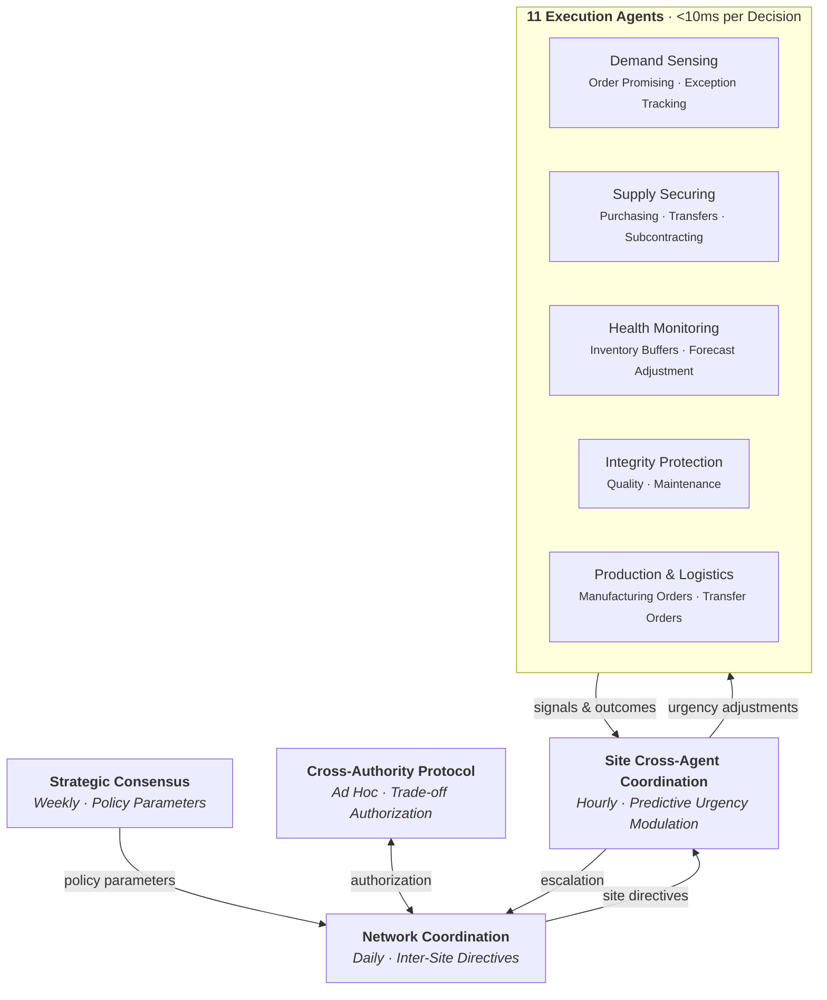
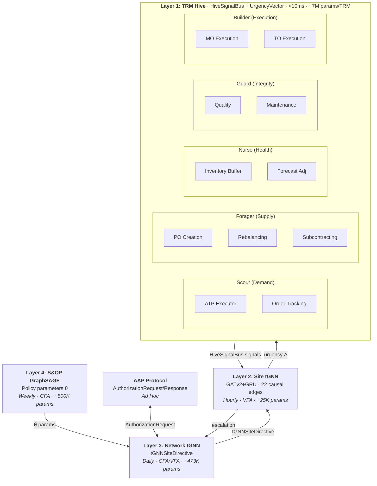
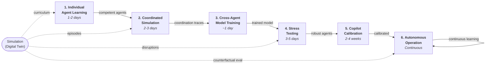
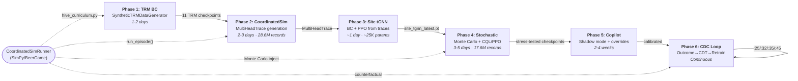
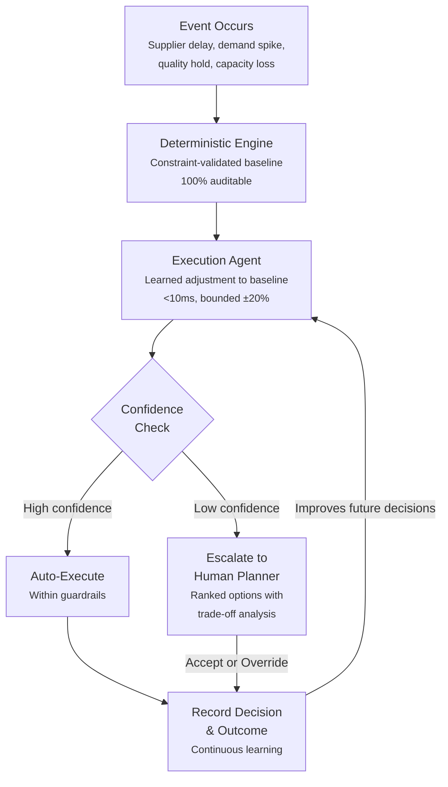

# Agent Hierarchy Diagrams — Standardized Reference

> **Platform reference:** [Autonomy-Core/docs/AGENT_ARCHITECTURE.md](../../../Autonomy-Core/docs/AGENT_ARCHITECTURE.md) — product-agnostic treatment. This doc covers the TMS-specific instantiation and TMS-specific agent content.

This file contains the canonical Mermaid diagrams for the Autonomy agent architecture.
Use the **External** versions in customer-facing documents. Use the **Internal** versions
in engineering and architecture documents.

---

## 1. Five-Layer Agent Hierarchy

### External Version (approach-only, no technology names)

### Internal Version (full technical detail)

---

## 2. Warm Start Pipeline

### External Version

### Internal Version

---

## 3. Decision Flow (Single Decision)

### External Version

---

## Document Classification

| Document | Audience | Label | Diagrams |
|----------|----------|-------|----------|
| `EXECUTIVE_SUMMARY.md` | Internal | `INTERNAL` | Internal hierarchy + warm start |
| `docs/external/EXECUTIVE_SUMMARY.md` | Customers, investors | `EXTERNAL` | External hierarchy + warm start |
| `TECHNICAL_OVERVIEW.md` | Internal (engineering) | `INTERNAL` | Internal hierarchy + warm start |
| `docs/external/TECHNICAL_OVERVIEW.md` | Solution architects, CTOs | `EXTERNAL` | External hierarchy + decision flow |
| `TRM_AGENTS_EXPLAINED.md` | Internal (engineering) | `INTERNAL` | Internal hierarchy |
| `POWELL_APPROACH.md` | Internal (engineering) | `INTERNAL` | Internal hierarchy + warm start |
| `TRM_HIVE_ARCHITECTURE.md` | Internal (engineering) | `INTERNAL` | Internal hierarchy + warm start |
| `CLAUDE.md` | Internal (dev reference) | `INTERNAL` | N/A (too large) |
