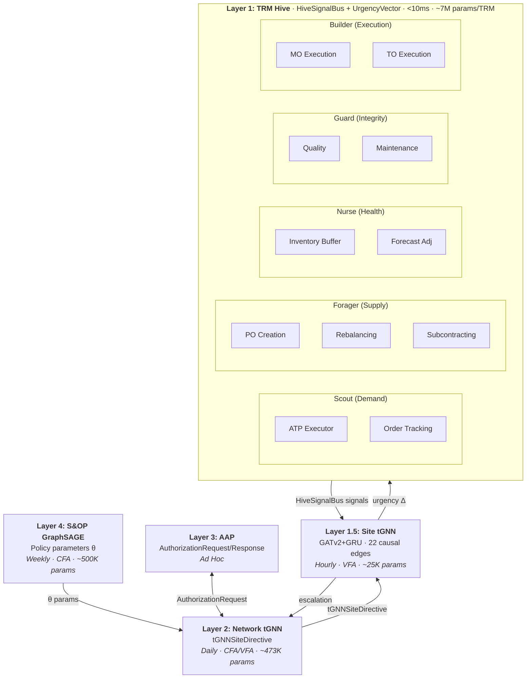
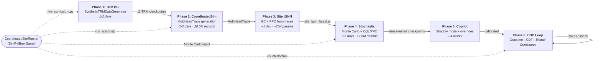

# Powell's Sequential Decision Analytics Framework: Integration Strategy

> **INTERNAL DOCUMENT** — Contains implementation details, file paths, and architecture specifications.

## Executive Summary

This document provides a comprehensive implementation plan for integrating Warren B. Powell's Sequential Decision Analytics and Modeling (SDAM) framework into the Autonomy Platform. The analysis concludes that **Powell's framework serves as a unifying superset** that encompasses our existing capabilities (deterministic optimization, stochastic simulation, conformal prediction, and AI agents) while providing a theoretical foundation for systematic improvement.

**Key Insight #1**: The current platform uses Monte Carlo simulation for **evaluation** (computing confidence bands after decisions are made). Powell's framework shifts this to **optimization** (finding optimal policy parameters before decisions are made). This is the fundamental transformation required.

**Key Insight #2 (Architectural Refinement)**: TRM agents must be constrained to **narrow execution decisions** where they excel. TRMs are NOT suitable for broad planning decisions. This leads to a **three-tier AI architecture**:

```
S&OP GraphSAGE (CFA) ────────────────────────────────────────────────
    │  Weekly/monthly: computes policy parameters θ
    │  (safety stock multipliers, criticality scores, risk scores)
    ↓
Execution tGNN (CFA/VFA) ────────────────────────────────────────────
    │  Daily: generates Priority × Product × Location allocations
    │  Provides context: demand forecasts, network state
    ↓
Narrow TRM Services (VFA) ───────────────────────────────────────────
    ├── ATPExecutorTRM: Allocated ATP with priority consumption (<10ms)
    ├── InventoryRebalancingTRM: Cross-location transfer decisions
    ├── POCreationTRM: Purchase order timing and quantity
    ├── OrderTrackingTRM: Exception detection and response
    ├── MOExecutionTRM: Manufacturing order release/sequence/expedite
    ├── TOExecutionTRM: Transfer order release/consolidation/expedite
    ├── QualityDispositionTRM: Quality hold/release/rework/scrap
    ├── MaintenanceSchedulingTRM: Preventive maintenance scheduling
    ├── SubcontractingTRM: Make-vs-buy/outsource decisions
    └── ForecastAdjustmentTRM: Signal-driven forecast adjustments
```

**TRM Scope Constraints**: TRMs work best with:
- **Narrow scope**: Few variables per decision
- **Short horizon**: Fast feedback (minutes to days)
- **Clear objective**: Single goal (maximize fill, minimize cost)
- **Repeatable patterns**: Similar decisions occurring frequently

**What TRM Does NOT Do**: Long-term planning, network-wide optimization, policy parameter setting (those are handled by GNN layers above).

**Key Insight #3 (TRM Training)**: TRM is the **model architecture**, RL/VFA is the **training method**. They are not alternatives.

| Training Method | Powell Class | When to Use |
|-----------------|--------------|-------------|
| Behavioral Cloning | Imitation of PFA/CFA | Warm-start, limited expert data |
| TD Learning (Q-learning) | **VFA** | Can exceed expert, needs transitions |
| Offline RL (CQL) | **VFA** | Learn from logs without simulator |
| Hybrid (BC + RL) | **Recommended** | Best of both worlds |

The narrow TRM scope makes RL tractable because it satisfies RL requirements:
- Small state space (few variables)
- Fast feedback (reward within days)
- Clear reward signal (single objective)
- Many training episodes (repeatable patterns)

**Training Pipeline**: `backend/app/services/powell/trm_trainer.py`

**Key Insight #4 (CDC-Triggered Replanning)**: Pure periodic planning (weekly CFA, daily tGNN) is suboptimal. **Event-driven replanning** detects metric deviations early and triggers out-of-cadence CFA runs before errors compound.

| Metric | Threshold | Trigger Action |
|--------|-----------|----------------|
| Demand vs Forecast | ±15% cumulative | Full CFA |
| Service Level | <(Target - 5%) | Full CFA |
| Inventory vs Target | <70% or >150% | Allocation rerun |
| Lead Time | +30% vs expected | Param adjustment |

**Analogy**: Condition-based maintenance for policy parameters. Don't wait for scheduled maintenance when sensors indicate imminent failure.

**Implementation**: `backend/app/services/powell/cdc_monitor.py` (see Section 5.9)

**CDC → Relearning Loop** (implemented): CDC triggers now feed into an autonomous relearning pipeline — outcome collection (hourly), reward computation, Offline RL retraining (every 6h or on FULL_CFA), with regression guards and checkpoint versioning. See Section 5.9.9 for full documentation. Key files: `outcome_collector.py`, `cdc_retraining_service.py`, `relearning_jobs.py`.

### Agent Architecture



---

## Part 1: Framework Analysis

### 1.1 Powell's Five Core Elements

Powell defines any sequential decision problem with five elements:

| Element | Symbol | Definition | Platform Implementation |
|---------|--------|------------|------------------------|
| **State** | Sₜ | All information at time t | Inventory, orders, forecasts in data model |
| **Decision** | xₜ | Action taken | Order quantities, production schedules |
| **Exogenous Info** | Wₜ₊₁ | New information arriving | Demand realizations, lead time outcomes |
| **Transition** | Sᴹ | State evolution | MRP netting, inventory updates |
| **Objective** | F | Optimization target | Cost minimization, service maximization |

**Gap Analysis**:
- **State**: Partial - Physical state (inventory, orders) is well-modeled, but **belief state** (forecast distributions, parameter estimates) is implicit
- **Decision**: Good - Clear decision variables (order quantities, production schedules)
- **Exogenous Info**: Implicit - Not formally separated from state
- **Transition**: Good - AWS SC data model handles state transitions
- **Objective**: Good - Probabilistic balanced scorecard with P10/P50/P90

### 1.2 Powell's Four Policy Classes

| Class | Definition | Platform Implementation | Assessment |
|-------|------------|------------------------|------------|
| **PFA** | Direct S→x mapping | Base-stock rules, (s,S) policies | ✅ Implemented |
| **CFA** | Parameterized optimization | 4 inventory policy types, **S&OP GraphSAGE** | ⚠️ Parameters set heuristically → **S&OP optimizes** |
| **VFA** | Value function approximation | TRM agent, **Execution tGNN** | ✅ Implemented, now formally structured |
| **DLA** | Direct lookahead | GNN forecasting + Monte Carlo, **HybridPlanningModel** | ⚠️ → ✅ With MPC integration |

### 1.2.1 Two-Tier GNN Architecture: Powell Mapping

The new two-tier GNN architecture (`SOPGraphSAGE` + `ExecutionTemporalGNN`) explicitly implements Powell's hierarchical policy structure:

```
┌─────────────────────────────────────────────────────────────────┐
│  S&OP GraphSAGE = CFA (Cost Function Approximation)             │
│  ─────────────────────────────────────────────────────────────  │
│  • Computes policy parameters θ that parameterize downstream    │
│    decisions (safety_stock_multiplier, criticality_score, etc.) │
│  • Updated weekly/monthly (slow timescale, strategic)           │
│  • Outputs feed into tactical/operational planning              │
│  • Powell: "Parameterized cost function with tunable θ"         │
└─────────────────────────────────────────────────────────────────┘
                    ↓ (structural embeddings = policy parameters)
┌─────────────────────────────────────────────────────────────────┐
│  Execution tGNN = VFA (Value Function Approximation)            │
│  ─────────────────────────────────────────────────────────────  │
│  • Makes decisions based on learned value estimates             │
│  • Consumes S&OP embeddings as part of state representation     │
│  • Updated daily/real-time (fast timescale, operational)        │
│  • Outputs: order_recommendation ≈ argmax_a Q(s, a)             │
│  • Powell: "Approximate V(Sˣ) using neural network"             │
└─────────────────────────────────────────────────────────────────┘
```

**Powell Classification of Two-Tier Outputs**:

| S&OP Output | Powell Role | How It's Used |
|-------------|-------------|---------------|
| `criticality_score` | CFA parameter | Prioritize planning attention |
| `bottleneck_risk` | Belief state component | Capacity planning triggers |
| `concentration_risk` | Belief state component | Supplier diversification |
| `resilience_score` | CFA parameter | Buffer stock positioning |
| `safety_stock_multiplier` | **CFA θ parameter** | Direct input to inventory policy: `SS = base_SS × θ` |
| `network_risk` | Aggregate belief state | Strategic dashboard KPI |

| Execution Output | Powell Role | How It's Used |
|------------------|-------------|---------------|
| `order_recommendation` | **VFA action** | argmax_a Q(s, a) approximation |
| `demand_forecast` | DLA component | Lookahead horizon input |
| `exception_probability` | Belief state | Risk-aware decision making |
| `propagation_impact` | VFA auxiliary | Value of network effects |
| `confidence` | Belief state | Exploration vs exploitation threshold |

**Hierarchical Consistency** (Powell's Key Insight):

The two-tier architecture naturally enforces Powell's hierarchical consistency:

```python
# S&OP sets constraints (CFA parameters)
theta = sop_model.safety_stock_multiplier  # θ = policy parameters

# Execution respects constraints (VFA within CFA bounds)
V_execution(s) ≈ E[V_tactical(s') | policy(θ)]

# Consistency check: Execution VFA should match strategic expectations
assert abs(V_execution - E[V_strategic]) / V_strategic < 0.10  # <10% deviation
```

**Files**:
- `backend/app/models/gnn/planning_execution_gnn.py` - Two-tier model implementation
- `backend/app/models/gnn/scalable_graphsage.py` - GraphSAGE for S&OP (CFA)
- `backend/scripts/training/train_planning_execution.py` - Training with Powell objectives

### 1.3 Planning Hierarchies and Powell Framework

The platform implements AWS Supply Chain-aligned hierarchies that directly map to Powell's policy class recommendations:

#### Three Dimensions of Hierarchy

**1. Site/Geographic Hierarchy**: Company → Region → Country → State → Site
**2. Product Hierarchy**: Category → Family → Group → Product (SKU)
**3. Time Bucket Hierarchy**: Year → Quarter → Month → Week → Day → Hour

#### Hierarchy-to-Powell Mapping

| Planning Type | Site Level | Product Level | Time Bucket | Horizon | Powell Class | Policy Role |
|---------------|------------|---------------|-------------|---------|--------------|-------------|
| **Execution** | Site | SKU | Hour | 1 week | **VFA** | Q(s,a) decisions |
| **MRP** | Site | SKU | Day | 13 weeks | **VFA** | Component decisions |
| **MPS** | Site | Group | Week | 6 months | **CFA** | Production parameters θ |
| **S&OP** | Country | Family | Month | 24 months | **CFA** | Strategic parameters θ |
| **Strategic** | Region | Category | Quarter | 5 years | **DLA** | Lookahead optimization |

**Key Powell Insight**: Higher hierarchy levels (longer horizons, aggregated data) → Policy parameter optimization (CFA/DLA). Lower hierarchy levels (short horizons, detailed data) → Value function approximation for decisions (VFA).

#### Hierarchical Consistency

Powell's framework requires that lower-level policies respect higher-level constraints:

```python
# Hierarchical consistency enforcement
V_execution(s) ≈ E[V_tactical(s') | execute policy from s]

# S&OP GraphSAGE outputs policy parameters θ
theta = sop_model.safety_stock_multiplier[node_id]  # CFA parameter

# Execution tGNN makes decisions within θ bounds
order_qty = exec_model.order_recommendation(state, theta_constraints=theta)

# Consistency check: execution value should match strategic expectation
deviation = abs(V_execution - E[V_strategic]) / V_strategic
assert deviation < consistency_tolerance  # e.g., 10%
```

#### GNN Model Assignment by Hierarchy

| GNN Model | Hierarchy Application | Powell Role |
|-----------|----------------------|-------------|
| S&OP GraphSAGE | Country × Family, Monthly | CFA - compute θ parameters |
| Hybrid Planning | Site × Group, Weekly | CFA/VFA bridge |
| Execution tGNN | Site × SKU, Daily/Hourly | VFA - compute Q(s,a) |

**Files**:
- `backend/app/models/planning_hierarchy.py` - Hierarchy models and templates
- `backend/app/services/hierarchical_dag_builder.py` - DAG construction at hierarchy levels
- `backend/app/models/gnn/planning_execution_gnn.py` - Two-tier GNN implementation

---

### 1.4 Is Powell a Superset?

**Yes.** The Powell framework is a superset that provides:

1. **Unified Theoretical Foundation**: All our approaches fit within Powell's taxonomy
2. **Principled Integration**: Shows how to combine PFA/CFA/VFA/DLA appropriately
3. **Optimization Framework**: Converts evaluation (simulation) to optimization (policy search)
4. **Hierarchical Consistency**: Ensures tactical policies respect strategic constraints
5. **Belief State Management**: Formalizes uncertainty representation

**Current Capabilities as Powell Building Blocks**:

| Current Capability | Powell Classification | Enhancement Opportunity |
|-------------------|----------------------|------------------------|
| Monte Carlo simulation | Scenario generation for DLA/CFA | Use for optimization, not just evaluation |
| Conformal prediction | Belief state construction | Integrate into formal belief state |
| TRM agent | VFA policy | Frame training as ADP, add exploration |
| GNN forecasting | DLA component | Integrate with optimization layer |
| LLM orchestrator | Meta-policy / Policy search | Formalize as meta-MDP |
| 4 inventory policies | CFA with fixed parameters | Add parameter optimization |

---

## Part 2: Implementation Plan by Planning Horizon

**Priority Order**: Execution → Operational → Tactical → Strategic (per user request)

---

### Phase 5: Narrow TRM Execution Layer (Refined Architecture)

**Timeline**: Weeks 21-24

Based on architectural refinement discussions, the TRM is now constrained to **narrow execution decisions** where it excels:

#### 5.1 TRM Scope Constraints

TRMs are specifically designed for:
- **Narrow scope**: Few variables per decision
- **Short horizon**: Decisions complete in minutes to days
- **Fast feedback**: See impact quickly
- **Clear objective**: Single goal (maximize fill, minimize cost)
- **Repeatable**: Similar patterns across many decisions

**What TRM Does NOT Do**:
- Long-term planning (that's tGNN + S&OP GraphSAGE)
- Network-wide optimization (that's MPC/DLA)
- Policy parameter setting (that's CFA)

#### 5.2 Four Narrow TRM Services

```
┌─────────────────────────────────────────────────────────────────┐
│  tGNN generates allocations (weekly cadence)                    │
│  ─────────────────────────────────────────────────────────────  │
│  • Priority × Product × Location allocations                    │
│  • Provides context: demand forecasts, risk scores              │
│  • Output: allocation buckets for TRM consumption               │
└─────────────────────────────────────────────────────────────────┘
                              ↓
┌─────────────────────────────────────────────────────────────────┐
│  TRM Services (narrow execution decisions)                      │
│  ─────────────────────────────────────────────────────────────  │
│  1. ATPExecutorTRM - Allocated Available-to-Promise (AATP)         │
│  2. InventoryRebalancingTRM - Cross-location transfers          │
│  3. POCreationTRM - Purchase order timing/quantity              │
│  4. OrderTrackingTRM - Exception detection and response         │
└─────────────────────────────────────────────────────────────────┘
```

#### 5.3 ATPExecutorTRM TRM (Allocated Available-to-Promise)

The ATPExecutorTRM handles real-time order promising decisions. When a customer order arrives, it must decide whether to fulfill, partially fulfill, defer, or reject based on available inventory allocations.

##### 5.3.1 Scope & Decision Boundary

| Aspect | Specification |
|--------|---------------|
| **Decision Frequency** | Per order arrival (continuous, ~100+ orders/second) |
| **Decision Horizon** | Immediate (single order) |
| **Latency Requirement** | <10ms inference time |
| **Decision Space** | 4 discrete actions |

**What ATPExecutorTRM DOES**:
- Promise available inventory to incoming orders
- Consume allocation buckets by priority sequence
- Handle shortage scenarios (partial fill, substitution)

**What ATPExecutorTRM Does NOT Do**:
- Set allocation quantities (done by tGNN weekly)
- Determine safety stock levels (done by CFA)
- Network-wide inventory positioning (done by Rebalancing TRM)

##### 5.3.2 State Space (Inputs)

The state vector for ATPExecutorTRM contains 26 features:

```python
state_vector = [
    # Order context (6 features)
    order_priority,              # 1-5 priority tier
    requested_quantity,          # Units requested
    requested_date_offset,       # Days from today
    customer_segment,            # Encoded segment (strategic/standard/transactional)
    order_value,                 # $ value of order
    customer_lifetime_value,     # Historical CLV

    # Product context (6 features)
    product_on_hand,             # Current inventory at location
    product_allocated_own_tier,  # Allocated to this priority tier
    product_allocated_lower,     # Allocated to lower priority tiers (consumable)
    product_pipeline,            # In-transit quantity
    product_avg_daily_demand,    # Historical demand rate
    product_demand_variability,  # Coefficient of variation

    # Location context (6 features)
    site_total_inventory,        # Total inventory at site
    site_capacity_utilization,   # % of storage capacity used
    site_backlog_units,          # Current backlog
    site_service_level_mtd,      # Service level month-to-date
    site_avg_fulfillment_time,   # Avg time to fulfill
    site_expedite_rate,          # % of orders expedited

    # Network context from tGNN (8 features)
    network_inventory_position,  # Total network inventory
    nearest_alternate_site,      # Distance to nearest site with stock
    alternate_available_qty,     # Qty available at alternate
    demand_forecast_7d,          # 7-day demand forecast
    demand_forecast_30d,         # 30-day demand forecast
    supply_risk_score,           # Supplier reliability score
    lead_time_estimate,          # Expected replenishment time
    bullwhip_indicator           # Network demand amplification
]
```

##### 5.3.3 Action Space (Outputs)

The ATPExecutorTRM outputs one of 4 discrete actions:

| Action | ID | Description | When Used |
|--------|-----|-------------|-----------|
| **FULFILL** | 0 | Promise full quantity | Sufficient allocation available |
| **PARTIAL** | 1 | Promise available portion | Partial allocation; customer accepts splits |
| **DEFER** | 2 | Promise for future date | Stock expected soon; customer can wait |
| **REJECT** | 3 | Decline order | Critical shortage; higher priorities need protection |

For PARTIAL and DEFER, the TRM also outputs continuous parameters:
- `partial_quantity`: How much to promise (0-100% of requested)
- `defer_days`: How many days to defer (1-14)

##### 5.3.4 AATP Consumption Logic

**Priority Consumption Sequence** (critical business rule):

```python
def build_consumption_sequence(order_priority: int, num_priorities: int = 5) -> List[int]:
    """
    AATP consumption follows strict priority rules:
    1. Own tier first (P2 order consumes P2 allocation)
    2. Bottom-up from lowest priority (P2 order can consume P5, P4, P3)
    3. Cannot consume above own tier (P2 order cannot consume P1)

    This protects high-priority customer commitments while allowing
    lower-priority allocation to be "borrowed" when needed.
    """
    sequence = [order_priority]  # Own tier first

    # Then from bottom up, stopping at own tier
    for p in range(num_priorities, order_priority, -1):
        if p != order_priority:
            sequence.append(p)

    return sequence

# Examples:
# Priority 1 (Critical): [1] - can only consume P1
# Priority 2 (High):     [2, 5, 4, 3] - own + lower tiers
# Priority 3 (Medium):   [3, 5, 4] - own + lower tiers
# Priority 5 (Standard): [5] - can only consume P5
```

##### 5.3.5 RL Training for ATPExecutorTRM

**Why RL Works for ATP**:

| RL Requirement | ATP Executor |
|----------------|--------------|
| Small state space | 26 features (vs thousands for planning) |
| Fast feedback | OTIF known within hours/days |
| Clear reward | Fill rate, customer satisfaction, margin |
| Many episodes | 100+ orders/day = rich training data |

**Reward Function**:

```python
def compute_atp_reward(decision, outcome):
    """
    Reward balances fill rate, customer satisfaction, and margin.

    Positive rewards:
    - Fulfilled on-time: +10 × order_value
    - Partial fill accepted: +5 × fulfilled_fraction × order_value

    Negative rewards:
    - Missed promise: -20 × order_value (OTIF penalty)
    - Customer escalation: -50 (relationship damage)
    - Unnecessary rejection: -15 × order_value (lost sale)
    - Over-promising: -30 × shortfall (credibility damage)
    """
    if outcome.fulfilled_on_time:
        return 10 * decision.order_value
    elif outcome.fulfilled_late:
        return -20 * decision.order_value
    elif outcome.rejected_but_could_fulfill:
        return -15 * decision.order_value
    elif outcome.partial_accepted:
        return 5 * outcome.fulfilled_fraction * decision.order_value
    else:
        return -50  # Customer escalation
```

**Training Data Collection**:

```python
# Decision log captured for every ATP decision
atp_decision_log = {
    "decision_id": uuid,
    "timestamp": datetime,
    "state_vector": [26 features],
    "action": 0-3,
    "action_params": {"partial_qty": 0.75, "defer_days": 0},
    "decision_source": "ai_autonomous",  # or "expert_human", "ai_modified"
    "outcome": {  # Filled in later when order completes
        "fulfilled_on_time": True,
        "actual_ship_date": date,
        "customer_feedback": "satisfied"
    }
}
```

**Files**:
- `backend/app/services/powell/atp_executor.py` - TRM inference
- `backend/app/services/powell/allocation_service.py` - Allocation management
- `backend/app/models/trm_training_data.py` - ATPDecisionLog model

---

#### 5.4 InventoryRebalancingTRM

The InventoryRebalancingTRM decides when and how to transfer inventory between locations to balance stock levels across the network.

##### 5.4.1 Scope & Decision Boundary

| Aspect | Specification |
|--------|---------------|
| **Decision Frequency** | Daily evaluation (batch) |
| **Decision Horizon** | 1-7 days (transfer lead time) |
| **Latency Requirement** | <1 second per site pair |
| **Decision Space** | Transfer quantity (continuous) |

**What RebalancingTRM DOES**:
- Identify imbalances (overstocked vs understocked sites)
- Recommend transfer quantities and routes
- Balance service improvement against transfer cost

**What RebalancingTRM Does NOT Do**:
- Set safety stock targets (done by CFA)
- Make purchase/production decisions (done by PO TRM)
- Long-term network design (done by strategic planning)

##### 5.4.2 State Space (Inputs)

The state vector for each source-destination pair:

```python
state_vector = [
    # Source site context (7 features)
    source_on_hand,              # Current inventory
    source_safety_stock,         # SS target
    source_dos,                  # Days of supply
    source_service_level,        # Recent fill rate
    source_demand_forecast_7d,   # Expected demand
    source_inbound_pipeline,     # Expected receipts
    source_excess_qty,           # On-hand - SS - Forecast

    # Destination site context (7 features)
    dest_on_hand,
    dest_safety_stock,
    dest_dos,
    dest_service_level,
    dest_demand_forecast_7d,
    dest_inbound_pipeline,
    dest_shortage_qty,           # SS + Forecast - On-hand - Pipeline

    # Transfer lane context (5 features)
    transfer_lead_time,          # Days to transfer
    transfer_cost_per_unit,      # $ per unit
    transfer_capacity,           # Max units per shipment
    historical_transfer_success, # % of transfers completed on-time
    lane_utilization,            # Current utilization %

    # Network context (5 features)
    product_network_position,    # Total network inventory
    product_network_demand,      # Total network demand forecast
    imbalance_severity,          # Max(excess) - Max(shortage)
    num_sites_understocked,      # Count of sites below SS
    network_service_level        # Overall network fill rate
]
```

##### 5.4.3 Action Space (Outputs)

The RebalancingTRM outputs:

| Output | Type | Range | Description |
|--------|------|-------|-------------|
| **transfer_decision** | Discrete | 0=skip, 1=transfer | Whether to transfer |
| **transfer_quantity** | Continuous | 0 to source_excess | Units to transfer |
| **urgency** | Discrete | 0=standard, 1=expedite | Shipping priority |

##### 5.4.4 Decision Logic

```python
def should_rebalance(source_state, dest_state, lane) -> RebalanceDecision:
    """
    Rebalancing decision evaluates cost-benefit tradeoff:

    Benefit = (expected DOS improvement at dest) × (value of avoided stockout)
    Cost = transfer_cost + handling_cost + risk_of_source_stockout

    Transfer if Benefit > Cost with confidence threshold
    """

    # Calculate potential improvement
    dest_shortage = max(0, dest_state.safety_stock - dest_state.on_hand)
    source_excess = max(0, source_state.on_hand - source_state.safety_stock)

    transferable = min(dest_shortage, source_excess, lane.capacity)

    if transferable <= 0:
        return RebalanceDecision(action=SKIP, quantity=0)

    # Cost-benefit calculation
    transfer_cost = transferable * lane.cost_per_unit
    dos_improvement = transferable / dest_state.avg_daily_demand
    stockout_cost = dest_state.stockout_cost_per_day * dos_improvement

    benefit = stockout_cost
    cost = transfer_cost

    if benefit > cost * 1.2:  # 20% margin for uncertainty
        return RebalanceDecision(
            action=TRANSFER,
            quantity=transferable,
            urgency=EXPEDITE if dest_state.dos < 1 else STANDARD
        )

    return RebalanceDecision(action=SKIP, quantity=0)
```

##### 5.4.5 RL Training for RebalancingTRM

**Reward Function**:

```python
def compute_rebalancing_reward(decision, outcome):
    """
    Reward balances service improvement against cost.

    Primary goal: Improve network-wide service level
    Secondary goal: Minimize transfer costs
    Penalty: Source stockout caused by transfer
    """
    reward = 0

    # Service improvement at destination
    if outcome.dest_stockout_avoided:
        reward += 100  # Major positive signal
    elif outcome.dest_dos_improved:
        reward += outcome.dos_improvement * 10

    # Cost of transfer
    reward -= outcome.transfer_cost * 0.1

    # Penalty if transfer caused source stockout
    if outcome.source_stockout_after_transfer:
        reward -= 200  # Major negative signal

    # Penalty for unnecessary transfer (no benefit)
    if decision.action == TRANSFER and not outcome.dest_dos_improved:
        reward -= 50

    return reward
```

**Why RL Works for Rebalancing**:

| RL Requirement | Rebalancing TRM |
|----------------|-----------------|
| State space | 24 features per lane |
| Feedback speed | DOS visible within lead time (days) |
| Clear reward | Service improvement - transfer cost |
| Training data | Historical transfers + simulated scenarios |

**Files**:
- `backend/app/services/powell/inventory_rebalancing_trm.py`
- `backend/app/models/trm_training_data.py` - RebalancingDecisionLog model

---

#### 5.5 POCreationTRM (Purchase Order Creation)

The POCreationTRM decides when to create purchase orders and in what quantities.

##### 5.5.1 Scope & Decision Boundary

| Aspect | Specification |
|--------|---------------|
| **Decision Frequency** | Continuous monitoring |
| **Decision Horizon** | Lead time (days to weeks) |
| **Latency Requirement** | <100ms per product-location |
| **Decision Space** | Order/skip + quantity |

**What POCreationTRM DOES**:
- Monitor inventory position vs reorder point
- Trigger purchase orders at optimal timing
- Select quantity based on demand forecast and economics

**What POCreationTRM Does NOT Do**:
- Select suppliers (handled by sourcing rules)
- Negotiate prices (handled by procurement)
- Set reorder points (done by CFA/policy optimization)

##### 5.5.2 State Space (Inputs)

```python
state_vector = [
    # Inventory position (4 features)
    on_hand_qty,                 # Current inventory
    allocated_qty,               # Reserved for orders
    in_transit_qty,              # On order, not received
    available_qty,               # on_hand - allocated

    # Policy parameters from CFA (3 features)
    reorder_point,               # Trigger level
    safety_stock,                # Minimum buffer
    target_inventory,            # Optimal level

    # Demand context (4 features)
    demand_forecast_lt,          # Forecast over lead time
    demand_variability,          # Coefficient of variation
    demand_trend,                # Increasing/decreasing/stable
    seasonal_factor,             # Seasonal adjustment

    # Supply context (4 features)
    supplier_lead_time,          # Expected lead time
    supplier_lead_time_var,      # Lead time variability
    supplier_reliability,        # On-time delivery rate
    last_order_date,             # Days since last PO

    # Economic factors (4 features)
    unit_cost,                   # Purchase price
    holding_cost_rate,           # Annual holding cost %
    ordering_cost,               # Fixed cost per order
    stockout_cost,               # Cost per unit short
]
```

##### 5.5.3 Action Space (Outputs)

| Output | Type | Range | Description |
|--------|------|-------|-------------|
| **order_decision** | Discrete | 0=skip, 1=order | Whether to create PO |
| **order_quantity** | Continuous | MOQ to max | Units to order |
| **order_type** | Discrete | 0=standard, 1=expedite | Shipping method |

##### 5.5.4 Decision Logic

```python
def should_create_po(state) -> PODecision:
    """
    PO creation uses classic reorder point logic enhanced by TRM:

    Base rule: Order when inventory_position <= reorder_point
    TRM enhances: Timing optimization, quantity adjustment, expedite decision
    """

    inventory_position = state.on_hand + state.in_transit - state.allocated

    # Trigger conditions (priority order)
    if inventory_position <= state.safety_stock:
        # Critical: below safety stock
        return PODecision(
            action=ORDER,
            quantity=compute_eoq(state) * 1.5,  # Order extra
            order_type=EXPEDITE
        )

    elif inventory_position <= state.reorder_point:
        # Standard: at reorder point
        return PODecision(
            action=ORDER,
            quantity=compute_eoq(state),
            order_type=STANDARD
        )

    elif state.demand_trend == INCREASING and days_of_supply(state) < 14:
        # Proactive: demand trending up
        return PODecision(
            action=ORDER,
            quantity=compute_eoq(state) * 1.2,
            order_type=STANDARD
        )

    else:
        return PODecision(action=SKIP, quantity=0)


def compute_eoq(state) -> float:
    """Economic Order Quantity formula"""
    # EOQ = sqrt(2 × D × S / H)
    # D = annual demand, S = ordering cost, H = holding cost per unit
    annual_demand = state.demand_forecast_lt * (365 / state.supplier_lead_time)
    eoq = math.sqrt(2 * annual_demand * state.ordering_cost /
                    (state.unit_cost * state.holding_cost_rate))

    # Apply MOQ and max constraints
    return max(state.moq, min(state.max_order_qty, eoq))
```

##### 5.5.5 RL Training for POCreationTRM

**Reward Function**:

```python
def compute_po_reward(decision, outcome, state):
    """
    Reward balances service (avoiding stockouts) against cost (inventory holding).

    Evaluated at lead_time + buffer after decision.
    """
    reward = 0

    # Stockout penalty (major negative)
    if outcome.stockout_occurred:
        stockout_units = outcome.stockout_quantity
        reward -= stockout_units * state.stockout_cost

    # Holding cost (ongoing negative)
    avg_inventory = outcome.average_inventory_during_period
    holding_cost = avg_inventory * state.unit_cost * state.holding_cost_rate / 365 * state.supplier_lead_time
    reward -= holding_cost

    # Ordering cost (if ordered)
    if decision.action == ORDER:
        reward -= state.ordering_cost
        if decision.order_type == EXPEDITE:
            reward -= state.expedite_premium

    # Bonus for maintaining target inventory
    if outcome.ending_inventory >= state.safety_stock:
        reward += 10  # Maintained service capability

    # Penalty for excess inventory (DOS > 60 days)
    if outcome.ending_dos > 60:
        excess = outcome.ending_inventory - (state.demand_forecast_lt * 2)
        reward -= excess * state.unit_cost * 0.1  # 10% excess penalty

    return reward
```

**Why RL Works for PO Creation**:

| RL Requirement | PO Creation TRM |
|----------------|-----------------|
| State space | 19 features |
| Feedback speed | Lead time (days to weeks) |
| Clear reward | Service - holding cost - ordering cost |
| Training data | Historical POs + outcomes |

**Reward Normalization**: PO Creation rewards can be large (thousands in cost). Normalize to [-100, +100] range:

```python
normalized_reward = np.clip(raw_reward / expected_cost_scale, -100, 100)
```

**Files**:
- `backend/app/services/powell/po_creation_trm.py`
- `backend/app/models/trm_training_data.py` - PODecisionLog model

---

#### 5.6 OrderTrackingTRM

The OrderTrackingTRM monitors in-transit orders and detects exceptions requiring action.

##### 5.6.1 Scope & Decision Boundary

| Aspect | Specification |
|--------|---------------|
| **Decision Frequency** | Continuous (event-driven) |
| **Decision Horizon** | Immediate exception response |
| **Latency Requirement** | <100ms per order |
| **Decision Space** | 4 response actions |

**What OrderTrackingTRM DOES**:
- Monitor shipment status and milestones
- Detect deviations from expected delivery
- Recommend response actions

**What OrderTrackingTRM Does NOT Do**:
- Execute the response (human or system does)
- Negotiate with suppliers (procurement does)
- Modify existing POs (PO management does)

##### 5.6.2 State Space (Inputs)

```python
state_vector = [
    # Order status (5 features)
    days_since_order,            # Days since PO created
    expected_lead_time,          # Original lead time estimate
    current_lead_time_estimate,  # Updated estimate
    days_until_expected,         # Days until expected arrival
    milestone_status,            # Encoded: ordered/shipped/in-transit/customs/delivered

    # Delay indicators (4 features)
    delay_days,                  # Current delay vs expected
    delay_trend,                 # Getting worse/stable/improving
    supplier_avg_delay,          # This supplier's avg delay
    carrier_avg_delay,           # This carrier's avg delay

    # Impact assessment (4 features)
    quantity_at_risk,            # Units in this order
    inventory_coverage,          # DOS at destination without this order
    criticality,                 # Impact if delayed further
    customer_orders_waiting,     # Orders waiting for this inventory

    # Historical context (4 features)
    supplier_reliability,        # On-time rate
    similar_order_outcomes,      # How similar orders resolved
    escalation_success_rate,     # How often escalation helps
    alternate_available,         # Is alternate supply available
]
```

##### 5.6.3 Action Space (Outputs)

| Action | ID | Description | Typical Trigger |
|--------|-----|-------------|-----------------|
| **MONITOR** | 0 | Continue watching | Minor delay, expected to resolve |
| **CONTACT** | 1 | Contact supplier/carrier | Need status update |
| **ESCALATE** | 2 | Escalate to management | Significant delay, high impact |
| **RESOLVE** | 3 | Close as resolved | Order received or cancelled |

##### 5.6.4 Exception Detection Logic

```python
def detect_exception(order_state) -> Optional[Exception]:
    """
    Exception detection rules based on milestone deviations.
    """

    exceptions = []

    # Late delivery detection
    if order_state.days_until_expected < 0:
        severity = min(abs(order_state.days_until_expected) / 7, 1.0)  # 0-1 scale
        exceptions.append(Exception(
            type=LATE_DELIVERY,
            severity=severity,
            impact=order_state.quantity_at_risk * severity
        ))

    # Stuck in transit
    if order_state.milestone_status == IN_TRANSIT:
        days_in_transit = order_state.days_since_order - order_state.days_to_ship
        expected_transit = order_state.expected_lead_time - order_state.days_to_ship
        if days_in_transit > expected_transit * 1.5:
            exceptions.append(Exception(
                type=STUCK_IN_TRANSIT,
                severity=0.7,
                impact=order_state.quantity_at_risk * 0.7
            ))

    # Missing milestone
    expected_milestones = get_expected_milestones(order_state)
    for milestone, expected_day in expected_milestones:
        if order_state.days_since_order > expected_day + 2:
            if not order_state.milestone_reached(milestone):
                exceptions.append(Exception(
                    type=MISSING_MILESTONE,
                    severity=0.5,
                    milestone=milestone
                ))

    # Quantity discrepancy
    if order_state.confirmed_quantity < order_state.ordered_quantity * 0.95:
        shortfall = order_state.ordered_quantity - order_state.confirmed_quantity
        exceptions.append(Exception(
            type=QUANTITY_SHORTAGE,
            severity=shortfall / order_state.ordered_quantity,
            impact=shortfall
        ))

    return exceptions if exceptions else None
```

##### 5.6.5 Action Recommendation Logic

```python
def recommend_action(order_state, exceptions) -> TrackingDecision:
    """
    Recommend action based on exception severity and available options.
    """

    if not exceptions:
        return TrackingDecision(action=MONITOR, confidence=0.95)

    max_severity = max(e.severity for e in exceptions)
    total_impact = sum(e.impact for e in exceptions)

    # High severity or impact: escalate
    if max_severity > 0.7 or total_impact > 1000:
        return TrackingDecision(
            action=ESCALATE,
            confidence=0.85,
            reason=f"High severity ({max_severity:.0%}) or impact (${total_impact:.0f})"
        )

    # Medium severity: contact for update
    if max_severity > 0.3:
        return TrackingDecision(
            action=CONTACT,
            confidence=0.80,
            reason=f"Status update needed; delay severity {max_severity:.0%}"
        )

    # Low severity: continue monitoring
    return TrackingDecision(
        action=MONITOR,
        confidence=0.90,
        reason="Minor deviation, expected to self-resolve"
    )
```

##### 5.6.6 RL Training for OrderTrackingTRM

**Reward Function (RLHF-based)**:

Order tracking has less clear immediate rewards than other TRMs. We use **Reinforcement Learning from Human Feedback (RLHF)**:

```python
def compute_tracking_reward(decision, outcome, human_feedback):
    """
    Reward based on:
    1. Outcome correctness (did the order resolve well?)
    2. Human feedback (did the planner agree with the action?)
    3. Action efficiency (did we take the right level of action?)
    """
    reward = 0

    # Outcome-based reward
    if outcome.order_received_on_time:
        if decision.action == MONITOR:
            reward += 20  # Correctly identified no action needed
        elif decision.action in [CONTACT, ESCALATE]:
            reward -= 10  # Over-reacted

    elif outcome.order_received_late:
        if decision.action == ESCALATE:
            reward += 10  # Appropriately escalated
        elif decision.action == MONITOR:
            reward -= 30  # Should have acted sooner

    elif outcome.order_cancelled:
        if decision.action == ESCALATE:
            reward += 5  # Flagged the problem
        else:
            reward -= 20  # Missed the severity

    # Human feedback reward (RLHF signal)
    if human_feedback:
        if human_feedback.agreed:
            reward += 15  # Human agreed with recommendation
        elif human_feedback.modified:
            reward -= 5   # Human modified (learn from correction)
        elif human_feedback.rejected:
            reward -= 25  # Human rejected

        # Use human's action as expert demonstration for BC
        if human_feedback.human_action != decision.action:
            # This becomes BC training data for future
            pass

    return reward
```

**Why RLHF for Order Tracking**:

| Challenge | RLHF Solution |
|-----------|---------------|
| Delayed/unclear outcomes | Use human judgment as proxy reward |
| Context-dependent correctness | Human feedback captures nuance |
| Rare escalation scenarios | Human corrections provide signal |

**Training Pipeline for Order Tracking**:

```
1. Behavioral Cloning (Phase 1)
   └── Train on historical planner decisions
   └── Learn "what a human would do"

2. Outcome-based RL (Phase 2)
   └── Add TD learning with order outcomes
   └── Learn which decisions led to good resolutions

3. RLHF Fine-tuning (Phase 3, continuous)
   └── Planner reviews AI recommendations
   └── Agreed/modified/rejected feedback updates policy
   └── Model learns from corrections
```

**Files**:
- `backend/app/services/powell/order_tracking_trm.py`
- `backend/app/models/trm_training_data.py` - OrderTrackingDecisionLog model

---

#### 5.7 Database Tables for TRM Execution

The TRM decision logs and replay buffer are stored in dedicated tables for training:

```sql
-- Decision logs capture every TRM decision for audit and training
-- atp_decision_log: ATP decisions with 26-feature state vectors
-- rebalancing_decision_log: Transfer decisions with outcomes
-- po_decision_log: PO creation decisions with inventory outcomes
-- order_tracking_decision_log: Exception handling with RLHF feedback

-- Powell decision audit tables (execution-layer persistence)
-- powell_mo_decisions: MO release/sequence/split/expedite/defer decisions
-- powell_to_decisions: TO release/expedite/consolidate/defer decisions
-- powell_quality_decisions: Quality disposition (accept/reject/rework/scrap/use-as-is)
-- powell_maintenance_decisions: Maintenance schedule/defer/expedite/outsource decisions
-- powell_subcontracting_decisions: Make-vs-buy routing decisions
-- powell_forecast_adjustment_decisions: Signal-driven forecast adjustment decisions

-- Unified replay buffer for RL training
-- trm_replay_buffer: (state, action, reward, next_state, done, is_expert) tuples
```

**Database Models**: `backend/app/models/trm_training_data.py`

**Migrations**:
- `backend/migrations/versions/20260207_trm_training_data_tables.py`
- `backend/migrations/versions/20260202_powell_allocation_tables.py`

#### 5.8 TRM Training: Behavioral Cloning vs RL (VFA)

**Critical Clarification**: TRM is the **model architecture** (7M parameter transformer). RL is a **training method**. They are not alternatives—you can train TRM with either behavioral cloning OR reinforcement learning.

**Current Approach (Behavioral Cloning)**:
```python
# Supervised learning from expert demonstrations
loss = MSE(predicted_action, expert_action)
```
- Pros: Fast, stable, no environment needed
- Cons: Limited to expert performance, poor generalization

**Powell's VFA Approach (Reinforcement Learning)**:
```python
# TD Learning with actual outcomes
Q_target = reward + γ * max_a' Q(s', a')
loss = MSE(Q(s, a), Q_target)
```
- Pros: Can discover better-than-expert policies
- Cons: Needs rewards, may be unstable

**Why Narrow Scope Enables RL**:

| RL Requirement | Broad Planning | Narrow TRM |
|----------------|----------------|------------|
| State space size | Huge (curse of dimensionality) | Small ✓ |
| Feedback speed | Months (delayed credit) | Days ✓ |
| Reward clarity | Multiple objectives | Single goal ✓ |
| Training episodes | Few (rare decisions) | Many ✓ |

**Recommended Hybrid Pipeline**:

```
Phase 1: Behavioral Cloning (20 epochs)
    │  • Train on historical planner decisions
    │  • Quick convergence to ~90% expert performance
    ↓
Phase 2: Offline RL Fine-tuning (80 epochs)
    │  • Use decision history with actual outcomes
    │  • record_outcome() provides rewards
    │  • Conservative Q-Learning prevents overestimation
    ↓
Phase 3: Online Learning (continuous)
    │  • Human corrections as RLHF signal
    │  • Adapts to distribution shift
```

**Reward Functions by TRM Type**:

| TRM Service | Reward Signal | Feedback Latency |
|-------------|---------------|------------------|
| ATPExecutorTRM | OTIF, fill rate | Hours-days |
| RebalancingTRM | `stockout_cost × stockouts_prevented - transfer_cost` (economic) | Days |
| POCreationTRM | `stockout_cost × unfulfilled + holding_cost × excess × days + ordering_cost` (economic) | Lead time |
| InventoryBufferTRM | `stockout_cost × stockout_qty + holding_cost × excess × days` (economic) | Days |
| OrderTrackingTRM | Action correctness (RLHF) | Hours-days |

> **Note**: Rebalancing, PO Creation, and Inventory Buffer reward functions now require `EconomicCostConfig` with actual dollar costs (holding_cost, stockout_cost, ordering_cost) computed from `Product.unit_cost` and `InvPolicy` parameters. No heuristic fallbacks — see Section 5.18.1.

**Implementation**: `backend/app/services/powell/trm_trainer.py`

```python
from app.services.powell import TRMTrainer, TrainingConfig, TrainingMethod

trainer = TRMTrainer(
    model=trm_model,
    config=TrainingConfig(
        method=TrainingMethod.HYBRID,
        bc_epochs=20,
        rl_epochs=80,
        gamma=0.99
    )
)

# Add experiences from TRM decision history
for record in atp_executor.get_training_data():
    trainer.add_experience(
        state_features=record['state_features'],
        action=record['response']['promised_qty'],
        outcome=record.get('actual_outcome', {}),
        trm_type='atp'
    )

# Train
result = trainer.train()
```

#### 5.9 CDC-Triggered Out-of-Cadence Replanning

**Key Insight**: Pure periodic planning (weekly CFA, daily tGNN) is suboptimal when significant changes occur mid-cycle. By Day 2, you may already detect a metric deviation that, if addressed immediately, prevents error compounding through Day 7.

**Analogy**: This is like **condition-based maintenance** for policy parameters. Just as you don't wait for scheduled maintenance when a sensor indicates imminent failure, you shouldn't wait for scheduled replanning when metrics indicate policy staleness.

##### 5.9.1 Problem: Pure Periodic Cadence

```
Week 1: CFA runs → policy params θ set
Day 2:  Major demand spike detected (but CFA not scheduled)
Day 3:  Using stale θ, inventory depletes faster than expected
Day 4:  Stockouts begin
Day 5:  Service level drops to 85%
Day 6:  Backlog grows
Day 7:  Still using stale θ, errors compound
Week 2: CFA finally runs → adapts θ (too late, damage done)
```

##### 5.9.2 Solution: Event-Driven Planning Layer

```
Week 1: CFA runs → policy params θ set (normal cadence)
Day 2:  CDC detects demand spike > threshold
Day 2:  Out-of-cadence CFA triggered → θ updated
Day 3+: Using fresh θ, system adapts early
Week 2: Scheduled CFA runs (may be no-op if already current)
```

##### 5.9.3 CDC Trigger Conditions

| Metric | Threshold | Trigger Action | Rationale |
|--------|-----------|----------------|-----------|
| **Demand vs Forecast** | ±15% cumulative | Full CFA | Demand shock invalidates safety stock |
| **Inventory vs Target** | <70% or >150% | Allocation rerun | Stock imbalance needs rebalancing |
| **Service Level** | <(Target - 5%) | Full CFA | Customer impact requires immediate response |
| **Lead Time** | +30% vs expected | Param adjustment | Supply disruption needs buffer increase |
| **Order Backlog** | >2 days growth | Allocation rerun | Execution falling behind |
| **Supplier On-Time** | <80% (if target 95%) | Full CFA | Reliability change needs safety time adjustment |

##### 5.9.4 CDC Monitor Architecture

**File**: `backend/app/services/powell/cdc_monitor.py`

```python
"""
CDC (Change Detection and Control) Monitor for Event-Driven Planning

Monitors key metrics against thresholds and triggers out-of-cadence
planning runs when significant deviations are detected.
"""

from dataclasses import dataclass
from datetime import datetime, timedelta
from enum import Enum
from typing import Optional, List, Dict
import logging

logger = logging.getLogger(__name__)


class TriggerReason(Enum):
    DEMAND_DEVIATION = "demand_deviation"
    INVENTORY_LOW = "inventory_low"
    INVENTORY_HIGH = "inventory_high"
    SERVICE_LEVEL_DROP = "service_level_drop"
    LEAD_TIME_INCREASE = "lead_time_increase"
    BACKLOG_GROWTH = "backlog_growth"
    SUPPLIER_RELIABILITY = "supplier_reliability"


class ReplanAction(Enum):
    FULL_CFA = "full_cfa"           # Full policy parameter re-optimization
    ALLOCATION_ONLY = "allocation"   # Rerun tGNN allocations only
    PARAM_ADJUSTMENT = "param_adj"   # Light parameter tweak (±10%)
    NONE = "none"                    # No action (within tolerance)


@dataclass
class SiteMetrics:
    """Current metrics for a site or site group"""
    site_key: str
    timestamp: datetime

    # Demand metrics
    demand_cumulative: float        # Actual cumulative demand this period
    forecast_cumulative: float      # Forecasted cumulative demand

    # Inventory metrics
    inventory_on_hand: float
    inventory_target: float

    # Service metrics
    service_level: float            # Actual (0.0-1.0)
    target_service_level: float     # Target (0.0-1.0)

    # Supply metrics
    avg_lead_time_actual: float     # Days
    avg_lead_time_expected: float   # Days
    supplier_on_time_rate: float    # 0.0-1.0

    # Execution metrics
    backlog_units: float
    backlog_yesterday: float        # For growth calculation


@dataclass
class TriggerEvent:
    """Result of a CDC trigger check"""
    triggered: bool
    reasons: List[TriggerReason]
    metrics_snapshot: SiteMetrics
    recommended_action: ReplanAction
    severity: str                   # "low", "medium", "high", "critical"
    message: str


class CDCMonitor:
    """
    Monitors key metrics and triggers out-of-cadence planning runs.

    Implements event-driven planning layered on top of periodic cadence.
    Analogous to condition-based maintenance for policy parameters.
    """

    def __init__(
        self,
        site_key: str,
        thresholds: Optional[Dict[str, float]] = None,
        cooldown_hours: int = 24
    ):
        self.site_key = site_key
        self.thresholds = thresholds or {
            'demand_deviation': 0.15,       # ±15%
            'inventory_ratio_low': 0.70,    # <70% of target
            'inventory_ratio_high': 1.50,   # >150% of target
            'service_level_drop': 0.05,     # 5% below target
            'lead_time_increase': 0.30,     # +30%
            'backlog_growth_days': 2,       # 2 consecutive days
            'supplier_reliability_drop': 0.15,  # 15% below target
        }
        self.cooldown_hours = cooldown_hours
        self.last_trigger_time: Dict[TriggerReason, datetime] = {}
        self.backlog_growth_days = 0  # Consecutive days of growth

    async def check_and_trigger(
        self,
        metrics: SiteMetrics
    ) -> TriggerEvent:
        """
        Check current metrics against thresholds.
        Returns TriggerEvent with recommended action if thresholds exceeded.
        """
        triggers: List[TriggerReason] = []

        # 1. Demand deviation check
        if metrics.forecast_cumulative > 0:
            demand_dev = abs(metrics.demand_cumulative - metrics.forecast_cumulative) / metrics.forecast_cumulative
            if demand_dev > self.thresholds['demand_deviation']:
                if self._cooldown_ok(TriggerReason.DEMAND_DEVIATION):
                    triggers.append(TriggerReason.DEMAND_DEVIATION)
                    logger.info(f"CDC: Demand deviation {demand_dev:.1%} at {self.site_key}")

        # 2. Inventory imbalance check
        if metrics.inventory_target > 0:
            inv_ratio = metrics.inventory_on_hand / metrics.inventory_target
            if inv_ratio < self.thresholds['inventory_ratio_low']:
                if self._cooldown_ok(TriggerReason.INVENTORY_LOW):
                    triggers.append(TriggerReason.INVENTORY_LOW)
                    logger.info(f"CDC: Inventory low {inv_ratio:.1%} at {self.site_key}")
            elif inv_ratio > self.thresholds['inventory_ratio_high']:
                if self._cooldown_ok(TriggerReason.INVENTORY_HIGH):
                    triggers.append(TriggerReason.INVENTORY_HIGH)
                    logger.info(f"CDC: Inventory high {inv_ratio:.1%} at {self.site_key}")

        # 3. Service level degradation check
        sl_threshold = metrics.target_service_level - self.thresholds['service_level_drop']
        if metrics.service_level < sl_threshold:
            if self._cooldown_ok(TriggerReason.SERVICE_LEVEL_DROP):
                triggers.append(TriggerReason.SERVICE_LEVEL_DROP)
                logger.warning(f"CDC: Service level {metrics.service_level:.1%} below target at {self.site_key}")

        # 4. Lead time increase check
        if metrics.avg_lead_time_expected > 0:
            lt_increase = (metrics.avg_lead_time_actual - metrics.avg_lead_time_expected) / metrics.avg_lead_time_expected
            if lt_increase > self.thresholds['lead_time_increase']:
                if self._cooldown_ok(TriggerReason.LEAD_TIME_INCREASE):
                    triggers.append(TriggerReason.LEAD_TIME_INCREASE)
                    logger.info(f"CDC: Lead time increase {lt_increase:.1%} at {self.site_key}")

        # 5. Backlog growth check (requires consecutive days)
        if metrics.backlog_units > metrics.backlog_yesterday:
            self.backlog_growth_days += 1
            if self.backlog_growth_days >= self.thresholds['backlog_growth_days']:
                if self._cooldown_ok(TriggerReason.BACKLOG_GROWTH):
                    triggers.append(TriggerReason.BACKLOG_GROWTH)
                    logger.info(f"CDC: Backlog growing for {self.backlog_growth_days} days at {self.site_key}")
        else:
            self.backlog_growth_days = 0  # Reset counter

        # 6. Supplier reliability check
        target_reliability = 0.95  # Could be parameterized
        if metrics.supplier_on_time_rate < (target_reliability - self.thresholds['supplier_reliability_drop']):
            if self._cooldown_ok(TriggerReason.SUPPLIER_RELIABILITY):
                triggers.append(TriggerReason.SUPPLIER_RELIABILITY)
                logger.info(f"CDC: Supplier OT rate {metrics.supplier_on_time_rate:.1%} at {self.site_key}")

        # Determine action and severity
        if not triggers:
            return TriggerEvent(
                triggered=False,
                reasons=[],
                metrics_snapshot=metrics,
                recommended_action=ReplanAction.NONE,
                severity="none",
                message="All metrics within tolerance"
            )

        action, severity = self._determine_action_and_severity(triggers)

        # Record trigger times
        now = datetime.utcnow()
        for reason in triggers:
            self.last_trigger_time[reason] = now

        return TriggerEvent(
            triggered=True,
            reasons=triggers,
            metrics_snapshot=metrics,
            recommended_action=action,
            severity=severity,
            message=f"CDC triggered: {[r.value for r in triggers]}"
        )

    def _cooldown_ok(self, reason: TriggerReason) -> bool:
        """Check if cooldown period has passed for this trigger type"""
        if reason not in self.last_trigger_time:
            return True

        elapsed = datetime.utcnow() - self.last_trigger_time[reason]
        return elapsed > timedelta(hours=self.cooldown_hours)

    def _determine_action_and_severity(
        self,
        triggers: List[TriggerReason]
    ) -> tuple[ReplanAction, str]:
        """
        Map trigger combination to action and severity.

        Priority:
        - SERVICE_LEVEL_DROP → FULL_CFA (critical - customer impact)
        - DEMAND_DEVIATION → FULL_CFA (high - forecast invalidated)
        - SUPPLIER_RELIABILITY → FULL_CFA (high - supply disruption)
        - INVENTORY_LOW → ALLOCATION_ONLY (medium - rebalance)
        - LEAD_TIME_INCREASE → PARAM_ADJUSTMENT (medium - buffer adjustment)
        - INVENTORY_HIGH / BACKLOG → ALLOCATION_ONLY (low - optimize)
        """

        # Critical: Customer-facing impact
        if TriggerReason.SERVICE_LEVEL_DROP in triggers:
            return ReplanAction.FULL_CFA, "critical"

        # High: Fundamental assumption change
        if TriggerReason.DEMAND_DEVIATION in triggers:
            return ReplanAction.FULL_CFA, "high"

        if TriggerReason.SUPPLIER_RELIABILITY in triggers:
            return ReplanAction.FULL_CFA, "high"

        # Medium: Operational adjustment needed
        if TriggerReason.INVENTORY_LOW in triggers:
            return ReplanAction.ALLOCATION_ONLY, "medium"

        if TriggerReason.LEAD_TIME_INCREASE in triggers:
            return ReplanAction.PARAM_ADJUSTMENT, "medium"

        # Low: Optimization opportunity
        return ReplanAction.ALLOCATION_ONLY, "low"
```

##### 5.9.5 Integration with SiteAgentExecutor

The CDC monitor integrates with the SiteAgentExecutor for coordinated replanning:

```python
class SiteAgentExecutor:
    """
    Orchestrates deterministic engines + TRM heads for a site,
    with CDC-triggered out-of-cadence replanning.
    """

    def __init__(self, site_key: str, db_session):
        self.site_key = site_key
        self.db = db_session

        # Initialize engines and TRMs (from previous section)
        self.mrp_engine = MRPEngine(site_key)
        self.aatp_engine = AATPEngine(site_key)
        self.ss_calculator = SafetyStockCalculator(site_key)
        self.atp_exception_head = ATPExceptionHead()

        # CDC Monitor for event-driven replanning
        self.cdc_monitor = CDCMonitor(
            site_key=site_key,
            cooldown_hours=24  # Prevent thrashing
        )

        # Track last planning runs
        self.last_cfa_run: Optional[datetime] = None
        self.last_allocation_run: Optional[datetime] = None

    async def periodic_cdc_check(self) -> Optional[TriggerEvent]:
        """
        Called frequently (e.g., hourly) to check for CDC triggers.

        This is the entry point for event-driven planning.
        """
        # Gather current metrics from database
        metrics = await self._gather_current_metrics()

        # Check against thresholds
        trigger = await self.cdc_monitor.check_and_trigger(metrics)

        if trigger.triggered:
            logger.info(f"CDC trigger at {self.site_key}: {trigger.message}")

            # Execute appropriate replanning action
            if trigger.recommended_action == ReplanAction.FULL_CFA:
                await self._run_out_of_cadence_cfa(trigger)
            elif trigger.recommended_action == ReplanAction.ALLOCATION_ONLY:
                await self._run_out_of_cadence_allocation(trigger)
            elif trigger.recommended_action == ReplanAction.PARAM_ADJUSTMENT:
                await self._run_param_adjustment(trigger)

            # Log for audit trail
            await self._log_cdc_event(trigger)

        return trigger

    async def _run_out_of_cadence_cfa(self, trigger: TriggerEvent):
        """
        Full CFA rerun - recompute policy parameters θ.

        This is the most expensive operation but necessary when
        fundamental assumptions (demand, supply) have changed.
        """
        logger.warning(f"Running out-of-cadence CFA for {self.site_key}")

        # In COPILOT mode, require human approval for out-of-cadence CFA
        if self.agent_mode == AgentMode.COPILOT:
            await self._request_human_approval(
                action="out_of_cadence_cfa",
                trigger=trigger,
                impact="Policy parameters will be recomputed"
            )
            return  # Will be executed after approval

        # In AUTONOMOUS mode, proceed directly
        from app.services.powell.policy_optimizer import PolicyOptimizer

        optimizer = PolicyOptimizer(
            simulator=self._simulate_policy,
            parameters=self.ss_calculator.get_tunable_params(),
            n_scenarios=50  # Reduced for speed (vs 100 for scheduled runs)
        )

        result = optimizer.optimize(max_iterations=20)  # Reduced iterations

        # Apply new parameters
        await self._apply_policy_parameters(result.optimal_parameters)

        self.last_cfa_run = datetime.utcnow()

        logger.info(
            f"Out-of-cadence CFA complete for {self.site_key}: "
            f"θ={result.optimal_parameters}, obj={result.optimal_objective:.2f}"
        )

    async def _run_out_of_cadence_allocation(self, trigger: TriggerEvent):
        """
        Rerun tGNN allocations with existing policy parameters.

        Faster than full CFA - appropriate for inventory rebalancing.
        """
        logger.info(f"Running out-of-cadence allocation for {self.site_key}")

        from app.services.powell.allocation_service import AllocationService

        alloc_service = AllocationService(self.db)
        await alloc_service.regenerate_allocations(
            site_key=self.site_key,
            reason=f"CDC trigger: {[r.value for r in trigger.reasons]}"
        )

        self.last_allocation_run = datetime.utcnow()

    async def _run_param_adjustment(self, trigger: TriggerEvent):
        """
        Light parameter adjustment without full re-optimization.

        E.g., increase safety stock multiplier by 10% when lead times increase.
        """
        logger.info(f"Running param adjustment for {self.site_key}")

        adjustments = {}

        if TriggerReason.LEAD_TIME_INCREASE in trigger.reasons:
            # Increase safety stock multiplier
            current_mult = await self._get_current_ss_multiplier()
            adjustments['safety_stock_multiplier'] = current_mult * 1.10

        if TriggerReason.INVENTORY_HIGH in trigger.reasons:
            # Decrease safety stock multiplier
            current_mult = await self._get_current_ss_multiplier()
            adjustments['safety_stock_multiplier'] = current_mult * 0.95

        if adjustments:
            await self._apply_policy_parameters(adjustments)
            logger.info(f"Param adjustments applied: {adjustments}")

    async def _gather_current_metrics(self) -> SiteMetrics:
        """Gather current metrics from database for CDC check"""
        # Implementation queries actual data
        # This is called frequently (hourly) so should be efficient
        ...

    async def _log_cdc_event(self, trigger: TriggerEvent):
        """Log CDC trigger for audit trail and analytics"""
        from app.models.powell import CDCTriggerLog

        log_entry = CDCTriggerLog(
            site_key=self.site_key,
            triggered_at=datetime.utcnow(),
            reasons=[r.value for r in trigger.reasons],
            action_taken=trigger.recommended_action.value,
            severity=trigger.severity,
            metrics_snapshot=trigger.metrics_snapshot.__dict__
        )
        self.db.add(log_entry)
        await self.db.commit()
```

##### 5.9.6 Safeguards Against Thrashing

CDC-triggered replanning must include safeguards to prevent oscillation:

| Safeguard | Implementation | Rationale |
|-----------|----------------|-----------|
| **Cooldown Period** | 24h between triggers of same type | Prevent rapid oscillation |
| **Cumulative Thresholds** | React to trends, not noise | Single-day spikes may be outliers |
| **Severity Tiers** | Light adjustments frequent, full CFA rare | Proportional response |
| **Human Approval (COPILOT)** | Out-of-cadence CFA requires approval | Safety check for major changes |
| **Audit Trail** | Log all CDC triggers | Post-hoc analysis and tuning |
| **Rate Limiting** | Max 1 full CFA per 3 days | Hard limit on major changes |

##### 5.9.7 Updated Cadence Model

| Component | Periodic Cadence | CDC-Triggered | Trigger Conditions |
|-----------|------------------|---------------|-------------------|
| **CFA** (policy params θ) | Weekly | On-demand | Demand shock, SL drop, supplier issues |
| **tGNN** (allocations) | Daily | On-demand | Inventory imbalance, backlog growth |
| **TRM** (execution) | Shift-based | N/A (always on) | Continuous per-decision |
| **CDC Monitor** | Hourly check | N/A | Scheduled monitoring job |

**Visual Timeline**:

```
Mon     Tue     Wed     Thu     Fri     Sat     Sun     Mon
 │       │       │       │       │       │       │       │
 ▼       │       │       │       │       │       │       ▼
CFA      │       │       │       │       │       │      CFA (scheduled)
 │       │       │       │       │       │       │       │
 │       ▼       │       │       │       │       │       │
 │      CDC      │       │       │       │       │       │
 │    detects    │       │       │       │       │       │
 │    demand     │       │       │       │       │       │
 │    spike      │       │       │       │       │       │
 │       │       │       │       │       │       │       │
 │       ▼       │       │       │       │       │       │
 │   CFA (OOC)   │       │       │       │       │       │
 │   triggered   │       │       │       │       │       │
 │       │       │       │       │       │       │       │
 └───────┴───────┴───────┴───────┴───────┴───────┴───────┘
         Without CDC: stale params until next Monday
         With CDC: fresh params by Wednesday
```

##### 5.9.8 Database Tables for CDC

```sql
-- powell_cdc_trigger_log: Audit trail for CDC events
CREATE TABLE powell_cdc_trigger_log (
    id BIGINT AUTO_INCREMENT PRIMARY KEY,
    site_key VARCHAR(100) NOT NULL,
    triggered_at TIMESTAMP NOT NULL DEFAULT CURRENT_TIMESTAMP,
    reasons JSON NOT NULL,              -- ["demand_deviation", "inventory_low"]
    action_taken VARCHAR(50) NOT NULL,  -- "full_cfa", "allocation", "param_adj"
    severity VARCHAR(20) NOT NULL,      -- "low", "medium", "high", "critical"
    metrics_snapshot JSON NOT NULL,     -- Full SiteMetrics at trigger time
    human_approved BOOLEAN DEFAULT NULL,-- NULL=autonomous, TRUE/FALSE=copilot
    execution_result JSON,              -- Outcome of action taken
    created_at TIMESTAMP DEFAULT CURRENT_TIMESTAMP,
    INDEX idx_site_triggered (site_key, triggered_at)
);

-- powell_cdc_thresholds: Site-specific threshold overrides
CREATE TABLE powell_cdc_thresholds (
    id BIGINT AUTO_INCREMENT PRIMARY KEY,
    site_key VARCHAR(100) NOT NULL,
    threshold_type VARCHAR(50) NOT NULL, -- "demand_deviation", "inventory_ratio_low", etc.
    threshold_value FLOAT NOT NULL,
    cooldown_hours INT NOT NULL DEFAULT 24,
    effective_from DATE NOT NULL,
    effective_to DATE,
    created_at TIMESTAMP DEFAULT CURRENT_TIMESTAMP,
    UNIQUE KEY uk_site_type (site_key, threshold_type, effective_from)
);
```

##### 5.9.9 CDC-Triggered Relearning: Closing the Feedback Loop

> **See also**: For vertical escalation from execution to operational/strategic tiers, see [Section 5.16](#516-vertical-escalation-cross-tier-decision-routing). For distribution-aware feature engineering and safety stock calibration that feeds into this loop, see [Section 5.17](#517-distribution-fitting-and-distribution-aware-feature-engineering). The CDC loop described here is horizontal (execution→execution); Section 5.16 adds the vertical dimension.

The CDC monitor detects deviations, but detection alone is insufficient — the system must **learn from outcomes** to improve future decisions. This section documents the autonomous relearning pipeline that closes the Powell SDAM feedback loop.

**Problem**: Without automated relearning, TRM models degrade over time as supply chain dynamics shift. Manual retraining requires data science intervention, creating a bottleneck. CDC triggers identify *when* conditions have changed, but the model needs to adapt *how* it responds.

**Solution**: An autonomous pipeline that:
1. Collects actual outcomes for every TRM decision after a configurable delay
2. Computes reward signals using domain-specific reward functions
3. Evaluates whether enough new experience has accumulated to warrant retraining
4. Executes Offline RL (CQL) to safely update the model from logged data
5. Validates the new model against the current checkpoint (rejects >10% regression)
6. Deploys the new checkpoint and reloads the active SiteAgent model

**Data Flow**:

```
SiteAgent decisions → [powell_site_agent_decisions]
       ↓ (hourly at :30)
OutcomeCollectorService
  • ATP decisions: check OutboundOrderLine fulfillment (4h delay)
  • Inventory adjustments: check InvLevel vs safety stock (24h delay)
  • PO timing: check delivery status (7-day delay)
  • CDC triggers: compare pre/post replan metrics (24h delay)
       ↓
RewardCalculator computes reward signal per decision type
       ↓
CDCMonitor fires TriggerEvent → [powell_cdc_trigger_log]
       ↓ (every 6h at :45, or immediately on FULL_CFA)
CDCRetrainingService.evaluate_retraining_need()
  • ≥100 decisions with outcomes since last checkpoint? ✓
  • Cooldown elapsed (6h since last training)? ✓
  • Recent CDC trigger in last 24h? ✓
       ↓
CDCRetrainingService.execute_retraining()
  1. Load decisions via SiteAgentDecisionTracker
  2. Extract state features (26-dim vector)
  3. Feed to TRMTrainer.add_experience()
  4. Train via Offline RL (CQL for safety)
  5. Compare new loss vs current checkpoint
  6. Save checkpoint if improved (reject >10% regression)
  7. Record in powell_site_agent_checkpoints
       ↓
SiteAgent.reload_model() → hot-swap active model
```

**Implementation Files**:

| File | Purpose |
|------|---------|
| `backend/app/services/powell/outcome_collector.py` | `OutcomeCollectorService` — computes actual outcomes from DB state (both SiteAgentDecision and all 11 powell_*_decisions tables) |
| `backend/app/services/powell/cdt_calibration_service.py` | `CDTCalibrationService` — batch and incremental CDT calibration from decision-outcome pairs |
| `backend/app/services/powell/cdc_retraining_service.py` | `CDCRetrainingService` — evaluates need, trains, checkpoints |
| `backend/app/services/powell/relearning_jobs.py` | APScheduler job registration for outcome collection, CDT calibration, and CDC retraining |
| `backend/app/services/powell/integration/decision_integration.py` | `SiteAgentDecisionTracker` — records decisions and extracts training data |
| `backend/app/services/powell/trm_trainer.py` | `TRMTrainer` — model training (4 methods) and `RewardCalculator` |
| `backend/app/services/condition_monitor_service.py` | 6 real-time condition checks with actual DB queries |
| `backend/app/api/endpoints/site_agent.py` | REST API: trigger history, retraining status, manual trigger |
| `frontend/src/pages/admin/PowellDashboard.jsx` | CDC Monitor tab with live triggers and Retraining Status card |

**Outcome Collection — Feedback Horizons**:

Each decision type has a different delay before its outcome can be reliably computed:

| Decision Type | Delay | Outcome Source | Key Metrics |
|---------------|-------|----------------|-------------|
| `atp_exception` | 4 hours | `OutboundOrderLine` fulfillment | fulfilled_qty, was_on_time, customer_priority |
| `inventory_adjustment` | 24 hours | `InvLevel` snapshot | service_level, actual_stockout, days_of_supply |
| `po_timing` | 7 days | PO delivery tracking | on_time_delivery, days_late, stockout_occurred |
| `cdc_trigger` | 24 hours | Next `CDCTriggerLog` entry | pre/post replan KPI, metrics_improved |

**Retraining Safety Mechanisms**:

| Mechanism | Description | Purpose |
|-----------|-------------|---------|
| **Offline RL (CQL)** | Conservative Q-Learning penalizes out-of-distribution actions | Prevents distribution shift from logged data |
| **Regression Guard** | Rejects new model if loss increases >10% vs current | Prevents accidental degradation |
| **Cooldown (6h)** | Minimum time between training runs per site | Prevents excessive retraining oscillation |
| **Minimum Experiences (100)** | Requires sufficient data before training | Prevents overfitting to small samples |
| **Checkpoint Versioning** | All checkpoints stored with metadata, old ones deactivated | Enables rollback if needed |

**Condition Monitor — Real-Time DB Checks**:

The `ConditionMonitorService` provides 6 condition checks that query actual database state:

| Check | Query Target | Condition |
|-------|-------------|-----------|
| ATP Shortfall | `PowellAllocation` | `allocated_qty - consumed_qty - reserved_qty ≤ 0` |
| Inventory Below Safety | `InvLevel` JOIN `InvPolicy` | `on_hand_qty < ss_quantity × threshold` |
| Capacity Overload | `ProductionProcess` JOIN `SupplyPlan` | `required_hours / capacity_hours > threshold` |
| Orders Past Due | `OutboundOrderLine` | `requested_delivery_date < today AND backlog > 0` |
| Forecast Deviation | `Forecast` vs `OutboundOrderLine` | `abs(actual - forecast) / forecast > threshold` |

**API Endpoints**:

| Endpoint | Method | Description |
|----------|--------|-------------|
| `/site-agent/cdc/triggers/{site_key}` | GET | Trigger history with `triggered_only` and `limit` filters |
| `/site-agent/retraining/status/{site_key}` | GET | Checkpoint info, pending experiences, readiness indicator (ready/waiting_for_trigger/collecting/not_ready) |
| `/site-agent/retraining/trigger/{site_key}` | POST | Manual retraining trigger (runs in background) |

**Scheduled Jobs** (registered at startup via APScheduler):

| Job ID | Schedule | Function |
|--------|----------|----------|
| `powell_outcome_collector` | Hourly at :30 | Compute outcomes for SiteAgentDecision (4 types) |
| `powell_trm_outcome_collector` | Hourly at :32 | Compute outcomes for all 11 powell_*_decisions tables |
| `powell_cdt_calibration` | Hourly at :35 | Incremental CDT calibration from new outcomes |
| `powell_cdc_retraining` | Every 6h at :45 | Evaluate retraining for sites with recent CDC triggers |
| `site_tgnn_inference` | Hourly at :25 | Intra-site cross-TRM urgency modulation via Site tGNN |
| `site_tgnn_training` | Every 12h at :50 | BC/RL training of Site tGNN from MultiHeadTrace data |

**Frontend — PowellDashboard CDC Monitor Tab**:

The CDC Monitor tab displays:
- **CDC Thresholds**: Live threshold bars from API (demand deviation, inventory ratio, service level gap, lead time, supplier reliability)
- **CDC Actions**: Alert status, action type reference, Check Now / Manual Trigger buttons
- **Retraining Status**: Readiness indicator (green/yellow/orange/red), experience progress bar (pending / required), active checkpoint details (version, loss, samples, phase), "Retrain Now" button
- **Recent Trigger History**: Scrollable list of trigger events with severity badges, reasons, recommended actions, and timestamps

##### 5.9.10 Override Effectiveness Tracking

Human overrides of AI agent decisions are not blindly trusted. The system maintains a **Bayesian Beta posterior** per `(user_id, trm_type)` pair that quantifies each user's empirical track record for each decision domain. The posterior `Beta(α, β)` starts from an uninformative `Beta(1, 1)` prior (E[p]=0.50) and updates as outcomes are observed.

**Why Bayesian?** Hard threshold classification (BENEFICIAL if delta ≥ 0.05) treats a +0.06 delta the same as +0.50, ignores observability differences across decision types, and never improves with data. The Beta posterior provides: (1) uncertainty quantification via credible intervals, (2) tiered signal strength that reflects observability, (3) progressive learning that sharpens with each observation.

**Three Observability Tiers** determine signal strength for posterior updates:

| Tier | Decision Types | Method | Signal Strength | Latency |
|------|---------------|--------|-----------------|---------|
| **Tier 1 — Analytical Counterfactual** | ATP, Forecast Adjustment, Quality | Deterministic replay of agent's action in observed environment; direct KPI comparison | 1.0 (full update) | Hours |
| **Tier 2 — Propensity-Score Matching** | MO, TO, PO, Order Tracking | Match override to similar non-overridden decisions by state vector; compare outcomes | 0.3–0.9 (scales with matched-pair count) | Days |
| **Tier 3 — Bayesian Minimal Update** | Safety Stock, Maintenance, Buffer, Subcontracting | High confounding; small nudge based on outcome direction; grows as causal forests are trained | 0.15 | Weeks |

**Training Weight Derivation**: `weight = 0.3 + 1.7 × E[p]`, capped by certainty discount `max_weight = 0.85 + 1.15 × min(1, n/10)`. A user with a strong track record (`Beta(45, 5)` → 0.90 mean) gets `~1.8×` weight; a user whose overrides frequently underperform (`Beta(8, 22)` → 0.27 mean) gets `~0.5×` weight. New users start at 0.85 and the weight diverges only as evidence accumulates.

**Systemic Impact (Site-Window BSC)**: Decision-local counterfactuals miss systemic effects (e.g., a reallocation that helps one order but degrades site-wide OTIF). The system computes a **site-window balanced scorecard delta** comparing aggregate site performance in the feedback window against the equivalent pre-override baseline. The final **composite override score** = `0.4 × local_delta + 0.6 × site_bsc_delta` feeds into the Bayesian posterior, ensuring planners whose overrides look locally good but are systemically harmful see their training weights decrease.

**Causal Learning Pipeline**: The system progressively improves its causal estimates: Phase 0 (Day 1) uses Bayesian priors only → Phase 1 (weeks) adds Tier 1 analytical counterfactuals → Phase 2 (months) adds propensity-score matching for Tier 2 → Phase 3 (3-6 months) adds doubly robust estimation and causal forests that identify *when* overrides help vs. hurt → Phase 4 (6+ months) enables predictive override scoring.

**Key Files**: `backend/app/services/override_effectiveness_service.py`, `backend/app/models/override_effectiveness.py`, `backend/app/services/powell/outcome_collector.py` (site-window BSC + counterfactual methods)
**Database Tables**: `override_effectiveness_posteriors`, `override_causal_match_pairs`
**API**: `GET /decision-metrics/override-posteriors` — per-user posterior summaries with 90% credible intervals
**Methodology**: See [docs/OVERRIDE_EFFECTIVENESS_METHODOLOGY.md](docs/OVERRIDE_EFFECTIVENESS_METHODOLOGY.md) for full Bayesian derivation, tiered signal strengths, systemic BSC comparison, causal inference pipeline, and mathematical appendix.

#### 5.10 Unified SiteAgent Architecture

> **See also**: [TRM_HIVE_ARCHITECTURE.md](TRM_HIVE_ARCHITECTURE.md) for the "Hive" model that reconceptualizes each SiteAgent as a colony of 11 specialized TRM workers coordinating through signal-mediated communication, with the tGNN serving as inter-hive connective tissue. Sections 10-12 integrate the Hive with the [Agentic Authorization Protocol](docs/AGENTIC_AUTHORIZATION_PROTOCOL.md) and define a Kinaxis-inspired embedded scenario architecture where agents create branched what-if scenarios and negotiate via the AAP.

The SiteAgent is the **execution-level orchestrator** that combines deterministic engines with learned TRM heads. Each site in the supply chain network has a SiteAgent responsible for all execution decisions at that location.

##### 5.10.1 Architecture Overview

```
┌─────────────────────────────────────────────────────────────────────────────┐
│                         SiteAgent (per site)                                 │
├─────────────────────────────────────────────────────────────────────────────┤
│  ┌─────────────────────────────────────────────────────────────────────┐    │
│  │                    Shared State Encoder                              │    │
│  │  ─────────────────────────────────────────────────────────────────  │    │
│  │  Inputs: inventory, pipeline, backlog, demand_history, forecasts    │    │
│  │  Output: 128-dim site_embedding                                     │    │
│  └─────────────────────────────────────────────────────────────────────┘    │
│                                    │                                         │
│                    ┌───────────────┼───────────────┐                        │
│                    ↓               ↓               ↓                        │
│  ┌─────────────────────┐ ┌─────────────────────┐ ┌─────────────────────┐   │
│  │  ATPExceptionHead   │ │ InventoryPlanHead   │ │   POTimingHead      │   │
│  │  ─────────────────  │ │ ─────────────────── │ │ ─────────────────── │   │
│  │  • Partial fill?    │ │ • SS multiplier adj │ │ • Order now/wait?   │   │
│  │  • Substitute?      │ │ • Reorder point adj │ │ • Expedite?         │   │
│  │  • Split shipment?  │ │ • Target inv adj    │ │ • Supplier select   │   │
│  └─────────────────────┘ └─────────────────────┘ └─────────────────────┘   │
│           │                       │                       │                 │
│           ↓                       ↓                       ↓                 │
│  ┌─────────────────────────────────────────────────────────────────────┐   │
│  │                    Deterministic Engines                             │   │
│  │  ─────────────────────────────────────────────────────────────────  │   │
│  │  MRPEngine │ AATPEngine │ SafetyStockCalc │ ShippingEngine │ POEngine│   │
│  │  (100% code, guaranteed correct, auditable)                          │   │
│  └─────────────────────────────────────────────────────────────────────┘   │
├─────────────────────────────────────────────────────────────────────────────┤
│  CDC Monitor (hourly) → triggers out-of-cadence replanning if needed        │
└─────────────────────────────────────────────────────────────────────────────┘
```

##### 5.10.2 Design Principles

| Principle | Rationale |
|-----------|-----------|
| **Engines are deterministic** | Auditable, testable, no surprises. MRP netting, AATP consumption, SS formulas are 100% code. |
| **TRM heads learn exceptions only** | Small scope makes RL tractable. Heads suggest adjustments, not base decisions. |
| **Shared encoder amortizes cost** | One forward pass encodes state, all heads reuse it. Efficient inference. |
| **Engines can run without TRM** | Graceful degradation. If TRM unavailable, engines still produce valid (conservative) decisions. |
| **TRM suggestions are bounded** | Heads output adjustments within ±20% of engine baseline. Prevents catastrophic errors. |

##### 5.10.3 Execution Flow

```python
class SiteAgent:
    """
    Unified execution agent for a supply chain site.

    Orchestrates deterministic engines with learned TRM adjustments.
    """

    def __init__(self, site_key: str, config: SiteAgentConfig):
        self.site_key = site_key

        # Deterministic engines (100% code)
        self.mrp_engine = MRPEngine(site_key, config.mrp_config)
        self.aatp_engine = AATPEngine(site_key, config.aatp_config)
        self.ss_calculator = SafetyStockCalculator(site_key, config.ss_config)
        self.shipping_engine = ShippingEngine(site_key, config.shipping_config)
        self.po_engine = POEngine(site_key, config.po_config)

        # Shared encoder + TRM heads (learned)
        self.model = SiteAgentModel(config.model_config)

        # CDC monitor for event-driven replanning
        self.cdc_monitor = CDCMonitor(site_key, config.cdc_config)

    async def execute_atp(self, order: Order) -> ATPResponse:
        """
        Execute ATP decision for incoming order.

        Flow:
        1. AATPEngine computes deterministic availability
        2. If shortage, ATPExceptionHead suggests resolution
        3. Return combined decision
        """
        # Step 1: Deterministic AATP
        base_result = self.aatp_engine.check_availability(order)

        if base_result.can_fulfill_full:
            # Happy path - no TRM needed
            return ATPResponse(
                promised_qty=order.requested_qty,
                promise_date=base_result.available_date,
                source="deterministic"
            )

        # Step 2: Exception - invoke TRM head
        state = self._encode_state()
        exception_decision = self.model.atp_exception_head(
            state_embedding=state,
            order_context=order.to_tensor(),
            shortage_qty=base_result.shortage_qty
        )

        # Step 3: Apply bounded adjustment
        return self._apply_atp_exception(base_result, exception_decision)

    async def execute_replenishment(self) -> List[PORecommendation]:
        """
        Execute replenishment planning for the site.

        Flow:
        1. MRPEngine computes net requirements
        2. SafetyStockCalculator provides targets
        3. POEngine determines order quantities
        4. POTimingHead adjusts timing/expedite decisions
        """
        # Step 1: Deterministic MRP
        net_requirements = self.mrp_engine.compute_net_requirements()

        # Step 2: Safety stock targets
        ss_targets = self.ss_calculator.compute_targets()

        # Step 3: Base PO recommendations
        base_pos = self.po_engine.generate_recommendations(
            net_requirements, ss_targets
        )

        # Step 4: TRM timing adjustments
        state = self._encode_state()
        adjusted_pos = []

        for po in base_pos:
            timing_adj = self.model.po_timing_head(
                state_embedding=state,
                po_context=po.to_tensor()
            )
            adjusted_pos.append(self._apply_timing_adjustment(po, timing_adj))

        return adjusted_pos

    def _encode_state(self) -> torch.Tensor:
        """Shared state encoding used by all TRM heads"""
        return self.model.encode_state(
            inventory=self._get_inventory_state(),
            pipeline=self._get_pipeline_state(),
            backlog=self._get_backlog_state(),
            demand_history=self._get_demand_history(),
            forecasts=self._get_forecasts()
        )
```

#### 5.11 Deterministic vs Learned Separation

**Core Principle**: Deterministic engines handle the **mathematically defined** operations (netting, BOM explosion, consumption sequences). TRM heads handle **judgment calls** (exceptions, timing, adjustments).

##### 5.11.1 Per-Function Breakdown

| Function | Engine (100% Code) | TRM Learns |
|----------|-------------------|------------|
| **Supply Planning** | MRP netting, BOM explosion, lead time offset | Sourcing overrides, expedite triggers |
| **Inventory Planning** | SS formulas (z×σ×√L), policy calculations | Service level targets, seasonal adjustments |
| **ATP Promising** | AATP consumption sequence, availability calc | Exception handling (partial, substitute, split) |
| **Shipping** | FIFO sequencing, capacity constraints | Timing optimization, expedite decisions |
| **PO Creation** | EOQ/MOQ calculations, supplier constraints | Order timing, supplier selection for exceptions |
| **Receiving** | Quantity matching, discrepancy detection | Accept/reject borderline cases |

##### 5.11.2 Why This Split?

| Aspect | Deterministic Engine | TRM Head |
|--------|---------------------|----------|
| **Correctness** | Provably correct by construction | Learned, may have errors |
| **Auditability** | Full trace, explainable | Context-aware explanations via AgentContextExplainer |
| **Consistency** | Same input → same output | May vary (exploration) |
| **Edge cases** | Handles defined cases only | Learns to handle exceptions |
| **Adaptability** | Requires code change | Learns from data |
| **Latency** | Microseconds | Milliseconds |

##### 5.11.3 Bounded Adjustments

TRM heads output **adjustments** to engine baselines, not raw decisions:

```python
@dataclass
class TRMAdjustment:
    """Bounded adjustment from TRM head"""
    adjustment_type: str          # "multiply", "add", "override"
    value: float                  # The adjustment value
    confidence: float             # 0.0-1.0

    # Bounds enforced at application time
    min_multiplier: float = 0.8   # Can reduce by max 20%
    max_multiplier: float = 1.2   # Can increase by max 20%


def apply_bounded_adjustment(
    base_value: float,
    adjustment: TRMAdjustment
) -> float:
    """Apply TRM adjustment with safety bounds"""

    if adjustment.adjustment_type == "multiply":
        # Clamp multiplier to bounds
        mult = max(adjustment.min_multiplier,
                   min(adjustment.max_multiplier, adjustment.value))
        return base_value * mult

    elif adjustment.adjustment_type == "add":
        # Convert to equivalent multiplier for bounding
        effective_mult = (base_value + adjustment.value) / base_value
        clamped_mult = max(adjustment.min_multiplier,
                          min(adjustment.max_multiplier, effective_mult))
        return base_value * clamped_mult

    elif adjustment.adjustment_type == "override":
        # Only allow override if confidence > threshold AND within bounds
        if adjustment.confidence > 0.9:
            min_val = base_value * adjustment.min_multiplier
            max_val = base_value * adjustment.max_multiplier
            return max(min_val, min(max_val, adjustment.value))
        return base_value

    return base_value
```

#### 5.12 SiteAgent Model Design

The SiteAgentModel uses a **shared encoder** with **multiple task-specific heads**. This is more efficient than separate models and enables transfer learning between tasks.

##### 5.12.1 Model Architecture

```python
import torch
import torch.nn as nn
from dataclasses import dataclass
from typing import Optional, Dict


@dataclass
class SiteAgentModelConfig:
    """Configuration for SiteAgent neural network"""
    # Encoder config
    state_dim: int = 64           # Raw state features
    embedding_dim: int = 128      # Shared embedding size
    encoder_layers: int = 2       # Transformer layers in encoder
    encoder_heads: int = 4        # Attention heads

    # Head configs
    head_hidden_dim: int = 64     # Hidden dim for each head
    head_layers: int = 2          # Layers per head

    # Regularization
    dropout: float = 0.1

    # Output bounds
    adjustment_bounds: tuple = (0.8, 1.2)  # ±20%


class SharedStateEncoder(nn.Module):
    """
    Shared encoder that produces site state embeddings.

    Used by all TRM heads - compute once, use many times.
    """

    def __init__(self, config: SiteAgentModelConfig):
        super().__init__()
        self.config = config

        # Input projection
        self.input_proj = nn.Linear(config.state_dim, config.embedding_dim)

        # Transformer encoder for temporal patterns
        encoder_layer = nn.TransformerEncoderLayer(
            d_model=config.embedding_dim,
            nhead=config.encoder_heads,
            dim_feedforward=config.embedding_dim * 4,
            dropout=config.dropout,
            batch_first=True
        )
        self.transformer = nn.TransformerEncoder(
            encoder_layer,
            num_layers=config.encoder_layers
        )

        # Layer norm for stable training
        self.layer_norm = nn.LayerNorm(config.embedding_dim)

    def forward(
        self,
        inventory: torch.Tensor,      # [batch, products]
        pipeline: torch.Tensor,       # [batch, products, lead_time_buckets]
        backlog: torch.Tensor,        # [batch, products]
        demand_history: torch.Tensor, # [batch, products, history_window]
        forecasts: torch.Tensor       # [batch, products, forecast_horizon]
    ) -> torch.Tensor:
        """
        Encode site state into shared embedding.

        Returns: [batch, embedding_dim] site embedding
        """
        # Concatenate state features
        # Flatten temporal dimensions for simplicity
        pipeline_flat = pipeline.flatten(start_dim=1)
        demand_flat = demand_history.flatten(start_dim=1)
        forecast_flat = forecasts.flatten(start_dim=1)

        state = torch.cat([
            inventory,
            pipeline_flat,
            backlog,
            demand_flat,
            forecast_flat
        ], dim=-1)

        # Project to embedding dim
        x = self.input_proj(state)

        # Add sequence dimension for transformer (single "token")
        x = x.unsqueeze(1)

        # Self-attention
        x = self.transformer(x)

        # Remove sequence dimension and normalize
        x = x.squeeze(1)
        x = self.layer_norm(x)

        return x


class ATPExceptionHead(nn.Module):
    """
    Head for ATP exception decisions.

    Decides how to handle shortages: partial fill, substitute, split, etc.
    """

    def __init__(self, config: SiteAgentModelConfig):
        super().__init__()

        # Context projection (order info)
        self.context_proj = nn.Linear(16, config.head_hidden_dim)  # order features

        # Decision layers
        self.layers = nn.Sequential(
            nn.Linear(config.embedding_dim + config.head_hidden_dim, config.head_hidden_dim),
            nn.ReLU(),
            nn.Dropout(config.dropout),
            nn.Linear(config.head_hidden_dim, config.head_hidden_dim),
            nn.ReLU(),
            nn.Dropout(config.dropout),
        )

        # Output heads
        self.action_head = nn.Linear(config.head_hidden_dim, 4)  # partial, substitute, split, reject
        self.fill_rate_head = nn.Linear(config.head_hidden_dim, 1)  # suggested fill %
        self.confidence_head = nn.Linear(config.head_hidden_dim, 1)

    def forward(
        self,
        state_embedding: torch.Tensor,  # [batch, embedding_dim]
        order_context: torch.Tensor,     # [batch, 16] order features
        shortage_qty: torch.Tensor       # [batch, 1]
    ) -> Dict[str, torch.Tensor]:
        """
        Decide how to handle ATP exception.

        Returns dict with:
        - action_probs: [batch, 4] probability over actions
        - fill_rate: [batch, 1] suggested partial fill rate
        - confidence: [batch, 1] decision confidence
        """
        # Project context
        ctx = self.context_proj(order_context)

        # Combine with state
        x = torch.cat([state_embedding, ctx], dim=-1)
        x = self.layers(x)

        return {
            'action_probs': torch.softmax(self.action_head(x), dim=-1),
            'fill_rate': torch.sigmoid(self.fill_rate_head(x)),
            'confidence': torch.sigmoid(self.confidence_head(x))
        }


class InventoryPlanningHead(nn.Module):
    """
    Head for inventory planning adjustments.

    Suggests adjustments to safety stock multipliers and reorder points.
    Does NOT compute SS formula - that's the deterministic engine.
    """

    def __init__(self, config: SiteAgentModelConfig):
        super().__init__()

        self.layers = nn.Sequential(
            nn.Linear(config.embedding_dim, config.head_hidden_dim),
            nn.ReLU(),
            nn.Dropout(config.dropout),
            nn.Linear(config.head_hidden_dim, config.head_hidden_dim),
            nn.ReLU(),
        )

        # Output: adjustment multipliers (centered at 1.0)
        self.ss_multiplier_head = nn.Linear(config.head_hidden_dim, 1)
        self.rop_multiplier_head = nn.Linear(config.head_hidden_dim, 1)
        self.confidence_head = nn.Linear(config.head_hidden_dim, 1)

        # Bounds
        self.min_mult = config.adjustment_bounds[0]
        self.max_mult = config.adjustment_bounds[1]

    def forward(
        self,
        state_embedding: torch.Tensor
    ) -> Dict[str, torch.Tensor]:
        """
        Suggest inventory parameter adjustments.

        Returns multipliers in [0.8, 1.2] range (bounded).
        """
        x = self.layers(state_embedding)

        # Raw outputs (unbounded)
        ss_raw = self.ss_multiplier_head(x)
        rop_raw = self.rop_multiplier_head(x)

        # Apply tanh and scale to bounds: tanh output in [-1,1] -> [0.8, 1.2]
        range_size = self.max_mult - self.min_mult
        center = (self.max_mult + self.min_mult) / 2

        ss_mult = torch.tanh(ss_raw) * (range_size / 2) + center
        rop_mult = torch.tanh(rop_raw) * (range_size / 2) + center

        return {
            'ss_multiplier': ss_mult,
            'rop_multiplier': rop_mult,
            'confidence': torch.sigmoid(self.confidence_head(x))
        }


class POTimingHead(nn.Module):
    """
    Head for PO timing decisions.

    Suggests whether to order now vs wait, and expedite decisions.
    """

    def __init__(self, config: SiteAgentModelConfig):
        super().__init__()

        # PO context projection
        self.context_proj = nn.Linear(12, config.head_hidden_dim)  # PO features

        self.layers = nn.Sequential(
            nn.Linear(config.embedding_dim + config.head_hidden_dim, config.head_hidden_dim),
            nn.ReLU(),
            nn.Dropout(config.dropout),
            nn.Linear(config.head_hidden_dim, config.head_hidden_dim),
            nn.ReLU(),
        )

        # Outputs
        self.timing_head = nn.Linear(config.head_hidden_dim, 3)  # now, wait, split
        self.expedite_head = nn.Linear(config.head_hidden_dim, 1)  # expedite probability
        self.days_offset_head = nn.Linear(config.head_hidden_dim, 1)  # timing adjustment
        self.confidence_head = nn.Linear(config.head_hidden_dim, 1)

    def forward(
        self,
        state_embedding: torch.Tensor,
        po_context: torch.Tensor
    ) -> Dict[str, torch.Tensor]:
        """
        Suggest PO timing adjustments.
        """
        ctx = self.context_proj(po_context)
        x = torch.cat([state_embedding, ctx], dim=-1)
        x = self.layers(x)

        # Days offset bounded to ±7 days
        days_raw = self.days_offset_head(x)
        days_offset = torch.tanh(days_raw) * 7

        return {
            'timing_probs': torch.softmax(self.timing_head(x), dim=-1),
            'expedite_prob': torch.sigmoid(self.expedite_head(x)),
            'days_offset': days_offset,
            'confidence': torch.sigmoid(self.confidence_head(x))
        }


class SiteAgentModel(nn.Module):
    """
    Complete SiteAgent model with shared encoder and task heads.
    """

    def __init__(self, config: SiteAgentModelConfig):
        super().__init__()
        self.config = config

        # Shared encoder
        self.encoder = SharedStateEncoder(config)

        # Task-specific heads
        self.atp_exception_head = ATPExceptionHead(config)
        self.inventory_planning_head = InventoryPlanningHead(config)
        self.po_timing_head = POTimingHead(config)

    def encode_state(self, **state_inputs) -> torch.Tensor:
        """Encode state once, use for all heads"""
        return self.encoder(**state_inputs)

    def forward_atp_exception(
        self,
        state_embedding: torch.Tensor,
        order_context: torch.Tensor,
        shortage_qty: torch.Tensor
    ) -> Dict[str, torch.Tensor]:
        return self.atp_exception_head(state_embedding, order_context, shortage_qty)

    def forward_inventory_planning(
        self,
        state_embedding: torch.Tensor
    ) -> Dict[str, torch.Tensor]:
        return self.inventory_planning_head(state_embedding)

    def forward_po_timing(
        self,
        state_embedding: torch.Tensor,
        po_context: torch.Tensor
    ) -> Dict[str, torch.Tensor]:
        return self.po_timing_head(state_embedding, po_context)

    def get_parameter_count(self) -> Dict[str, int]:
        """Get parameter counts for each component"""
        def count_params(module):
            return sum(p.numel() for p in module.parameters())

        return {
            'encoder': count_params(self.encoder),
            'atp_exception_head': count_params(self.atp_exception_head),
            'inventory_planning_head': count_params(self.inventory_planning_head),
            'po_timing_head': count_params(self.po_timing_head),
            'total': count_params(self)
        }
```

##### 5.12.2 Model Size Analysis

| Component | Parameters | Notes |
|-----------|------------|-------|
| SharedStateEncoder | ~200K | 2-layer transformer, 128-dim |
| ATPExceptionHead | ~20K | 2-layer MLP |
| InventoryPlanningHead | ~15K | 2-layer MLP |
| POTimingHead | ~20K | 2-layer MLP |
| **Total** | **~255K** | Much smaller than 7M TRM - focused scope |

**Why smaller than original TRM?** The SiteAgent model has a narrower scope per head. The original 7M TRM tried to handle all decisions; here we decompose into specialized heads.

#### 5.13 Deterministic Engines

These engines contain **100% deterministic code** - no neural networks, no randomness. They implement mathematically defined operations that are provably correct.

##### 5.13.1 MRP Engine

```python
"""
MRP Engine - 100% Deterministic

Implements standard MRP netting logic:
- Gross requirements from demand/forecasts
- Net requirements = Gross - On-hand - Scheduled receipts
- BOM explosion for dependent demand
- Lead time offsetting for planned orders
"""

from dataclasses import dataclass
from datetime import date, timedelta
from typing import List, Dict, Optional
from collections import defaultdict


@dataclass
class MRPConfig:
    """MRP engine configuration"""
    planning_horizon_days: int = 90
    planning_buckets: str = "daily"  # "daily", "weekly"
    lot_sizing_rule: str = "lot_for_lot"  # "lot_for_lot", "eoq", "fixed"
    fixed_lot_size: Optional[int] = None
    safety_lead_time_days: int = 0


@dataclass
class GrossRequirement:
    """A gross requirement for an item"""
    item_id: str
    required_date: date
    quantity: float
    source: str  # "demand", "forecast", "dependent"


@dataclass
class NetRequirement:
    """A net requirement after netting"""
    item_id: str
    required_date: date
    gross_qty: float
    on_hand_available: float
    scheduled_receipt: float
    net_qty: float  # = gross - on_hand - scheduled


@dataclass
class PlannedOrder:
    """A planned order from MRP"""
    item_id: str
    order_date: date      # When to release
    receipt_date: date    # When expected
    quantity: float
    order_type: str       # "purchase", "manufacture", "transfer"


class MRPEngine:
    """
    Material Requirements Planning engine.

    100% deterministic - same inputs always produce same outputs.
    No neural networks, no learned components.
    """

    def __init__(self, site_key: str, config: MRPConfig):
        self.site_key = site_key
        self.config = config

    def compute_net_requirements(
        self,
        gross_requirements: List[GrossRequirement],
        on_hand_inventory: Dict[str, float],
        scheduled_receipts: Dict[str, List[tuple]],  # item_id -> [(date, qty)]
        bom: Dict[str, List[tuple]],  # parent_id -> [(child_id, qty_per)]
        lead_times: Dict[str, int]  # item_id -> days
    ) -> tuple[List[NetRequirement], List[PlannedOrder]]:
        """
        Run MRP netting and explosion.

        Algorithm:
        1. Sort gross requirements by date
        2. For each period, compute net = gross - available
        3. Generate planned orders for positive net requirements
        4. Explode BOM to create dependent demand
        5. Lead time offset planned orders

        Returns:
            (net_requirements, planned_orders)
        """
        # Group gross requirements by item and date
        req_by_item_date = defaultdict(lambda: defaultdict(float))
        for req in gross_requirements:
            req_by_item_date[req.item_id][req.required_date] += req.quantity

        # Track projected inventory
        projected_inv = dict(on_hand_inventory)

        # Track scheduled receipts by item and date
        receipts_by_item_date = defaultdict(lambda: defaultdict(float))
        for item_id, receipts in scheduled_receipts.items():
            for receipt_date, qty in receipts:
                receipts_by_item_date[item_id][receipt_date] += qty

        net_requirements = []
        planned_orders = []

        # Process each item
        all_items = set(req_by_item_date.keys())

        # Add BOM parents to ensure explosion
        for parent_id in bom:
            all_items.add(parent_id)

        for item_id in sorted(all_items):
            item_nets, item_planned = self._process_item(
                item_id=item_id,
                requirements=req_by_item_date[item_id],
                projected_inv=projected_inv.get(item_id, 0),
                scheduled_receipts=receipts_by_item_date[item_id],
                lead_time=lead_times.get(item_id, 1),
                bom=bom
            )
            net_requirements.extend(item_nets)
            planned_orders.extend(item_planned)

            # BOM explosion: add dependent demand
            for planned in item_planned:
                if item_id in bom:
                    for child_id, qty_per in bom[item_id]:
                        dependent_req = GrossRequirement(
                            item_id=child_id,
                            required_date=planned.order_date,  # Need by order release
                            quantity=planned.quantity * qty_per,
                            source="dependent"
                        )
                        req_by_item_date[child_id][planned.order_date] += dependent_req.quantity

        return net_requirements, planned_orders

    def _process_item(
        self,
        item_id: str,
        requirements: Dict[date, float],
        projected_inv: float,
        scheduled_receipts: Dict[date, float],
        lead_time: int,
        bom: Dict[str, List[tuple]]
    ) -> tuple[List[NetRequirement], List[PlannedOrder]]:
        """Process a single item through MRP logic"""

        nets = []
        planned = []

        # Get all dates in planning horizon
        today = date.today()
        horizon_end = today + timedelta(days=self.config.planning_horizon_days)

        # Collect all relevant dates
        all_dates = set(requirements.keys()) | set(scheduled_receipts.keys())
        all_dates = sorted([d for d in all_dates if today <= d <= horizon_end])

        running_inv = projected_inv

        for req_date in all_dates:
            gross = requirements.get(req_date, 0)
            receipt = scheduled_receipts.get(req_date, 0)

            # Update projected inventory
            running_inv += receipt

            # Compute net requirement
            net = gross - running_inv

            nets.append(NetRequirement(
                item_id=item_id,
                required_date=req_date,
                gross_qty=gross,
                on_hand_available=running_inv,
                scheduled_receipt=receipt,
                net_qty=max(0, net)
            ))

            if net > 0:
                # Generate planned order
                order_qty = self._apply_lot_sizing(net)
                order_date = req_date - timedelta(
                    days=lead_time + self.config.safety_lead_time_days
                )

                planned.append(PlannedOrder(
                    item_id=item_id,
                    order_date=max(today, order_date),  # Can't order in past
                    receipt_date=req_date,
                    quantity=order_qty,
                    order_type=self._determine_order_type(item_id, bom)
                ))

                # Planned receipt increases future inventory
                running_inv += order_qty

            # Consume inventory
            running_inv -= gross
            running_inv = max(0, running_inv)  # Can't go negative

        return nets, planned

    def _apply_lot_sizing(self, net_qty: float) -> float:
        """Apply lot sizing rule to net quantity"""
        if self.config.lot_sizing_rule == "lot_for_lot":
            return net_qty
        elif self.config.lot_sizing_rule == "fixed":
            if self.config.fixed_lot_size:
                # Round up to fixed lot size
                import math
                return math.ceil(net_qty / self.config.fixed_lot_size) * self.config.fixed_lot_size
            return net_qty
        return net_qty

    def _determine_order_type(
        self,
        item_id: str,
        bom: Dict[str, List[tuple]]
    ) -> str:
        """Determine if item is purchased or manufactured"""
        if item_id in bom:
            return "manufacture"
        return "purchase"
```

##### 5.13.2 AATP Engine

```python
"""
Allocated Available-to-Promise (AATP) Engine - 100% Deterministic

Implements priority-based ATP consumption:
1. Allocations set by tGNN (Priority × Product × Location)
2. Orders consume from own priority tier first
3. Then bottom-up from lowest priority
4. Cannot consume above own tier
"""

from dataclasses import dataclass
from datetime import date, timedelta
from typing import Dict, List, Optional, Tuple
from enum import IntEnum


class Priority(IntEnum):
    """Order priorities (1=highest, 5=lowest)"""
    CRITICAL = 1
    HIGH = 2
    MEDIUM = 3
    LOW = 4
    STANDARD = 5


@dataclass
class ATPAllocation:
    """Allocation bucket from tGNN"""
    product_id: str
    location_id: str
    priority: Priority
    allocated_qty: float
    period_start: date
    period_end: date


@dataclass
class Order:
    """Incoming order to promise"""
    order_id: str
    product_id: str
    location_id: str
    requested_qty: float
    requested_date: date
    priority: Priority
    customer_id: str


@dataclass
class ATPResult:
    """Result of ATP check"""
    order_id: str
    can_fulfill_full: bool
    available_qty: float
    shortage_qty: float
    available_date: date
    consumption_detail: List[Tuple[Priority, float]]  # Which tiers consumed


class AATPEngine:
    """
    Allocated Available-to-Promise engine.

    100% deterministic consumption logic.
    Allocations come from tGNN; this engine just executes the rules.
    """

    def __init__(self, site_key: str, config: Optional[dict] = None):
        self.site_key = site_key
        self.config = config or {}
        self.allocations: Dict[str, Dict[Priority, float]] = {}  # product -> priority -> qty

    def load_allocations(self, allocations: List[ATPAllocation]):
        """Load allocations from tGNN"""
        self.allocations.clear()

        for alloc in allocations:
            key = f"{alloc.product_id}:{alloc.location_id}"
            if key not in self.allocations:
                self.allocations[key] = {p: 0.0 for p in Priority}
            self.allocations[key][alloc.priority] = alloc.allocated_qty

    def check_availability(self, order: Order) -> ATPResult:
        """
        Check availability for an order using AATP logic.

        Consumption sequence:
        1. Own priority tier first
        2. Bottom-up from lowest (5→4→3→...)
        3. Stop at own tier (cannot consume above)
        """
        key = f"{order.product_id}:{order.location_id}"

        if key not in self.allocations:
            return ATPResult(
                order_id=order.order_id,
                can_fulfill_full=False,
                available_qty=0,
                shortage_qty=order.requested_qty,
                available_date=order.requested_date,
                consumption_detail=[]
            )

        alloc = self.allocations[key]
        consumption_sequence = self._build_consumption_sequence(order.priority)

        remaining_need = order.requested_qty
        consumption_detail = []

        for priority in consumption_sequence:
            available_in_tier = alloc.get(priority, 0)
            consume = min(remaining_need, available_in_tier)

            if consume > 0:
                consumption_detail.append((priority, consume))
                remaining_need -= consume

            if remaining_need <= 0:
                break

        fulfilled_qty = order.requested_qty - remaining_need

        return ATPResult(
            order_id=order.order_id,
            can_fulfill_full=(remaining_need <= 0),
            available_qty=fulfilled_qty,
            shortage_qty=max(0, remaining_need),
            available_date=order.requested_date,
            consumption_detail=consumption_detail
        )

    def commit_consumption(self, order: Order, result: ATPResult) -> bool:
        """
        Actually consume the allocations (after decision to fulfill).

        Call this after ATP exception handling decides to proceed.
        """
        key = f"{order.product_id}:{order.location_id}"

        if key not in self.allocations:
            return False

        alloc = self.allocations[key]

        for priority, qty in result.consumption_detail:
            alloc[priority] = max(0, alloc[priority] - qty)

        return True

    def _build_consumption_sequence(self, order_priority: Priority) -> List[Priority]:
        """
        Build consumption sequence for given order priority.

        Rules:
        1. Own tier first
        2. Bottom-up from lowest priority
        3. Cannot consume above own tier

        Example: Priority 2 order → [2, 5, 4, 3]
        (skips 1 because cannot consume above own tier)
        """
        sequence = [order_priority]  # Own tier first

        # Then from bottom up, stopping at own tier
        for p in [Priority.STANDARD, Priority.LOW, Priority.MEDIUM,
                  Priority.HIGH, Priority.CRITICAL]:
            if p != order_priority and p > order_priority:
                sequence.append(p)

        return sequence

    def get_available_by_priority(
        self,
        product_id: str,
        location_id: str
    ) -> Dict[Priority, float]:
        """Get current availability breakdown by priority"""
        key = f"{product_id}:{location_id}"
        return dict(self.allocations.get(key, {}))
```

##### 5.13.3 Safety Stock Calculator

```python
"""
Safety Stock Calculator - 100% Deterministic

Implements the 4 AWS SC policy types:
- abs_level: Fixed quantity
- doc_dem: Days of coverage (demand-based)
- doc_fcst: Days of coverage (forecast-based)
- sl: Service level with z-score (SS = z × σ × √L)
"""

from dataclasses import dataclass
from typing import Dict, Optional, List
from enum import Enum
import math


class PolicyType(Enum):
    ABS_LEVEL = "abs_level"    # Fixed quantity
    DOC_DEM = "doc_dem"        # Days of coverage (demand)
    DOC_FCST = "doc_fcst"      # Days of coverage (forecast)
    SL = "sl"                  # Service level


@dataclass
class SSPolicy:
    """Safety stock policy definition"""
    policy_type: PolicyType

    # For abs_level
    fixed_quantity: Optional[float] = None

    # For doc_dem / doc_fcst
    days_of_coverage: Optional[float] = None

    # For sl
    target_service_level: Optional[float] = None  # e.g., 0.95

    # Common
    min_ss: float = 0
    max_ss: Optional[float] = None


@dataclass
class DemandStats:
    """Demand statistics for SS calculation"""
    avg_daily_demand: float
    std_daily_demand: float
    avg_daily_forecast: float
    lead_time_days: float
    lead_time_std: float = 0  # For lead time variability


@dataclass
class SSResult:
    """Safety stock calculation result"""
    product_id: str
    location_id: str
    safety_stock: float
    reorder_point: float
    policy_type: PolicyType
    calculation_detail: Dict


# Z-scores for common service levels
Z_SCORES = {
    0.50: 0.000,
    0.75: 0.674,
    0.80: 0.842,
    0.85: 1.036,
    0.90: 1.282,
    0.95: 1.645,
    0.97: 1.881,
    0.98: 2.054,
    0.99: 2.326,
    0.995: 2.576,
    0.999: 3.090,
}


class SafetyStockCalculator:
    """
    Safety stock calculator implementing 4 policy types.

    100% deterministic - formula-based calculations only.
    """

    def __init__(self, site_key: str, config: Optional[dict] = None):
        self.site_key = site_key
        self.config = config or {}

    def compute_safety_stock(
        self,
        product_id: str,
        location_id: str,
        policy: SSPolicy,
        stats: DemandStats
    ) -> SSResult:
        """
        Compute safety stock based on policy type.
        """
        if policy.policy_type == PolicyType.ABS_LEVEL:
            ss = self._calc_abs_level(policy)
        elif policy.policy_type == PolicyType.DOC_DEM:
            ss = self._calc_doc_dem(policy, stats)
        elif policy.policy_type == PolicyType.DOC_FCST:
            ss = self._calc_doc_fcst(policy, stats)
        elif policy.policy_type == PolicyType.SL:
            ss = self._calc_service_level(policy, stats)
        else:
            ss = 0

        # Apply bounds
        ss = max(policy.min_ss, ss)
        if policy.max_ss is not None:
            ss = min(policy.max_ss, ss)

        # Reorder point = SS + (demand during lead time)
        ddlt = stats.avg_daily_demand * stats.lead_time_days
        rop = ss + ddlt

        return SSResult(
            product_id=product_id,
            location_id=location_id,
            safety_stock=ss,
            reorder_point=rop,
            policy_type=policy.policy_type,
            calculation_detail={
                'demand_during_lead_time': ddlt,
                'avg_daily_demand': stats.avg_daily_demand,
                'lead_time_days': stats.lead_time_days
            }
        )

    def _calc_abs_level(self, policy: SSPolicy) -> float:
        """Fixed quantity - simplest policy"""
        return policy.fixed_quantity or 0

    def _calc_doc_dem(self, policy: SSPolicy, stats: DemandStats) -> float:
        """Days of coverage based on historical demand"""
        if not policy.days_of_coverage:
            return 0
        return stats.avg_daily_demand * policy.days_of_coverage

    def _calc_doc_fcst(self, policy: SSPolicy, stats: DemandStats) -> float:
        """Days of coverage based on forecast"""
        if not policy.days_of_coverage:
            return 0
        return stats.avg_daily_forecast * policy.days_of_coverage

    def _calc_service_level(self, policy: SSPolicy, stats: DemandStats) -> float:
        """
        Service level based safety stock.

        Formula: SS = z × σ_D × √L

        Where:
        - z = z-score for target service level
        - σ_D = standard deviation of daily demand
        - L = lead time in days

        If lead time is also variable:
        SS = z × √(L × σ_D² + D² × σ_L²)

        Where:
        - D = average daily demand
        - σ_L = standard deviation of lead time
        """
        if not policy.target_service_level:
            return 0

        z = self._get_z_score(policy.target_service_level)

        if stats.lead_time_std > 0:
            # Variable lead time formula
            variance = (
                stats.lead_time_days * (stats.std_daily_demand ** 2) +
                (stats.avg_daily_demand ** 2) * (stats.lead_time_std ** 2)
            )
            ss = z * math.sqrt(variance)
        else:
            # Fixed lead time formula: z × σ × √L
            ss = z * stats.std_daily_demand * math.sqrt(stats.lead_time_days)

        return ss

    def _get_z_score(self, service_level: float) -> float:
        """Get z-score for service level, with interpolation"""
        if service_level in Z_SCORES:
            return Z_SCORES[service_level]

        # Linear interpolation
        levels = sorted(Z_SCORES.keys())
        for i in range(len(levels) - 1):
            if levels[i] <= service_level <= levels[i + 1]:
                # Interpolate
                ratio = (service_level - levels[i]) / (levels[i + 1] - levels[i])
                return Z_SCORES[levels[i]] + ratio * (Z_SCORES[levels[i + 1]] - Z_SCORES[levels[i]])

        # Extrapolate for very high service levels
        if service_level > 0.999:
            return 3.5  # Approximate

        return 0

    def get_tunable_params(self) -> List:
        """Return parameters that can be tuned by PolicyOptimizer"""
        from app.services.powell.policy_optimizer import PolicyParameter

        return [
            PolicyParameter(
                name='ss_multiplier',
                initial_value=1.0,
                lower_bound=0.5,
                upper_bound=2.0,
                parameter_type='continuous',
                description='Multiplier applied to calculated safety stock'
            ),
            PolicyParameter(
                name='service_level_target',
                initial_value=0.95,
                lower_bound=0.85,
                upper_bound=0.99,
                parameter_type='continuous',
                description='Target service level for SL policy type'
            )
        ]
```

#### 5.14 SiteAgent Training Pipeline

Training the SiteAgent model involves training the shared encoder and all heads jointly, with task-specific losses.

##### 5.14.1 Training Architecture

```
┌─────────────────────────────────────────────────────────────────────────────┐
│                      SiteAgent Training Pipeline                             │
├─────────────────────────────────────────────────────────────────────────────┤
│                                                                              │
│  ┌──────────────┐     ┌──────────────┐     ┌──────────────┐                │
│  │  Historical  │     │  Simulated   │     │    Human     │                │
│  │   Decisions  │     │   Episodes   │     │  Corrections │                │
│  │   (BC data)  │     │   (RL data)  │     │  (RLHF data) │                │
│  └──────┬───────┘     └──────┬───────┘     └──────┬───────┘                │
│         │                    │                    │                         │
│         └────────────────────┼────────────────────┘                         │
│                              ↓                                              │
│  ┌─────────────────────────────────────────────────────────────────────┐   │
│  │                    Training Data Buffer                              │   │
│  │  ───────────────────────────────────────────────────────────────    │   │
│  │  • State features (inventory, pipeline, demand, forecasts)          │   │
│  │  • Task labels (ATP decisions, inv adjustments, PO timing)          │   │
│  │  • Outcomes (actual service level, costs, fill rates)               │   │
│  └─────────────────────────────────────────────────────────────────────┘   │
│                              │                                              │
│                              ↓                                              │
│  ┌─────────────────────────────────────────────────────────────────────┐   │
│  │                    Multi-Task Trainer                                │   │
│  │  ───────────────────────────────────────────────────────────────    │   │
│  │  Phase 1: Behavioral Cloning (warmup)                               │   │
│  │  Phase 2: Multi-task supervised (joint encoder + heads)             │   │
│  │  Phase 3: RL fine-tuning (optional, per head)                       │   │
│  └─────────────────────────────────────────────────────────────────────┘   │
│                              │                                              │
│                              ↓                                              │
│  ┌─────────────────────────────────────────────────────────────────────┐   │
│  │                    SiteAgentModel Checkpoint                         │   │
│  │  ───────────────────────────────────────────────────────────────    │   │
│  │  • encoder.pt, atp_head.pt, inv_head.pt, po_head.pt                 │   │
│  │  • training_metrics.json, validation_results.json                   │   │
│  └─────────────────────────────────────────────────────────────────────┘   │
│                                                                              │
└─────────────────────────────────────────────────────────────────────────────┘
```

##### Warm Start Pipeline (Interactive)



##### 5.14.2 Training Configuration

```python
@dataclass
class SiteAgentTrainingConfig:
    """Configuration for SiteAgent training pipeline"""
    # General
    device: str = "cuda" if torch.cuda.is_available() else "cpu"
    seed: int = 42

    # Phase 1: Behavioral cloning
    bc_epochs: int = 10
    bc_lr: float = 1e-3

    # Phase 2: Multi-task supervised
    supervised_epochs: int = 50
    supervised_lr: float = 1e-4

    # Phase 3: RL fine-tuning (optional)
    rl_epochs: int = 20
    rl_lr: float = 1e-5
    gamma: float = 0.99

    # Task weights for multi-task loss
    task_weights: Dict[str, float] = field(default_factory=lambda: {
        'atp_exception': 1.0,
        'inventory_planning': 1.0,
        'po_timing': 1.0
    })

    # Regularization
    weight_decay: float = 1e-4
    gradient_clip: float = 1.0

    # Batch sizes
    batch_size: int = 64

    # Checkpointing
    checkpoint_dir: str = "checkpoints/site_agent"
    save_every_epochs: int = 10
```

##### 5.14.3 Training Data Sources

| Source | Data Type | Collection Method | Volume |
|--------|-----------|-------------------|--------|
| **Historical Decisions** | BC data | Export planner decisions from production | 10K+ samples |
| **Simulated Episodes** | RL data | Run SiteAgent in SimPy simulation | 100K+ transitions |
| **Human Corrections** | RLHF data | Track when humans override TRM suggestions | 1K+ corrections |

##### 5.14.4 Training Commands

```bash
# Generate training data
make generate-site-agent-data SITE_KEY=SITE001 NUM_EPISODES=1000

# Train SiteAgent model
make train-site-agent SITE_KEY=SITE001 EPOCHS=50 DEVICE=cuda

# Evaluate trained model
make eval-site-agent SITE_KEY=SITE001 CHECKPOINT=best

# Deploy to production
make deploy-site-agent SITE_KEY=SITE001 CHECKPOINT=final
```

##### 5.14.5 Implementation Files

| File | Purpose |
|------|---------|
| `backend/app/services/powell/site_agent_model.py` | Model architecture |
| `backend/app/services/powell/site_agent_trainer.py` | Training pipeline |
| `backend/app/services/powell/site_agent.py` | Inference wrapper |
| `backend/scripts/training/train_site_agent.py` | Training script |
| `backend/scripts/training/generate_site_agent_data.py` | Data generation |

---

### Phase 1: Execution Level (ATP/CTP/Real-time Decisions)

**Timeline**: Weeks 1-4

**Current State**: TRM agent provides <10ms decisions, ATP with multi-site sourcing

**Powell Recommendation**: PFA for speed, fast VFA for rationing decisions

**Assessment**: Best alignment with Powell - TRM is essentially a fast VFA/PFA hybrid

**Note**: This phase has been superseded by Phase 5 (Narrow TRM Execution Layer) which provides a more refined architecture for TRM usage in execution decisions.

#### 1.1 Formalize TRM as Value Function Approximation

**Goal**: Explicitly frame TRM training as Approximate Dynamic Programming (ADP)

**Current**:
```python
# Behavioral cloning
loss = MSE(predicted_action, expert_action)
```

**Powell Enhancement**:
```python
# Temporal difference learning
Q_target = reward + gamma * max_a' Q(s', a')
loss = MSE(Q(s, a), Q_target)
```

**Database Changes**: None required

**Code Changes**:

Create `backend/app/services/powell/value_function.py`:
```python
"""
Value Function Approximation (VFA) for Powell Framework

Wraps TRM agent with explicit value function semantics:
- Post-decision state formulation
- Temporal difference updates
- Exploration via knowledge gradient or UCB
"""

from dataclasses import dataclass
from typing import Dict, Any, Optional, Tuple
import torch
import numpy as np

@dataclass
class PostDecisionState:
    """
    Post-decision state (Sˣ) after decision x but before exogenous info W

    In supply chain context:
    - inventory_position: inventory + on_order - backlog (after ordering)
    - time_until_next_decision: periods until next decision point
    """
    inventory_position: float
    pipeline_inventory: float
    expected_demand: float
    demand_uncertainty: float  # From conformal prediction
    time_index: int

    def to_tensor(self) -> torch.Tensor:
        return torch.tensor([
            self.inventory_position,
            self.pipeline_inventory,
            self.expected_demand,
            self.demand_uncertainty,
            self.time_index
        ], dtype=torch.float32)


class ValueFunctionApproximator:
    """
    VFA wrapper for TRM agent with Powell semantics
    """

    def __init__(self, trm_model, gamma: float = 0.99):
        self.model = trm_model
        self.gamma = gamma
        self.td_errors = []  # For monitoring convergence

    def compute_value(self, state: PostDecisionState) -> float:
        """Compute V(Sˣ) - value of post-decision state"""
        with torch.no_grad():
            features = state.to_tensor().unsqueeze(0)
            value = self.model.get_value(features)
            return value.item()

    def compute_q_value(self, state: Dict, action: int) -> float:
        """Compute Q(S, x) = C(S, x) + gamma * E[V(Sˣ)]"""
        # Immediate cost
        immediate_cost = self._compute_immediate_cost(state, action)

        # Post-decision state
        post_state = self._compute_post_decision_state(state, action)

        # Expected future value
        future_value = self.compute_value(post_state)

        return immediate_cost + self.gamma * future_value

    def update_from_transition(
        self,
        pre_state: Dict,
        action: int,
        cost: float,
        post_state: PostDecisionState,
        next_pre_state: Dict
    ):
        """
        Temporal difference update

        TD error = C(S,x) + gamma * V(Sˣ') - V(Sˣ)
        """
        # Current value estimate
        current_value = self.compute_value(
            self._compute_post_decision_state(pre_state, action)
        )

        # TD target
        next_post_state = self._compute_post_decision_state(
            next_pre_state,
            self._get_greedy_action(next_pre_state)
        )
        td_target = cost + self.gamma * self.compute_value(next_post_state)

        # TD error
        td_error = td_target - current_value
        self.td_errors.append(td_error)

        return td_error

    def _compute_immediate_cost(self, state: Dict, action: int) -> float:
        """Compute single-period cost C(S, x)"""
        inventory = state.get('inventory', 0)
        backlog = state.get('backlog', 0)
        holding_cost = state.get('holding_cost_per_unit', 0.5)
        backlog_cost = state.get('backlog_cost_per_unit', 1.0)

        return holding_cost * max(0, inventory) + backlog_cost * backlog

    def _compute_post_decision_state(
        self,
        state: Dict,
        action: int
    ) -> PostDecisionState:
        """Compute post-decision state Sˣ = Sᴹ,ˣ(S, x)"""
        return PostDecisionState(
            inventory_position=state.get('inventory', 0) + action - state.get('backlog', 0),
            pipeline_inventory=sum(state.get('pipeline', [])) + action,
            expected_demand=state.get('forecast_mean', 0),
            demand_uncertainty=state.get('forecast_p90', 0) - state.get('forecast_p10', 0),
            time_index=state.get('period', 0)
        )

    def _get_greedy_action(self, state: Dict) -> int:
        """Get greedy action from current policy"""
        # Delegate to TRM model
        with torch.no_grad():
            return self.model.get_action(state)
```

#### 1.2 Add Inventory Rationing Logic

**Goal**: Hold back inventory for high-priority future orders (a VFA application)

**Powell Insight**: Rationing requires a value function that captures future order distributions

**Code Changes**:

Add to `backend/app/services/powell/rationing.py`:
```python
"""
Inventory Rationing using Powell's VFA Framework

When inventory is scarce, allocate to maximize expected value:
- High-priority orders get preference
- Future high-value orders may be worth holding inventory
"""

from typing import List, Dict, Tuple
from dataclasses import dataclass
import numpy as np

@dataclass
class OrderRequest:
    order_id: str
    quantity: float
    priority: int  # 1=highest
    due_date: int  # periods from now
    margin: float  # profit per unit
    penalty: float  # cost per unit short

@dataclass
class RationingDecision:
    order_id: str
    allocated_quantity: float
    rationing_reason: str


class InventoryRationer:
    """
    Allocate scarce inventory using value function approach
    """

    def __init__(self, vfa: 'ValueFunctionApproximator', safety_factor: float = 1.5):
        self.vfa = vfa
        self.safety_factor = safety_factor

    def ration_inventory(
        self,
        available_inventory: float,
        pending_orders: List[OrderRequest],
        expected_future_orders: Dict[int, float],  # period -> expected high-priority qty
        state: Dict
    ) -> List[RationingDecision]:
        """
        Allocate inventory to orders using VFA-based rationing

        Powell approach: Compare value of fulfilling now vs holding for future
        """
        decisions = []
        remaining_inventory = available_inventory

        # Sort by priority, then due date
        sorted_orders = sorted(
            pending_orders,
            key=lambda o: (o.priority, o.due_date)
        )

        for order in sorted_orders:
            if remaining_inventory <= 0:
                decisions.append(RationingDecision(
                    order_id=order.order_id,
                    allocated_quantity=0,
                    rationing_reason="No inventory available"
                ))
                continue

            # Value of fulfilling this order now
            fulfill_value = self._compute_fulfill_value(order, state)

            # Value of holding for potential future high-priority orders
            hold_value = self._compute_hold_value(
                order.quantity,
                expected_future_orders,
                state
            )

            if fulfill_value >= hold_value:
                allocated = min(order.quantity, remaining_inventory)
                remaining_inventory -= allocated
                decisions.append(RationingDecision(
                    order_id=order.order_id,
                    allocated_quantity=allocated,
                    rationing_reason=f"Fulfill value ({fulfill_value:.2f}) >= Hold value ({hold_value:.2f})"
                ))
            else:
                decisions.append(RationingDecision(
                    order_id=order.order_id,
                    allocated_quantity=0,
                    rationing_reason=f"Hold value ({hold_value:.2f}) > Fulfill value ({fulfill_value:.2f})"
                ))

        return decisions

    def _compute_fulfill_value(self, order: OrderRequest, state: Dict) -> float:
        """Value of fulfilling order now"""
        # Margin benefit
        margin_value = order.quantity * order.margin

        # Avoid penalty
        penalty_avoided = order.quantity * order.penalty if order.due_date == 0 else 0

        return margin_value + penalty_avoided

    def _compute_hold_value(
        self,
        quantity: float,
        expected_future_orders: Dict[int, float],
        state: Dict
    ) -> float:
        """Value of holding inventory for future high-priority orders"""
        # Use VFA to estimate value of having inventory in future states
        hold_value = 0.0
        gamma = 0.99  # Discount factor

        for period, expected_qty in expected_future_orders.items():
            # Probability that we'll need this inventory
            prob_needed = min(1.0, expected_qty / max(1, quantity))

            # Discounted value
            future_state = {**state, 'period': state.get('period', 0) + period}
            value = self.vfa.compute_value(
                self.vfa._compute_post_decision_state(future_state, 0)
            )

            hold_value += (gamma ** period) * prob_needed * value * self.safety_factor

        return hold_value
```

#### 1.3 Integrate Conformal Prediction into Belief State

**Goal**: Use conformal prediction intervals for demand uncertainty in execution

**Powell Fit**: Conformal prediction provides **distribution-free coverage guarantees** for belief state

**Code Changes**:

Create `backend/app/services/powell/belief_state.py`:
```python
"""
Belief State Management for Powell Framework

Belief state contains:
- Point estimates (forecasts)
- Uncertainty quantification (conformal intervals)
- Parameter distributions (Bayesian posteriors)
"""

from dataclasses import dataclass, field
from typing import Dict, List, Tuple, Optional
import numpy as np

@dataclass
class ConformalInterval:
    """Conformal prediction interval with coverage guarantee"""
    lower: float
    upper: float
    coverage: float  # e.g., 0.90 for 90% coverage
    method: str  # 'split_conformal', 'aci', 'enbpi'

    @property
    def width(self) -> float:
        return self.upper - self.lower

    @property
    def midpoint(self) -> float:
        return (self.lower + self.upper) / 2


@dataclass
class BeliefState:
    """
    Powell's belief state: What we believe about uncertain quantities

    Separate from physical state (inventory, orders) which is known.
    """
    # Demand beliefs
    demand_forecast: float
    demand_interval: Optional[ConformalInterval] = None
    demand_distribution_type: str = "unknown"  # For parametric fallback

    # Lead time beliefs
    lead_time_estimate: float = 0.0
    lead_time_interval: Optional[ConformalInterval] = None

    # Yield beliefs
    yield_estimate: float = 100.0
    yield_interval: Optional[ConformalInterval] = None

    # Forecast error beliefs (for bias correction)
    forecast_bias_estimate: float = 0.0
    forecast_bias_interval: Optional[ConformalInterval] = None

    # Tracking for adaptive conformal
    recent_residuals: List[float] = field(default_factory=list)
    coverage_history: List[bool] = field(default_factory=list)

    def get_robust_demand(self, risk_level: str = 'moderate') -> float:
        """
        Get demand estimate based on risk preference

        risk_level:
        - 'aggressive': Use P50 (midpoint)
        - 'moderate': Use P75 (upper quartile of interval)
        - 'conservative': Use P90 (upper bound)
        """
        if self.demand_interval is None:
            return self.demand_forecast

        if risk_level == 'aggressive':
            return self.demand_interval.midpoint
        elif risk_level == 'moderate':
            # Interpolate to ~75th percentile
            return self.demand_interval.lower + 0.75 * self.demand_interval.width
        else:  # conservative
            return self.demand_interval.upper

    def update_with_observation(self, actual_demand: float):
        """
        Update belief state with new observation (for adaptive conformal)
        """
        if self.demand_interval is not None:
            # Track residual
            residual = actual_demand - self.demand_forecast
            self.recent_residuals.append(residual)

            # Keep last 100 residuals
            if len(self.recent_residuals) > 100:
                self.recent_residuals = self.recent_residuals[-100:]

            # Track coverage
            covered = self.demand_interval.lower <= actual_demand <= self.demand_interval.upper
            self.coverage_history.append(covered)

            if len(self.coverage_history) > 100:
                self.coverage_history = self.coverage_history[-100:]

    @property
    def empirical_coverage(self) -> Optional[float]:
        """Actual coverage rate from observations"""
        if len(self.coverage_history) < 10:
            return None
        return sum(self.coverage_history) / len(self.coverage_history)


class AdaptiveConformalPredictor:
    """
    Adaptive Conformal Inference (ACI) for non-stationary demand

    Adjusts interval width based on observed coverage to maintain
    target coverage rate even with distribution shift.
    """

    def __init__(self, target_coverage: float = 0.90, gamma: float = 0.01):
        """
        Args:
            target_coverage: Desired coverage probability (e.g., 0.90)
            gamma: Learning rate for coverage adjustment
        """
        self.target_coverage = target_coverage
        self.gamma = gamma
        self.alpha = 1 - target_coverage  # Miscoverage rate

    def update_alpha(self, covered: bool):
        """
        Online update of miscoverage rate

        If we're over-covering, decrease alpha (narrower intervals)
        If we're under-covering, increase alpha (wider intervals)
        """
        self.alpha = self.alpha + self.gamma * (self.alpha - (1 - int(covered)))
        self.alpha = max(0.01, min(0.50, self.alpha))  # Clamp to reasonable range

    def get_interval(
        self,
        point_forecast: float,
        residuals: List[float],
        base_model_interval: Optional[Tuple[float, float]] = None
    ) -> ConformalInterval:
        """
        Compute conformal interval with adaptive width
        """
        if len(residuals) < 10:
            # Not enough data, use wide interval
            width = abs(point_forecast) * 0.5  # 50% of forecast
            return ConformalInterval(
                lower=point_forecast - width,
                upper=point_forecast + width,
                coverage=self.target_coverage,
                method='fallback'
            )

        # Compute quantile of absolute residuals
        abs_residuals = [abs(r) for r in residuals]
        quantile_index = int(np.ceil((1 - self.alpha) * (len(abs_residuals) + 1))) - 1
        quantile_index = max(0, min(len(abs_residuals) - 1, quantile_index))
        sorted_residuals = sorted(abs_residuals)
        width = sorted_residuals[quantile_index]

        return ConformalInterval(
            lower=point_forecast - width,
            upper=point_forecast + width,
            coverage=1 - self.alpha,
            method='aci'
        )
```

#### 1.4 Conformal Prediction Orchestrator (Implemented)

**Goal**: Wire all conformal prediction components into an automatic feedback loop

**Powell Fit**: Closes the **observe → update belief → re-optimize** loop that Powell defines as the core sequential decision cycle. Supports multiple entity types, not just demand.

**Implementation**: `backend/app/services/conformal_orchestrator.py`

The `ConformalOrchestrator` singleton fills 6 gaps with generic multi-entity support:

1. **Forecast load hook**: When forecasts are imported, checks for existing calibration or bootstraps from historical errors
2. **Actuals observation hooks** (5 entity types):
   - **Demand**: `on_actual_demand_observed()` — matches `OutboundOrderLine` to `Forecast`, computes `forecast_error`
   - **Lead Time**: `on_lead_time_observed()` — compares estimated vs actual delivery dates on TO/PO receipt
   - **Price**: `on_price_observed()` — compares catalog `vendor_unit_cost` vs PO line item price at receipt
   - **Service Level**: `on_service_level_observed()` — tracks fill rate when orders are fully fulfilled
   - **Yield**: `on_yield_observed()` — ready for future manufacturing execution (not wired yet)
3. **Drift monitoring**: Generic `_record_and_check_calibration()` works for all entity types; `_emergency_recalibrate()` dispatches to the correct suite predictor
4. **Scheduled recalibration**: APScheduler job at 1:30 AM UTC calls `CalibrationFeedbackService.recalibrate_all_stale()`
5. **Planning staleness check**: `check_staleness_by_entity()` supports any entity type (demand wrapper kept for backward compatibility)
6. **Suite ↔ DB persistence**: Persists/hydrates all 4 suite predictor types (DEMAND, LEAD_TIME, YIELD, PRICE)

**Integration points**:
- `main.py` startup registers APScheduler job + hydrates suite (all entity types)
- `demand_plan.py /integrate` and `/override` fire background tasks
- `OrderManagementService.create_customer_order(customer_id=...)` feeds demand actuals
- `OrderManagementService.receive_transfer_order()` feeds lead time + price actuals
- `OrderManagementService.update_order_fulfillment(customer_id=...)` feeds service level actuals
- `inventory_target_calculator._calculate_conformal_safety_stock()` checks staleness
- `BeliefStateManager.integrate_with_conformal_service()` wires to `SupplyChainConformalSuite`

#### 1.5 Conformal Prediction vs Discrete Event Simulation: Hybrid Architecture

**Goal**: Replace batch Monte Carlo / DES where possible with real-time conformal prediction, keeping DES for system-level dynamics.

**Research Foundation**:
- Gibbs & Candes (2024). *Adaptive Conformal Inference under Distribution Shift* (AISTATS)
- Angelopoulos et al. (2024). *Conformal Risk Control* (ICLR 2024) — controls expected loss directly, not just coverage
- Clarkson (2025). *CoRel: Relational Conformal Prediction for Correlated Time Series* — graph deep learning operators for network-wide intervals
- Lekeufack et al. (2024). *Conformal Decision Theory* (ICRA 2024) — calibrates decisions rather than predictions

**Where CP Replaces DES**:

| Function | DES Approach | CP Replacement | Advantage |
|----------|-------------|----------------|-----------|
| Per-decision UQ | Run 1000 MC scenarios, extract P10/P50/P90 | Single conformal interval, <1ms | 1000x faster, guaranteed coverage |
| Safety stock | z × σ × √LT (assumes Normal) | Conformal Risk Control: minimize E[stockout cost] subject to coverage | Distribution-free, cost-aware |
| Real-time risk | Batch simulation every N hours | ACI intervals update online with every observation | Continuous, no batch lag |
| TRM confidence | No formal guarantees on TRM output | CDT wrapper: P(loss ≤ τ) ≥ 1−α on every decision | Provable risk bounds |

**Where DES Remains Essential**:

| Function | Why CP Cannot Replace |
|----------|----------------------|
| Training data generation | CP needs training data; DES/SimPy generates it |
| Multi-echelon dynamics | Bullwhip, pipeline coupling, BOM explosion require sequential simulation |
| Policy evaluation | "What if we change lot size from 100→200?" needs full trajectory simulation |
| Rare event analysis | Extreme scenarios (supplier failure + demand spike) need explicit sampling |
| Counterfactual reasoning | "What would have happened with strategy X?" needs replay |

**Implemented Upgrades**:

1. **Conformal Risk Control (CRC)** — `inventory_target_calculator._calculate_conformal_safety_stock()`:
   Controls expected stockout cost directly rather than raw coverage. Uses a loss function L(safety_stock, actual_demand) and finds the smallest safety stock where E[L] ≤ λ with conformal guarantee. Replaces z-score safety stock for `sl` policy type.

2. **CoRel (Graph-Aware CP)** — `conformal_prediction/suite.py: RelationalConformalPredictor`:
   Exploits DAG structure to produce tighter, correlated prediction intervals across sites. A demand spike at retailer implies increased demand at upstream wholesaler/distributor within lead-time offset. Uses graph attention to weight neighbor residuals.

3. **Conformal Decision Theory (CDT)** — `conformal_prediction/conformal_decision.py: ConformalDecisionWrapper`:
   Wraps any TRM decision with provable risk bounds. Calibrated from historical (decision, outcome) pairs. Returns `risk_bound: float` on every decision — the probability that the realized cost exceeds the decision's cost estimate. Enables autonomous escalation when `risk_bound > threshold`.

**CDT Calibration Pipeline** — `powell/cdt_calibration_service.py: CDTCalibrationService`:

All 11 TRM agents have CDT wired in (`risk_bound`, `risk_assessment` on every response dataclass). The calibration pipeline closes the loop:

```
powell_*_decisions (11 tables, estimated + actual costs)
       ↓ OutcomeCollectorService.collect_trm_outcomes() — hourly at :32
       ↓ (fills actual_cost / was_executed / etc. columns)
CDTCalibrationService.calibrate_incremental() — hourly at :35
       ↓ (reads completed decisions, extracts DecisionOutcomePair)
ConformalDecisionWrapper.add_calibration_pair()
       ↓ (auto-calibrates at ≥30 pairs)
TRM.evaluate() → response.risk_bound = P(loss > τ) ≤ bound
```

| Component | Schedule | Purpose |
|-----------|----------|---------|
| `OutcomeCollectorService.collect_trm_outcomes()` | Hourly at :32 | Fill outcome columns on all 11 `powell_*_decisions` tables |
| `CDTCalibrationService.calibrate_all()` | Startup (batch) | Batch calibrate CDT wrappers from all historical decisions with outcomes |
| `CDTCalibrationService.calibrate_incremental()` | Hourly at :35 | Add newly completed pairs to CDT wrappers (online calibration) |
| `SiteTGNNInferenceService.infer_all_sites()` | Hourly at :25 | Intra-site cross-TRM urgency modulation (Layer 1.5) |
| `SiteTGNNTrainer.train()` | Every 12h at :50 | BC/RL training from MultiHeadTrace decision data |

Per-TRM cost mapping (estimated → actual → loss):

| TRM | Estimated | Actual | Loss Function |
|-----|-----------|--------|---------------|
| ATP | `promised_qty` | `actual_fulfilled_qty` | Fill rate shortfall |
| Rebalance | `expected_cost` | `actual_cost` | Cost overrun ratio |
| PO | `expected_cost` | `actual_cost` | Cost overrun ratio |
| Order Tracking | `estimated_impact_cost` | `actual_impact_cost` | Cost overrun ratio |
| MO Execution | `planned_qty` | `actual_qty` | Yield loss ratio |
| TO Execution | `estimated_transit_days` | `actual_transit_days` | Transit delay ratio |
| Quality | `rework + scrap estimate` | `actual rework + scrap` | Cost overrun ratio |
| Maintenance | `estimated_downtime_hours` | `actual_downtime_hours` | Downtime overrun + breakdown penalty |
| Subcontracting | `unit_cost × qty` | `actual_cost` | Cost overrun ratio |
| Forecast | `adjustment_magnitude` | `error_after - error_before` | Error increase |
| Safety Stock | `adjusted_ss` | `holding_cost + stockout_penalty` | Stockout + excess ratio |

Key files: `cdt_calibration_service.py`, `conformal_decision.py`, `outcome_collector.py`, `relearning_jobs.py`

**Multi-Tenant Isolation**: CDT registries and forecast-level conformal suites are **per-tenant** — calibration data from one tenant never leaks to another. `get_cdt_registry(tenant_id)` returns isolated registries; `CDTCalibrationService(db, tenant_id)` filters extraction by tenant's config IDs; `_run_cdt_calibration()` in `relearning_jobs.py` iterates all tenants independently. `SiteAgent.connect_trm()` replaces global CDT wrappers with tenant-scoped ones. See `Conformal_Prediction_Framework_Guide.md` for full tenant scoping details.

**CDT Cold Start**: Uncalibrated TRMs (< 30 pairs) default to `risk_bound=0.50` (maximum uncertainty) with `escalation_recommended=True`, forcing escalation to Claude Skills or human review. The CDT Readiness Banner on the Decision Stream and CDT Readiness Panel in the Provisioning Stepper show per-TRM calibration status. API: `GET /conformal-prediction/cdt/readiness`.

**Two-Level CP Architecture**: (1) Forecast-level CP provides intervals on demand/lead time/yield/price/service level for planning decisions. (2) Decision-level CDT provides risk bounds on all 11 TRM execution decisions. CDT requires measurable binary outcomes with computable loss — upper planning layers (S&OP, tGNN, MPS/MRP) produce continuous/multi-dimensional outputs where forecast-level CP on inputs is more appropriate. See `Conformal_Prediction_Framework_Guide.md` §Two-Level Architecture.

**Architecture Summary**:
```
Batch Layer (DES/SimPy)           Real-Time Layer (Conformal)
├─ Training data generation       ├─ ACI demand intervals (<1ms)
├─ Policy evaluation              ├─ CRC safety stock (per-product)
├─ Stochastic programming         ├─ CoRel network-wide intervals
└─ Rare event scenarios           ├─ CDT decision risk bounds
                                  └─ CDC relearning triggers
```

---

### Phase 2: Operational Level (MRP/DRP)

**Timeline**: Weeks 5-8

**Current State**: MRP with time-phased netting, ML-based lead time predictions

**Powell Recommendation**: CFA (MRP is inherently parameterized), VFA for exception handling

#### 2.1 Policy Parameter Optimization for MRP

**Goal**: Optimize MRP parameters (lot sizes, safety times, planning fences) via simulation

**Current Gap**: Parameters are manually set, not optimized

**Code Changes**:

Create `backend/app/services/powell/policy_optimizer.py`:
```python
"""
Policy Parameter Optimization using Powell's CFA Framework

Optimizes policy parameters θ by:
1. Sampling scenarios from stochastic engine
2. Simulating policy with candidate θ
3. Computing expected objective
4. Iterating to find optimal θ*
"""

from typing import Dict, Any, List, Callable, Optional, Tuple
from dataclasses import dataclass
import numpy as np
from scipy.optimize import minimize, differential_evolution
import logging

logger = logging.getLogger(__name__)


@dataclass
class PolicyParameter:
    """Definition of a tunable policy parameter"""
    name: str
    initial_value: float
    lower_bound: float
    upper_bound: float
    parameter_type: str  # 'continuous', 'integer'
    description: str


@dataclass
class OptimizationResult:
    """Result of policy optimization"""
    optimal_parameters: Dict[str, float]
    optimal_objective: float
    convergence_history: List[float]
    num_iterations: int
    num_simulations: int
    confidence_interval: Tuple[float, float]


class PolicyOptimizer:
    """
    Simulation-based policy parameter optimization

    Uses Monte Carlo scenarios to evaluate policy performance,
    then optimizes parameters to minimize expected cost.
    """

    def __init__(
        self,
        simulator: Callable[[Dict[str, float], int], float],
        parameters: List[PolicyParameter],
        n_scenarios: int = 100,
        objective: str = 'expected_cost'
    ):
        """
        Args:
            simulator: Function(params, seed) -> cost
            parameters: List of tunable parameters
            n_scenarios: Number of Monte Carlo scenarios
            objective: 'expected_cost', 'cvar_95', 'service_level'
        """
        self.simulator = simulator
        self.parameters = {p.name: p for p in parameters}
        self.n_scenarios = n_scenarios
        self.objective = objective
        self.evaluation_cache: Dict[tuple, float] = {}

    def evaluate_policy(self, param_values: Dict[str, float]) -> Tuple[float, float]:
        """
        Evaluate policy using Monte Carlo simulation

        Returns:
            (objective_value, standard_error)
        """
        # Cache key
        cache_key = tuple(sorted(param_values.items()))
        if cache_key in self.evaluation_cache:
            return self.evaluation_cache[cache_key], 0.0

        # Run simulations
        costs = []
        for seed in range(self.n_scenarios):
            cost = self.simulator(param_values, seed)
            costs.append(cost)

        costs = np.array(costs)

        # Compute objective
        if self.objective == 'expected_cost':
            obj_value = np.mean(costs)
        elif self.objective == 'cvar_95':
            # Conditional Value-at-Risk (average of worst 5%)
            threshold = np.percentile(costs, 95)
            obj_value = np.mean(costs[costs >= threshold])
        elif self.objective == 'service_level':
            # Maximize service level (minimize stockouts)
            obj_value = -np.mean(costs <= 0)  # Negative because we minimize
        else:
            obj_value = np.mean(costs)

        std_error = np.std(costs) / np.sqrt(len(costs))

        self.evaluation_cache[cache_key] = obj_value
        return obj_value, std_error

    def optimize(
        self,
        method: str = 'differential_evolution',
        max_iterations: int = 100
    ) -> OptimizationResult:
        """
        Find optimal policy parameters

        Args:
            method: 'differential_evolution', 'nelder_mead', 'knowledge_gradient'
            max_iterations: Maximum optimization iterations

        Returns:
            OptimizationResult with optimal parameters
        """
        convergence_history = []
        num_simulations = 0

        # Define bounds
        bounds = [
            (self.parameters[name].lower_bound, self.parameters[name].upper_bound)
            for name in sorted(self.parameters.keys())
        ]

        param_names = sorted(self.parameters.keys())

        def objective_fn(x):
            nonlocal num_simulations
            params = {name: val for name, val in zip(param_names, x)}
            obj, _ = self.evaluate_policy(params)
            num_simulations += self.n_scenarios
            convergence_history.append(obj)
            return obj

        if method == 'differential_evolution':
            result = differential_evolution(
                objective_fn,
                bounds,
                maxiter=max_iterations,
                seed=42,
                polish=True
            )
            optimal_x = result.x
            optimal_obj = result.fun

        elif method == 'nelder_mead':
            x0 = [self.parameters[name].initial_value for name in param_names]
            result = minimize(
                objective_fn,
                x0,
                method='Nelder-Mead',
                options={'maxiter': max_iterations}
            )
            optimal_x = result.x
            optimal_obj = result.fun

        else:
            raise ValueError(f"Unknown optimization method: {method}")

        # Convert to parameter dict
        optimal_params = {name: val for name, val in zip(param_names, optimal_x)}

        # Compute confidence interval at optimum
        _, std_error = self.evaluate_policy(optimal_params)
        ci = (optimal_obj - 1.96 * std_error, optimal_obj + 1.96 * std_error)

        return OptimizationResult(
            optimal_parameters=optimal_params,
            optimal_objective=optimal_obj,
            convergence_history=convergence_history,
            num_iterations=len(convergence_history),
            num_simulations=num_simulations,
            confidence_interval=ci
        )


class InventoryPolicyOptimizer(PolicyOptimizer):
    """
    Specialized optimizer for inventory policies

    Optimizes the 4 policy types:
    - abs_level: Fixed safety stock quantity
    - doc_dem: Days of coverage based on demand
    - doc_fcst: Days of coverage based on forecast
    - sl: Service level with z-score
    """

    @staticmethod
    def get_policy_parameters(policy_type: str) -> List[PolicyParameter]:
        """Get tunable parameters for each policy type"""

        if policy_type == 'abs_level':
            return [
                PolicyParameter(
                    name='safety_stock_qty',
                    initial_value=100.0,
                    lower_bound=0.0,
                    upper_bound=1000.0,
                    parameter_type='continuous',
                    description='Fixed safety stock quantity'
                )
            ]

        elif policy_type == 'doc_dem':
            return [
                PolicyParameter(
                    name='days_of_coverage',
                    initial_value=14.0,
                    lower_bound=1.0,
                    upper_bound=90.0,
                    parameter_type='continuous',
                    description='Days of coverage based on average demand'
                )
            ]

        elif policy_type == 'doc_fcst':
            return [
                PolicyParameter(
                    name='days_of_coverage',
                    initial_value=14.0,
                    lower_bound=1.0,
                    upper_bound=90.0,
                    parameter_type='continuous',
                    description='Days of coverage based on forecast'
                ),
                PolicyParameter(
                    name='forecast_horizon',
                    initial_value=7.0,
                    lower_bound=1.0,
                    upper_bound=30.0,
                    parameter_type='integer',
                    description='Days ahead for forecast averaging'
                )
            ]

        elif policy_type == 'sl':
            return [
                PolicyParameter(
                    name='service_level',
                    initial_value=0.95,
                    lower_bound=0.80,
                    upper_bound=0.99,
                    parameter_type='continuous',
                    description='Target service level (probability)'
                ),
                PolicyParameter(
                    name='demand_variability_factor',
                    initial_value=1.0,
                    lower_bound=0.5,
                    upper_bound=2.0,
                    parameter_type='continuous',
                    description='Multiplier on historical demand std dev'
                )
            ]

        else:
            raise ValueError(f"Unknown policy type: {policy_type}")
```

#### 2.2 Exception Handling via VFA

**Goal**: Learn when to escalate MRP exceptions vs handle automatically

**Code Changes**:

Create `backend/app/services/powell/exception_handler.py`:
```python
"""
Exception Handling Policy using VFA

Learns optimal responses to MRP exceptions:
- Reschedule in/out
- Expedite
- Cancel
- Escalate to planner
"""

from enum import Enum
from dataclasses import dataclass
from typing import Dict, List, Optional
import numpy as np


class ExceptionType(Enum):
    DEMAND_SPIKE = "demand_spike"
    SUPPLY_DELAY = "supply_delay"
    QUALITY_ISSUE = "quality_issue"
    CAPACITY_SHORTAGE = "capacity_shortage"
    INVENTORY_SHORTAGE = "inventory_shortage"


class ExceptionAction(Enum):
    RESCHEDULE_IN = "reschedule_in"
    RESCHEDULE_OUT = "reschedule_out"
    EXPEDITE = "expedite"
    CANCEL = "cancel"
    SPLIT_ORDER = "split_order"
    SUBSTITUTE = "substitute"
    ESCALATE = "escalate"


@dataclass
class Exception:
    """MRP exception requiring action"""
    exception_type: ExceptionType
    severity: float  # 0-1 scale
    affected_quantity: float
    affected_date: int  # days from now
    affected_product_id: str
    affected_site_id: str

    # Context
    current_inventory: float
    current_backlog: float
    customer_priority: int


class ExceptionHandlerVFA:
    """
    Value function approximation for exception handling

    State: (exception_type, severity, context)
    Action: (reschedule, expedite, cancel, escalate)
    Reward: -cost (minimize cost including escalation cost)
    """

    def __init__(self, escalation_cost: float = 100.0):
        self.escalation_cost = escalation_cost
        self.q_table: Dict[tuple, Dict[str, float]] = {}
        self.learning_rate = 0.1
        self.discount_factor = 0.95

    def get_state_key(self, exception: Exception) -> tuple:
        """Convert exception to state key"""
        return (
            exception.exception_type.value,
            round(exception.severity, 1),
            round(exception.affected_quantity / 100) * 100,  # Discretize
            min(exception.affected_date, 30),  # Cap at 30 days
            exception.customer_priority
        )

    def get_action(
        self,
        exception: Exception,
        explore: bool = False,
        epsilon: float = 0.1
    ) -> ExceptionAction:
        """
        Select action using epsilon-greedy policy
        """
        state_key = self.get_state_key(exception)

        # Initialize Q-values if not seen
        if state_key not in self.q_table:
            self.q_table[state_key] = {
                action.value: 0.0 for action in ExceptionAction
            }

        # Exploration
        if explore and np.random.random() < epsilon:
            return np.random.choice(list(ExceptionAction))

        # Exploitation (greedy)
        q_values = self.q_table[state_key]
        best_action = max(q_values.keys(), key=lambda a: q_values[a])
        return ExceptionAction(best_action)

    def update(
        self,
        exception: Exception,
        action: ExceptionAction,
        cost: float,
        next_exception: Optional[Exception]
    ):
        """
        Q-learning update

        Q(s,a) <- Q(s,a) + α * [cost + γ * max_a' Q(s',a') - Q(s,a)]
        """
        state_key = self.get_state_key(exception)

        if next_exception is None:
            # Terminal state
            max_next_q = 0.0
        else:
            next_state_key = self.get_state_key(next_exception)
            if next_state_key not in self.q_table:
                self.q_table[next_state_key] = {
                    a.value: 0.0 for a in ExceptionAction
                }
            max_next_q = max(self.q_table[next_state_key].values())

        # Q-learning update (note: cost is negative reward)
        old_q = self.q_table[state_key][action.value]
        td_target = -cost + self.discount_factor * max_next_q
        self.q_table[state_key][action.value] = (
            old_q + self.learning_rate * (td_target - old_q)
        )

    def compute_action_cost(
        self,
        exception: Exception,
        action: ExceptionAction
    ) -> float:
        """Estimate cost of taking action"""
        base_cost = exception.affected_quantity * 0.1  # Base handling cost

        if action == ExceptionAction.ESCALATE:
            return self.escalation_cost
        elif action == ExceptionAction.EXPEDITE:
            return base_cost * 3  # 3x normal cost
        elif action == ExceptionAction.CANCEL:
            return base_cost * 5 + exception.affected_quantity * 2  # Cancellation penalty
        elif action == ExceptionAction.RESCHEDULE_IN:
            return base_cost * 1.5
        elif action == ExceptionAction.RESCHEDULE_OUT:
            return base_cost * 1.2
        elif action == ExceptionAction.SUBSTITUTE:
            return base_cost * 2
        elif action == ExceptionAction.SPLIT_ORDER:
            return base_cost * 1.8

        return base_cost
```

---

### Phase 3: Tactical Level (MPS/Supply Planning)

**Timeline**: Weeks 9-14

**Current State**: MPS with rough-cut capacity, supply planning with BOM explosion

**Powell Recommendation**: Hybrid CFA+VFA, DLA with Model Predictive Control

#### 3.1 Model Predictive Control (MPC) as DLA

**Goal**: Implement explicit lookahead optimization using GNN forecasts

**Code Changes**:

Create `backend/app/services/powell/mpc_planner.py`:
```python
"""
Model Predictive Control (MPC) as Powell's Direct Lookahead Approximation (DLA)

MPC solves a finite-horizon optimization at each decision point,
then executes only the first-period decisions.
"""

from typing import Dict, List, Optional, Tuple
from dataclasses import dataclass
import numpy as np
from scipy.optimize import linprog, minimize

try:
    import cvxpy as cp
    CVXPY_AVAILABLE = True
except ImportError:
    CVXPY_AVAILABLE = False


@dataclass
class MPCState:
    """State for MPC planning"""
    inventory: Dict[str, float]  # product_id -> quantity
    pipeline: Dict[str, List[float]]  # product_id -> [arrivals by period]
    backlog: Dict[str, float]  # product_id -> quantity
    capacity: Dict[str, float]  # resource_id -> available capacity


@dataclass
class MPCForecast:
    """Forecast for MPC planning"""
    demand_mean: Dict[str, List[float]]  # product_id -> [demand by period]
    demand_p90: Dict[str, List[float]]  # product_id -> [P90 demand by period]
    lead_time_mean: Dict[str, float]  # supplier_id -> mean lead time


@dataclass
class MPCDecision:
    """First-period decisions from MPC"""
    production_quantities: Dict[str, float]  # product_id -> quantity
    purchase_orders: Dict[str, float]  # supplier_product_id -> quantity
    transfer_orders: Dict[Tuple[str, str, str], float]  # (product, from, to) -> qty


class MPCSupplyPlanner:
    """
    Model Predictive Control for supply planning

    Solves a rolling-horizon optimization problem at each period.
    This is Powell's DLA (Direct Lookahead Approximation).
    """

    def __init__(
        self,
        horizon: int = 12,
        holding_cost: float = 0.5,
        backlog_cost: float = 2.0,
        production_cost: float = 1.0,
        use_scenarios: bool = True,
        n_scenarios: int = 10
    ):
        self.horizon = horizon
        self.holding_cost = holding_cost
        self.backlog_cost = backlog_cost
        self.production_cost = production_cost
        self.use_scenarios = use_scenarios
        self.n_scenarios = n_scenarios

    def plan(
        self,
        state: MPCState,
        forecast: MPCForecast,
        products: List[str],
        resources: List[str]
    ) -> MPCDecision:
        """
        Solve MPC problem and return first-period decisions

        Objective: Minimize expected cost over horizon
        Constraints:
        - Inventory balance
        - Capacity constraints
        - Non-negativity
        """
        if self.use_scenarios:
            return self._plan_stochastic(state, forecast, products, resources)
        else:
            return self._plan_deterministic(state, forecast, products, resources)

    def _plan_deterministic(
        self,
        state: MPCState,
        forecast: MPCForecast,
        products: List[str],
        resources: List[str]
    ) -> MPCDecision:
        """Deterministic MPC using mean forecasts"""

        if not CVXPY_AVAILABLE:
            return self._plan_heuristic(state, forecast, products)

        n_products = len(products)
        H = self.horizon

        # Decision variables
        production = cp.Variable((n_products, H), nonneg=True)
        inventory = cp.Variable((n_products, H + 1), nonneg=True)
        backlog = cp.Variable((n_products, H + 1), nonneg=True)

        constraints = []

        # Initial conditions
        for i, prod in enumerate(products):
            constraints.append(inventory[i, 0] == state.inventory.get(prod, 0))
            constraints.append(backlog[i, 0] == state.backlog.get(prod, 0))

        # Inventory balance constraints
        for t in range(H):
            for i, prod in enumerate(products):
                demand = forecast.demand_mean.get(prod, [0] * H)[t]
                pipeline_arrival = state.pipeline.get(prod, [0] * H)[t] if t < len(state.pipeline.get(prod, [])) else 0

                # inventory[t+1] = inventory[t] + production[t] + pipeline[t] - demand - backlog_filled + new_backlog
                constraints.append(
                    inventory[i, t + 1] - backlog[i, t + 1] ==
                    inventory[i, t] - backlog[i, t] + production[i, t] + pipeline_arrival - demand
                )

        # Capacity constraints (simplified)
        for t in range(H):
            total_production = cp.sum(production[:, t])
            total_capacity = sum(state.capacity.values())
            constraints.append(total_production <= total_capacity)

        # Objective: minimize total cost
        holding_costs = self.holding_cost * cp.sum(inventory)
        backlog_costs = self.backlog_cost * cp.sum(backlog)
        production_costs = self.production_cost * cp.sum(production)

        objective = cp.Minimize(holding_costs + backlog_costs + production_costs)

        problem = cp.Problem(objective, constraints)
        problem.solve(solver=cp.ECOS)

        if problem.status != cp.OPTIMAL:
            return self._plan_heuristic(state, forecast, products)

        # Extract first-period decisions
        first_period_production = {
            products[i]: max(0, float(production.value[i, 0]))
            for i in range(n_products)
        }

        return MPCDecision(
            production_quantities=first_period_production,
            purchase_orders={},
            transfer_orders={}
        )

    def _plan_stochastic(
        self,
        state: MPCState,
        forecast: MPCForecast,
        products: List[str],
        resources: List[str]
    ) -> MPCDecision:
        """
        Stochastic MPC using scenario tree

        Generates scenarios from demand distributions and solves
        a two-stage stochastic program.
        """
        # Generate scenarios
        scenarios = self._generate_scenarios(forecast, products)

        # Solve scenario-averaged problem
        total_production = {prod: 0.0 for prod in products}

        for scenario_demand in scenarios:
            # Create modified forecast with this scenario
            scenario_forecast = MPCForecast(
                demand_mean=scenario_demand,
                demand_p90=forecast.demand_p90,
                lead_time_mean=forecast.lead_time_mean
            )

            decision = self._plan_deterministic(state, scenario_forecast, products, resources)

            for prod, qty in decision.production_quantities.items():
                total_production[prod] += qty / len(scenarios)

        return MPCDecision(
            production_quantities=total_production,
            purchase_orders={},
            transfer_orders={}
        )

    def _generate_scenarios(
        self,
        forecast: MPCForecast,
        products: List[str]
    ) -> List[Dict[str, List[float]]]:
        """Generate demand scenarios for stochastic MPC"""
        scenarios = []

        for _ in range(self.n_scenarios):
            scenario = {}
            for prod in products:
                mean = forecast.demand_mean.get(prod, [0] * self.horizon)
                p90 = forecast.demand_p90.get(prod, mean)

                # Sample from distribution implied by mean and P90
                # Assuming lognormal: P90 = mean * exp(1.28 * sigma)
                scenario_demand = []
                for t in range(self.horizon):
                    mu = mean[t] if t < len(mean) else mean[-1]
                    p90_t = p90[t] if t < len(p90) else p90[-1]

                    if mu > 0 and p90_t > mu:
                        sigma = np.log(p90_t / mu) / 1.28
                        sample = np.random.lognormal(np.log(mu), sigma)
                    else:
                        sample = mu * (1 + 0.2 * np.random.randn())

                    scenario_demand.append(max(0, sample))

                scenario[prod] = scenario_demand

            scenarios.append(scenario)

        return scenarios

    def _plan_heuristic(
        self,
        state: MPCState,
        forecast: MPCForecast,
        products: List[str]
    ) -> MPCDecision:
        """Fallback heuristic when optimization fails"""
        production = {}

        for prod in products:
            inv = state.inventory.get(prod, 0)
            backlog = state.backlog.get(prod, 0)
            demand = forecast.demand_mean.get(prod, [0])[0] if forecast.demand_mean.get(prod) else 0

            # Simple base-stock heuristic
            target = demand * 3  # 3 periods of demand
            production[prod] = max(0, target - inv + backlog)

        return MPCDecision(
            production_quantities=production,
            purchase_orders={},
            transfer_orders={}
        )
```

#### 3.2 Hierarchical Policy Constraints

**Goal**: Ensure tactical policies respect strategic constraints

**Code Changes**:

Create `backend/app/services/powell/hierarchical_planner.py`:
```python
"""
Hierarchical Planning with Powell Consistency

Ensures lower-level policies respect higher-level constraints:
- Strategic bounds on capacity investment
- Tactical bounds on production levels
- Operational bounds on inventory positions
"""

from dataclasses import dataclass
from typing import Dict, List, Optional, Tuple
import numpy as np


@dataclass
class StrategicBounds:
    """Strategic constraints from S&OP"""
    min_production_by_site: Dict[str, float]
    max_production_by_site: Dict[str, float]
    target_inventory_investment: float
    max_inventory_investment: float
    approved_suppliers: List[str]
    capacity_expansion_allowed: bool


@dataclass
class TacticalBounds:
    """Tactical constraints from MPS"""
    production_schedule: Dict[str, List[float]]  # product -> [qty by period]
    firm_planned_orders: List[Dict]  # Orders that cannot be changed
    planning_fence: int  # Periods within which no changes allowed


@dataclass
class OperationalBounds:
    """Operational constraints from MRP"""
    min_lot_size: Dict[str, float]
    max_lot_size: Dict[str, float]
    safety_stock: Dict[str, float]


class HierarchicalPlanner:
    """
    Coordinates planning across horizons with policy consistency

    Powell's key insight: Lower-level value functions should be
    consistent with higher-level policies.

    V_execution(s) ≈ E[V_tactical(s') | execute policy from s]
    """

    def __init__(self):
        self.strategic_bounds: Optional[StrategicBounds] = None
        self.tactical_bounds: Optional[TacticalBounds] = None
        self.operational_bounds: Optional[OperationalBounds] = None

    def set_strategic_bounds(self, bounds: StrategicBounds):
        """Set strategic constraints from S&OP"""
        self.strategic_bounds = bounds

    def set_tactical_bounds(self, bounds: TacticalBounds):
        """Set tactical constraints from MPS"""
        self.tactical_bounds = bounds

    def set_operational_bounds(self, bounds: OperationalBounds):
        """Set operational constraints from MRP"""
        self.operational_bounds = bounds

    def constrain_tactical_decision(
        self,
        decision: Dict[str, float],  # product -> production qty
        period: int
    ) -> Dict[str, float]:
        """
        Apply strategic constraints to tactical decision

        Returns constrained decision
        """
        if self.strategic_bounds is None:
            return decision

        constrained = {}

        for product, qty in decision.items():
            # Get site for product (simplified - would need product-site mapping)
            site = self._get_site_for_product(product)

            if site:
                min_prod = self.strategic_bounds.min_production_by_site.get(site, 0)
                max_prod = self.strategic_bounds.max_production_by_site.get(site, float('inf'))

                constrained[product] = max(min_prod, min(max_prod, qty))
            else:
                constrained[product] = qty

        return constrained

    def constrain_operational_decision(
        self,
        decision: Dict[str, float],  # order quantities
        period: int
    ) -> Dict[str, float]:
        """
        Apply tactical constraints to operational decision

        Respect planning fences and firm planned orders
        """
        if self.tactical_bounds is None:
            return decision

        constrained = {}

        for product, qty in decision.items():
            # Check if within planning fence
            if period < self.tactical_bounds.planning_fence:
                # Must follow MPS exactly
                scheduled = self.tactical_bounds.production_schedule.get(product, [])
                if period < len(scheduled):
                    constrained[product] = scheduled[period]
                else:
                    constrained[product] = qty
            else:
                # Outside fence, but respect lot size constraints
                if self.operational_bounds:
                    min_lot = self.operational_bounds.min_lot_size.get(product, 0)
                    max_lot = self.operational_bounds.max_lot_size.get(product, float('inf'))
                    constrained[product] = max(min_lot, min(max_lot, qty))
                else:
                    constrained[product] = qty

        return constrained

    def check_consistency(
        self,
        strategic_value: float,
        tactical_value: float,
        tolerance: float = 0.1
    ) -> Tuple[bool, str]:
        """
        Check if tactical value function is consistent with strategic

        V_tactical should approximate expected V_strategic
        """
        relative_diff = abs(tactical_value - strategic_value) / max(abs(strategic_value), 1)

        is_consistent = relative_diff <= tolerance

        if is_consistent:
            message = f"Consistent: {relative_diff:.2%} difference"
        else:
            message = f"Inconsistent: {relative_diff:.2%} difference exceeds {tolerance:.0%} tolerance"

        return is_consistent, message

    def _get_site_for_product(self, product: str) -> Optional[str]:
        """Get manufacturing site for product (stub)"""
        # Would query product-site mapping from database
        return None
```

---

### Phase 4: Strategic Level (S&OP/Network Design)

**Timeline**: Weeks 15-20

**Current State**: LLM orchestrator, Monte Carlo scenarios, probabilistic balanced scorecard

**Powell Recommendation**: DLA with multi-stage stochastic programming, policy extraction

#### 4.1 Stochastic Programming Layer

**Goal**: Optimize over scenarios instead of just evaluating

**Current Gap**: Monte Carlo is used for evaluation, not optimization

**Code Changes**:

Create `backend/app/services/powell/stochastic_program.py`:
```python
"""
Stochastic Programming for Strategic Planning

Converts current "scenario → simulate → metrics" approach to
"scenario → optimize → extract policy" per Powell's framework.
"""

from typing import Dict, List, Optional, Tuple, Callable
from dataclasses import dataclass
import numpy as np

try:
    import cvxpy as cp
    CVXPY_AVAILABLE = True
except ImportError:
    CVXPY_AVAILABLE = False


@dataclass
class Scenario:
    """A scenario in stochastic program"""
    id: int
    probability: float
    demand: Dict[str, List[float]]  # product -> demand by period
    lead_times: Dict[str, float]  # supplier -> lead time
    yields: Dict[str, float]  # product -> yield percentage
    capacities: Dict[str, float]  # resource -> capacity


@dataclass
class StochasticSolution:
    """Solution to stochastic program"""
    first_stage_decisions: Dict[str, float]  # Decisions made now
    recourse_decisions: Dict[int, Dict[str, float]]  # scenario -> recourse decisions
    expected_cost: float
    cost_distribution: List[float]  # cost by scenario
    var_95: float  # Value at Risk
    cvar_95: float  # Conditional Value at Risk


class TwoStageStochasticProgram:
    """
    Two-stage stochastic program for strategic planning

    Stage 1: Here-and-now decisions (capacity, contracts, safety stock targets)
    Stage 2: Recourse decisions (production, expediting) after uncertainty resolves

    This is Powell's approach: Optimize over scenarios to find optimal policy.
    """

    def __init__(
        self,
        scenarios: List[Scenario],
        products: List[str],
        resources: List[str],
        planning_horizon: int = 12
    ):
        self.scenarios = scenarios
        self.products = products
        self.resources = resources
        self.horizon = planning_horizon

        # Cost parameters (would be loaded from config)
        self.capacity_cost = 100.0  # per unit of capacity
        self.holding_cost = 0.5  # per unit per period
        self.backlog_cost = 2.0  # per unit per period
        self.expediting_cost = 5.0  # per unit expedited

    def solve(self) -> StochasticSolution:
        """
        Solve two-stage stochastic program

        min E[cost] = c^T x + E[Q(x, ξ)]

        where x = first-stage decisions
              Q(x, ξ) = min cost of recourse given x and scenario ξ
        """
        if not CVXPY_AVAILABLE:
            return self._solve_heuristic()

        n_scenarios = len(self.scenarios)
        n_products = len(self.products)
        n_resources = len(self.resources)

        # First-stage variables (here-and-now)
        # Capacity investment
        capacity_expansion = cp.Variable(n_resources, nonneg=True)
        # Safety stock targets
        safety_stock_target = cp.Variable(n_products, nonneg=True)

        # Second-stage variables (per scenario)
        production = {}
        inventory = {}
        backlog = {}
        expedite = {}

        for s, scenario in enumerate(self.scenarios):
            production[s] = cp.Variable((n_products, self.horizon), nonneg=True)
            inventory[s] = cp.Variable((n_products, self.horizon + 1), nonneg=True)
            backlog[s] = cp.Variable((n_products, self.horizon + 1), nonneg=True)
            expedite[s] = cp.Variable((n_products, self.horizon), nonneg=True)

        constraints = []
        scenario_costs = []

        for s, scenario in enumerate(self.scenarios):
            # Initial conditions
            for i in range(n_products):
                constraints.append(inventory[s][i, 0] == safety_stock_target[i])
                constraints.append(backlog[s][i, 0] == 0)

            # Inventory balance
            for t in range(self.horizon):
                for i, prod in enumerate(self.products):
                    demand = scenario.demand.get(prod, [0] * self.horizon)[t]

                    constraints.append(
                        inventory[s][i, t + 1] - backlog[s][i, t + 1] ==
                        inventory[s][i, t] - backlog[s][i, t] +
                        production[s][i, t] + expedite[s][i, t] - demand
                    )

            # Capacity constraints (with expansion)
            for t in range(self.horizon):
                for j, res in enumerate(self.resources):
                    base_capacity = scenario.capacities.get(res, 100)
                    total_capacity = base_capacity + capacity_expansion[j]

                    constraints.append(
                        cp.sum(production[s][:, t]) <= total_capacity
                    )

            # Scenario cost
            holding = self.holding_cost * cp.sum(inventory[s])
            backlog_cost = self.backlog_cost * cp.sum(backlog[s])
            expediting = self.expediting_cost * cp.sum(expedite[s])

            scenario_costs.append(
                scenario.probability * (holding + backlog_cost + expediting)
            )

        # First-stage cost
        first_stage_cost = self.capacity_cost * cp.sum(capacity_expansion)

        # Total expected cost
        total_cost = first_stage_cost + cp.sum(scenario_costs)

        # Solve
        problem = cp.Problem(cp.Minimize(total_cost), constraints)
        problem.solve(solver=cp.ECOS)

        if problem.status != cp.OPTIMAL:
            return self._solve_heuristic()

        # Extract solution
        first_stage = {
            'capacity_expansion': {
                self.resources[j]: float(capacity_expansion.value[j])
                for j in range(n_resources)
            },
            'safety_stock_target': {
                self.products[i]: float(safety_stock_target.value[i])
                for i in range(n_products)
            }
        }

        recourse = {}
        cost_by_scenario = []

        for s, scenario in enumerate(self.scenarios):
            recourse[s] = {
                'production': {
                    self.products[i]: [float(production[s].value[i, t]) for t in range(self.horizon)]
                    for i in range(n_products)
                }
            }

            # Compute realized cost for this scenario
            scenario_cost = (
                self.holding_cost * np.sum(inventory[s].value) +
                self.backlog_cost * np.sum(backlog[s].value) +
                self.expediting_cost * np.sum(expedite[s].value)
            )
            cost_by_scenario.append(float(scenario_cost))

        # Risk metrics
        cost_array = np.array(cost_by_scenario)
        var_95 = np.percentile(cost_array, 95)
        cvar_95 = np.mean(cost_array[cost_array >= var_95])

        return StochasticSolution(
            first_stage_decisions=first_stage,
            recourse_decisions=recourse,
            expected_cost=float(total_cost.value),
            cost_distribution=cost_by_scenario,
            var_95=var_95,
            cvar_95=cvar_95
        )

    def _solve_heuristic(self) -> StochasticSolution:
        """Fallback heuristic when solver unavailable"""
        # Simple averaging heuristic
        avg_demand = {prod: 0.0 for prod in self.products}

        for scenario in self.scenarios:
            for prod in self.products:
                demand = scenario.demand.get(prod, [0])
                avg_demand[prod] += scenario.probability * sum(demand) / max(len(demand), 1)

        first_stage = {
            'capacity_expansion': {res: 0.0 for res in self.resources},
            'safety_stock_target': {prod: avg_demand[prod] * 2 for prod in self.products}
        }

        return StochasticSolution(
            first_stage_decisions=first_stage,
            recourse_decisions={},
            expected_cost=0.0,
            cost_distribution=[],
            var_95=0.0,
            cvar_95=0.0
        )
```

#### 5.15 Context-Aware Explainability Architecture

All 11 TRM agents and both GNN models produce context-aware explanations via `AgentContextExplainer` (`backend/app/services/agent_context_explainer.py`).

##### 5.15.1 Explanation Pipeline

```
Model Decision (tensor output)
    ↓
AgentContextExplainer.generate_inline_explanation()
    ├── AuthorityContextResolver → agent authority boundaries + approval thresholds
    ├── GuardrailStatusReporter → CDC thresholds vs current metrics (WITHIN/APPROACHING/EXCEEDED)
    ├── PolicyParameterResolver → active theta from powell_policy_parameters
    ├── ConformalContextFormatter → belief state intervals + calibration quality
    └── CounterfactualGenerator → nearest threshold that would change the outcome
    ↓
ContextAwareExplanation (unified dataclass)
    ├── Inline mode: Template string (<1ms, every decision) → populates decision.reasoning
    └── On-demand mode: Rich JSON (Ask Why API) → optionally LLM-enhanced when Qwen 3 available
```

##### 5.15.2 Per-Model Attribution Methods

| Model | Attribution Method | What It Extracts |
|-------|-------------------|-----------------|
| **TRM (SiteAgentModel)** | Gradient saliency (`predict_with_attribution()`) | Per-feature importance via ∂output/∂input |
| **SOPGraphSAGE** | GAT attention weights (`forward_with_attention()`) | Neighbor site influence + input saliency |
| **ExecutionTemporalGNN** | Temporal + spatial attention (`forward_with_full_attention()`) | Time-step weights + neighbor influence |

##### 5.15.3 Authority Boundaries Per TRM

| TRM | Unilateral Actions | Requires Authorization |
|-----|-------------------|----------------------|
| ATPExecutorTRM | Reallocate within priority tier, partial fill | Expedite (Logistics), cross-DC (Inventory) |
| POCreationTRM | Standard PO within cost threshold | New supplier (Procurement), policy exception (S&OP) |
| InventoryRebalancingTRM | Intra-region transfers within policy | Cross-region (Logistics), exception (S&OP) |
| OrderTrackingTRM | Flag exceptions, recommend actions | Expedite/cancel (Supervisor) |
| MOExecutionTRM | Release within schedule, sequence | Overtime/expedite (Plant), quality hold (Quality) |
| TOExecutionTRM | Standard release, consolidation | Mode change (Logistics), cross-region (S&OP) |
| QualityDispositionTRM | Accept/reject within spec | Use-as-is (Engineering), scrap (Finance) |
| MaintenanceSchedulingTRM | Schedule within window | Defer critical (Plant Manager), outsource (Procurement) |
| SubcontractingTRM | Select from approved vendors | New vendor (Procurement), IP-sensitive (Legal) |
| ForecastAdjustmentTRM | Minor adjustments (<5%) | Large adjustments (Demand Manager) |
| InventoryBufferTRM | Adjust buffer within ±20% of policy | Exceed bounds (S&OP), critical items (VP) |

##### 5.15.4 Explanation Templates

39 templates (13 agent types × 3 verbosity levels) in `backend/app/services/explanation_templates.py`.

Example (POCreationTRM, NORMAL level):
```
"Reorder point breach: Order 500 units from Supplier-A.
 Within OPERATOR authority (standard PO, $7,500 < $10K threshold).
 Top driver: inventory_dos (42% importance — 8.2 days, below 14-day target).
 All guardrails within thresholds. Policy theta: SS multiplier=1.65."
```

##### 5.15.5 API Endpoints

- `GET /planning-cascade/trm-decision/{id}/ask-why?level=VERBOSE` — Full TRM explanation with attribution
- `GET /planning-cascade/gnn-analysis/{config_id}/node/{node_id}/ask-why?model_type=sop&level=NORMAL` — GNN node explanation
- Existing `ask_why_supply_commit` and `ask_why_allocation_commit` endpoints extended with `agent_context` field

##### 5.15.6 Frontend Integration

`AskWhyPanel.jsx` renders four collapsible sections:
1. **Authority Context** — Shield icon, classification chip (UNILATERAL/REQUIRES_AUTH/ADVISORY), approval info
2. **Active Guardrails** — Traffic-light indicators (green/yellow/red), threshold vs actual
3. **Feature Attribution** — Horizontal bar charts for top-5 features, neighbor attention chips for GNN
4. **Counterfactuals** — "If X were Y, decision would change to Z" statements

---

#### 5.16 Vertical Escalation: Cross-Tier Decision Routing

> **Full reference**: See [docs/ESCALATION_ARCHITECTURE.md](docs/ESCALATION_ARCHITECTURE.md) for the complete theoretical foundation (Kahneman, Boyd OODA, Powell 2026, SOFAI).

##### 5.16.1 The Dual-Process Gap

The existing CDC→Relearning loop (Section 5.9.9) is **horizontal**: execution-tier anomalies trigger retraining of the same execution-tier model. This handles the case where a TRM's weights are stale, but fails when the root cause is at a higher tier.

**The missing case**: When TRMs consistently correct in the same direction (e.g., always ordering 20% more than the deterministic engine suggests), the execution decisions aren't wrong — the policy parameters (θ) feeding them are. Retraining the TRM just teaches it to compensate harder for bad policy, rather than fixing the policy itself.

This maps to Kahneman's dual-process theory:
- **System 1 (TRMs)** operates automatically using trained patterns (<10ms)
- **System 1.5 (Site tGNN)** — learned cross-TRM coordination within each site (hourly, <5ms). Fills the gap between reactive stigmergic signals and daily network-level inference by predicting cascade effects across the 11 TRM agents. See Section 5.20 for full documentation.
- **System 2 (tGNN/GraphSAGE)** deliberates analytically using full network state (daily/weekly)
- **The Lazy Controller** (Escalation Arbiter) only activates System 2 when System 1 shows persistent failure

And to Boyd's nested OODA loops:
- Execution OODA (<10ms): TRM observe → orient → decide → act
- Intra-site OODA (hourly): Site tGNN observe cross-TRM patterns → predict cascade effects → modulate urgency
- Operational OODA (daily): tGNN observe → orient → decide → push directives
- Strategic OODA (weekly): GraphSAGE observe → orient → decide → update policy θ
- **Escalation = inner loop anomaly triggering outer loop iteration**

##### 5.16.2 Persistence Detection Algorithm

The Escalation Arbiter (scheduled every 2h at :40) queries recent TRM decisions from `powell_*_decisions` tables and computes **persistence signals**:

| Metric | Formula | Meaning |
|--------|---------|---------|
| **Direction** | `mean(sign(adjustment))` | Systematic bias direction [-1, +1] |
| **Magnitude** | `mean(\|adjustment / baseline\|)` | Strength of correction [0, ∞) |
| **Consistency** | `max(frac_positive, frac_negative)` | How one-sided the drift is [0.5, 1.0] |
| **Duration** | `max(created_at) - min(created_at)` | How long the pattern persists |

Thresholds (configurable per tenant):
- `CONSISTENCY_THRESHOLD = 0.70` — 70% same-direction adjustments
- `MAGNITUDE_THRESHOLD_OPERATIONAL = 0.20` — 20% average adjustment
- `MAGNITUDE_THRESHOLD_STRATEGIC = 0.35` — 35% average adjustment
- `CROSS_SITE_FRACTION = 0.30` — 30% of sites showing same pattern
- `PERSISTENCE_WINDOW_HOURS = 48` — Look-back window

##### 5.16.3 Escalation Routing Table

| Signal Pattern | Powell Diagnosis | Routing | Action |
|---------------|-----------------|---------|--------|
| Single TRM, short, low consistency | Execution noise (Wₜ₊₁ variability) | None → CDC | Existing horizontal loop |
| Single TRM, long, high consistency | Bₜ drift (belief diverges from Rₜ) | Vertical-Operational | tGNN refresh for this site-product |
| Multiple TRMs, same site | Site-level policy error (θ miscalibrated) | Vertical-Operational | tGNN refresh + allocation rebalance |
| Multiple sites, same direction | Network-wide shift (exogenous regime change) | Vertical-Strategic | S&OP GraphSAGE re-inference |
| Cross-site + demand signals | Market regime change | Vertical-Strategic | Full S&OP consensus board trigger |

##### 5.16.4 Powell Framing: Which Tier Owns Which Decision

Powell's "three framing questions" (Bridging Vol I, Ch 1) applied to escalation:

1. **What are the performance metrics?**
   - Execution tier: Fill rate, on-time delivery, order cycle time
   - Operational tier: Allocation efficiency, inventory turns, cost per unit
   - Strategic tier: Total cost, resilience score, service level portfolio

2. **What are the types of decisions?**
   - Execution: Continuous (order quantities), per-event (<10ms)
   - Operational: Vectors (priority allocations per product-site), daily batch
   - Strategic: Continuous (policy parameters θ), weekly negotiation

3. **What are the sources of uncertainty?**
   - The Arbiter uses Powell's "interaction matrices" to determine routing:
   - Demand noise → Execution handles (normal CDC)
   - Demand regime shift → Strategic handles (S&OP review)
   - Supplier disruption → Operational/Strategic depending on scope

##### 5.16.5 Integration with CDC Monitor and ReplanAction

Extended `ReplanAction` enum with two new values:
```python
VERTICAL_OPERATIONAL = "vertical_operational"  # Off-cadence tGNN refresh
VERTICAL_STRATEGIC = "vertical_strategic"      # S&OP policy review
```

The Arbiter evaluates after CDC and CDT in the relearning schedule:
```
:25 — Site tGNN inference (Layer 1.5 urgency modulation)
:30 — Outcome collection (SiteAgentDecision)
:32 — TRM outcome collection (11 tables)
:33 — Skill outcome collection
:35 — CDT calibration
:40 — Escalation Arbiter evaluation (every 2h)
:45 — CDC retraining evaluation (every 6h)
:50 — Site tGNN training (every 12h)
```

##### 5.16.6 Implementation Files

| File | Purpose |
|------|---------|
| `backend/app/services/powell/escalation_arbiter.py` | Escalation Arbiter service (persistence detection, routing, logging) |
| `backend/app/models/escalation_log.py` | `PowellEscalationLog` audit trail model |
| `backend/app/services/powell/cdc_monitor.py` | Extended `ReplanAction` enum |
| `backend/app/services/powell/relearning_jobs.py` | Scheduled job at :40 every 2h |
| `docs/ESCALATION_ARCHITECTURE.md` | Full theoretical foundation |

---

#### 5.17 Distribution Fitting and Distribution-Aware Feature Engineering

##### 5.17.1 The Normal Distribution Problem

The standard safety stock formula `SS = z × σ × √LT` and the platform's existing `sl` inventory policy type both assume normally distributed demand and lead times. This assumption fails for:

- **Retail demand**: Typically lognormal (positive skew from promotional spikes)
- **Ocean freight lead times**: Typically Weibull or gamma (long right tail from port congestion, customs)
- **Seasonal products**: Mixture distributions with distinct demand regimes per season
- **Intermittent demand**: Poisson or negative binomial (spare parts, low-volume SKUs)

When the actual distribution is non-Normal, the z-score formula systematically miscalculates safety stock — underestimating by 15-30% for lognormal demand (causing stockouts) or overestimating for thin-tailed distributions (causing excess inventory).

##### 5.17.2 Distribution Fitting via Maximum Likelihood Estimation

The `DistributionFitter` service (`backend/app/services/stochastic/distribution_fitter.py`) addresses this by fitting the platform's 20 supported distribution types to historical data using MLE:

**Algorithm**:
1. For each candidate distribution D in {Normal, Lognormal, Gamma, Weibull, Beta, Exponential, Triangular, Uniform, Poisson, NegBinomial, Empirical, Mixture, ...}:
   - Compute MLE parameters θ̂ = argmax L(θ|data)
   - Compute KS statistic and p-value (reject fit if p < 0.05)
   - Compute AIC = 2k - 2ln(L̂) and BIC = k×ln(n) - 2ln(L̂)
2. Rank valid fits by AIC (or BIC for small samples)
3. Return best-fitting distribution with parameters

**Powell Framework Mapping**: The fitted distribution becomes part of the **belief state Bₜ** in Powell's state decomposition (Sₜ = Rₜ ∪ Iₜ ∪ Bₜ). The distribution parameters encode the system's *belief* about the statistical process generating demand, lead times, or yields at each product-site combination. When the best-fit distribution changes (e.g., demand shifts from Normal to Lognormal after a new product launch), this represents a belief state transition that should trigger recalibration of downstream policies.

**API**: `POST /api/v1/stochastic/fit` — accepts historical data array, returns ranked distribution fits with parameters, KS p-values, AIC/BIC scores, and a reference to the platform `Distribution` constructor for the winning fit.

##### 5.17.3 The `sl_fitted` Safety Stock Policy

The new `sl_fitted` policy type in `inventory_target_calculator.py` extends the existing 4 policy types (abs_level, doc_dem, doc_fcst, sl) with distribution-aware safety stock calculation:

```
if best_fit(demand) == Normal AND best_fit(lead_time) == Normal:
    # Use standard z-score formula (fast, exact)
    SS = z(α) × σ_demand × √mean_lead_time
else:
    # Monte Carlo simulation of Demand-During-Lead-Time (DDLT)
    for i in 1..N_SIMULATIONS:
        lt_sample = sample(fitted_lt_distribution)
        ddlt[i] = sum(sample(fitted_demand_distribution) for _ in range(lt_sample))
    SS = percentile(ddlt, 1-α) - mean(ddlt)
```

The Monte Carlo approach handles arbitrary distribution shapes, including the convolution of non-Normal demand with non-Normal lead time — a case where no closed-form solution exists. The number of simulations (default: 10,000) provides convergence to within 1% of the true safety stock at the target service level.

**Backward compatibility**: The existing `sl` policy type and Normal-distribution paths are unchanged. The `sl_fitted` policy is additive — customers can adopt it per product-site combination where distribution fitting reveals non-Normal patterns.

##### 5.17.4 Distribution-Aware Feature Engineering (Kravanja 2026)

Motivated by Kravanja (2026) — *"Stop Using Average and Standard Deviation for Your Features"* — the `FeatureExtractor` service (`backend/app/services/stochastic/feature_extractor.py`) replaces summary-statistic features with distribution-parameter features in TRM state vectors:

**Traditional features** (assume normality):
- `mean_demand`, `std_demand`, `mean_lead_time`, `std_lead_time`

**Distribution-aware features** (capture true shape):
- `demand_dist_type` (categorical: normal, lognormal, gamma, weibull, ...)
- `demand_shape`, `demand_scale` (fitted parameters)
- `demand_cv`, `demand_skew`, `demand_kurtosis` (shape summary)
- `demand_mad_ratio` (MAD/median — robust to outliers)
- `lt_dist_type`, `lt_shape`, `lt_scale`

The `_classify_demand_robust()` function uses MAD/median ratio instead of coefficient of variation (CV = σ/μ) to classify demand volatility. MAD (Median Absolute Deviation) is robust to the outliers that make standard deviation unreliable for skewed distributions — a lognormal distribution with a few large promotional spikes will have inflated σ but stable MAD.

**Sampling modes**: The `DemandModel` and `LeadTimeModel` enums now include `AUTO` (fit best distribution automatically), `WEIBULL`, and `LOGNORMAL` alongside the existing `NORMAL` mode. The `AUTO` mode calls `DistributionFitter` once per product-site at the start of each planning cycle, caches the result, and uses it for all subsequent sampling in that cycle.

**Decision metadata**: Distribution parameters are stored in the JSON metadata column of `powell_*_decisions` tables, making them available for offline analysis, retraining, and audit. This enables post-hoc analysis of whether distribution shifts correlate with decision quality changes — a direct input to the CDC → Relearning feedback loop.

##### 5.17.5 Per-Agent Stochastic Parameters and Pipeline Configuration

Each TRM agent type maintains its own stochastic variable values in the `agent_stochastic_params` table, with source tracking (`industry_default` / `sap_import` / `manual_edit`) and an `is_default` flag for selective industry-change propagation. The `TRM_PARAM_MAP` in `agent_stochastic_param.py` defines which of the 10 stochastic variables each of the 11 TRM types uses (23 total parameter slots).

**Pipeline settings**: Each supply chain config carries a `stochastic_config` JSON column with 4 configurable thresholds that control SAP extraction and distribution fitting: `min_observations` (default 10), `min_rows_sufficiency` (default 50), `cv_lognormal_threshold` (default 0.5), `min_group_count` (default 3). Admin-configurable via the Pipeline Settings panel in the Stochastic Parameters UI.

**Three-tier data flow — deliberately separated by design**:

| Tier | Purpose | Data Source | Never Uses |
|------|---------|-------------|------------|
| 1. Stochastic Parameters | Source of truth for distributions | SAP transactional data, industry defaults, manual edit | — |
| 2. Monte Carlo / Digital Twin | Scenario generation, safety stock, TRM training | Distributions from Tier 1 | Real observation data |
| 3. Conformal Prediction | Distribution-free validation of decisions | Real observations vs predictions | Simulated data |

**Why Tier 3 must never use Tier 2 data**: Conformal prediction's distribution-free guarantee (P(actual ∈ interval) ≥ 1-α) requires calibration from real prediction errors. Calibrating from Monte Carlo output would make the guarantee dependent on simulation model accuracy, defeating the purpose. The connection is indirect: better Tier 1 params → more realistic Tier 2 simulations → better TRM training → more accurate decisions → smaller real prediction errors → tighter Tier 3 conformal intervals.

**Powell framework mapping**: Stochastic parameters are part of the **belief state Bₜ** in Powell's state decomposition (Sₜ = Rₜ ∪ Iₜ ∪ Bₜ). They encode the system's belief about the statistical processes generating demand, lead times, yields, etc. The `is_default` flag tracks whether this belief comes from a prior (industry default) or from evidence (SAP data / manual calibration).

##### 5.17.6 Implementation Files

| File | Purpose |
|------|---------|
| `backend/app/services/stochastic/distribution_fitter.py` | MLE fitting, KS test, AIC/BIC ranking across 20 distribution types |
| `backend/app/services/stochastic/feature_extractor.py` | Distribution-aware feature extraction for TRM state vectors |
| `backend/app/services/aws_sc_planning/inventory_target_calculator.py` | `sl_fitted` policy with Monte Carlo DDLT |
| `backend/app/models/agent_stochastic_param.py` | Per-agent stochastic param model, TRM_PARAM_MAP, pipeline config defaults |
| `backend/app/services/industry_defaults_service.py` | Industry default distributions, `apply_agent_stochastic_defaults()` |
| `backend/app/services/sap_data_staging_service.py` | SAP import → `agent_stochastic_params` population with sufficiency check |
| `backend/app/api/endpoints/agent_stochastic_params.py` | CRUD API + pipeline config GET/PUT |
| `backend/app/api/endpoints/stochastic.py` | `POST /api/v1/stochastic/fit` endpoint |
| `frontend/src/pages/admin/StochasticParamsEditor.jsx` | Admin UI: per-agent distributions + pipeline settings |

---

#### 5.18 Quantitative Supply Chain Economics (Lokad Methodology Adoption)

Adopting principles from Lokad's quantitative supply chain methodology, the platform now implements dollar-denominated decision economics, probabilistic forecast scoring, censored demand handling, and automated policy re-optimization. These changes close the gap between having sophisticated probabilistic infrastructure and using it to drive actual economic value.

**Core Principle**: Every stocking decision must be evaluated in terms of actual economic trade-offs — "what is the expected cost of stocking one more unit vs. the expected cost of a stockout?" — rather than heuristic proxies like normalized scores or magic number penalties.

##### 5.18.1 Economic Loss Functions in TRM Reward Calculator

**Problem**: The `RewardCalculator` in `trm_trainer.py` used heuristic scaling factors: `-10.0` stockout penalty, `cost/1000` normalization, `service_improvement * 10` in rebalancing. These proxies don't reflect actual economic costs and make reward magnitudes arbitrary across products with different unit costs.

**Solution**: `EconomicCostConfig` dataclass with **all required fields, no defaults**:

```python
@dataclass
class EconomicCostConfig:
    holding_cost_per_unit_day: float  # unit_cost × annual_holding_rate / 365
    stockout_cost_per_unit: float     # holding × stockout_multiplier (typically 4x)
    ordering_cost_per_order: float    # from sourcing_rules
    unit_cost: float                  # Product.unit_cost

    def __post_init__(self):
        for field_name in ['holding_cost_per_unit_day', 'stockout_cost_per_unit',
                           'ordering_cost_per_order', 'unit_cost']:
            if getattr(self, field_name) <= 0:
                raise ValueError(f"{field_name} must be positive")

    @classmethod
    def from_product_cost(cls, unit_cost, annual_holding_rate,
                          stockout_multiplier, ordering_cost):
        holding = unit_cost * annual_holding_rate / 365.0
        return cls(holding_cost_per_unit_day=holding,
                   stockout_cost_per_unit=holding * stockout_multiplier,
                   ordering_cost_per_order=ordering_cost,
                   unit_cost=unit_cost)
```

**Refactored reward methods** (all require `econ: EconomicCostConfig`, raise `TypeError` if `None`):

| Method | Old Heuristic | New Economic |
|--------|---------------|--------------|
| `po_creation_reward()` | `-10.0` stockout, `cost/1000` | `stockout_cost × unfulfilled_qty + holding_cost × excess × days + ordering_cost` |
| `inventory_buffer_reward()` | `-2.0` stockout, `excess_cost/1000` | `stockout_cost × stockout_qty + holding_cost × excess × period_days` |
| `rebalancing_reward()` | `service * 10`, `cost/1000` | `stockout_cost × stockouts_prevented - transfer_cost` |

**Powell Framework Mapping**: This transforms TRM training from VFA with proxy rewards to VFA with actual value functions — the reward now represents the true incremental economic value of the decision, which is exactly what a value function approximation should estimate.

**No Fallbacks Policy**: The `econ` parameter is **required** (not Optional). If `EconomicCostConfig` is not provided, the method raises `TypeError`. If any cost component is ≤ 0, `__post_init__` raises `ValueError`. The `from_product_cost()` factory requires all four parameters. This enforces explicit economic specification for every tenant — no silent defaults.

##### 5.18.2 Scheduled CFA Policy Optimization

**Problem**: `PolicyOptimizer` in `policy_optimizer.py` (659 lines) implements Differential Evolution, Nelder-Mead, L-BFGS-B, and grid search for optimizing inventory policy parameters (θ). But it was never scheduled — no periodic re-optimization happened.

**Solution**: Weekly job registered in `relearning_jobs.py`:

```python
scheduler.add_job(
    func=_run_cfa_optimization,
    trigger=CronTrigger(day_of_week="sun", hour=4, minute=0),
    id="powell_cfa_optimization",
    name="Powell: CFA Policy Optimization (weekly)",
    replace_existing=True,
    misfire_grace_time=7200,
)
```

The `_run_cfa_optimization()` function:
1. Queries all active `SupplyChainConfig` entries
2. For each config, loads `InvPolicy` records and product data
3. Instantiates `InventoryPolicyOptimizer` with current parameters
4. Calls `optimize(method="differential_evolution")` — global search that avoids local minima
5. Persists optimal θ to `PowellPolicyParameters` table
6. Commits per config (partial failures don't block other configs)
7. Logs convergence info

**Powell Framework Mapping**: This is the CFA (Cost Function Approximation) optimization loop — the same `X^π(Sₜ|θ)` policy optimization that Powell describes in SDAM 2nd Ed Ch. 7. The weekly schedule matches the S&OP cadence, with the Escalation Arbiter triggering off-cadence runs when persistent TRM drift is detected.

##### 5.18.3 CRPS Metric in Conformal Orchestrator

**Problem**: The conformal prediction pipeline tracked empirical coverage (% of actuals within predicted intervals) and interval width, but not CRPS — the gold standard metric for evaluating the overall quality of probabilistic forecasts.

**CRPS** measures the full predictive distribution's accuracy, not just whether the observation falls within a specific interval. It penalizes both miscalibration (wrong coverage) and sharpness (unnecessarily wide intervals).

**Implementation** in `conformal_orchestrator.py`:

```python
@staticmethod
def compute_crps_normal(mu: float, sigma: float, observed: float) -> float:
    """Closed-form CRPS for Normal distribution.
    CRPS = σ[z(2Φ(z)-1) + 2φ(z) - 1/√π] where z=(x-μ)/σ
    """
    z = (observed - mu) / sigma
    phi_z = sp_stats.norm.pdf(z)
    big_phi_z = sp_stats.norm.cdf(z)
    return sigma * (z * (2 * big_phi_z - 1) + 2 * phi_z - 1.0 / math.sqrt(math.pi))

@staticmethod
def compute_crps_empirical(cdf_values, grid_points, observed) -> float:
    """CRPS = ∫(F(y) - 𝟙{y≥x})² dy for discrete CDF."""
    indicator = (grid_points >= observed).astype(float)
    integrand = (cdf_values - indicator) ** 2
    return float(np.trapezoid(integrand, grid_points))
```

CRPS is integrated into `_record_and_check_calibration()` as an exponential moving average (α=0.1) stored in `distribution_fit["crps_score"]` on the `PowellBeliefState`. The `compute_crps_for_entity()` method computes CRPS from recent calibration logs for any entity type.

**Powell Framework Mapping**: CRPS extends the belief state Bₜ with a continuous quality measure of the predictive distribution — enabling the system to distinguish between a well-calibrated tight interval (low CRPS, good) and a well-calibrated wide interval (moderate CRPS, could be sharper).

##### 5.18.4 Log-Logistic Distribution for Lead Times

**Problem**: Lead time candidates were `["weibull", "lognormal", "gamma", "exponential"]`. The log-logistic distribution (fat-tailed, good at capturing "most shipments on time, minority very late" patterns) was not available.

**Solution**: Added `LogLogisticDistribution` class in `distributions.py` using `scipy.stats.fisk(c=beta, scale=alpha)`, and registered `"loglogistic"` in `distribution_fitter.py`:

- Added to `_get_scipy_dist` mapping (→ `sp_stats.fisk`)
- Added to `_scipy_to_platform` conversion
- Added to `_count_params` (2 params: alpha=scale/median, beta=shape)
- Added to `LEAD_TIME_CANDIDATES` list

**When log-logistic wins over Weibull/lognormal**: Lead time data with both a clear mode (most common delivery time) and a heavier right tail than lognormal predicts. Common in ocean freight, cross-border shipments, and vendor-managed inventory with variable consolidation schedules.

##### 5.18.5 Censored Demand Detection

**Problem**: When inventory hits zero, observed sales are a **lower bound** of true demand — the demand was censored by the stockout. The demand processor treated all actuals as true demand, and distribution fitting included censored observations without adjustment, causing systematic underestimation of true demand parameters.

**Solution**:

In `demand_processor.py`:
- Added `_load_inventory_levels()` method that queries `InvLevel` for on-hand quantities
- `process_demand()` now cross-references demand actuals with inventory levels
- When `inv_level.on_hand_qty <= 0` for a product-site-period, the observation is flagged as censored
- Returns `Tuple[Dict, Dict]` — net_demand + censored_flags (breaking API change)

In `distribution_fitter.py`:
- Added optional `censored_mask: np.ndarray` parameter to `fit()`
- When `censored_mask` is provided, censored observations are excluded from MLE fitting
- For small datasets where excluding censored data would leave < `MIN_SAMPLES_FOR_FIT`, all data is used with a warning in `FitReport`
- Warning count added to `FitReport` for transparency

**Powell Framework Mapping**: This is an information state (Iₜ) improvement — the system's knowledge of true demand is more accurate because it correctly treats stockout observations as censored. The fitted distribution (Bₜ) reflects actual demand rather than supply-constrained demand.

##### 5.18.6 Economically Optimal Safety Stock (`econ_optimal` Policy)

**Problem**: All existing policy types (abs_level, doc_dem, doc_fcst, sl, sl_fitted, conformal, sl_conformal_fitted) compute safety stock from statistical/coverage targets. None directly optimizes the economic trade-off: "what is the expected marginal value of stocking one more unit?"

**Solution**: `econ_optimal` as an 8th policy type in `inventory_target_calculator.py`:

```python
# Marginal economic return analysis:
# For each candidate stock level k = 0, 1, 2, ..., max_reasonable:
#   P(demand > k) = fraction of DDLT samples exceeding k
#   marginal_benefit(k) = stockout_cost × P(demand > k-1)
#   marginal_cost(k) = holding_cost (constant)
#   optimal k = largest k where marginal_benefit(k) > marginal_cost(k)

ddlt_samples = demand_samples * lead_time_samples  # 10,000 Monte Carlo
for k in range(max_k):
    p_exceed = np.mean(ddlt_samples > k)
    marginal_benefit = stockout_cost * p_exceed
    if marginal_benefit <= holding_cost:
        optimal_ss = k - 1
        break
```

**Required data** (no fallbacks):
- `Product.unit_cost` > 0 (raises `ValueError` if missing)
- `inv_policy.annual_holding_rate` and `stockout_cost_multiplier` (from supplementary JSON, raises `ValueError` if missing)
- ≥ 5 historical demand observations (raises `ValueError` if insufficient)
- ≥ 3 lead time observations (raises `ValueError` if insufficient)

**Powell Framework Mapping**: This is Lokad's "prioritized ordering" principle implemented as a CFA policy class. The policy function X^π(Sₜ|θ) where θ = {holding_cost, stockout_cost} directly optimizes the economic objective rather than a statistical proxy.

##### 5.18.7 No-Fallback Policy

All six changes enforce a strict no-fallback policy:

| Component | What's Required | Error if Missing |
|-----------|----------------|-----------------|
| `EconomicCostConfig` | All 4 cost fields > 0 | `ValueError` in `__post_init__` |
| Reward methods | `econ` parameter | `TypeError` if `None` |
| `econ_optimal` policy | `unit_cost`, `annual_holding_rate`, `stockout_cost_multiplier` | `ValueError` |
| `econ_optimal` data | ≥5 demand + ≥3 lead time observations | `ValueError` |
| `ss_policy` dispatch | One of 8 supported policy types | `ValueError` with list of valid types |
| Lead time in `econ_optimal` | Historical `VendorLeadTime` records | `ValueError` if <3 observations |

This eliminates the class of bugs where a missing configuration silently produces suboptimal results because a default value was used. Every assumption is explicit, visible, and auditable.

##### 5.18.8 Implementation Files

| File | Changes |
|------|---------|
| `backend/app/services/powell/trm_trainer.py` | `EconomicCostConfig` dataclass, 3 refactored reward methods |
| `backend/app/services/powell/relearning_jobs.py` | Weekly CFA optimization job + `_run_cfa_optimization()` |
| `backend/app/services/conformal_orchestrator.py` | `compute_crps_normal()`, `compute_crps_empirical()`, `compute_crps_for_entity()`, EMA in calibration |
| `backend/app/services/stochastic/distributions.py` | `LogLogisticDistribution` class |
| `backend/app/services/stochastic/distribution_fitter.py` | loglogistic support, `censored_mask` parameter on `fit()` |
| `backend/app/services/sc_planning/demand_processor.py` | `_load_inventory_levels()`, censored flag detection |
| `backend/app/services/sc_planning/inventory_target_calculator.py` | `econ_optimal` policy, `_load_product()` helper |

---

#### 5.19 Decision Intelligence Framework (Gartner DI Alignment)

Gartner designated Decision Intelligence as a "transformational" technology in the 2025 AI Hype Cycle and published its inaugural Magic Quadrant for Decision Intelligence Platforms (DIPs) in January 2026. This section maps Autonomy's Powell SDAM implementation to Gartner's DI framework.

##### 5.19.1 Gartner DIP Definition

> "Software solutions designed to support, automate, and augment decision-making for humans and machines. These platforms bring together data, analytics, knowledge, and AI, while also enabling collaboration across decision modeling, execution, monitoring, and governance."

Gartner evaluates DIPs on their ability to "deliver decision-centric architectures that combine explicit decision modeling, AI-driven augmentation and automation and governance at scale."

##### 5.19.2 Four Decision Lifecycle Capabilities

Gartner requires DIPs to deliver across the full decision lifecycle:

| DIP Capability | Description | Autonomy/Powell Implementation |
|---|---|---|
| **Decision Modeling** | Explicitly define decision structure, inputs, logic, constraints, ownership | Powell SDAM five elements: State Sₜ = (Rₜ, Iₜ, Bₜ), Decision xₜ, Exogenous Wₜ₊₁, Transition Sᴹ, Objective. Each TRM agent has defined action space, state encoding, and reward function. |
| **Decision Orchestration** | Coordinate execution flows across systems and agents | TRM Hive 6-phase decision cycle (Scout → Analyze → Propose → Coordinate → Execute → Learn), AAP cross-authority protocol, HiveSignalBus intra-site, tGNN inter-site |
| **Decision Monitoring** | Track outcomes, detect drift, measure quality | CDC relearning loop (hourly outcome collection, CDT calibration, CRPS scoring), conformal prediction intervals, drift detection via `CDCMonitor` |
| **Decision Governance** | Ensure compliance, auditability, trustworthiness | Override effectiveness tracking (Bayesian Beta posteriors), CDT risk_bound P(loss > τ) on every decision, authority boundaries (AAP unilateral/requires-auth/forbidden), escalation arbiter for vertical routing |

##### 5.19.3 Four Critical Capabilities Use Cases

Gartner's 2026 Critical Capabilities report evaluates vendors across four use cases:

| Use Case | Gartner Description | Autonomy Coverage |
|---|---|---|
| **Decision Stewardship** | Governance, monitoring, lifecycle management | ✅ `OverrideEffectivenessPosterior` tracks per-user/per-TRM-type decision quality with Bayesian posteriors. CDT risk_bound on every decision. `PowellEscalationLog` audit trail. CDC trigger history in `powell_cdc_trigger_log`. All 11 `powell_*_decisions` tables log full decision metadata. |
| **Decision Analysis** | Analytical decisioning, rules-driven workflows | ✅ Deterministic engine (always runs first), 8 inventory policy types (abs_level, doc_dem, doc_fcst, sl, sl_fitted, conformal, sl_conformal_fitted, econ_optimal), probabilistic balanced scorecard (Financial, Customer, Operational, Strategic with P10/P50/P90) |
| **Decision Engineering** | Orchestration, modeling, execution | ✅ 11 narrow TRM agents per site (<10ms each), TRM Hive with UrgencyVector + HiveSignalBus, AAP authorization protocol for cross-authority decisions, 6-phase decision cycle, multi-site coordination via tGNN directives |
| **Decision Science** | Blended analytics + ML + logical reasoning | ✅ Hybrid TRM + Claude Skills (neural + symbolic), conformal prediction routing (threshold-based escalation), distribution-aware feature engineering (21 distribution types, MLE fitting), CRPS probabilistic scoring, censored demand detection |

##### 5.19.4 Decision-as-Asset Model

Gartner's core insight: "By digitizing and modeling decisions as assets, DI bridges the insight-to-action gap." This maps to Pratt's Causal Decision Diagram (CDD) framework:

| CDD Component | Definition | Powell/Autonomy Mapping |
|---|---|---|
| **Decision Levers** | Actions the decision-maker can take | xₜ: Order quantity, safety stock adjustment, transfer amount, ATP allocation, MO release |
| **Outcomes** | Ultimate measurable goals | Objective function: E[Total Cost], OTIF, inventory turns (dollar-denominated via `EconomicCostConfig`) |
| **Externals** | Factors outside control | Wₜ₊₁: Demand variability, lead time uncertainty, supplier disruptions, quality issues |
| **Intermediaries** | Leading indicators along the causal path | Rₜ: Fill rate, DOS, backlog level, pipeline position (computed in TRM state vectors) |

Each decision is logged to the appropriate `powell_*_decisions` table with:
- Full state context (input features from TRM state vector)
- Action taken (decision output)
- Confidence (CDT risk_bound)
- Authority scope (unilateral vs. authorized)
- Outcome (populated by `OutcomeCollectorService` after feedback horizon)
- Override flag and quality score (if human overrode)

##### 5.19.5 Three-Level DI Maturity Model

Gartner and DI industry frameworks define three levels of human-AI collaboration:

| DI Level | Label | Human Role | Agent Mode | Progression Criteria |
|---|---|---|---|---|
| Level 1 | Decision Support | In the Loop | Manual | — (entry level) |
| Level 2 | Decision Augmentation | On the Loop | Copilot | Sufficient historical data for TRM training |
| Level 3 | Decision Automation | Out of the Loop | Autonomous | Override posterior E[p] > 0.70, CDT risk_bound < 0.15, decision quality score > threshold |

**Progression governance**: The transition from Level 2 (copilot) to Level 3 (autonomous) is controlled by measurable criteria, not arbitrary trust thresholds:
- `OverrideEffectivenessPosterior.expected_value` > 0.70 (agent decisions are good enough that overrides rarely improve outcomes)
- CDT `risk_bound` consistently < 0.15 (conformal prediction shows tight uncertainty intervals)
- Decision quality score (from `OutcomeCollectorService`) above tenant-configured threshold
- Minimum decision history count (configurable, default 500+ decisions)

This implements Gartner's prediction: "By 2028, 25% of CDAO vision statements will become 'decision-centric' surpassing 'data-driven.'"

##### 5.19.6 Supply Chain Technology Convergence

Gartner's 2025 Hype Cycle for Supply Chain Planning Technologies identifies four interdependent technologies:

| Technology | Hype Cycle Position | Autonomy Status |
|---|---|---|
| Explainable AI | Slope of Enlightenment | ✅ `AgentContextExplainer`, 39 templates × 3 verbosity, Ask Why API |
| Autonomous Planning | Trough → Slope | ✅ 11 TRM agents in copilot/autonomous mode |
| Agentic AI | Innovation Trigger | ✅ TRM Hive, multi-site coordination, AAP |
| Decision-Centric Planning | Innovation Trigger | ✅ Powell SDAM, decision-as-asset logging, CDC feedback |

Gartner prediction: "By 2030, 50% of cross-functional SCM solutions will use intelligent agents to autonomously execute decisions." Autonomy deploys 11 agents per site today.

##### 5.19.7 DI Operating Model Mapping

Mapping the Balodis DI operating model to Powell SDAM:

| DI Activity | Description | Powell/Autonomy Implementation |
|---|---|---|
| **Decision Design** | Define structure, inputs, constraints, ownership | `SupplyChainConfig` topology + `InvPolicy` parameters + `SiteAgentConfig` authority boundaries + TRM action spaces |
| **Decision Support** | Provide insights, scenarios, recommendations | Probabilistic BSC, what-if via embedded scenarios (Kinaxis-inspired), Ask Why endpoint with evidence citations |
| **Decision Optimization** | Use AI/ML to improve decision quality | TRM agents (VFA), CFA policy optimization (weekly Differential Evolution), Monte Carlo evaluation |
| **Decision Review** | Monitor outcomes, recalibrate, learn | CDC triggers, outcome collection (hourly), CDT calibration, override posterior updates, TRM retraining (every 6h) |

**Enabling Factors**:
- **Organizational Capabilities**: TRM curriculum (6-phase digital twin pipeline), simulation tenant for training
- **Decision Culture**: Override capture with Bayesian scoring, causal inference (propensity matching → causal forests), learning from human judgment

##### 5.19.8 Competitive Positioning via DI Framework

| Gartner DIP Capability | SAS/FICO/Aera (DIP Leaders) | Autonomy |
|---|---|---|
| Decision Modeling | Generic business rules engines | Domain-specific: Powell SDAM with state decomposition (Rₜ, Iₜ, Bₜ) |
| Decision Execution | Rules engines, workflow orchestration | Real-time neural agents (TRM, <10ms, 7M params) |
| Decision Monitoring | BI dashboards, basic drift detection | Conformal prediction + CRPS + CDC triggers + outcome collection |
| Decision Governance | Audit logs, compliance rules | Bayesian override tracking + causal inference (Athey & Imbens 2018) + CDT risk bounds |
| Supply Chain Domain | Bolt-on or requires extensive customization | Native: 35 AWS SC entities, 8 policy types, 21 distributions |
| Agentic AI | Early/experimental | 11 production agents per site, 5-layer multi-site coordination |
| Probabilistic Planning | Limited | Monte Carlo, conformal prediction, CRPS, censored demand, fitted distributions |
| Learning from Overrides | Basic logging | Bayesian posteriors → propensity matching → doubly robust → causal forests |

**Positioning**: Autonomy is the first purpose-built Decision Intelligence Platform for supply chain — delivering Gartner's full DI lifecycle natively within the supply chain domain, rather than requiring horizontal DIP customization.

##### 5.19.9 Reference

See [Decision Intelligence Framework Guide](../docs/Knowledge/Decision_Intelligence_Framework_Guide.md) for full research synthesis including Kozyrkov (Google), Pratt (CDD framework), and Gartner source citations.

---

#### 5.20 Site tGNN — Intra-Site Cross-TRM Coordination (Layer 1.5)

The existing 4-layer coordination stack has a temporal gap between Layer 1 (reactive stigmergic signals, <10ms, pheromone decay) and Layer 2 (network-wide tGNN inference, daily batch). The HiveSignalBus propagates signals *reactively* -- an ATP shortage signal fires after the shortage is observed. But many cross-TRM interactions are *causal and predictable*: a spike in manufacturing order releases will, with high probability, generate quality inspection load 2-4 hours later, which may in turn create maintenance pressure. The Site tGNN fills this gap as Layer 1.5 -- a lightweight graph neural network that learns these causal relationships and proactively modulates TRM urgency vectors before the 6-phase decision cycle runs.

##### 5.20.1 Powell Framework Mapping

The Site tGNN maps cleanly to Powell's five SDAM elements:

| Powell Element | Site tGNN Mapping |
|---------------|-------------------|
| **State (S_t)** | Per-TRM urgency levels, recent decision counts, outcome quality metrics, signal bus activity -- an 11-node snapshot of the site's execution state |
| **Decision (x_t)** | Urgency adjustment deltas for each TRM -- continuous values in [-0.3, +0.3] that modulate the UrgencyVector before the decision cycle |
| **Exogenous Information (W_{t+1})** | Network tGNN directives (tGNNSiteDirective), new customer orders, supplier status changes, demand forecast revisions |
| **Transition Function (S^M)** | HiveSignalBus propagation -- after urgency adjustments, TRMs make decisions that emit signals, which update the state for the next cycle |
| **Objective Function** | Composite site-level Balanced Scorecard: weighted combination of fill rate, inventory turns, cost efficiency, and on-time delivery across all 11 TRM types |

**Policy class**: VFA (Value Function Approximation) -- the Site tGNN learns a value function over intra-site coordination states, trained via behavioral cloning warm-start and PPO fine-tuning.

##### 5.20.2 Architecture

The Site tGNN uses a GATv2 (Graph Attention Network v2) encoder with GRU (Gated Recurrent Unit) temporal memory:

- **Nodes**: 11 (one per TRM agent type)
- **Edges**: 22 directed causal edges representing known interaction pathways
- **Node features**: 8 dimensions (urgency_level, urgency_direction, decision_count_1h, decision_count_24h, avg_outcome_quality, signal_emission_rate, confidence_mean, active_flag)
- **Edge features**: 4 dimensions (causal_strength, avg_lag_hours, interaction_count, correlation)
- **Hidden dimension**: 32
- **GRU memory**: 32-dim hidden state per node, capturing temporal patterns across inference cycles
- **Output**: 11 urgency adjustment deltas (one per TRM), continuous in [-0.3, +0.3]
- **Parameters**: ~25K total (lightweight enough for <5ms inference)
- **Attention heads**: 4 (GATv2 multi-head attention)

Key causal edges:

| Source TRM | Target TRM | Causal Relationship |
|-----------|------------|---------------------|
| ATP Executor | MO Execution | Fulfilled orders drive production requirements |
| ATP Executor | PO Creation | Shortages trigger purchase orders |
| MO Execution | Quality Disposition | Production output requires quality inspection |
| MO Execution | Maintenance Scheduling | Production load affects maintenance timing |
| Quality Disposition | MO Execution | Rejects/rework feed back to production |
| Quality Disposition | Inventory Buffer | Quality yield affects safety stock needs |
| PO Creation | Order Tracking | New POs require tracking |
| Order Tracking | PO Creation | Late/failed POs trigger reorders |
| Forecast Adjustment | ATP Executor | Forecast changes affect ATP availability |
| Forecast Adjustment | Inventory Buffer | Forecast changes affect buffer requirements |
| Inventory Buffer | PO Creation | Buffer changes drive ordering decisions |
| Maintenance Scheduling | MO Execution | Maintenance windows constrain production |
| TO Execution | Inventory Rebalancing | Transfer execution affects rebalancing needs |
| Inventory Rebalancing | TO Execution | Rebalancing decisions generate transfer orders |
| Subcontracting | MO Execution | Make-vs-buy affects internal production load |
| MO Execution | Subcontracting | Capacity pressure drives subcontracting |
| ATP Executor | Forecast Adjustment | Demand patterns signal forecast revision need |
| PO Creation | Subcontracting | Supplier constraints trigger make-vs-buy re-evaluation |
| Order Tracking | TO Execution | Delayed orders may need expedited transfers |
| Quality Disposition | Subcontracting | Persistent quality issues shift to alternate vendors |
| Inventory Buffer | Inventory Rebalancing | Buffer adjustments affect cross-site balance |
| Maintenance Scheduling | Subcontracting | Extended downtime triggers external routing |

##### 5.20.3 Training Pipeline

Three-phase training, aligned with the existing TRM training curriculum:

**Phase 1 -- Behavioral Cloning (BC)**: Supervised learning from historical MultiHeadTrace records. Each trace captures a complete 6-phase decision cycle with all 11 TRM urgency levels, decisions, and outcomes. The Site tGNN learns to predict urgency adjustments that would have improved site-level BSC scores. Data source: `powell_*_decisions` tables joined with UrgencyVector snapshots.

**Phase 2 -- PPO Fine-Tuning**: Proximal Policy Optimization using the site-level BSC as reward signal. The Site tGNN interacts with the TRM Hive in a simulated decision cycle (using the coordinated simulation runner from the digital twin pipeline). PPO is chosen over TD learning because the action space is continuous (11 adjustment deltas) and the environment is partially observable (other sites' states are not visible).

**Phase 3 -- Production Calibration**: Online adjustment during copilot mode. The Site tGNN runs alongside TRMs with its adjustments logged but not applied (shadow mode). Adjustment quality is measured against actual BSC outcomes. Once shadow-mode accuracy exceeds a configurable threshold, adjustments are activated.

Checkpoint naming: `site_tgnn_site{site_id}_v{N}.pt`, following the existing TRM convention.

##### 5.20.4 Integration with Decision Cycle

The Site tGNN inference runs at the start of each decision cycle, before the SENSE phase:

```
Site tGNN inference (hourly, <5ms)
    ↓ urgency adjustments [-0.3, +0.3]
UrgencyVector modulation
    ↓
SENSE phase (Scout TRMs: ATP, Order Tracking)
    ↓
ASSESS phase (Nurse TRMs: Inventory Buffer, Forecast Adjustment)
    ↓
ACQUIRE phase (Forager TRMs: PO Creation, Subcontracting)
    ↓
PROTECT phase (Guard TRMs: Quality, Maintenance)
    ↓
BUILD phase (Builder TRMs: MO Execution, TO Execution)
    ↓
REFLECT phase (Inventory Rebalancing)
```

The urgency adjustments are additive and clamped: `new_urgency = clamp(current_urgency + site_tgnn_delta, 0.0, 1.0)`. This ensures TRM autonomy is preserved -- the Site tGNN modulates emphasis, not overrides decisions.

##### 5.20.5 Cold Start and Feature Flag

- **Cold start**: When no trained model exists, the Site tGNN outputs zero adjustments (identity pass-through). TRMs operate exactly as before.
- **Feature flag**: `ENABLE_SITE_TGNN=false` by default. Enabled per-tenant when sufficient MultiHeadTrace data exists for training (minimum 1000 complete decision cycles).
- **Graceful degradation**: If inference fails or times out, the decision cycle proceeds with unmodified urgency vectors. No single point of failure.

##### 5.20.6 Implementation Files

| File | Purpose |
|------|---------|
| `backend/app/services/powell/site_tgnn.py` | `SiteTGNN` model (GATv2+GRU, ~25K params) |
| `backend/app/services/powell/site_tgnn_inference_service.py` | Hourly inference, urgency modulation |
| `backend/app/services/powell/site_tgnn_trainer.py` | 3-phase training (BC, PPO, calibration) |

---

#### 5.21 Human-to-AI Signal Channels (Talk to Me & Email Signal Intelligence)

Two external signal channels inject information into the Powell framework's exogenous information process (Wₜ₊₁):

**Talk to Me — Natural Language Directives**: Users type directives in the TopNavbar (e.g., "Increase SW region revenue by 10% next quarter"). The directive service parses via LLM, detects missing fields via gap detection, and routes to the appropriate Powell layer based on the user's `powell_role`:
- VP/Executive → Layer 4: S&OP GraphSAGE (policy parameter θ adjustment)
- S&OP Director → Layer 2: Execution tGNN (multi-site daily directives)
- MPS Manager → Layer 1.5: Site tGNN (single-site cross-TRM modulation)
- Analyst → Layer 1: Individual TRM (specific execution decision)

Directives with parser confidence ≥0.7 auto-apply. Effectiveness tracked via Bayesian posteriors per `(user_id, directive_type)`, following the same override effectiveness methodology (§5.9.10). Files: `directive_service.py`, `user_directives.py`. See [TALK_TO_ME.md](TALK_TO_ME.md).

**Email Signal Intelligence — GDPR-Safe Email Ingestion**: IMAP/Gmail inbox monitoring extracts supply chain signals from customer/supplier emails. PII stripped before persistence. LLM classification (Haiku tier) extracts signal type, direction, magnitude, urgency. High-confidence signals (≥0.6) auto-route to primary TRM — feeding the ForecastAdjustmentTRM's `source="email"` path for demand signals, POCreationTRM for supply disruptions, QualityDispositionTRM for quality issues. Heuristic fallback for air-gapped deployments. Files: `email_signal_service.py`, `email_pii_scrubber.py`, `email_connector.py`. See [EMAIL_SIGNAL_INTELLIGENCE.md](EMAIL_SIGNAL_INTELLIGENCE.md).

Both channels map to Powell's exogenous information framework: they represent state-dependent information arrivals that modify the belief state Bₜ and trigger transition function evaluations.

#### 5.21 Urgency + Likelihood: Decision Stream Prioritization

The Decision Stream is the primary human interface for the Powell framework. It surfaces the decisions where human judgment adds the most value by scoring every TRM decision on two dimensions:

- **Urgency** (0.0–1.0): Time-sensitivity of the decision. Powell mapping: urgency reflects the *cost of delay* — the gradient of the objective function with respect to decision timing. High urgency means delaying the decision degrades the objective rapidly. Derived from UrgencyVector, HiveSignalBus state, and exception severity.

- **Likelihood** (0.0–1.0): Agent confidence that its recommended action resolves the issue. Powell mapping: likelihood approximates the *value function accuracy* at the current state — how well the VFA/CFA policy maps this state to a good action. Derived from TRM output confidence, conformal prediction interval width, and CDT risk bound P(loss > τ).

**Four operating quadrants** (2×2 urgency × likelihood routing matrix):

| | Agent Uncertain (likelihood < threshold) | Agent Confident (likelihood ≥ threshold) |
|---|---|---|
| **Urgent** (urgency ≥ threshold) | **Surface for judgment** — top of Decision Stream. Cost of delay is high and the VFA estimate is unreliable. Human judgment provides the exploration signal (Powell: "exploration vs. exploitation" trade-off). | **Surface for awareness** — agent is confident but stakes are high. Human reviews but likely accepts. |
| **Routine** (urgency < threshold) | **Surface for validation** — agent is unsure about a low-stakes decision. Human validates before auto-actioning. | **Auto-actioned** — agent handles autonomously within guardrails. Low urgency, high confidence — routine execution. Shown in Decision Stream under "Show All" toggle. |

**Two configurable thresholds** (per-tenant, set by tenant admin in BSC Configuration):

| Threshold | Default | Question it answers | DB column |
|-----------|---------|---------------------|-----------|
| **Urgency Threshold** | 0.65 (High) | "How urgent must a decision be before I want to see it?" | `tenant_bsc_config.urgency_threshold` |
| **Likelihood Threshold** | 0.70 | "How confident must the agent be to act without my review?" | `tenant_bsc_config.likelihood_threshold` |

**Routing logic** (implemented in `_prioritize_decisions()`):
```
if urgency >= urgency_threshold:
    → needs_attention = True   # Always surface — urgent
elif likelihood >= likelihood_threshold:
    → auto_actioned = True     # Agent acts alone — routine + confident
else:
    → needs_attention = True   # Surface for validation — routine + uncertain
```

**How urgency is calculated** (per-decision, at seeding/execution time):
- **Base signal**: `UrgencyVector` value from the HiveSignalBus (0.0–1.0)
- **Exception severity**: `exception_severity` mapping (critical=0.9, high=0.7, medium=0.5, low=0.3)
- **Inventory position gap**: `gap / reorder_point` for PO decisions
- **Backlog ratio**: `backlog / (demand × lead_time)` for order tracking
- **DOS imbalance**: Cross-site days-of-supply variance for rebalancing
- **Capacity utilization**: `utilization - threshold` for MO/maintenance/subcontracting
- **Forecast error**: `|actual - forecast| / forecast` for forecast adjustment
- Mapped to tiers: Critical (≥0.85), High (≥0.65), Medium (≥0.40), Low (≥0.20), Routine (<0.20)

**How likelihood is calculated** (per-decision, at seeding/execution time):
- **TRM output confidence**: Model's self-assessed confidence (0.0–1.0)
- **CDT risk bound**: `1.0 - risk_bound` (conformal prediction P(loss > τ))
- **Conformal interval width**: `1.0 - interval_width` (wide intervals reduce confidence)
- **Network fill rate**: Weighted average fill rate across the DAG
- **Demand predictability**: `1.0 - demand_cv × 1.5` (high variability reduces confidence)
- Mapped to tiers: Certain (≥0.85), Likely (≥0.65), Possible (≥0.40), Unlikely (≥0.20)

**Tenant admin control**: The BSC Configuration page (Administration → BSC Configuration) exposes both sliders:
- **Urgency slider**: "How urgent must a decision be before you want to see it?" (marks: Low/Medium/High/Critical)
- **Confidence slider**: "How confident must the agent be to act without your review?" (marks: Unlikely/Possible/Likely/Certain)

**Maturity progression**: New tenants start with conservative defaults (urgency=0.65, likelihood=0.70). As they build trust in the agents and observe auto-actioned decisions performing well, they can progressively lower the urgency threshold (see fewer decisions) and/or lower the likelihood threshold (trust less-confident agents). This maps to Gartner's three-level DI maturity: Support → Augmentation → Automation.

**Powell connection**: This mechanism implements what Powell (SDAM 2nd Ed, Ch. 7) calls the "value of information" — the expected improvement from obtaining better information before deciding. The urgency threshold governs the *cost of delay* boundary, while the likelihood threshold governs the *value of information* boundary. Together they operationalize the exploration-vs-exploitation trade-off for human-agent collaboration.

**Implementation**: `backend/app/services/decision_stream_service.py` — `_prioritize_decisions()` method. Per-tenant thresholds stored in `tenant_bsc_config` table, editable via `PUT /bsc-config` API. Legacy combined threshold (`DECISION_STREAM_ABANDON_THRESHOLD` env var) is retained for backward compatibility but the split thresholds take precedence when configured.

---

## Part 3: Summary and Recommendations

### 3.1 Key Findings

1. **Powell's Framework IS a Superset**: It provides a unified theoretical foundation that encompasses:
   - Deterministic optimization (as special case)
   - Stochastic simulation (as belief state updating)
   - Conformal prediction (as belief state construction)
   - AI agents (three-tier architecture):
     - **S&OP GraphSAGE = CFA** (Cost Function Approximation - computes policy parameters θ)
     - **Execution tGNN = CFA/VFA** (Generates allocations, provides context for TRM)
     - **Narrow TRMs = VFA** (Value Function Approximation for specific execution decisions)
     - LLM = meta-policy (policy selection and orchestration)

2. **Critical Gap**: Current system uses Monte Carlo for **evaluation**, not **optimization**
   - Current: Scenarios → Simulate → Compute metrics
   - Powell: Scenarios → Optimize over scenarios → Extract policy parameters

3. **Best Alignment**: TRM agents for **narrow execution decisions** (AATP, rebalancing, PO creation, order tracking)

4. **TRM Scope Constraint** (Key Refinement): TRMs should NOT be used for broad planning decisions. They excel at:
   - Narrow scope (few variables)
   - Short horizon (fast feedback)
   - Clear objective (single goal)
   - Repeatable patterns

4. **Planning Hierarchies Enable Powell Structure**: AWS SC hierarchies map directly to Powell policy classes:
   - Strategic/S&OP (Region × Category/Family, Monthly) → DLA/CFA for policy parameters θ
   - MPS (Site × Group, Weekly) → CFA for tactical parameters
   - MRP/Execution (Site × SKU, Daily/Hourly) → VFA for operational decisions Q(s,a)

### 3.2 Planning Hierarchy Integration

The three-dimensional hierarchy (Site, Product, Time) provides the structural foundation for Powell integration:

| Hierarchy Level | Time Horizon | Powell Class | GNN Model | Consistency |
|-----------------|--------------|--------------|-----------|-------------|
| Region × Category | 5 years | DLA | S&OP GraphSAGE | Sets bounds |
| Country × Family | 24 months | CFA | S&OP GraphSAGE | <15% deviation |
| Site × Group | 6 months | CFA | Hybrid | <10% deviation |
| Site × SKU | 1-13 weeks | VFA | Execution tGNN | <5% deviation |

**Key Implementation Files**:
- `backend/app/models/planning_hierarchy.py` - Hierarchy configuration models
- `backend/app/services/hierarchical_dag_builder.py` - DAG construction at hierarchy levels
- `backend/app/models/gnn/planning_execution_gnn.py` - Two-tier GNN with hierarchical consistency

### 3.3 Implementation Priority

| Phase | Level | Weeks | Key Deliverables |
|-------|-------|-------|-----------------|
| 1 | Execution | 1-4 | VFA wrapper for TRM, inventory rationing, conformal belief state |
| 2 | Operational | 5-8 | Policy parameter optimizer, exception handling VFA |
| 3 | Tactical | 9-14 | MPC as DLA, hierarchical constraints |
| 4 | Strategic | 15-20 | Two-stage stochastic program, policy extraction |
| **5** | **Narrow TRM** | **21-24** | **AATP, rebalancing, PO creation, order tracking TRMs** |

**Phase 5 Detail** (Refined TRM Architecture):
- AllocationService: Priority × Product × Location allocations from tGNN
- ATPExecutorTRM: AATP with specific consumption sequence logic
- InventoryRebalancingTRM: Cross-location transfer decisions
- POCreationTRM: Purchase order timing and quantity
- OrderTrackingTRM: Exception detection and recommended actions

### 3.4 Alternative Approaches

The existing capabilities should be preserved as **building blocks** within Powell's framework:

| Existing Capability | Powell Role | Relationship |
|-------------------|-------------|--------------|
| Deterministic planning | Special case with degenerate distributions | CFA with fixed parameters |
| Monte Carlo simulation | Scenario generation | Input to optimization, not just evaluation |
| Conformal prediction | Belief state construction | Distribution-free uncertainty quantification |
| **S&OP GraphSAGE** | **CFA (policy parameters)** | Computes θ (safety stock multipliers, risk scores) weekly/monthly |
| **Execution tGNN** | **CFA/VFA (allocations + context)** | Generates priority allocations, demand forecasts for TRM |
| **Narrow TRMs** | **VFA (execution decisions)** | AATP, rebalancing, PO creation, order tracking |
| **HybridPlanningModel** | **Hierarchical consistency** | Ensures V_execution ≈ E[V_tactical] |
| LLM Orchestrator | Meta-policy / Policy search | Formalize as meta-MDP |

**Three-Tier AI Architecture**:

```
S&OP GraphSAGE (CFA)
    ↓ policy parameters θ (weekly/monthly)
Execution tGNN (CFA/VFA)
    ↓ allocations + context (daily)
Narrow TRMs (VFA)
    └── ATPExecutorTRM (per order, <10ms)
    └── InventoryRebalancingTRM (daily evaluation)
    └── POCreationTRM (continuous monitoring)
    └── OrderTrackingTRM (continuous monitoring)
```

These are **not** competing approaches - they are **complementary components** within Powell's unified framework.

### 3.5 Success Metrics

Track these metrics to measure Powell integration effectiveness:

1. **Policy Quality**: Compare optimized θ* vs heuristic θ
   - Target: 10-20% cost reduction from policy optimization

2. **Forecast Accuracy**: Conformal coverage rate
   - Target: Achieve stated coverage (e.g., 90% for P90)

3. **Hierarchical Consistency**: V_execution vs E[V_tactical]
   - Target: <10% deviation

4. **Computation Time**: Policy optimization + execution
   - Target: <1min for tactical, <10ms for execution

### 3.6 Aggregation/Disaggregation Services (Powell Implementation)

Powell treats hierarchical planning as a problem of **state abstraction** (aggregation) and **policy-based allocation** (disaggregation). The platform implements this through two generic services:

#### Aggregation as State Abstraction

Powell's framework views aggregation as reducing dimensionality for tractable optimization at higher levels:

```
V_detailed(S_detailed) → aggregate → V_aggregated(S_aggregated)
```

The `AggregationService` supports multiple methods:

| Method | Powell Interpretation | Use Case |
|--------|----------------------|----------|
| SUM | Total across children | Inventory, demand aggregation |
| AVERAGE | Expected value | Average lead time, cost |
| WEIGHTED_AVERAGE | Importance-weighted expected value | Capacity-weighted utilization |
| MIN / MAX | Bound on children | Minimum reliability, max exposure |
| VARIANCE | Uncertainty measure | Demand variability at family level |
| PERCENTILE | Risk-adjusted value | P90 inventory requirement |

```python
from app.services.aggregation_service import AggregationService

# Aggregate site-level inventory to country level for S&OP
service = AggregationService(db, customer_id)
country_inventory = await service.aggregate(
    site_inventory_records,
    target_site_level=SiteHierarchyLevel.COUNTRY,
    target_product_level=ProductHierarchyLevel.FAMILY,
    target_time_bucket=TimeBucketType.MONTH
)
```

#### Disaggregation as a Policy

Powell's key insight: **Disaggregation proportions are a policy decision**, not a fixed transformation. Three policy classes apply:

| Powell Class | Disaggregation Method | Description |
|--------------|----------------------|-------------|
| **PFA** | PROPORTIONAL | Fixed historical proportions (Policy Function Approximation) |
| **CFA** | LEARNED | Parameterized splits optimized from data (Cost Function Approximation) |
| **VFA** | VALUE_BASED | Allocate to maximize value function (Value Function Approximation) |

```python
from app.services.disaggregation_service import DisaggregationService, DisaggregationMethod

# Disaggregate S&OP plan to MPS level using learned proportions
service = DisaggregationService(db, customer_id)

# PFA: Use historical proportions (simple, stable)
site_plan = await service.disaggregate(
    country_plan,
    target_site_level=SiteHierarchyLevel.SITE,
    default_method=DisaggregationMethod.PROPORTIONAL
)

# CFA: Use learned splits (data-driven, adaptive)
site_plan = await service.disaggregate(
    country_plan,
    target_site_level=SiteHierarchyLevel.SITE,
    default_method=DisaggregationMethod.LEARNED
)

# Learn splits from historical plan vs. actual data
await service.learn_splits_from_history(
    historical_detailed_records,
    historical_aggregated_records,
    metric_name="demand"
)
```

#### Hierarchical Consistency Constraint

Powell requires: `V_aggregated(S_agg) ≈ E[V_detailed(S_detail) | disaggregate(S_agg)]`

The disaggregation service enforces this:

```python
# Verify consistency after disaggregation
total_disaggregated = sum(site_plan.values())
total_aggregated = country_plan.total

assert abs(total_disaggregated - total_aggregated) / total_aggregated < tolerance
# Default tolerance: 0.10 (10%) per planning hierarchy configuration
```

### 3.7 Synthetic Data for Testing Powell Framework

The synthetic data generator creates complete planning environments for testing Powell integration:

**Generated Entities Supporting Powell**:

| Entity | Powell Relevance |
|--------|------------------|
| Site Hierarchy | Geographic aggregation levels for state abstraction |
| Product Hierarchy | Product aggregation levels for dimension reduction |
| Forecasts with P10/P50/P90 | Belief state with uncertainty quantification |
| Planning Configs | Powell policy class assignments (CFA, VFA, DLA) |
| Agent Configs | Agent strategies implementing VFA decisions |

**Archetype-Specific Powell Configurations**:

| Archetype | Recommended Policy Class | Agent Mode | Rationale |
|-----------|-------------------------|------------|-----------|
| Retailer | CFA → VFA | Copilot | Many sites, need learned policies with human oversight |
| Distributor | CFA → VFA | Copilot | Moderate complexity, balanced automation |
| Manufacturer | DLA → CFA → VFA | Autonomous | Complex BOM, multi-tier requires lookahead |

**Testing Workflow**:

1. **Generate synthetic data** with archetype defaults
2. **Run S&OP** - Verify CFA computes sensible policy parameters θ
3. **Disaggregate to MPS** - Verify learned splits maintain consistency
4. **Execute with VFA** - Verify real-time decisions respect θ bounds
5. **Measure metrics** - Cost reduction, hierarchical consistency, coverage

```python
# Complete Powell testing workflow
from app.services.synthetic_data_generator import SyntheticDataGenerator, GenerationRequest

# 1. Generate test environment
generator = SyntheticDataGenerator(db)
result = await generator.generate(GenerationRequest(
    group_name="Powell Test Corp",
    archetype=CompanyArchetype.MANUFACTURER,
    company_name="Powell Test",
    admin_email="admin@test.com",
    admin_name="Test Admin"
))

# 2. Run S&OP (CFA) to get policy parameters
from app.services.sop_planning_service import SOPPlanningService
sop_service = SOPPlanningService(db, result.customer_id)
theta = await sop_service.compute_policy_parameters(result.config_id)

# 3. Disaggregate with learned splits
from app.services.disaggregation_service import DisaggregationService
disagg = DisaggregationService(db, result.customer_id)
mps_plan = await disagg.disaggregate(
    theta.country_family_targets,
    target_site_level=SiteHierarchyLevel.SITE,
    default_method=DisaggregationMethod.LEARNED
)

# 4. Execute with VFA agent
from app.services.agents import get_policy_by_strategy
vfa_policy = get_policy_by_strategy("optimizer")
for site in execution_sites:
    decision = vfa_policy.compute_order(site, context={"theta": theta})
    assert decision.respects_bounds(theta)

# 5. Measure Powell metrics
consistency = measure_hierarchical_consistency(theta, mps_plan)
assert consistency < 0.10  # <10% deviation
```

**Implementation Files**:
- `backend/app/services/synthetic_data_generator.py` - Archetype-based data generation
- `backend/app/services/synthetic_data_wizard.py` - Claude-powered setup wizard
- `backend/app/services/aggregation_service.py` - Generic state abstraction
- `backend/app/services/disaggregation_service.py` - Policy-based allocation
- `backend/app/api/endpoints/synthetic_data.py` - REST API endpoints

---

## References

1. Powell, W.B. (2022). **Sequential Decision Analytics and Modeling**. Now Publishers.
2. Powell, W.B. (2011). **Approximate Dynamic Programming: Solving the Curses of Dimensionality**. Wiley.
3. Powell, W.B. & Ryzhov, I.O. (2012). **Optimal Learning**. Wiley.
4. Angelopoulos, A.N. & Bates, S. (2021). **A Gentle Introduction to Conformal Prediction**. arXiv.
5. Birge, J.R. & Louveaux, F. (2011). **Introduction to Stochastic Programming**. Springer.
