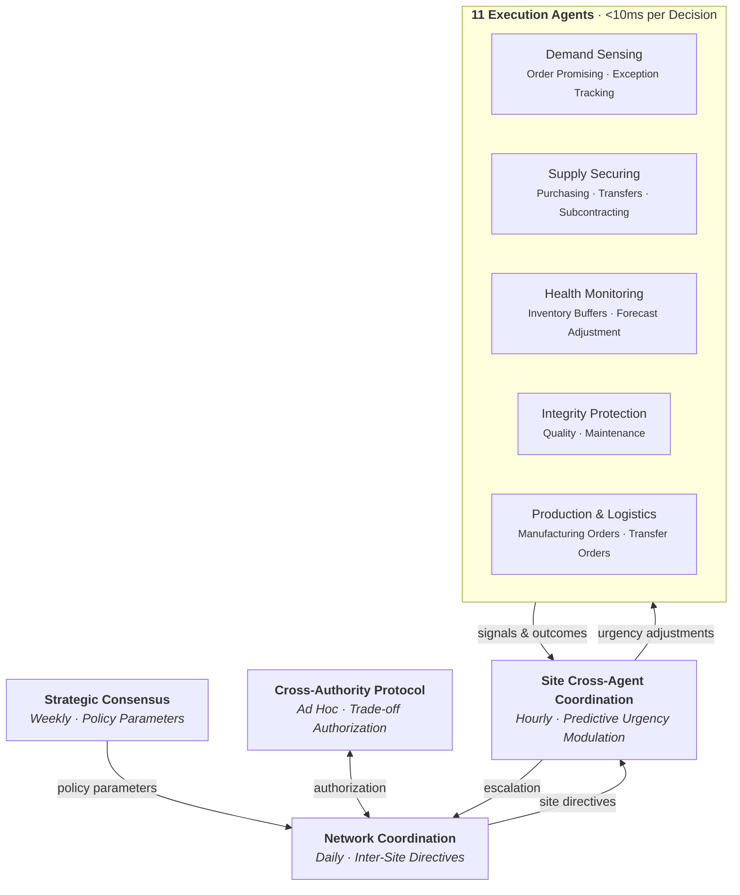
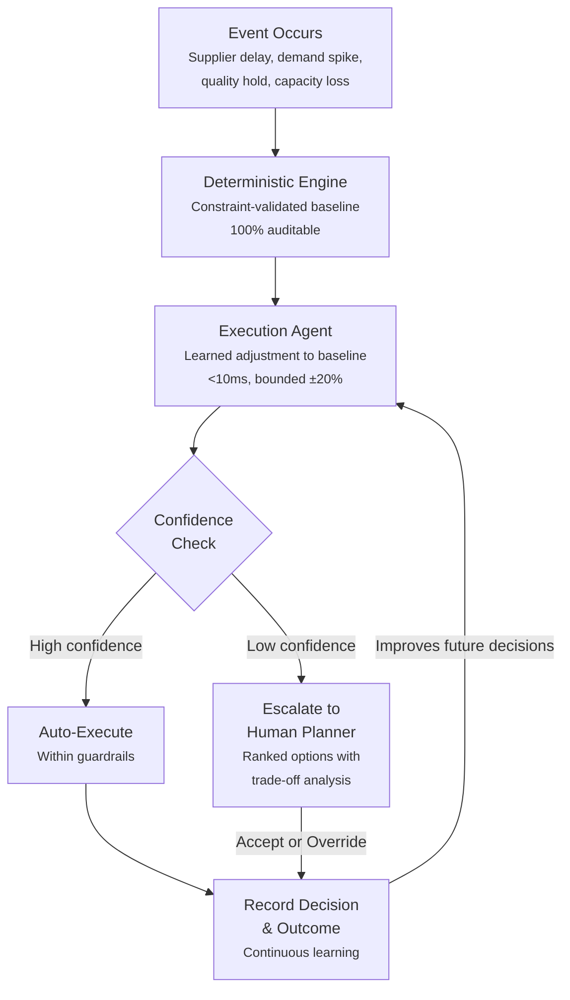
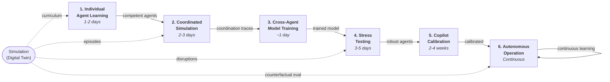

> **EXTERNAL DOCUMENT** — For solution architects, CTOs, and technical evaluators. Describes approach and capabilities without implementation details.
> Internal version: [TECHNICAL_OVERVIEW.md](../../TECHNICAL_OVERVIEW.md)

# Autonomy: Technical Overview

## How the Architecture Delivers the Operating Model

*Companion to the Executive Summary. That document describes what changes for the organization, operations, and workforce. This document describes how the technology layers make it possible.*

**Version**: 3.0 (External)
**Date**: March 8, 2026

---

## The Core Architectural Idea

The executive summary describes a system where routine planning decisions execute autonomously, disruptions are handled in minutes instead of days, and every human override teaches the system something new. Delivering this requires solving two hard coordination problems simultaneously:

1. **Vertical coordination**: Aligning decisions across planning horizons — strategic policy (months), tactical allocation (days), and operational execution (milliseconds) — so that an inventory buffer target set at the S&OP level correctly constrains a purchase order placed at the execution level.

2. **Horizontal coordination**: Aligning decisions across the supply chain network — so that a shortage signal at a distribution center propagates upstream to the factory, triggers a rebalancing decision at a sister DC, and adjusts ATP promises to customers downstream — all without any single agent having a global view.

The architecture solves both problems through a layered agent hierarchy (vertical) and a biologically-inspired signal propagation system (horizontal), unified by a sequential decision framework that provides the theoretical foundation for policy optimization, belief state management, and continuous learning.

---

## Part 1: The Vertical Stack — From Policy to Execution

### Five Layers, Four Time Horizons

The decision architecture is a stack of five layers, each operating at a different time horizon and producing outputs that constrain the layer below. The key insight from the sequential decision framework is that multi-level planning is *nested optimization* — each layer optimizes within the bounds set by the layer above.



### What Each Layer Does

**Layer 4 — Strategic Network Analysis** examines the structural properties of the supply chain network. It looks at the topology — which sites are critical chokepoints, where sourcing is dangerously concentrated, which parts of the network are fragile — and produces *policy parameters* that shape how the layers below behave. For example, a site identified as a critical bottleneck might receive a safety stock multiplier of 1.4x, meaning the execution layers will maintain 40% more buffer inventory there than the default policy would suggest.

This layer uses a network analysis model designed for large graphs because the problem is fundamentally about *network structure* — the answer to "how critical is this DC?" depends not just on the DC itself but on its position relative to every other node, the number of alternative paths, and the concentration of demand it serves. The structural embeddings it produces (encoding each site's network context) are cached and consumed by Layer 3.

**Update cadence**: Weekly or monthly. Network structure changes slowly.

**Layer 3 — Network Coordination** combines the structural embeddings from Layer 4 with real-time transactional data — current inventory levels, order backlogs, shipments in transit, demand forecasts — to produce *daily operational directives* for each site. These directives include demand forecasts for the next four periods, exception probability scores (how likely is this site to have a problem today?), and updated priority allocations (which customer orders should be fulfilled first when inventory is constrained?).

This layer uses a temporal graph attention model because the problem requires reasoning about both *network relationships* (how does a delay at Site A affect Site B downstream?) and *temporal patterns* (is this demand spike a one-time event or the beginning of a trend?). The graph attention mechanism lets the model learn which neighboring sites are most relevant for each prediction, while the temporal memory component captures time-series dynamics.

The key output is a **site directive** — a structured package of guidance that flows to each site's local agent cluster:

- **Policy context** (from Layer 4): Safety stock multipliers, criticality scores, bottleneck risk levels
- **Operational context** (from Layer 3): Multi-period demand forecasts, exception probabilities, model confidence scores
- **Network signals**: Upstream shortage alerts, downstream demand propagation warnings, lateral rebalancing opportunities

**Update cadence**: Daily. Transactional state changes meaningfully day-to-day.

**Layer 1.5 — Site Cross-Agent Coordination** bridges the gap between daily network-level inference and sub-millisecond reactive signals. Within each site, the 11 execution agents interact through causal pathways that the reactive signal system can only observe *after the fact* — a shortage signal fires after the shortage occurs. The site coordination model learns these causal relationships and predicts cascade effects *before* they materialize. For example, it learns that a spike in manufacturing order releases will generate quality inspection load 2-4 hours later, which may in turn create maintenance pressure. Using a lightweight graph attention architecture with temporal memory, it reads the current urgency state of all 11 agents and produces adjustment deltas that modulate each agent's urgency before the decision cycle runs. The adjustments are small and additive — the coordinator shifts emphasis, not overrides decisions.

**Update cadence**: Hourly. Intra-site cross-agent dynamics evolve faster than network-wide state but slower than individual decisions.

**Layer 1 — Execution Agent Cluster** is where individual decisions happen. Each site in the supply chain runs a *cluster* of 11 narrow decision agents — compact neural networks with a recursive refinement architecture. Each agent handles one specific type of execution decision:

| Agent | Decision | Example |
|-------|----------|---------|
| ATP Executor | Should we promise this order? | "Fulfill 80 of 100 units from Tier 2 allocation" |
| PO Creation | Should we place a purchase order? | "Order 500 units from Supplier A, expedite" |
| Inventory Rebalancing | Should we transfer inventory? | "Move 200 units from DC-East to DC-West" |
| Order Tracking | Is this order at risk? | "Flag PO-4521 — supplier 3 days late, recommend expedite" |
| MO Execution | Should we release this production order? | "Release MO-892, sequence after MO-891" |
| TO Execution | Should we release this transfer? | "Consolidate TO-334 and TO-335, ship Thursday" |
| Quality Disposition | What should we do with this quality hold? | "Rework lot Q-127, yield estimate 85%" |
| Maintenance Scheduling | When should we do this maintenance? | "Defer PM-44 by 48 hours, no production impact" |
| Subcontracting | Make or buy? | "Route 30% of demand to external manufacturer" |
| Forecast Adjustment | Should we adjust the forecast? | "Increase next-month forecast by 12% — trade show signal" |
| Inventory Buffer | Should we change safety stock? | "Increase buffer by 15% — lead time variability rising" |

Each execution agent is *narrow by design*. It doesn't try to understand the whole supply chain. It receives a focused state vector (14-30 features depending on the decision type), consults the cluster's shared signal system for context from other agents, and produces a decision in under 10 milliseconds. The recursive refinement (applying the same network weights multiple times in sequence) gives it computational depth without parameter bloat — effectively multiplying reasoning layers without multiplying parameters.

**Inference speed**: <10ms per decision. 100+ decisions per second per site.

**Layer 0 — Deterministic Engines** are pure logic — no learned parameters, no neural networks, no ambiguity. There are 11 engines, one for each decision type, and they implement the hard business rules: MRP netting logic, ATP allocation sequences, BOM explosion, capacity constraints. Every execution agent's decision is validated against the corresponding engine. If an agent proposes something that violates a physical constraint (ordering negative units, exceeding warehouse capacity), the engine catches it.

The engines also serve as the **fallback**. If a model fails to load, if the neural network produces garbage, if the entire ML stack goes down — the engines keep running. The platform degrades gracefully to deterministic planning, which is still better than no planning.

### How the Layers Connect: A Concrete Example

A customer places a rush order for 500 units of Product X at the East Coast DC.

1. **Layer 0** (Engine): The ATP engine checks current inventory (200 units), scheduled receipts (150 arriving tomorrow), and allocation buckets. Deterministic result: can fulfill 350 of 500.

2. **Layer 1.5** (Site Coordinator): Before the decision cycle runs, the site coordination model observes that MO Execution urgency is elevated (production behind schedule) and predicts that Quality Disposition and PO Creation will face increased pressure within hours. It raises PO Creation urgency and Quality urgency, pre-positioning those agents to respond faster.

3. **Layer 1** (Execution Cluster): The ATP agent receives the engine's baseline plus cluster context — a rebalancing signal indicating 100 units transferring from the West Coast DC, and a network shortage signal from the coordination model indicating the upstream supplier is constrained. The PO Creation agent, with urgency already elevated by the site coordinator, responds immediately to the ATP shortage signal. The ATP agent decides: fulfill 350 now, promise remaining 150 for Thursday (when the rebalancing transfer arrives).

4. **Layer 3** (Network Coordination): Tomorrow's daily cycle incorporates today's fulfillment data. The coordination model updates the East Coast DC's demand forecast upward (rush order suggests increased demand), raises the exception probability for the constrained supplier, and adjusts allocations to prioritize this customer segment.

5. **Layer 4** (Strategic Analysis): At the next weekly cycle, the network analysis detects increased concentration risk — the East Coast DC now sources 78% from a single supplier that has shown constraint signals. The safety stock multiplier increases from 1.0 to 1.3, and a sourcing diversification signal is generated.

The information flows *down* (policy to allocation to execution to constraint validation) and *back up* (outcomes to calibration to retraining to policy adjustment). This bidirectional flow is what makes the system continuously self-improving.

---

## Part 2: The Horizontal Network — Coordination Across the Supply Chain

### The Problem: No Agent Sees Everything

In a supply chain with 50 sites, no single agent can or should have a global view. The computational cost would be prohibitive, the latency unacceptable, and the coupling would make the system fragile. Instead, the architecture uses a five-layer coordination stack that gives each site agent *just enough* context to make good local decisions that are globally coherent.

### Layer 1: Intra-Cluster Signals (Within a Single Site, <10ms)

Within each site, the 11 execution agents coordinate through a **stigmergic signal system** — inspired by how ant colonies coordinate without centralized control. Instead of agents calling each other directly, they emit *signals* into a shared environment (the signal coordination system), and other agents observe those signals when making their own decisions.

There are 25 signal types, organized by functional role:

| Role | Agents | Signal Examples |
|------|--------|-----------------|
| **Scout** | ATP Executor, Order Tracking | Demand surge, ATP shortage, order exception |
| **Nurse** | Inventory Buffer, Forecast Adjustment | Buffer increased, forecast adjusted |
| **Forager** | PO Creation, Subcontracting | PO expedite, subcontract routed |
| **Guard** | Quality, Maintenance | Quality reject, maintenance urgent |
| **Builder** | MO Execution, TO Execution | MO released, TO delayed |

Signals decay exponentially over time (pheromone model), with a default half-life of 30 minutes. This means recent signals carry more weight than stale ones, and the system naturally forgets outdated context without explicit cleanup.

**Why this ordering matters**: The decision cycle runs in six phases — SENSE, ASSESS, ACQUIRE, PROTECT, BUILD, REFLECT — and the sequencing is deliberate. Scout agents (ATP, Order Tracking) observe incoming demand *before* Forager agents (PO Creation) place upstream orders. Quality and Maintenance signals reach the Builder agents (MO, TO Execution) *before* they release production orders. The Rebalancing agent runs last (REFLECT phase) with full visibility into everything that happened in the cycle, allowing it to detect and correct conflicting decisions.

The **priority vector** provides a complementary coordination mechanism: a shared array where each agent writes its current urgency level (0.0 to 1.0) and direction (shortage, surplus, risk, relief). Any agent can read any other agent's urgency, creating an always-available snapshot of the site's overall state. When the ATP agent reports urgency 0.9 (shortage direction), the PO Creation agent sees this and increases its propensity to expedite orders — without any direct function call between them.

### Layer 1.5: Learned Cross-Agent Coordination (Within a Single Site, Hourly)

Between reactive stigmergic signals (<10ms, Layer 1) and daily network-level inference (Layer 2), the site coordination model provides *learned* intra-site coordination on an hourly cadence. While the signal system is reactive (signals fire after events), the site coordinator is *predictive* — it observes the current urgency and activity state of all 11 agents, applies graph attention over 22 causal edges, and outputs urgency adjustment deltas that modulate the priority vector before the next decision cycle.

The key insight is that many cross-agent interactions follow predictable causal chains: ATP fulfillments drive MO requirements, MO completions generate quality inspection work, quality rejects create reorder pressure. The signal system captures these interactions *after* they happen. The site coordinator learns the statistical regularities and pre-adjusts urgency *before* the cascade unfolds, giving downstream agents a head start.

The adjustments are deliberately small and additive. The coordinator shifts emphasis across the agent cluster — "pay more attention to quality today because production volume is spiking" — rather than overriding any individual agent's decisions.

### Layer 2: Inter-Site Signals (Across Sites, Daily)

No execution agent ever calls across sites. All cross-site information flows through the network coordination model (Layer 3 in the vertical stack), which produces **inter-site signals** that are injected into each site's local signal system.

The network coordination model analyzes the full network graph daily and generates 9 types of inter-site signals:

| Signal | Meaning | Effect on Receiving Site |
|--------|---------|------------------------|
| Network shortage | Upstream supply is constrained | Increase buffer, diversify sourcing |
| Network surplus | Upstream has excess inventory | Reduce orders, accept transfers |
| Demand propagation | Demand wave moving through network | Prepare capacity, pre-position inventory |
| Bottleneck risk | A network chokepoint is at risk | Delay non-critical production |
| Concentration risk | Sourcing too concentrated | Expedite alternate-source POs |
| Resilience alert | Network fragility detected | Increase safety stock |
| Allocation refresh | Priority allocations updated | Re-run ATP against new buckets |
| Priority shift | Customer priority rankings changed | Adjust fulfillment sequence |
| Forecast revision | Network-level forecast updated | Adjust local demand expectations |

When a signal arrives at a site, it is translated into the local signal vocabulary (e.g., a network shortage becomes a local ATP shortage signal) and injected with a network-origin marker so the agents can distinguish network-level signals from locally-generated ones.

Inter-site signals have a 12-hour half-life (vs. 30 minutes for intra-site), reflecting the fact that network-level conditions change more slowly than local operational state.

**The critical design principle**: Execution agents are *unaware* that they're receiving network-level signals. They simply observe signals on the local bus and react according to their learned policy. This means the same agent model works identically whether the site is standalone or embedded in a 50-site network — the network context arrives as signals, not as architectural coupling.

### Layer 3: Cross-Authority Authorization (Seconds to Minutes)

Some decisions require coordination between agents that belong to different functional authorities. A purchasing agent that wants to expedite an order might need approval from a finance authority (budget). A plant agent that wants to insert a rush production order needs authorization from the sales/ATP authority (customer commitment).

The **Cross-Authority Protocol** handles this through explicit authority boundaries. Each of the 11 agent types maps to one of 13 functional authority roles (Sales & Operations, Procurement, Plant, Logistics, Quality, Maintenance, Demand, Inventory, and others).

Every possible action is classified into three categories:
- **Unilateral**: The agent can execute without asking anyone (e.g., adjusting order timing within normal bounds)
- **Requires Authorization**: The agent must request approval from another authority (e.g., requesting expedite — needs finance approval for the cost premium)
- **Forbidden**: The agent cannot perform this action at all (e.g., no execution agent can change sourcing rules — that's an S&OP policy decision)

When an agent proposes an action that requires authorization, the system:

1. Identifies the required authority and checks whether the target resource is available and uncontested
2. If no contention exists, auto-approves and proceeds immediately (latency under 500ms)
3. If contention exists or the decision exceeds delegation limits, queues for human review with pre-digested options — not a raw alert, but ranked alternatives with trade-off analysis across the balanced scorecard

### Layer 4: S&OP Consensus Board (Weekly)

At the top of the horizontal coordination stack, functional agents negotiate **policy parameters** — the values that flow down through the entire vertical stack. This is where strategic trade-offs are resolved: How much safety stock should we carry network-wide? What OTIF target should we commit to? How should we allocate capacity between product lines?

The S&OP layer consumes feedback signals from all 11 agent types across all sites — OTIF actuals, shortfall frequencies, expedite costs, inventory turns — and uses these as evidence in the negotiation. When the execution layer consistently shows that a safety stock policy is causing excess inventory without improving service levels, that signal reaches the S&OP layer and drives a policy parameter adjustment.

**Update cadence**: Weekly, aligned with the S&OP review cycle.

---

## Part 3: The Confidence Engine — Routing Between Fast and Deep

### The 95/5 Architecture

Not every decision needs the same depth of reasoning. A straightforward ATP check against available inventory is fundamentally different from a quality disposition decision involving a novel defect pattern the system has never seen. The architecture handles this through a **confidence-based routing mechanism** that steers decisions between fast execution (learned agents) and deep reasoning (exception handler).



Three checks govern the routing:

1. **Agent confidence** below threshold (default: 0.6) — the model itself reports low certainty
2. **Risk bound** above threshold — distribution-free uncertainty quantification indicates the probability of a bad outcome is too high
3. **Prediction interval width** exceeds 50% of value range — the uncertainty band is too wide to act on

When escalation triggers, the exception handler receives the full state context plus few-shot examples from a decision memory (past similar decisions retrieved by semantic similarity). Exception handler proposals are validated against the deterministic engine — no exception decision can deviate more than 30% from the engine baseline — and every exception decision is recorded as training data for the execution agent.

**The meta-learning effect**: Over time, the execution agent learns to handle situations that previously required escalation. The 95/5 boundary is not static — it shifts as the agent absorbs more training examples. This is the cost-reduction flywheel described in the executive summary: early in deployment, the exception handler handles more decisions (higher cost); as the agent learns, the exception handler handles fewer (lower cost).

### Urgency + Likelihood: Directing Human Attention Where It Matters

Confidence routing governs *which model* makes the decision (fast agent vs. deep exception handler). A second mechanism governs *whether a human needs to see it at all* — the **urgency + likelihood matrix**.

Every decision carries two scores:

- **Urgency** (0.0–1.0): How time-sensitive is this? Derived from the agent's urgency vector, signal bus state, and exception severity. A rush order with no inventory scores 0.95. A routine restock with 3 weeks of supply scores 0.1.
- **Likelihood** (0.0–1.0): How confident is the agent that its recommended action will resolve the issue? Derived from the TRM's output confidence, conformal prediction intervals, and CDT risk bounds.

These two dimensions create four operating quadrants:

```
                        Likelihood (agent confidence)
                    LOW                         HIGH
            ┌───────────────────┬───────────────────┐
    HIGH    │  HUMAN NEEDED     │  AUTONOMOUS        │
  Urgency   │  Top of stream    │  Agent acts,       │
            │  Clock ticking,   │  logged for        │
            │  agent uncertain  │  awareness          │
            ├───────────────────┼───────────────────┤
    LOW     │  ABANDONED        │  AUTONOMOUS        │
            │  Not worth        │  Agent acts,       │
            │  anyone's time    │  logged for        │
            │                   │  awareness          │
            └───────────────────┴───────────────────┘
```

The Decision Stream — the primary interface for planners — surfaces decisions sorted by urgency descending, then likelihood ascending. This means the decision at the top of the stream is always the most urgent one where the agent is least confident — precisely the situation where human expertise adds the most value.

Decisions with both low urgency and low likelihood are abandoned automatically using a sliding-scale guardrail: `urgency + likelihood` must exceed a configurable threshold (default: 0.5). This means the lower the urgency, the higher the likelihood must be to survive. High-urgency decisions are never abandoned regardless of likelihood — if the clock is ticking, the planner needs to see it even if the agent's best guess is weak.

Abandoned decisions are not deleted. They are recorded with their abandon reason and available on audit and training pages — useful for evaluating agent calibration and identifying patterns where the agent consistently generates low-value decisions.

---

## Part 4: The Learning Loop — How the System Gets Smarter

### Decision, Outcome, Calibration, Retraining

Every decision the system makes is tracked, and every outcome is eventually observed. The feedback loop runs on a fixed schedule:

| Time | Job | What It Does |
|------|-----|-------------|
| Hourly | Outcome Collection | Computes actual outcomes for site-level and agent-level decisions |
| Hourly | Uncertainty Calibration | Updates prediction intervals from new decision-outcome pairs |
| Every 6h | Retraining Evaluation | Checks if enough new experience has accumulated; if so, retrains the agent |
| Daily | Causal Matching | Builds matched pairs for override effectiveness analysis |
| Daily | Network Coordination | Runs strategic + operational models, broadcasts directives to all sites |

The feedback horizons are matched to each decision type — ATP outcomes are observable in 4 hours (did the order ship on time?), while inventory buffer adjustments take 14 days to evaluate (did the new safety stock level prevent stockouts?).

### Retraining: When and How

Retraining is not continuous — it fires when three conditions are met:

1. **Experience threshold**: At least 100 decisions with computed outcomes since the last checkpoint
2. **Change detection trigger**: At least one change detection event in the last 24 hours (indicating the environment has shifted)
3. **Cooldown**: No training run in the last 6 hours (prevents thrashing)

When triggered, the system trains the execution agent using offline reinforcement learning on the accumulated decision-outcome pairs. The new model is compared against the current one; if it regresses by more than 10%, the update is rejected. Accepted checkpoints are saved and the site agent hot-reloads the new model without interrupting service.

### Override Effectiveness: Learning from Human Judgment

When a planner overrides an AI decision, the system doesn't just record the override — it *measures whether the override was beneficial*, using a Bayesian framework.

Each (user, agent type) pair maintains a probability distribution. When an override outcome is observed:
- If the human decision outperformed the AI's counterfactual, the probability of the human being right increases
- If the AI's decision would have been better, the probability decreases
- Neutral outcomes produce no update

The resulting probability drives a **training weight** that controls how much influence the human's decision patterns have on future agent training. A planner who consistently makes better decisions than the AI earns higher training weight; one who consistently makes worse decisions earns lower weight. This is not punitive — it's calibration. The system learns *whose judgment to trust for which decision types*.

Critically, override effectiveness is measured at *two scopes*:

1. **Decision-local**: Did the human's choice produce a better outcome than the AI's for *this specific decision*?
2. **Site-wide**: Did the override improve the site's *aggregate balanced scorecard* (service level, inventory turns, cost, quality)?

The composite score weights site-wide impact more heavily (60/40 split) to prevent locally-optimal but systemically-harmful overrides from inflating a user's training weight. A planner who consistently optimizes their own area at the expense of the network will see their training weight decrease, not increase.

Three observability tiers determine how precisely the system can measure override quality:

| Tier | Decision Types | Method | Signal Strength |
|------|---------------|--------|-----------------|
| **1 — Analytical** | ATP, Forecast, Quality | Exact counterfactual computation | Full update |
| **2 — Statistical** | PO, MO, TO, Order Tracking | Matched pair comparison | Partial update (depends on match quality) |
| **3 — Prior only** | Inventory Buffer, Maintenance, Subcontracting | Prior-based estimation (high confounding) | Minimal update |

This graduated approach means the system learns fastest from decision types where causal attribution is clearest, and most cautiously from types where confounding makes attribution unreliable.

---

## Part 5: The DAG as the Organizing Principle

### Four Master Site Types

The supply chain network is modeled as a Directed Acyclic Graph (DAG) with four master site types that govern material flow and information routing:

- **Market Supply** (upstream sources — suppliers, raw material origins)
- **Manufacturer** (transform sites — production, assembly, BOM explosion)
- **Inventory** (storage/fulfillment — DCs, warehouses, retailers)
- **Market Demand** (terminal demand — end customers, retail points of sale)

Each site type determines which execution agents are applicable. A Manufacturer site runs MO Execution and Subcontracting agents that an Inventory site doesn't need. A Market Demand site generates demand signals that flow upstream through the network. The DAG topology — which sites connect to which, through which transportation lanes, with what lead times — is the structural backbone that both the strategic network analysis and the daily coordination model reason over.

### How the DAG Constrains Agent Communication

The DAG topology is not just a data model — it governs *how information flows between agents*. Inter-site signals propagate along the edges of the DAG:

- **Demand signals** flow *upstream* (from Market Demand toward Market Supply)
- **Supply/shortage signals** flow *downstream* (from Market Supply toward Market Demand)
- **Rebalancing signals** flow *laterally* (between Inventory sites at the same echelon)

An execution agent at the East Coast DC never receives a direct signal from a factory in Asia. Instead, the factory's constraints are reflected in the network coordination model's inter-site signals, which arrive at the DC as a network shortage or bottleneck risk — abstracted, summarized, and actionable without requiring the DC agent to understand the factory's internal state.

This is deliberate. It means the system scales without increasing the communication complexity at each site. Adding a new site to the network adds edges to the graph that the coordination model processes, but each site's local agent cluster remains unchanged — it still observes the same signal types on the same bus, just with potentially different values.

### Bill of Materials and Multi-Product Coordination

At Manufacturer sites, the DAG includes BOM relationships — a finished good requires specific components in defined ratios (e.g., 1 Case = 4 Six-Packs = 24 Bottles). The MRP engine at Layer 0 handles BOM explosion (computing component requirements from finished good demand), but the agent cluster adds learned coordination:

- The **MO Execution agent** sequences production orders considering component availability (signaled via ATP shortage from upstream component sites)
- The **Subcontracting agent** makes make-vs-buy decisions when internal capacity (signaled via maintenance urgent) is constrained
- The **Quality Disposition agent** decides whether to rework or scrap defective components, considering downstream production schedules (signaled via MO released)

All of this coordination happens through the signal system — no agent directly reads another agent's state. The manufacturing site's cluster self-organizes around the current reality, responding to signals as they arrive.

---

## Part 6: Putting It Together — End-to-End Decision Flow

### A Complete Cycle

Here is a single decision flowing through every layer of the architecture:

**Event**: Supplier notifies that a shipment of 1,000 units will be 5 days late.

**Layer 0 — Engine** (immediate):
The Order Tracking engine detects the late shipment by comparing the supplier's revised delivery date against the PO's expected receipt date. It flags the exception and computes the impact: 3 downstream customer orders at risk of missing their promise dates.

**Layer 1 — Execution Cluster** (within 20ms):
- **Order Tracking agent** emits an exception signal with urgency 0.8 (shortage direction)
- **ATP agent** observes the signal, rechecks affected customer promises, emits a shortage signal
- **Inventory Buffer agent** observes the shortage, recommends increasing safety stock for this product
- **PO Creation agent** observes ATP shortage + order exception, evaluates whether to place an expedited PO with an alternate supplier
- The PO Creation agent's expedite action *requires authorization* from Finance (cost premium)
- **Cross-Authority Protocol** creates an authorization request — auto-approved (within budget delegation, no contention)
- Expedited PO is placed

**Layer 1 — Confidence Routing** (within decision cycle):
The PO Creation agent's confidence on the alternate supplier routing is 0.52 (below the 0.6 threshold — this supplier has rarely been used). The uncertainty quantification escalates to the exception handler. The handler examines the decision memory, finds 3 similar past decisions, and concurs with the PO expedite recommendation with additional context: "Supplier B has 98% on-time rate for expedited orders in the last 6 months." The proposal passes validation (quantity deviation within 30%) and is accepted.

**Layer 2 — Inter-Site** (next daily cycle):
The network coordination model incorporates yesterday's late shipment event. It generates a network shortage signal for the affected supplier lane and a demand propagation signal for downstream sites. Sister DCs receive rebalancing suggestions. The shortage signal raises exception probabilities at all sites sourcing from this supplier.

**Layer 4 — Strategic Analysis** (next weekly cycle):
The strategic network analysis detects increased concentration risk on this supplier lane. The safety stock multiplier for affected sites increases from 1.0 to 1.2. The policy parameter flows down through the next coordination cycle, adjusting buffer calculations at every affected site.

**Feedback Loop** (over the following days):
- Hourly, the outcome collector checks: did the expedited PO arrive on time?
- Hourly, calibration updates the prediction intervals for PO Creation decisions involving alternate suppliers
- Every 6 hours, the retraining evaluator checks if enough new PO decisions have accumulated for a training run
- The exception handler decision is stored in the decision memory, available as context for future similar situations
- If the planner had overridden the AI's decision, the override effectiveness tracker would compute the counterfactual and update the Bayesian posterior

**What the planner sees**: A prioritized worklist item — "Supplier delay: 3 customer orders at risk. System placed expedited PO with Supplier B (auto-approved, within budget). Revised promise dates sent to customers. Review recommended." The planner reviews, approves or adjusts, and moves on. Total elapsed time from supplier notification to response: under 2 minutes.

---

## Part 7: Infrastructure and Deployment

### Performance Characteristics

| Metric | Value |
|--------|-------|
| Execution agent inference latency | <10ms per decision |
| Full cluster decision cycle | ~20ms (11 agents sequentially) |
| Network coordination daily inference | ~15s (strategic + operational + broadcast) |
| Exception escalation latency | ~200ms (includes reasoning + validation) |
| Outcome collection | <60s per hourly cycle |
| Uncertainty calibration | ~30s per hourly cycle |
| Retraining (when triggered) | ~5 minutes per agent type |
| Digital twin simulation | Days of simulated time in minutes |

### Data Model Compliance

The platform implements 100% of the AWS Supply Chain data model (35 entities) as the foundation layer. All planning logic — MRP netting, BOM explosion, inventory policy, sourcing rules — operates on AWS SC-standard tables and field names. The decision framework tables (allocations, decisions, belief state, calibration) extend the base model without modifying it. This means data can be imported from and exported to any AWS SC-compliant system without transformation.

### Deployment Model

The platform is containerized and deploys via standard container orchestration. The architecture separates cleanly into:

- **Stateless compute**: API services, agent inference, coordination models
- **Stateful storage**: Relational database for transactional data, vector storage for decision memory
- **GPU-optional**: Neural model training benefits from GPU acceleration (5-8x speedup), but all inference runs on CPU at production latency targets

The system requires no external ML platform — training, inference, and model management are built into the application. Models are checkpointed to the database and hot-reloaded without service interruption.

---

## Part 8: Distribution Fitting and Likelihood Estimation

### Why Point Estimates Break Safety Stock

Traditional planning systems assume demand and lead times follow a normal distribution. This assumption is baked into the standard safety stock formula. When the actual distribution is skewed (lognormal demand), heavy-tailed (lead times with occasional long delays), or multimodal (seasonal products with distinct demand regimes), the normal assumption produces safety stock levels that are systematically wrong — either too low (stockouts) or too high (excess inventory).

The platform addresses this through a **distribution fitting engine** that identifies the true statistical shape of each operational variable, and a **distribution-aware safety stock policy** that uses Monte Carlo simulation instead of closed-form formulas when the data is non-Normal.

### The Distribution Fitting Engine

The distribution fitting service performs maximum likelihood estimation (MLE) across 20+ supported distribution types and selects the best fit using statistical tests:

1. **Input**: Historical data series (demand, lead time, yield, price)
2. **Fitting**: MLE across candidate distributions — Normal, Lognormal, Gamma, Weibull, Beta, Exponential, Triangular, Log-Logistic, Mixture, Empirical, and others
3. **Evaluation**: Kolmogorov-Smirnov test (goodness-of-fit), AIC (penalizes complexity), BIC (stronger complexity penalty)
4. **Output**: Ranked results with best-fitting distribution, parameters, and confidence scores

The fitting results integrate directly with the stochastic sampler, Monte Carlo engine, and safety stock calculator.

### Distribution-Aware Safety Stock

The standard service level policy calculates safety stock using a z-score formula that assumes normally distributed demand and lead time. The fitted service level policy removes this assumption:

1. **Fit distributions** to historical demand and lead time data using MLE
2. **If both are Normal** — use the standard z-score formula (fast, exact)
3. **If either is non-Normal** — simulate Demand-During-Lead-Time (DDLT) via Monte Carlo: sample from the fitted distributions, compute the DDLT distribution, and set safety stock at the target service level percentile
4. **Result**: Safety stock that provides the *actual* target service level, regardless of the underlying distribution shape

This matters most for:
- **Lognormal demand** (common in retail): Standard formula underestimates safety stock by 15-30%
- **Weibull lead times** (common with ocean freight): Standard formula misses the long tail
- **Seasonal products**: Mixture distributions capture distinct demand regimes

### Distribution-Aware Feature Engineering

Rather than feeding summary statistics (mean, standard deviation) as features to the execution agents — which assume normality and lose information about skewness, tail behavior, and multimodality — the platform extracts **distribution parameters as features**:

| Traditional Feature | Distribution-Aware Replacement | Why It Matters |
|---|---|---|
| Mean demand | Distribution type, shape, scale | Captures skewness and tail behavior |
| Standard deviation | Coefficient of variation, skewness, kurtosis | Distinguishes thin-tailed from heavy-tailed |
| Mean lead time | Distribution type, shape, scale | Captures delay probability distribution |
| Demand history average | MAD/median ratio | Robust to outliers, better for non-Normal |

Demand classification uses the MAD/median ratio (Median Absolute Deviation) instead of the coefficient of variation, because MAD is robust to the outliers that make standard deviation unreliable for skewed distributions. An automatic sampling mode fits the best distribution and samples from it, alongside explicit distribution selection options.

---

## Part 9: The Digital Twin Training Pipeline — Cold-Start to Continuous Learning

### The Cold-Start Problem

When Autonomy deploys at a new customer site, the execution agents have no site-specific experience. They've never seen this customer's demand patterns, supplier reliability, or seasonal dynamics. Deploying untrained models would produce decisions worse than simple rules. But waiting months for production data to accumulate before enabling AI defeats the value proposition.

The solution is a **six-phase training pipeline** that uses the platform's simulation capabilities as a digital twin — progressively building agent competence from synthetic data through to production autonomy.



### Six Phases: From Zero to Autonomous

**Phase 1 — Individual Agent Learning** (1-2 days):

Each of the 11 agent types trains independently on curriculum-generated data. The curriculum progresses through complexity levels: single-site scenarios, 2-site chains, 4-site networks, multi-echelon networks, and production-scale topologies. At each level, thousands of scenarios generate supervised training pairs where the *engine baseline* serves as the teacher. After Phase 1, every agent can reproduce the deterministic engine's decisions within +/-5% — a safe starting point that guarantees no agent decision is worse than the engine fallback.

**Phase 2 — Coordinated Simulation** (2-3 days):

All 11 agents run simultaneously in simulation, with the signal system active. This is where they learn *coordination* — how an ATP shortage signal should influence PO timing, how a maintenance deferral affects MO sequencing, how rebalancing decisions propagate through the network. Phase 2 generates millions of training records across 2-3 days of compute. The key difference from Phase 1: the training signal comes from *system outcomes* (total cost, service level) rather than per-decision accuracy.

**Phase 3 — Cross-Agent Model Training** (~1 day):

The site coordination model (Layer 1.5) trains on the coordinated traces from Phase 2, learning the causal relationships between agent interactions and predicting cascade effects. This phase produces the hourly urgency modulation capability that bridges reactive signals and daily network inference.

**Phase 4 — Stress Testing** (3-5 days):

The trained agents face adversarial scenarios: demand spikes (3 standard deviations and above), supplier failures (zero supply for 2+ weeks), capacity shocks (50% reduction), and compound disruptions. Agents that panic (massive over-ordering) or freeze (ignoring signals) are retrained with emphasis on the failure modes. This phase uses the platform's Monte Carlo simulation with variance reduction techniques (Latin hypercube sampling, antithetic variates).

**Phase 5 — Copilot Calibration** (2-4 weeks, production, human-in-the-loop):

The agents run in copilot mode — suggesting every decision but requiring human approval. Every override is captured with context (the override effectiveness tracking system described in Part 4). Over 2-4 weeks, the agents absorb the customer's specific judgment patterns: which suppliers they trust more than the data suggests, which customers they prioritize beyond the formal priority scheme, which forecast adjustments they routinely make based on market intelligence. The Bayesian posterior on each (user, agent type) pair determines how much influence these overrides have on training.

**Phase 6 — Autonomous Operation** (continuous, no end date):

The continuous learning loop takes over. Outcome collection, uncertainty calibration, and retraining evaluation run automatically on an hourly and 6-hourly cadence. The agents improve continuously from their own production decisions. Exception handler decisions feed back into agent training data, gradually shifting the 95/5 boundary as agents learn to handle situations that previously required escalation.

**Timeline**: Phase 1 completes in 1-2 days (compute-bound). Phase 2 takes 2-3 days. Phase 3 takes approximately 1 day. Phase 4 takes 3-5 days. Phase 5 takes 2-4 weeks (human-paced). Phase 6 begins immediately after Phase 5 and runs indefinitely. Total time from deployment to autonomous operation: 3-5 weeks.

---

## Part 10: Vertical Escalation — When Execution Anomalies Signal Policy Errors

### The Horizontal Limitation

The continuous learning loop described in Part 4 is *horizontal* — when an agent's performance degrades, the system retrains that same agent. This handles execution-level drift: the model's weights become stale, the prediction intervals widen, the system detects it and retrains. But some problems can't be solved at the execution level.

Consider: the PO Creation agent at every site consistently orders 20% more than the engine baseline, week after week. Retraining doesn't fix it — in fact, retraining *reinforces* it, because the 20% excess is the agent's correct response to the current policy parameters. The real problem is that the safety stock multiplier set at the S&OP level (Layer 4) is too low for current market conditions. The agent is compensating for a strategic policy error by over-ordering at the execution level. No amount of execution-level retraining will fix a strategic-level problem.

### Dual-Process Cognition Applied to Supply Chain

This maps directly to Daniel Kahneman's dual-process theory from *Thinking, Fast and Slow*:

| Kahneman | Platform | Characteristics |
|----------|----------|----------------|
| **System 1** (fast, intuitive) | 11 Execution Agents (<10ms) | Pattern-matched, automatic, high throughput |
| **System 2** (slow, deliberate) | Network Coordination (daily) + Strategic Analysis (weekly) | Analytical, network-aware, resource-intensive |
| **The Lazy Controller** | Confidence Router | System 2 activates only when System 1 signals uncertainty |
| **Cognitive Strain** | Escalation Arbiter | Persistent anomalies force slow thinking |
| **WYSIATI** (What You See Is All There Is) | Agent's local-only state | Each agent sees only its site — can't diagnose network-wide issues |

Kahneman's key insight: System 1 works well most of the time through pattern matching, but it fails systematically on novel situations because it *substitutes* a simpler question for the hard one. Execution agents do the same — they substitute "what does the pattern say?" for "is the policy still correct?" The Escalation Arbiter detects when this substitution is producing persistent errors.

### Nested Decision Loops

John Boyd's Observe-Orient-Decide-Act (OODA) loop maps onto three nested decision cycles at different time scales:

- **Execution OODA** (agents, <10ms): Observe local state, orient via trained weights, decide order quantity, act immediately
- **Operational OODA** (network coordination, daily): Observe transactional data + strategic embeddings, orient via graph attention, decide priority allocations, act via site directives
- **Strategic OODA** (network analysis, weekly): Observe network topology + market signals, orient via bottleneck analysis, decide policy parameters, act via structural embeddings

Boyd's concept of *Schwerpunkt* (center of gravity) applies: the orientation phase is the center of gravity at each level. When orientation is wrong — stale agent weights, outdated coordination patterns, incorrect S&OP parameters — all downstream decisions are systematically biased. The Escalation Arbiter detects orientation failure at the execution level and triggers reorientation at the appropriate higher level.

### The Escalation Arbiter

The Arbiter runs on a regular schedule and monitors execution agent decision patterns across all sites for **persistent directional drift**:

For each site and agent type, it collects recent decisions over a rolling window and computes:
- **Direction**: The running mean of adjustments from baseline (positive or negative)
- **Magnitude**: The running mean of the absolute adjustment as a fraction of baseline
- **Consistency**: The fraction of adjustments in the dominant direction

If consistency exceeds a threshold (default 70%) and magnitude is significant, a pattern is detected and routed to the appropriate level:

| Pattern | Diagnosis | Route |
|---------|-----------|-------|
| Single agent, short duration | Execution noise | Horizontal retrain |
| Single agent, long duration, high consistency | Local policy drift | Off-cadence operational refresh |
| Multiple agents at same site | Site-level policy error | Operational + allocation rebalance |
| Same pattern across 30%+ of sites | Network-wide shift | Strategic re-inference |
| Cross-site + demand signal correlation | Market regime change | Full S&OP consensus board |

Cooldowns prevent oscillation: 12 hours between operational escalations, 72 hours between strategic escalations. The system must accumulate at least 20 decisions before a pattern is considered meaningful. All escalation events are logged with full evidence (persistence signals, cross-site patterns, diagnosis) for audit and tuning.

---

## Part 11: Quantitative Supply Chain Economics — From Heuristic to Dollar-Denominated Decisions

### The Problem with Heuristic Rewards

Traditional planning AI optimizes proxy metrics — service level percentages, days of supply, normalized scores. The agents learn to hit these proxies without understanding the economic trade-offs that matter to the business. A 1% service level improvement at a $2 item is treated the same as at a $200 item. Holding cost penalties use fixed scaling factors rather than actual cost-per-unit-per-day.

The platform now implements **dollar-denominated decision economics** throughout the agent stack, adopting principles from quantitative supply chain methodology: every stocking decision, every rebalancing transfer, and every purchase order is evaluated in terms of actual economic cost rather than heuristic scores.

### Economic Loss Functions

The agent training system uses an economic cost configuration that loads actual holding cost, stockout cost, and ordering cost from the product's unit cost and the inventory policy parameters. All three cost components are **required** — the system raises an error if any are missing, enforcing explicit economic specification for every tenant.

- **Holding cost**: Unit cost times annual holding rate divided by 365 per unit per day
- **Stockout cost**: Holding cost times stockout multiplier per unit (typically 4x holding cost)
- **Ordering cost**: Per-order fixed cost from sourcing rules

Agent reward functions for PO creation, inventory rebalancing, and inventory buffer decisions now compute rewards in dollar terms. An over-stocked warehouse generates a penalty proportional to actual holding cost times excess units times days. A stockout generates a penalty proportional to actual stockout cost times unfulfilled units. No heuristic scaling factors.

### Economically Optimal Safety Stock

A safety stock policy type implements **marginal economic return analysis**: for each candidate stock level, compute the expected marginal value of stocking one more unit. The optimal level is where the marginal cost of holding one more unit exceeds the marginal benefit of avoiding a stockout.

This is computed via Monte Carlo simulation of demand-during-lead-time, requiring fitted demand and lead time distributions (no fallbacks to point estimates — historical data is required).

### Probabilistic Forecast Scoring (CRPS)

The uncertainty quantification system computes the **Continuous Ranked Probability Score (CRPS)** — the gold standard for evaluating probabilistic forecasts. Unlike coverage and interval width (which measure calibration), CRPS measures the overall quality of the entire predictive distribution. It uses a closed-form solution for Normal distributions and numerical integration for empirical CDFs, tracked as an exponential moving average on each entity's belief state.

### Censored Demand Detection

When inventory hits zero, observed sales represent a lower bound of true demand — the demand was *censored* by the stockout. The demand processor detects these periods by cross-referencing inventory levels, flags them, and excludes censored observations from distribution fitting. This prevents the systematic demand underestimation that occurs when stockout periods are treated as true demand observations.

### Log-Logistic Distribution for Lead Times

Lead time variability often exhibits fat-tailed behavior — most shipments arrive on time, but a significant minority arrives very late. The log-logistic distribution captures this pattern better than Weibull or lognormal alternatives. It is now included as a candidate in lead time distribution fitting.

### Automated Policy Re-Optimization

The parameterized optimization policy optimizer — which performs global search over inventory policy parameters using evolutionary algorithms — is now scheduled as a weekly automated job. This closes the gap between having a sophisticated optimizer and actually running it regularly, ensuring policy parameters stay current as demand patterns and cost structures evolve.

---

## Part 12: Human-to-AI Signal Channels — Talk to Me & Email Signal Intelligence

Two input channels allow humans and external communications to inject signals directly into the AI decision pipeline, complementing the autonomous agent-driven workflows with human intent and external intelligence.

### Talk to Me — Natural Language Directive Capture

A persistent AI prompt bar in the TopNavbar accepts natural language directives from any authenticated user. The two-phase flow (analyze → clarify → submit) uses LLM parsing to extract structured fields (direction, metric, magnitude, duration, scope, justification), detects missing information via smart gap detection, and routes the completed directive to the appropriate Powell Cascade layer based on the user's `powell_role`.

**Key design decisions**:
- **Reason always required**: A directive without justification ("increase revenue") cannot be tracked for effectiveness. The system insists on the "why."
- **Strategic leniency**: VP/Executive directives legitimately target the entire network — geography and product scope are not marked missing for strategic-layer directives.
- **Confidence-gated auto-apply**: Only directives parsed with ≥0.7 confidence are auto-routed to TRMs. Below that, the directive is persisted but held for human review.
- **Effectiveness tracking**: Bayesian posteriors per `(user_id, directive_type)` learn which users and directive types actually improve outcomes over time.

Implementation: `backend/app/services/directive_service.py`, `backend/app/api/endpoints/user_directives.py`, `frontend/src/components/TopNavbar.jsx`

See [TALK_TO_ME.md](TALK_TO_ME.md) for full architecture documentation.

### Email Signal Intelligence — GDPR-Safe External Signal Ingestion

Email Signal Intelligence monitors customer and supplier inboxes, extracts supply chain signals from incoming emails, and routes them to the appropriate TRM agents. Personal identifiers are stripped before any text is stored — only the sending company (resolved via domain→TradingPartner) is persisted. The original email is never stored.

**Pipeline**: IMAP/Gmail Inbox → PII Scrubber (regex-based, no external deps) → TradingPartner Resolution (domain→company) → LLM Classification (Haiku tier, ~$0.0018/call) → Scope Resolution (fuzzy-match product/site refs) → EmailSignal persisted (GDPR-safe) → Auto-route to TRM(s) if confidence ≥ threshold + Decision Stream alert.

**12 signal types** map to primary/secondary TRMs: demand_increase/decrease → Forecast Adjustment, supply_disruption/lead_time_change → PO Creation, quality_issue → Quality Disposition, capacity_change → MO Execution, etc.

**Key design decisions**:
- **GDPR by design**: PII scrubbed *before* persistence, not after. No "right to erasure" complexity.
- **Emails are signal sources, not decision types**: No 12th TRM — emails feed existing TRMs via the ForecastAdjustmentTRM's `source="email"` path.
- **Company, not person**: Domain→TradingPartner resolution captures the valuable SC intelligence without personal identity.
- **Heuristic fallback**: Keyword-based classification when LLM unavailable (air-gapped), lower confidence (0.2-0.4) but maintains availability.

Implementation: `backend/app/services/email_signal_service.py`, `backend/app/services/email_pii_scrubber.py`, `backend/app/services/email_connector.py`, `frontend/src/pages/admin/EmailSignalsDashboard.jsx`

See [EMAIL_SIGNAL_INTELLIGENCE.md](EMAIL_SIGNAL_INTELLIGENCE.md) for full architecture documentation.

---

## Part 13: Decision Intelligence — From Planning Tool to Decision Platform

Gartner designated Decision Intelligence as a "transformational" technology in the 2025 AI Hype Cycle and published its inaugural Magic Quadrant for Decision Intelligence Platforms in January 2026. The framework defines four lifecycle capabilities that every Decision Intelligence Platform must deliver: decision modeling, decision orchestration, decision monitoring, and decision governance. Separately, Gartner's 2025 Hype Cycle for Supply Chain Planning Technologies identifies decision-centric planning and agentic AI as two of four interdependent technologies reshaping supply chain management — predicting that 50% of cross-functional SCM solutions will use intelligent agents by 2030.

### Decision-Centric Architecture

Rather than treating decisions as implicit outputs of planning runs, the Decision Intelligence paradigm models each recurring decision — how much to buy, make, move, and promise — as a **repeatable asset** with defined inputs, logic, constraints, ownership, and measurable outcomes. The platform's sequential decision framework already implements this: every decision carries the five core elements (State, Decision, Exogenous Information, Transition Function, Objective), and the outcome collection pipeline closes the feedback loop.

### Three-Level Maturity Progression

The Decision Intelligence framework defines three levels of human-AI collaboration that map directly to the platform's agent modes:

- **Decision Support** (human in the loop): The system provides data, insights, and scenario analysis. Human makes all decisions.
- **Decision Augmentation** (human on the loop): AI generates recommendations with confidence scores and impact analysis. Human approves, modifies, or overrides — and the system learns from every override.
- **Decision Automation** (human out of the loop): AI executes within pre-approved guardrails with full auditability. Human monitors and adjusts guardrails.

The progression from augmentation to automation is governed by measured decision quality: override effectiveness posteriors, prediction confidence, and cumulative outcome tracking — not arbitrary trust thresholds.

### Four Decision Intelligence Use Cases

Gartner's Critical Capabilities report evaluates platforms across Decision Stewardship (governance and lifecycle management), Decision Analysis (analytical and rules-driven workflows), Decision Engineering (orchestration and execution), and Decision Science (blended AI and logical reasoning). The platform addresses all four through its combination of deterministic engines, neural agents, probabilistic planning, distribution-free uncertainty quantification, and override learning.

---

## Part 13: Site Cross-Agent Coordination — Learned Predictive Modulation (Layer 1.5)

### The Gap Between Reactive and Planned

The execution cluster's stigmergic signal system (Layer 1) is *reactive*: a shortage signal fires after the shortage is observed, a quality rejection signal fires after the lot is inspected. The network coordination model (Layer 3) is *planned*: it analyzes the full supply chain graph daily and pushes directives to each site. Between these two lies a temporal gap — many cross-agent interactions within a site are causal and predictable on an hourly timescale, but neither the reactive signal system nor the daily batch inference captures them.

Consider a concrete example: a manufacturer's production schedule spikes — 40% more manufacturing orders released than usual. This will, with high probability, generate increased quality inspection load 2-4 hours later (more product to inspect), which may create maintenance pressure if equipment runs harder, which in turn drives purchasing activity if quality rejects increase. The signal system captures each link in this chain *after* it happens. The site coordination model learns the chain as a whole and pre-adjusts urgency for downstream agents *before* the cascade unfolds.

### Architecture Approach

The site coordination model treats the 11 execution agents within a single site as nodes in a directed graph, connected by 22 causal edges representing known interaction pathways. It uses dynamic graph attention (where the relevance of each neighbor changes based on the current state) combined with temporal memory (accumulating patterns across hourly inference cycles).

**Why dynamic attention?** Standard graph attention computes a static attention function — the same neighbor always gets the same attention weight regardless of context. Dynamic attention makes the relevance of each neighbor depend on the current situation. This matters for cross-agent coordination because the importance of, say, the ATP-to-MO relationship depends on whether ATP is currently in shortage or surplus mode.

**Why temporal memory?** The causal relationships between agents have temporal dynamics that a single snapshot cannot capture. The temporal memory accumulates patterns across hourly cycles — detecting trends like "MO urgency has been rising for 4 hours" that a memoryless model would miss.

### Causal Edge Design

The 22 directed edges encode known interaction pathways between agent types:

| Source | Target | Causal Mechanism |
|--------|--------|-----------------|
| ATP Executor | MO Execution | Fulfilled orders generate production requirements |
| ATP Executor | PO Creation | ATP shortages trigger upstream ordering |
| ATP Executor | Forecast Adjustment | Demand patterns signal forecast revision need |
| MO Execution | Quality Disposition | Production output requires quality inspection |
| MO Execution | Maintenance Scheduling | Production load drives maintenance timing |
| MO Execution | Subcontracting | Capacity pressure triggers make-vs-buy |
| Quality Disposition | MO Execution | Rejects and rework feed back to production queue |
| Quality Disposition | Inventory Buffer | Quality yield variability affects buffer needs |
| Quality Disposition | Subcontracting | Persistent quality issues shift to alternate vendors |
| PO Creation | Order Tracking | New purchase orders require tracking |
| PO Creation | Subcontracting | Supplier constraints trigger make-vs-buy re-eval |
| Order Tracking | PO Creation | Late or failed POs trigger reorders |
| Order Tracking | TO Execution | Delayed orders may need expedited transfers |
| Forecast Adjustment | ATP Executor | Forecast changes affect ATP availability |
| Forecast Adjustment | Inventory Buffer | Forecast changes affect buffer requirements |
| Inventory Buffer | PO Creation | Buffer level changes drive ordering |
| Inventory Buffer | Inventory Rebalancing | Buffer adjustments affect cross-site balance |
| Maintenance Scheduling | MO Execution | Maintenance windows constrain production |
| Maintenance Scheduling | Subcontracting | Extended downtime triggers external routing |
| TO Execution | Inventory Rebalancing | Transfer execution affects rebalancing needs |
| Inventory Rebalancing | TO Execution | Rebalancing decisions generate transfer orders |
| Subcontracting | MO Execution | Make-vs-buy decisions affect internal production load |

Edges are *not symmetric*: ATP-to-MO captures "fulfillment drives production," while MO-to-ATP would capture "production availability enables fulfillment" — a different causal mechanism that may not exist in all supply chain configurations.

### Training Pipeline

**Phase 1 — Supervised Learning from Examples**: The site coordination model learns from historical multi-agent trace records. Each trace captures a complete 6-phase decision cycle with urgency levels, decisions, and outcomes for all 11 agents. The training target is urgency adjustment deltas that would have improved the site-level balanced scorecard.

**Phase 2 — Reinforcement Learning Fine-Tuning**: The model interacts with the agent cluster in a simulated decision cycle. Reinforcement learning handles the continuous action space (11 urgency deltas) and partial observability (no cross-site visibility), using the site-level balanced scorecard as the reward signal.

**Phase 3 — Production Calibration**: Shadow mode during copilot operation. Adjustments are logged but not applied. Once shadow-mode balanced scorecard improvement exceeds a configurable threshold, adjustments go live.

### Integration: How Layer 1.5 Connects

The site coordination model consumes the daily site directive as exogenous context (network-level signals affect intra-site dynamics) and outputs urgency deltas that are applied additively. Agent autonomy is preserved — the coordinator modulates emphasis, never overrides decisions.

The decision cycle phases proceed in order:
1. **SENSE**: ATP, Order Tracking (observe incoming demand and exceptions)
2. **ASSESS**: Inventory Buffer, Forecast Adjustment (evaluate position)
3. **ACQUIRE**: PO Creation, Subcontracting (secure supply)
4. **PROTECT**: Quality, Maintenance (ensure integrity)
5. **BUILD**: MO Execution, TO Execution (produce and move)
6. **REFLECT**: Inventory Rebalancing (correct imbalances)

### Cold Start and Graceful Degradation

When no trained model exists, the site coordinator outputs zero adjustments — an identity pass-through. Agents operate exactly as they would without it. The coordinator is enabled per-tenant when sufficient multi-agent trace data exists (minimum 1,000 complete decision cycles). If inference fails or exceeds the latency timeout, the decision cycle proceeds with unmodified urgency vectors.

---

## Part 14: Causal AI — The Fourth Pillar

> The platform's four pillars are **AI Agents** (Parts 1-5), **Conformal Prediction** (Part 6), **Digital Twin** (Parts 8-9), and **Causal AI** (this section). Each pillar reinforces the others: the digital twin generates training data and calibration sets, conformal prediction provides uncertainty guarantees that govern agent autonomy, agents make the decisions, and causal AI determines which decisions actually worked — closing the learning loop.

### The Outcome Attribution Problem

The learning loop described in Part 4 depends on a critical assumption: that we can correctly attribute outcomes to the decisions that caused them. In practice, this is the hardest problem in the entire architecture.

When an ATP agent promises 80 units and the order ships on time, was that because of the ATP decision, the PO agent's earlier restocking, the inventory buffer agent's preemptive increase, or favorable demand that would have produced a good outcome regardless? Attributing the outcome to the ATP agent without controlling for these confounders produces biased training data — and biased training data produces agents that learn the wrong lessons.

This is not an academic concern. It is the difference between an AI system that gets genuinely smarter over time and one that overfits to historical accidents.

### Counterfactual Reasoning: The Foundation

The only rigorous way to determine whether a decision caused a positive outcome is to compare the actual outcome against what *would have happened* under a different decision — the counterfactual. For decisions where a human planner overrides the agent, both paths can be estimated:

- **Agent's counterfactual**: Given the actual environment outcome (real demand, real lead times), what reward would the agent's original recommendation have earned?
- **Human's actual**: Given the same environment, what reward did the override produce?
- **Treatment effect**: The difference is the causal effect of the override.

For ATP decisions, this computation is direct: if the agent recommended 80 units, the human overrode to 100, and actual demand was 90, the agent's counterfactual fill rate is 88.9% vs. the human's actual 100%. The override was demonstrably beneficial.

For more complex decisions (production scheduling, maintenance timing), analytical counterfactuals are not feasible — too many confounding variables interact. The system uses **propensity-score matching** instead: finding non-overridden decisions made under similar conditions (same site, similar inventory, demand, and backlog) and comparing their outcomes as statistical controls.

### Three Tiers of Causal Inference

The tiered strategy matches causal inference methods to each decision type's observability characteristics:

| Tier | Decision Types | Method | Signal Strength | Feedback Delay |
|------|---------------|--------|-----------------|----------------|
| **1** | ATP, Forecast Adjustment, Quality | Analytical counterfactual | 1.0 | 4h–7d |
| **2** | MO, TO, PO, Order Tracking | Propensity-score matching (L2 nearest-neighbor on state vectors) | 0.3–0.9 (scales with match count) | 1d–14d |
| **3** | Inventory Buffer, Maintenance, Subcontracting | Bayesian Beta prior (high confounding, long delays) | 0.15 | 14d–30d |

Tier 2 signal strength increases as the matching service accumulates more comparison pairs — 0 matches yields 0.30, 50+ matches yields 0.90. This prevents the system from drawing strong causal conclusions from insufficient evidence.

### From Causation to Training Weights

The causal inference pipeline feeds directly into the TRM training loop through **Bayesian override effectiveness posteriors**. Each (user, TRM type) pair maintains a Beta(α, β) distribution:

- When an override outcome exceeds the agent's counterfactual → α increases (beneficial signal)
- When an override outcome is worse → β increases (detrimental signal)
- Neutral outcomes → no update

The posterior's expected value E[p] = α/(α+β) translates to a **training weight**: users with historically beneficial overrides get higher sample weights when their decision patterns are used to train agents. This is not evaluation of planners — it is calibration of how much each planner's judgment should influence the AI's learning.

### Systemic Impact: Beyond Decision-Local Attribution

A subtle failure mode: an override that looks beneficial for one decision but harms the broader system. A planner who expedites one order may improve that order's on-time delivery while consuming capacity that delays ten other orders. The decision-local counterfactual shows a win; the systemic impact is a loss.

The system measures both scopes:
- **Local**: Counterfactual comparison for the specific decision
- **Site-window**: Balanced scorecard comparison across the entire site for a window surrounding the override

The composite score weights systemic impact 60% and local impact 40%, preventing locally-good but systemically-harmful overrides from inflating training weights.

### Why This Is a Pillar, Not a Feature

Causal AI is not a monitoring dashboard or an analytics add-on. It is the mechanism that makes the entire learning loop trustworthy:

- Without causal inference, the learning loop trains on **correlation** — agents learn what happened to co-occur with good outcomes, including favorable demand, lucky timing, and other agents' contributions
- With causal inference, the learning loop trains on **causation** — agents learn which specific decision patterns actually produce better outcomes, controlling for confounders

This is the difference between an AI system that degrades when conditions change (because its correlations break) and one that generalizes (because it learned actual causal relationships). For supply chain planning — where conditions change constantly — this distinction is not optional.

---

## Part 15: SAP Operational Statistics — Automated Distribution Parameter Extraction

The stochastic planning engine requires distribution parameters for operational variables — supplier lead times, manufacturing yields, machine reliability, transportation times. Rather than downloading millions of raw transaction records and fitting distributions locally, the platform executes **13 HANA SQL aggregation queries** directly in SAP's in-memory columnar engine. Each query computes a full statistical summary (min, P05, P25, median, P75, P95, max, mean, stddev, count) grouped by the appropriate business dimensions (vendor × material × plant, material × plant, equipment × plant, etc.).

The extraction script (`extract_sap_hana.py --operational-stats`) outputs a JSON file of pre-computed statistics. The mapper (`SupplyChainMapper.map_operational_stats_to_distributions()`) then fits the best distribution family from summary statistics alone — lognormal for right-skewed positive durations (detected when median < mean or CV > 0.5), beta for bounded rates and ratios (yields, on-time rates), normal for symmetric data, triangular as a fallback when fewer than 5 observations are available. P05/P95 percentiles serve as truncation bounds to exclude outliers.

Distribution parameters are stored as JSON in `*_dist` columns on the relevant entity tables: `vendor_lead_times.lead_time_dist`, `production_process.operation_time_dist/setup_time_dist/yield_dist/mtbf_dist/mttr_dist`, and `transportation_lane.supply_lead_time_dist`. A NULL `*_dist` column signals "use the deterministic base field." The stochastic sampler checks for `*_dist` first and falls back to the scalar column, preserving backward compatibility.

This design follows Lokad's principle that **distribution parameters should come from production data, not guesswork** — while keeping the computation in HANA where it belongs (leveraging columnar storage, in-memory processing, and native PERCENTILE_CONT/LAG window functions) rather than transferring raw transaction history over the network.

### Part 15b: Per-Agent Stochastic Parameter Specialization

While entity-level `*_dist` columns provide the base distributions, each TRM agent type has its own stochastic parameter values stored in the `agent_stochastic_params` table. This enables per-agent tuning without modifying the underlying entity data:

- **11 TRM types × 1-5 parameters each** = up to 30 distribution parameters per config
- **Three sources** with protection hierarchy: `industry_default` (auto-updated on industry change) → `sap_import` (protected) → `manual_edit` (protected)
- **`is_default` flag**: When a tenant's industry changes, only parameters still at their industry default (`is_default=True`) are updated. Manually edited or SAP-imported values are preserved.
- **Config-wide + site-specific**: Parameters default to config-wide scope (`site_id=NULL`); site-specific overrides take precedence when present.

The `TRM_PARAM_MAP` in `agent_stochastic_param.py` defines which parameters each agent uses — e.g., MO Execution uses manufacturing_cycle_time, yield, setup_time, mtbf, and mttr, while ATP Executor only uses demand_variability.

Admin UI at `/admin/stochastic-params` provides grouped editing by TRM type with inline JSON editing, source badges, and reset-to-default.

---

## Summary: The Architecture in One Paragraph

Autonomy operates as a five-layer decision stack — strategic network analysis (weekly), tactical allocation (network coordination model, daily), learned intra-site cross-agent coordination (hourly), operational execution (agent cluster, milliseconds), and deterministic validation (engines, always) — where each layer constrains the layer below through policy parameters, directives, urgency modulation, and hard constraints. Within each site, 11 narrow decision agents coordinate through a biologically-inspired signal system with pheromone-like decay, organized into a six-phase decision cycle that ensures scouts observe before foragers act. Across sites, information flows along the supply chain DAG through inter-site signals generated by the network coordination model, preserving local autonomy while maintaining global coherence. A confidence-based router steers ~5% of low-confidence decisions to an exception handler for deep reasoning, and every decision feeds a closed-loop learning pipeline — outcome collection, uncertainty calibration, Bayesian override tracking, and periodic retraining — that makes the system measurably smarter from every planning cycle it runs. Distribution-aware feature engineering replaces normal-distribution assumptions with MLE-fitted distributions for safety stock, demand classification, and agent state vectors. A six-phase digital twin pipeline — supervised learning, coordinated simulation, cross-agent model training, stress testing, copilot calibration, and autonomous operation — takes agents from zero experience to production autonomy in 3-5 weeks. When execution-level anomalies signal that strategic policy parameters are wrong, the Escalation Arbiter detects persistent directional drift and routes the problem to the appropriate higher tier — operational (coordination refresh) or strategic (S&OP policy review) — closing the vertical feedback loop that connects execution outcomes to policy correction. And throughout, every stocking decision, rebalancing transfer, and purchase order is evaluated in dollar-denominated economic terms — actual holding costs, stockout costs, and ordering costs from the product and policy configuration — with censored demand detection, probabilistic forecast scoring, and automated weekly policy re-optimization ensuring the economic parameters stay calibrated to reality. The result is a purpose-built Decision Intelligence Platform for supply chain — where every recurring decision is modeled as a trackable asset with defined inputs, logic, confidence, and measured outcomes — delivering the full Decision Intelligence lifecycle (model, orchestrate, monitor, govern) natively within the supply chain domain.
