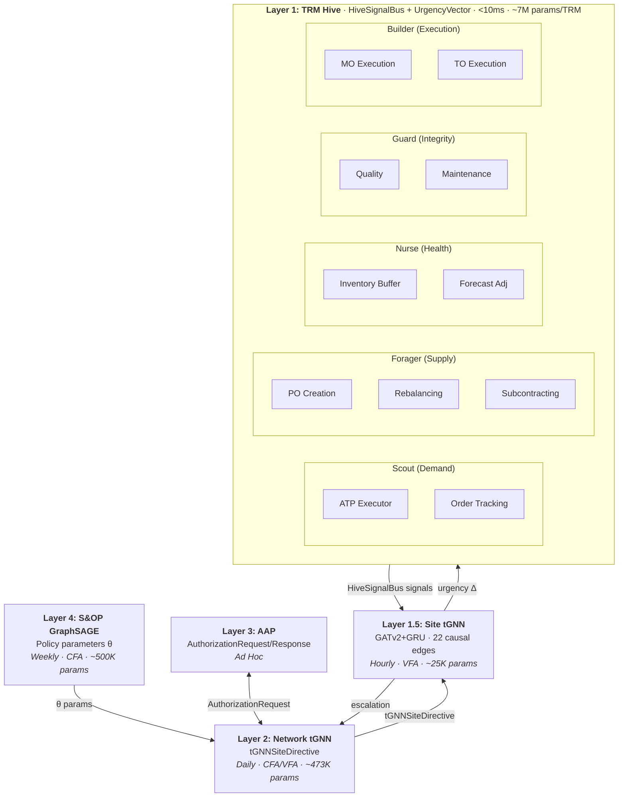
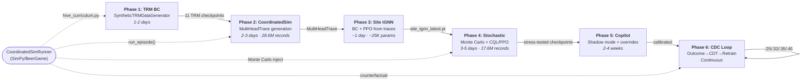

# TRM Agents Explained

> **INTERNAL DOCUMENT** — Contains implementation details, file paths, and architecture specifications.

## Overview

The Autonomy platform uses Warren B. Powell's **Sequential Decision Analytics and Modeling (SDAM)** framework to structure its AI agents. At the execution layer, **Tiny Recursive Models (TRMs)** make narrow, fast decisions (< 10ms) that augment deterministic engine baselines.

Each TRM is paired 1:1 with a **deterministic engine**. The engine provides the auditable, formula-based baseline. The TRM learns context-dependent adjustments the engine's fixed rules cannot capture.

```
┌────────────────────────────────────────────────────────────┐
│  S&OP GraphSAGE  (CFA - Cost Function Approximation)      │
│  Updates: weekly/monthly                                    │
│  Outputs: policy parameters θ, criticality scores           │
└──────────────────────────┬─────────────────────────────────┘
                           │ θ + network embeddings
┌──────────────────────────▼─────────────────────────────────┐
│  Execution tGNN  (CFA/VFA Bridge)                          │
│  Updates: daily                                             │
│  Outputs: Priority × Product × Location allocations         │
└──────────────────────────┬─────────────────────────────────┘
                           │ allocations + context
┌──────────────────────────▼─────────────────────────────────┐
│  Narrow TRMs  (VFA - Value Function Approximation)         │
│  Updates: per-decision (< 10ms)                            │
│  11 Engine-TRM pairs:                                       │
│    ┌───────────────────────┬─────────────────────────────┐  │
│    │ Deterministic Engine   │ Learned TRM                 │  │
│    ├───────────────────────┼─────────────────────────────┤  │
│    │ AATPEngine             │ ATPExecutorTRM              │  │
│    │ MRPEngine              │ POCreationTRM               │  │
│    │ SafetyStockCalculator  │ InventoryBufferTRM          │  │
│    │ RebalancingEngine      │ InventoryRebalancingTRM     │  │
│    │ OrderTrackingEngine    │ OrderTrackingTRM            │  │
│    │ MOExecutionEngine      │ MOExecutionTRM              │  │
│    │ TOExecutionEngine      │ TOExecutionTRM              │  │
│    │ QualityEngine          │ QualityDispositionTRM       │  │
│    │ MaintenanceEngine      │ MaintenanceSchedulingTRM    │  │
│    │ SubcontractingEngine   │ SubcontractingTRM           │  │
│    │ ForecastAdjustmentEng  │ ForecastAdjustmentTRM       │  │
│    └───────────────────────┴─────────────────────────────┘  │
└────────────────────────────────────────────────────────────┘
```

### Graceful Degradation

The layered architecture ensures the system works at every level of capability:

| Level | Available | Behavior |
|-------|-----------|----------|
| **Full** | Engine + trained TRM | Engine baseline + learned adjustments |
| **Heuristic** | Engine only (TRM untrained) | Engine baseline = TRM heuristic fallback |
| **Minimal** | Neither | Hard-coded defaults (safe but suboptimal) |

### Urgency + Likelihood: Decision Prioritization

Every TRM decision carries two scores that determine whether a human needs to see it:

- **Urgency** (0.0–1.0): Time-sensitivity derived from the TRM's UrgencyVector, HiveSignalBus state, and exception severity. A rush order with depleted inventory scores high; a routine restock with weeks of supply scores low.
- **Likelihood** (0.0–1.0): Agent confidence that the recommended action resolves the issue. Derived from the TRM's output confidence head, conformal prediction interval width, and CDT risk bound.

| Urgency | Likelihood | Action |
|---------|-----------|--------|
| High | Low | **Decision Stream — top priority.** Human judgment needed; the clock is ticking and the agent is uncertain. |
| High | High | Agent acts autonomously within guardrails, logged. |
| Low | High | Agent acts autonomously within guardrails, logged. |
| Low | Low | Abandoned. Not worth human attention. Available on audit/training pages. |

The Decision Stream sorts by urgency descending, then likelihood ascending — so the decision at the top is always the most time-sensitive one where the agent is least confident. Abandonment uses a sliding scale: `urgency + likelihood` must exceed a threshold (default 0.5). High-urgency decisions are never abandoned.

### Agent Architecture



---

## The 11 Engine-TRM Pairs

### 1. AATP Engine → ATP Executor

**Purpose**: Allocated Available-to-Promise. Given a customer order, determine what can be fulfilled from priority-based allocation buckets.

**Engine**: `engines/aatp_engine.py` — `AATPEngine`

The AATP engine implements priority-based consumption with a specific sequence:

```
Consumption sequence for order at priority P:
  1. Own tier (P) first
  2. Bottom-up from lowest priority (5 → 4 → 3 → ...)
  3. Stop at own tier (cannot consume above)

Example: P=2 order → tries [2, 5, 4, 3] (skips 1)
```

| Component | Detail |
|-----------|--------|
| Input | `Order(order_id, product_id, location_id, requested_qty, priority)` |
| Output | `ATPResult(can_fulfill_full, available_qty, shortage_qty, consumption_detail)` |
| Config | `AATPConfig(num_priority_tiers=5, allow_borrowing_up=False)` |
| Deterministic? | 100% — same allocations + same order = same result |

**TRM**: `atp_executor.py` — `ATPExecutorTRM`

The TRM adds:
- Exception handling for partial fills (substitute? backorder? split?)
- Dynamic priority adjustment based on customer context
- Cross-site availability checks when local stock insufficient

| Component | Detail |
|-----------|--------|
| State vector | inventory, pipeline, backlog, allocated, available_atp, demand_forecast, pending_orders, priority |
| Action space | Discrete: fulfill (0), partial (1), defer (2), reject (3) + continuous: qty_fulfilled |
| Reward | `fill_rate * 0.4 + on_time_bonus * 0.2 + priority_weight * 0.2 + fairness * 0.2` |

**Delegation**: `ATPExecutorTRM._heuristic_decision()` builds an `EngineOrder`, calls `self._engine.check_availability()`, and maps the result to an `ATPResponse`.

---

### 2. MRP Engine → PO Creation TRM

**Purpose**: Purchase order timing and quantity decisions. When should we order, how much, from which supplier?

**Engine**: `engines/mrp_engine.py` — `MRPEngine`

The MRP engine implements standard netting, BOM explosion, and lot sizing:

```
Net Requirements = Gross Requirements - On Hand - Scheduled Receipts + Safety Stock
Planned Orders  = Lot-size(Net Requirements, policy) offset by Lead Time
```

| Component | Detail |
|-----------|--------|
| Input | `GrossRequirement(product_id, period, quantity)` + BOM + inventory |
| Output | `List[PlannedOrder(product_id, period, quantity, order_type)]` |
| Config | `MRPConfig(planning_horizon=52, lot_sizing='lot_for_lot')` |
| Lot sizing | `lot_for_lot`, `fixed_order_qty`, `eoq`, `period_order_qty` |
| Deterministic? | 100% |

**TRM**: `po_creation_trm.py` — `POCreationTRM`

The TRM wraps order-up-to logic with context-aware adjustments:
- Expedite decisions when below critical thresholds
- Supplier selection considering reliability and cost
- Forecast-driven anticipatory ordering

| Component | Detail |
|-----------|--------|
| State vector | on_hand, in_transit, on_order, committed, backlog, safety_stock, reorder_point, dos, demand_forecast, lead_time, supplier_reliability, supply_risk, demand_volatility |
| Action space | Discrete: order (1), defer (0), expedite (2), cancel (3) + continuous: order_qty |
| Reward | `stockout_penalty * 0.4 + dos_target * 0.3 + cost_efficiency * 0.2 + timing_accuracy * 0.1` |

**Delegation**: `POCreationTRM` stores `self._engine = mrp_engine` in `__init__`. The heuristic fallback uses order-up-to-level logic with safety stock from the SS calculator. The MRP engine is available for gross-to-net planning at the orchestration level.

---

### 3. Safety Stock Calculator → Inventory Buffer TRM

**Purpose**: Adjust inventory buffer levels beyond what deterministic formulas compute, capturing context the formulas miss (seasonality, regime changes, recent stockouts). *(Renamed from SafetyStockTRM, Feb 2026 — see Terminology Note in CLAUDE.md)*

**Engine**: `engines/safety_stock_calculator.py` — `SafetyStockCalculator`

Implements the AWS SC policy types plus distribution-aware extensions:

| Policy Type | Formula |
|-------------|---------|
| `abs_level` | SS = fixed quantity |
| `doc_dem` | SS = avg_daily_demand × days_of_coverage |
| `doc_fcst` | SS = avg_daily_forecast × days_of_coverage |
| `sl` (service level) | SS = z(SL) × √(LT × σ²_d + d² × σ²_LT) |
| `sl_fitted` | Monte Carlo DDLT when demand/LT is non-Normal |
| `econ_optimal` | Marginal economic return: stock where E[stockout_cost × P(demand>k)] > holding_cost |

| Component | Detail |
|-----------|--------|
| Input | `DemandStats(avg_daily_demand, std_daily_demand, avg_lead_time, std_lead_time)` + `SSPolicy(policy_type, service_level)` |
| Output | `SSResult(safety_stock, reorder_point, order_up_to_level, policy_type)` |
| Deterministic? | 100% |

**TRM**: `inventory_buffer_trm.py` — `InventoryBufferTRM`

> **Note**: Renamed from `SafetyStockTRM` / `safety_stock_trm.py` (Feb 2026). Addresses the DDMRP critique — at the TRM execution layer, this is an **inventory buffer** (uncertainty absorber with soft-buffer netting), not a hard demand target for MRP. The deterministic engine (`SafetyStockCalculator`) retains its name as it implements the AWS SC safety stock calculation.

The TRM learns a **multiplier ∈ [0.5, 2.0]** on top of the engine baseline:

```
adjusted_ss = baseline_ss × multiplier
```

Heuristic rules (used before training):
| Condition | Multiplier | Reason |
|-----------|-----------|--------|
| stockout_count ≥ 3 | 1.4× | RECENT_STOCKOUT |
| stockout_count ≥ 1 | 1.2× | RECENT_STOCKOUT |
| demand_cv > 0.5 | 1.3× | HIGH_VOLATILITY |
| seasonal_index > 1.3 | 1.2× | SEASONAL_PEAK |
| seasonal_index < 0.7 | 0.85× | SEASONAL_TROUGH |
| demand_trend > 0.1 | 1.1× | TREND_UP |
| demand_trend < -0.1 | 0.9× | TREND_DOWN |
| excess_days > 60 | 0.85× | EXCESS_INVENTORY |
| \|forecast_bias\| > 0.1 | 1.0 + bias | FORECAST_BIAS |

| Component | Detail |
|-----------|--------|
| State vector | baseline_ss, current_dos, demand_cv, demand_trend, seasonal_index, recent_stockout_count, recent_excess_days, forecast_bias, lead_time_days, lead_time_cv |
| Action space | Continuous: multiplier ∈ [0.5, 2.0] |
| Reward | `stockout_penalty * 0.4 + dos_target * 0.3 + excess_cost * 0.2 + stability_bonus * 0.1` |

**Delegation**: `InventoryBufferTRM._heuristic_evaluate()` calls `self._ss_calculator.compute_safety_stock()` for the baseline, then applies context-dependent multiplier rules.

---

### 4. Rebalancing Engine → Inventory Rebalancing TRM

**Purpose**: Cross-location inventory transfers. Identify excess/deficit sites and recommend transfers.

**Engine**: `engines/rebalancing_engine.py` — `RebalancingEngine`

```
Excess sites:   DOS > target_dos × 1.5
Deficit sites:  DOS < target_dos × 0.75

Transfer qty = min(source_excess, dest_deficit)
             where source_excess = available - safety_stock
                   dest_deficit  = safety_stock - available

Apply lane constraints: qty = max(min_qty, min(qty, max_qty))
```

| Component | Detail |
|-----------|--------|
| Input | `Dict[str, SiteState]` + `List[LaneConstraints]` |
| Output | `List[TransferRecommendation]` sorted by urgency |
| Config | `RebalancingConfig(excess_threshold=1.5, deficit_threshold=0.75, stockout_risk_threshold=0.5)` |
| Reason classification | stockout_risk (dest risk > 0.5), excess_inventory (source DOS > 2× target), service_level (default) |
| Deterministic? | 100% |

**TRM**: `inventory_rebalancing_trm.py` — `InventoryRebalancingTRM`

The TRM adds:
- Demand-shift detection and proactive rebalancing
- Cost-optimization transfers (reduce holding costs)
- tGNN-informed criticality weighting

| Component | Detail |
|-----------|--------|
| State vector | Per-site: on_hand, in_transit, committed, backlog, demand_forecast, demand_uncertainty, safety_stock, target_dos, criticality, supply_risk, dos, stockout_risk + lane features + network features (30 dims) |
| Action space | Binary: transfer (1) / hold (0) + continuous: transfer_qty |
| Reward | `service_improvement * 0.5 + transfer_cost_penalty * 0.3 + balance_improvement * 0.2` |

**Delegation**: `InventoryRebalancingTRM._heuristic_evaluate_pair()` converts TRM's `SiteInventoryState` → engine's `SiteState`, calls `self._engine.evaluate_pair()`, and maps the engine's `TransferRecommendation` back to the TRM's `RebalanceRecommendation`.

---

### 5. Order Tracking Engine → Order Tracking TRM

**Purpose**: Detect order exceptions and recommend actions. Continuous monitoring of POs, TOs, and customer orders.

**Engine**: `engines/order_tracking_engine.py` — `OrderTrackingEngine`

Six threshold-based detection rules evaluated in priority order:

| Rule | Condition | Severity | Action |
|------|-----------|----------|--------|
| Stuck in transit | status=in_transit AND days > typical × 2.0 | critical | escalate |
| Missing confirmation | status=created AND days > 2.0 | high | contact_supplier |
| Late delivery | days_until_expected < -2.0 | warning/high/critical | expedite/find_alternate |
| Early delivery | days_until_expected > 3.0 | info | adjust_schedule |
| Quantity shortage | fill_rate < 0.95 | warning/high | find_alternate |
| Price variance | \|price_delta\| > 10% | warning/high | review_pricing |

| Component | Detail |
|-----------|--------|
| Input | `OrderSnapshot(order_id, order_type, status, days_until_expected, quantities, prices, partner_metrics)` |
| Output | `ExceptionResult(exception_type, severity, recommended_action, description, impact_assessment)` |
| Config | `OrderTrackingConfig(late_threshold_days=2.0, early_threshold_days=3.0, quantity_variance_threshold=0.05, price_variance_threshold=0.10)` |
| Deterministic? | 100% |

**TRM**: `order_tracking_trm.py` — `OrderTrackingTRM`

The TRM adds:
- Severity refinement based on customer impact and inventory context
- Pattern recognition (recurring issues with specific suppliers)
- Escalation judgment (when to involve humans)

| Component | Detail |
|-----------|--------|
| State vector | exception_type, severity, days_from_expected, qty_variance, inventory_position, pending_orders, customer_impact |
| Action space | Discrete: accept (0), expedite (1), reorder (2), escalate (3), cancel (4) |
| Reward | `correct_exception * 0.4 + resolution_speed * 0.3 + escalation_appropriateness * 0.3` |

**Delegation**: `OrderTrackingTRM._heuristic_evaluate()` builds an `OrderSnapshot` from the TRM's `OrderState`, calls `self._engine.evaluate_order()`, and maps the engine's string-based results back to TRM enum types.

---

### 6. MO Execution Engine → MO Execution TRM

**Purpose**: Manufacturing order release timing, sequencing, split decisions, and expediting — balancing lead time adherence with production efficiency and changeover cost minimization.

**Engine**: `engines/mo_execution_engine.py` — `MOExecutionEngine`

The engine evaluates material availability (BOM % complete), capacity availability, and sequences MOs using a **two-phase Glenday Sieve + nearest-neighbor** algorithm:

1. **Glenday Sieve** (`engines/setup_matrix.py`): Classifies products into Green (~6% of SKUs, ~50% volume), Yellow, Red, and Blue runners by cumulative production volume. Green runners are scheduled first with dedicated capacity.
2. **Nearest-neighbor changeover minimization**: Remaining capacity is filled by selecting the next MO that minimizes changeover time from the current product on the line. Urgent MOs (due ≤3 days or priority 1-2) are pinned to the front regardless of changeover cost.

**Setup Matrix** (`engines/setup_matrix.py`): Loads sequence-dependent changeover times from `resource_capacity_constraint` (constraint_type='setup') with `from_product_id → to_product_id → setup_time_hours`. Fallback chain: exact pair → any-resource → same product family (30% of default) → resource default from `production_process.setup_time` → global default.

| Component | Detail |
|-----------|--------|
| Input | `MOState(mo_id, product_id, planned_qty, due_date, priority, bom_availability, capacity_pct, changeover_hours, runner_category, ...)` |
| Output | `MODecision(release_now, sequence_position, expedite, defer_days, split_quantities, priority_override)` |
| Config | `MOExecutionConfig(material_threshold=0.95, capacity_threshold=0.85)` |
| Deterministic? | 100% |

**TRM**: `mo_execution_trm.py` — `MOExecutionTRM`

The TRM adds:
- Learned sequence adjustments (max ±3 position shift from engine baseline)
- Priority overrides for customer-linked MOs near due date
- Quantity adjustments when historical yield is poor (<90%)
- Setup overrun buffers based on historical patterns
- **Changeover-aware state**: `changeover_hours_from_current` and `runner_category` feed directly into the 20-dim state vector, enabling the TRM to learn changeover patterns the greedy heuristic misses

| Component | Detail |
|-----------|--------|
| State vector | work_in_progress, capacity_available, order_qty, due_date_urgency, backlog, material_available, operator_available, quality_rate, tool_wear, maintenance_due, parallel_orders, priority, yield_rate, runner_category, overtime_available, sequence_position, bom_coverage, defect_rate, setup_time (changeover-aware), cycle_time (20 dims) |
| Action space | release_now (bool) + sequence_position (int) + expedite (bool) + defer_days (0-14) + split_quantities (list) + priority_override (1-5) |
| Reward | `on_time_delivery * 0.4 + setup_cost * 0.3 + queue_holding_cost * 0.2 + yield_success * 0.1` |

**Glenday integration with Site tGNN**: The Glenday Sieve runs at SiteAgent initialization. Before each decision cycle, green runner pressure boosts `mo_execution` urgency in the UrgencyVector, which flows into Site tGNN features. This lets the tGNN learn cross-TRM effects of green-runner-heavy production windows (e.g., maintenance deferral during green campaigns).

**Delegation**: Engine provides deterministic release/sequence decision. TRM refines if confidence > 0.7, else falls back to heuristic. Emits `MO_RELEASED` or `MO_DELAYED` signal. Persists to `powell_mo_decisions`.

---

### 7. TO Execution Engine → TO Execution TRM

**Purpose**: Inter-site transfer order timing and consolidation — balancing source inventory depletion risk with destination stockout prevention.

**Engine**: `engines/to_execution_engine.py` — `TOExecutionEngine`

The engine validates source has minimum DOS (default 3 days), checks destination urgency, and evaluates consolidation opportunities within a 24-hour window (10% cost savings threshold):

| Component | Detail |
|-----------|--------|
| Input | `TOState(to_id, source_site, dest_site, qty, days_until_needed, source_inventory, dest_inventory, ...)` |
| Output | `TODecision(release_now, expedite, consolidate_with, defer_days, reroute_via)` |
| Config | `TOExecutionConfig(min_source_dos=3, consolidation_window_hours=24, consolidation_savings_threshold=0.10)` |
| Deterministic? | 100% |

**TRM**: `to_execution_trm.py` — `TOExecutionTRM`

The TRM adds:
- Deferral adjustments based on transit time variability
- Auto-release when destination has backlog AND source has >7 days supply
- Expedite triggers when transit variability high (>0.3) and timing tight
- Alternative route selection via network embeddings

| Component | Detail |
|-----------|--------|
| State vector | planned_qty, days_until_needed, priority, transit_time, source_onhand, source_dos, source_committed, dest_onhand, dest_dos, dest_backlog, dest_safety_stock, dest_forecast, transport_cost, avg_transit_days, transit_variability, carrier_otp, lane_criticality, network_congestion (18 dims) |
| Action space | release_now (bool) + expedite (bool) + consolidate_with (list[str]) + defer_days (0-7) + reroute_via (optional str) |
| Reward | `stockout_prevention * 0.4 + transport_cost * 0.3 + consolidation_savings * 0.2 + source_depletion_risk * 0.1` |

**Delegation**: Engine provides deterministic release/consolidate decision. TRM refines with transit variability awareness. Emits `TO_RELEASED` or `TO_DELAYED` signal. Persists to `powell_to_decisions`.

---

### 8. Quality Engine → Quality Disposition TRM

**Purpose**: Quality hold/release/rework/scrap decisions — learning vendor-specific quality patterns to improve disposition accuracy over time.

**Engine**: `engines/quality_engine.py` — `QualityEngine`

The engine applies threshold-based rules: auto-accept if defect rate < 1%, auto-reject if critical defects present or major defect count > 3, evaluate rework if cost < 30% of product value with >80% success probability:

| Component | Detail |
|-----------|--------|
| Input | `QualityState(lot_id, inspection_qty, defect_count, defect_rate, severity, vendor_quality, rework_cost, ...)` |
| Output | `QualityDecision(disposition, quantities_by_disposition, return_to_vendor, vendor_notification)` |
| Config | `QualityConfig(accept_threshold=0.01, reject_major_count=3, rework_cost_ceiling=0.30, scrap_cost_ceiling=0.50)` |
| Deterministic? | 100% |

**TRM**: `quality_disposition_trm.py` — `QualityDispositionTRM`

The TRM adds:
- Vendor-specific quality pattern learning from historical rejection outcomes
- Avoids use-as-is if similar products led to customer complaints (>10%)
- Skips rework if historical success rate low (<70%)
- Returns to vendor if recent reject rate >15%
- Adjusts acceptance thresholds based on downstream inventory pressure

| Component | Detail |
|-----------|--------|
| State vector | inspection_qty, defect_count, defect_rate, severity_level, characteristics_pass_rate, unit_value, rework_cost, scrap_cost, vendor_quality, vendor_reject_rate, days_since_receipt, onhand, safety_stock, dos, pending_orders, product_defect_rate, rework_success_rate, use_as_is_complaint_rate (18 dims) |
| Action space | disposition (accept/reject/rework/scrap/use_as_is/return_to_vendor) + quantity splits + return_to_vendor (bool) |
| Reward | `quality_escape_penalty * 0.4 + rework_scrap_cost * 0.3 + inventory_availability * 0.2 + vendor_credibility * 0.1` |

**Delegation**: Engine provides deterministic disposition. TRM overrides with vendor pattern awareness. Emits `QUALITY_REJECT` or `QUALITY_HOLD` signal. Persists to `powell_quality_decisions`.

---

### 9. Maintenance Engine → Maintenance Scheduling TRM

**Purpose**: Preventive maintenance scheduling and deferral — learning safe deferral windows from breakdown history to maximize production uptime.

**Engine**: `engines/maintenance_engine.py` — `MaintenanceEngine`

The engine calculates deferral risk from asset age, MTBF, recent failures, and overdue days. Prevents deferral if defer count > 2, risk exceeds 30%, or asset is critical. Seeks production gaps for scheduling:

| Component | Detail |
|-----------|--------|
| Input | `MaintenanceState(work_order_id, asset_id, criticality, days_since_last, mtbf, recent_failures, estimated_cost, ...)` |
| Output | `MaintenanceDecision(decision_type, recommended_date, defer_to_date, defer_risk, outsource, combine_with)` |
| Config | `MaintenanceConfig(max_defer_count=2, risk_threshold=0.30, outsource_cost_ceiling=1.5, combine_savings_threshold=0.15)` |
| Deterministic? | 100% |

**TRM**: `maintenance_scheduling_trm.py` — `MaintenanceSchedulingTRM`

The TRM adds:
- Learned breakdown rates after past deferral decisions
- Historical cost overrun ratios (actual/estimated) for budget accuracy
- Defers only if historical breakdown-after-defer rate < 30%
- Aligns maintenance with MO schedule gaps (combines where possible)

| Component | Detail |
|-----------|--------|
| State vector | days_since_last, frequency_days, days_overdue, defer_count, downtime_hours, estimated_cost, spare_parts_available, criticality, asset_age, mtbf, recent_failures, production_load, production_impact, next_gap_days, historical_breakdown_rate, cost_overrun_ratio (16 dims) |
| Action space | decision_type (schedule/defer/expedite/combine/outsource/cancel) + recommended_date + defer_to_date + defer_risk (0-1) |
| Reward | `breakdown_prevention * 0.4 + maintenance_cost * 0.3 + production_uptime * 0.2 + asset_longevity * 0.1` |

**Delegation**: Engine provides deterministic schedule/defer decision. TRM refines using historical breakdown patterns. Emits `MAINTENANCE_DEFERRED` or `MAINTENANCE_URGENT` signal. Persists to `powell_maintenance_decisions`.

---

### 10. Subcontracting Engine → Subcontracting TRM

**Purpose**: Make-vs-buy and external manufacturing routing — learning vendor reliability patterns to optimize cost, quality, and capacity utilization.

**Engine**: `engines/subcontracting_engine.py` — `SubcontractingEngine`

The engine checks internal capacity utilization (consider subcontracting above 90%), validates vendor quality (≥85%) and on-time delivery (≥80%), and evaluates cost savings (≥10% for external, accept up to 20% premium for capacity relief):

| Component | Detail |
|-----------|--------|
| Input | `SubcontractingState(product_id, required_qty, internal_capacity, internal_cost, vendor_cost, vendor_quality, ip_sensitivity, ...)` |
| Output | `SubcontractingDecision(decision_type, internal_qty, external_qty, recommended_vendor)` |
| Config | `SubcontractingConfig(capacity_threshold=0.90, quality_floor=0.85, otp_floor=0.80, max_external_pct=0.70, max_single_vendor_pct=0.60)` |
| Deterministic? | 100% |

**TRM**: `subcontracting_trm.py` — `SubcontractingTRM`

The TRM adds:
- Vendor reject rate and late delivery pattern learning
- Avoids subcontracting to vendors with >10% reject rate or >20% late rate
- Routes critical/high-IP products internal unless vendor quality ≥ 92%
- Adjusts cost comparison for historical quality losses at external vendor

| Component | Detail |
|-----------|--------|
| State vector | required_qty, internal_capacity, internal_cost, internal_lead_time, internal_yield, vendor_cost, vendor_lead_time, vendor_quality, vendor_otp, critical_product, special_tooling, ip_sensitivity, current_external_pct, vendor_reject_rate, vendor_late_rate, demand_forecast_30d, backlog_qty (17 dims) |
| Action space | decision_type (route_external/keep_internal/split/change_vendor) + internal_qty + external_qty + recommended_vendor |
| Reward | `cost_efficiency * 0.3 + quality_outcome * 0.3 + delivery_otp * 0.2 + capacity_freed * 0.1 + ip_protection * 0.1` |

**Delegation**: Engine provides deterministic make-vs-buy decision. TRM refines with vendor reliability learning. Emits `SUBCONTRACT_ROUTED` signal. Persists to `powell_subcontracting_decisions`.

---

### 11. Forecast Adjustment Engine → Forecast Adjustment TRM

**Purpose**: Signal-driven forecast adjustments — learning which external signals (email, market intelligence, customer feedback) actually improve forecast accuracy.

**Engine**: `engines/forecast_adjustment_engine.py` — `ForecastAdjustmentEngine`

The engine filters signals below minimum confidence (30%), applies source reliability weights (email 0.5, market intel 0.8, competitor 0.6), scales adjustments by signal type (demand_increase 15%, disruption 35%, discontinuation 50%), and caps magnitude at ±50%:

| Component | Detail |
|-----------|--------|
| Input | `SignalState(signal_type, source, direction, confidence, magnitude_hint, current_forecast, product_volatility, ...)` |
| Output | `ForecastDecision(should_adjust, direction, adjustment_pct, auto_applicable, requires_human_review, time_horizon)` |
| Config | `ForecastAdjustmentConfig(min_confidence=0.30, auto_apply_confidence=0.80, max_adjustment_pct=0.50)` |
| Deterministic? | 100% |

**TRM**: `forecast_adjustment_trm.py` — `ForecastAdjustmentTRM`

The TRM adds:
- Source reliability learning from historical signal accuracy (Bayesian posterior)
- Dampens adjustments from historically inaccurate sources
- Reduces confidence if product trend contradicts signal direction
- Skips adjustment on high-volatility products with weak signals (<10%)

| Component | Detail |
|-----------|--------|
| State vector | source_type, direction, confidence, magnitude_hint, current_forecast, forecast_confidence, historical_accuracy, source_accuracy, signal_type_accuracy, product_volatility, product_trend, seasonality_factor, current_dos, pending_orders, time_horizon (15 dims) |
| Action space | should_adjust (bool) + direction (up/down/no_change) + adjustment_pct (-50% to +50%) + auto_applicable (bool) + requires_human_review (bool) + time_horizon_periods (int) |
| Reward | `forecast_accuracy_improvement * 0.4 + signal_noise_penalty * 0.3 + timeliness * 0.2 + source_reliability * 0.1` |

**Delegation**: Engine provides deterministic signal classification and base adjustment. TRM refines with learned source reliability weights. Emits `FORECAST_ADJUSTED`, `DEMAND_SURGE`, or `DEMAND_DROP` signal. Persists to `powell_forecast_adjustment_decisions`.

**Signal Sources**: The ForecastAdjustmentTRM accepts signals from multiple sources:
- **Email Signal Intelligence**: GDPR-safe email ingestion monitors customer/supplier inboxes, strips PII, classifies emails into supply chain signals (demand_increase, supply_disruption, lead_time_change, etc.), and auto-routes to the ForecastAdjustmentTRM with `source="email"`. See [EMAIL_SIGNAL_INTELLIGENCE.md](EMAIL_SIGNAL_INTELLIGENCE.md).
- **Talk to Me Directives**: Natural language directives from users (e.g., "Increase SW region forecast by 10% due to customer feedback") are parsed, validated, and routed to the ForecastAdjustmentTRM when the directive targets demand metrics. See [TALK_TO_ME.md](TALK_TO_ME.md).
- **Market Intelligence**: External market data feeds (competitor actions, economic indicators)
- **Customer Feedback**: Direct signals from trading partners via CPFR or manual entry

---

## Training Pipeline

### Data Generation

`synthetic_trm_data_generator.py` generates training data for all 11 TRM types. The generator **calls the actual engines** for expert labels, ensuring training data matches the deterministic baselines:

```python
# ATP: AATPEngine.check_availability() → expert action
# PO Creation: MRPEngine + SafetyStockCalculator → ROP/order-up-to
# Inventory Buffer: SafetyStockCalculator.compute_safety_stock() → baseline + heuristic multiplier
# Rebalancing: RebalancingEngine.evaluate_pair() → expert action
# Order Tracking: OrderTrackingEngine.evaluate_order() → expert action
# MO Execution: MOExecutionEngine.evaluate_mo() → release/sequence/defer
# TO Execution: TOExecutionEngine.evaluate_to() → release/consolidate/defer
# Quality: QualityEngine.evaluate_lot() → accept/reject/rework/scrap
# Maintenance: MaintenanceEngine.evaluate_work_order() → schedule/defer/expedite
# Subcontracting: SubcontractingEngine.evaluate() → internal/external/split
# Forecast Adj: ForecastAdjustmentEngine.evaluate_signal() → adjust/ignore
```

Each decision generates:
1. **Decision Log** — full state + action + context (per-type table)
2. **Outcome** — measured results after the decision period
3. **Replay Buffer Entry** — `(state, action, reward, next_state, done)` tuple for RL

### Training Methods

`trm_trainer.py` supports 4 methods:

| Method | Description | When to Use |
|--------|-------------|-------------|
| **Behavioral Cloning (BC)** | Supervised learning from engine/expert decisions | Fast warm-start, limited to expert performance |
| **TD Learning** | Q-learning with target network | Online improvement beyond expert |
| **Offline RL (CQL)** | Conservative Q-learning from logs | Learning from historical data safely |
| **Hybrid** | BC warm-start (20 epochs) + Offline RL fine-tune (80 epochs) | **Default** — best of both |

### Reward Functions

Each TRM type has a dedicated reward calculator in `RewardCalculator`:

| TRM Type | Key Reward Components |
|----------|----------------------|
| `atp` | fill_rate, on_time_bonus, priority_weight |
| `po_creation` | **Economic**: `stockout_cost × unfulfilled_qty + holding_cost × excess × days + ordering_cost` |
| `inventory_buffer` | **Economic**: `stockout_cost × stockout_qty + holding_cost × excess × period_days` |
| `rebalancing` | **Economic**: `stockout_cost × stockouts_prevented - transfer_cost` |
| `order_tracking` | correct_exception, resolution_speed, escalation_appropriateness |
| `mo_execution` | on_time_delivery, setup_cost, queue_holding_cost, yield_success |
| `to_execution` | stockout_prevention, transport_cost, consolidation_savings, source_depletion |
| `quality` | quality_escape_penalty, rework_scrap_cost, inventory_availability, vendor_credibility |
| `maintenance` | breakdown_prevention, maintenance_cost, production_uptime, asset_longevity |
| `subcontracting` | cost_efficiency, quality_outcome, delivery_otp, capacity_freed, ip_protection |
| `forecast_adjustment` | forecast_accuracy_improvement, signal_noise_penalty, timeliness, source_reliability |

#### Dollar-Denominated Rewards (March 2026)

Three reward methods (PO creation, inventory buffer, rebalancing) now use actual economic costs instead of heuristic scaling factors. An `EconomicCostConfig` dataclass is **required** for these methods — it loads `holding_cost_per_unit_day`, `stockout_cost_per_unit`, and `ordering_cost_per_order` from `Product.unit_cost` and `InvPolicy` parameters. No defaults or fallbacks — the system raises errors if cost data is missing.

This means reward magnitudes are now proportional to actual dollar impact: a stockout on a $200 product generates a 20x larger penalty than on a $10 product, matching the business reality that the planning team experiences.

`EconomicCostConfig.from_product_cost(unit_cost, annual_holding_rate, stockout_multiplier, ordering_cost)` is the factory method. All parameters are required.

#### Decision Intelligence Alignment (March 2026)

Each TRM decision maps to Gartner's Decision Intelligence lifecycle:
- **Decision Modeling**: Powell SDAM five elements (State, Decision, Exogenous, Transition, Objective) define the structure of every TRM decision type
- **Decision Orchestration**: The TRM Hive 6-phase decision cycle and AAP authorization protocol coordinate execution across 11 agent types
- **Decision Monitoring**: CDC relearning loop (outcome collection hourly, CDT calibration, CRPS scoring) measures decision quality
- **Decision Governance**: Override effectiveness tracking (Bayesian posteriors), CDT risk_bound P(loss > threshold) on every decision response, authority boundaries

Every TRM decision is logged to its `powell_*_decisions` table as a trackable **decision asset** — with full state context, action, confidence, authority scope, and measured outcome. This implements the Gartner DI principle: "By digitizing and modeling decisions as assets, DI bridges the insight-to-action gap."

### Per-Site Learning-Depth Curriculum

Training is organized **per site x per TRM type** with a 3-phase progressive curriculum based on data availability (not topology complexity):

| Phase | Name | Data Source | Prerequisite |
|-------|------|-------------|--------------|
| 1 | **Engine Imitation (BC)** | Curriculum generator + deterministic engines | Always available |
| 2 | **Context Learning (Supervised)** | Human expert override decision logs | ≥500 expert decisions for the site |
| 3 | **Outcome Optimization (RL/VFA)** | Replay buffer with measured outcomes | ≥1000 outcome records for the site |

**Phase 1** uses the `CURRICULUM_REGISTRY` with 3 sub-phases (simple → moderate → full complexity) and behavioral cloning to match engine baselines. Every site-TRM pair runs Phase 1.

**Phase 2** trains on human expert overrides filtered by `site_id`. A DC with 200K frozen capacity develops different ATP patterns than a small regional warehouse — per-site training captures these differences.

**Phase 3** uses TD learning + Conservative Q-Learning (CQL) from the replay buffer filtered by `site_id` to discover policies that outperform both engines and human experts.

#### TRM Applicability by Site Master Type

| TRM Type | `inventory` | `manufacturer` | `market_*` |
|----------|-------------|----------------|------------|
| ATPExecutorTRM | Yes | Yes | No |
| POCreationTRM | Yes | Yes | No |
| InventoryBufferTRM | Yes | Yes | No |
| InventoryRebalancingTRM | Yes | No | No |
| OrderTrackingTRM | Yes | Yes | No |
| MOExecutionTRM | No | Yes | No |
| TOExecutionTRM | Yes | No | No |
| QualityDispositionTRM | Yes | Yes | No |
| MaintenanceSchedulingTRM | No | Yes | No |
| SubcontractingTRM | No | Yes | No |
| ForecastAdjustmentTRM | Yes | Yes | No |

#### Checkpoint Naming & Fallback

Checkpoints follow the naming convention `trm_{type}_site{site_id}_v{N}.pt`. When loading a model for inference, the system tries a fallback chain:

1. **Site-specific**: `trm_{type}_site{site_id}_v*.pt` (best match)
2. **Base model**: `trm_{type}_base_{master_type}.pt` (cold-start for new sites)
3. **Legacy**: `trm_{type}_{config_id}.pt` (backward compatibility)

#### Key Files

- `trm_site_trainer.py` — `TRMSiteTrainer` class + `find_best_checkpoint()` fallback
- `powell_training_service.py` — `train_trm_per_site()` orchestrator
- `powell_training_config.py` — `TRMSiteTrainingConfig` model (per-phase status tracking)

### Warm Start Pipeline



---

## SiteAgent Orchestration

The `SiteAgent` (`site_agent.py`) wires engines and TRMs together at the per-site execution level:

```
SiteAgent (per site)
  ├── SharedStateEncoder (common feature extraction)
  ├── ATPExecutorTRM (engine: AATPEngine)
  ├── POCreationTRM (engine: MRPEngine)
  ├── InventoryBufferTRM (engine: SafetyStockCalculator)
  ├── InventoryRebalancingTRM (engine: RebalancingEngine)
  ├── OrderTrackingTRM (engine: OrderTrackingEngine)
  ├── MOExecutionTRM (engine: MOExecutionEngine)
  ├── TOExecutionTRM (engine: TOExecutionEngine)
  ├── QualityDispositionTRM (engine: QualityEngine)
  ├── MaintenanceSchedulingTRM (engine: MaintenanceEngine)
  ├── SubcontractingTRM (engine: SubcontractingEngine)
  └── ForecastAdjustmentTRM (engine: ForecastAdjustmentEngine)
```

The SiteAgent:
1. Receives state updates (inventory, orders, forecasts)
2. Encodes state through the shared encoder
3. Dispatches to appropriate TRM based on decision type
4. Records outcomes for continuous learning

---

## Cross-TRM Coordination (Site tGNN — Layer 1.5)

The 11 TRM agents within each site coordinate through two mechanisms: the reactive **HiveSignalBus** (Layer 1, <10ms) and the learned **Site tGNN** (Layer 1.5, hourly). The signal bus handles immediate event propagation -- when an ATP shortage fires, the PO Creation TRM sees it on the next cycle. The Site tGNN handles *predictive* coordination -- learning that a production spike will cascade into quality pressure, then maintenance load, then reorder activity, hours before the signal bus would detect each link.

### Architecture

The Site tGNN models the 11 TRM agents as nodes in a directed graph with 22 causal edges:

```
                    ┌──────────────┐
           ┌───────│ ATP Executor  │───────┐
           │       └──────────────┘       │
           ▼              │               ▼
    ┌──────────────┐      │        ┌──────────────┐
    │ PO Creation  │◀─────┘        │  Forecast    │
    └──────────────┘               │  Adjustment  │
           │                       └──────────────┘
           ▼                              │
    ┌──────────────┐                      ▼
    │Order Tracking│              ┌──────────────┐
    └──────────────┘              │  Inventory   │
           │                      │  Buffer      │
           ▼                      └──────────────┘
    ┌──────────────┐                      │
    │ TO Execution │◀─┐                   ▼
    └──────────────┘  │           ┌──────────────┐
           │          │           │  Inventory   │
           ▼          │           │  Rebalancing │
    ┌──────────────┐  │           └──────────────┘
    │MO Execution  │──┤
    └──────────────┘  │
        │    │        │
        ▼    ▼        │
  ┌────────┐ ┌────────────┐  ┌──────────────┐
  │Quality │ │Maintenance │  │Subcontracting│
  └────────┘ └────────────┘  └──────────────┘
```

- **Model**: GATv2 (Graph Attention Network v2) with GRU temporal memory
- **Parameters**: ~25K total (deliberately lightweight)
- **Inference**: <5ms per site
- **Node features**: 8 dimensions -- urgency_level, urgency_direction, decision_count_1h, decision_count_24h, avg_outcome_quality, signal_emission_rate, confidence_mean, active_flag
- **Edge features**: 4 dimensions -- causal_strength, avg_lag_hours, interaction_count, correlation
- **Output**: 11 urgency adjustment deltas, continuous in [-0.3, +0.3]
- **Hidden dimension**: 32 with 4 attention heads

### The 22 Causal Edges

Each edge represents a known causal pathway where activity at the source TRM predictably affects the target TRM:

| Source | Target | What It Captures |
|--------|--------|-----------------|
| ATP Executor | MO Execution | Fulfilled orders drive production requirements |
| ATP Executor | PO Creation | Shortages trigger upstream purchase orders |
| ATP Executor | Forecast Adjustment | Demand patterns signal forecast revision need |
| MO Execution | Quality Disposition | Production output requires quality inspection |
| MO Execution | Maintenance Scheduling | Production load affects maintenance timing |
| MO Execution | Subcontracting | Capacity pressure triggers make-vs-buy |
| Quality Disposition | MO Execution | Rejects and rework feed back to production |
| Quality Disposition | Inventory Buffer | Quality yield variability affects buffer needs |
| Quality Disposition | Subcontracting | Persistent quality issues shift to alternate vendors |
| PO Creation | Order Tracking | New purchase orders require tracking |
| PO Creation | Subcontracting | Supplier constraints trigger make-vs-buy re-eval |
| Order Tracking | PO Creation | Late or failed POs trigger reorders |
| Order Tracking | TO Execution | Delayed orders may need expedited transfers |
| Forecast Adjustment | ATP Executor | Forecast changes affect ATP availability |
| Forecast Adjustment | Inventory Buffer | Forecast changes affect buffer requirements |
| Inventory Buffer | PO Creation | Buffer level changes drive ordering |
| Inventory Buffer | Inventory Rebalancing | Buffer adjustments affect cross-site balance |
| Maintenance Scheduling | MO Execution | Maintenance windows constrain production |
| Maintenance Scheduling | Subcontracting | Extended downtime triggers external routing |
| TO Execution | Inventory Rebalancing | Transfer execution affects rebalancing needs |
| Inventory Rebalancing | TO Execution | Rebalancing decisions generate transfer orders |
| Subcontracting | MO Execution | Make-vs-buy decisions affect internal production load |

### How Site tGNN Modulates Urgency

The Site tGNN runs at the start of each decision cycle, *before* the SENSE phase:

```
Hourly: Site tGNN inference (<5ms)
    │
    │  Reads: current UrgencyVector (11 slots) + GRU hidden state
    │  Produces: 11 adjustment deltas ∈ [-0.3, +0.3]
    │
    ▼
UrgencyVector modulation:
    new_urgency[i] = clamp(current_urgency[i] + delta[i], 0.0, 1.0)
    │
    ▼
6-phase Decision Cycle:
    SENSE → ASSESS → ACQUIRE → PROTECT → BUILD → REFLECT
```

The adjustments are additive and clamped. The Site tGNN modulates *emphasis* -- "quality needs more attention this cycle" -- but never overrides a TRM's decision. Each TRM remains the sole authority over its domain.

### Position in the 5-Layer Coordination Stack

| Layer | Component | Scope | Cadence | Mechanism |
|-------|-----------|-------|---------|-----------|
| **4** | S&OP GraphSAGE | Entire network | Weekly | Policy parameters theta |
| **3** | Execution tGNN | Network-wide | Daily | Per-site directives |
| **2** | AAP Authorization | Cross-authority | Seconds-minutes | Authorization requests |
| **1.5** | **Site tGNN** | **Single site, active TRMs** | **Hourly** | **Urgency modulation** |
| **1** | TRM Hive + Signal Bus | Single site | Per-decision | Stigmergic signals |

Layer 1.5 consumes the tGNNSiteDirective from Layer 3 as exogenous context (network conditions affect intra-site dynamics) and outputs urgency deltas consumed by Layer 1's decision cycle.

### Cold Start

When no trained model exists, the Site tGNN outputs zero adjustments -- TRMs operate exactly as they would without it. The feature is gated behind `ENABLE_SITE_TGNN=false` (default OFF) and requires a minimum of 1000 complete MultiHeadTrace decision cycles before training is viable. If inference fails or exceeds the 5ms timeout, the decision cycle proceeds with unmodified urgency vectors.

### Site-Specific Hive Composition

Not every site needs all 11 TRMs. A distribution center has no production line; a retailer doesn't place purchase orders to external suppliers. The active TRM set is determined by the site's `master_type` from the DAG topology (`site_capabilities.py`):

| Site Type | Example | Active TRMs | Count |
|-----------|---------|-------------|-------|
| Manufacturer | Factory, Plant | All 11 | 11 |
| DC / Wholesaler / Distributor | Regional DC, Warehouse | ATP, OrderTracking, Buffer, ForecastAdj, TO, Rebalancing, PO | 7 |
| Retailer | Store | ATP, OrderTracking, Buffer, ForecastAdj, TO, Rebalancing | 6 |
| Market Supply | Supplier source | OrderTracking | 1 |
| Market Demand | Customer sink | OrderTracking | 1 |

The Site tGNN handles variable-size hives by **masking inactive nodes** — zero features in, zero adjustments out — while keeping the 11-node graph topology fixed. GATv2 attention naturally downweights zero-feature nodes, so the same trained model works across all site types. `SiteAgent.connect_trm()` silently skips TRMs not in the active set, and `execute_decision_cycle()` filters its executor dict.

### Training

Three-phase training aligned with the existing TRM curriculum:

1. **Behavioral Cloning**: Learn from historical MultiHeadTrace records (urgency + decisions + outcomes for all 11 TRMs per cycle)
2. **PPO Fine-Tuning**: Proximal Policy Optimization with site-level Balanced Scorecard as reward
3. **Production Calibration**: Shadow mode during copilot operation -- adjustments logged but not applied until accuracy threshold met

Training runs every 12h at :50 via the relearning jobs scheduler.

### Files

| File | Purpose |
|------|---------|
| `backend/app/services/powell/site_tgnn.py` | `SiteTGNN` model (GATv2+GRU, ~25K params) |
| `backend/app/services/powell/site_tgnn_inference_service.py` | Hourly inference, UrgencyVector modulation |
| `backend/app/services/powell/site_tgnn_trainer.py` | 3-phase training (BC, PPO, calibration) |

---

## File Reference

### Deterministic Engines (100% auditable)

| File | Class | Purpose |
|------|-------|---------|
| `engines/aatp_engine.py` | `AATPEngine` | Priority-based ATP consumption |
| `engines/mrp_engine.py` | `MRPEngine` | Netting, BOM explosion, lot sizing |
| `engines/safety_stock_calculator.py` | `SafetyStockCalculator` | 4+1 AWS SC policy types (incl. sl_fitted) |
| `engines/rebalancing_engine.py` | `RebalancingEngine` | Cross-location transfer rules |
| `engines/order_tracking_engine.py` | `OrderTrackingEngine` | Threshold-based exception detection |
| `engines/mo_execution_engine.py` | `MOExecutionEngine` | MO release, sequencing, capacity check |
| `engines/to_execution_engine.py` | `TOExecutionEngine` | TO release, consolidation, routing |
| `engines/quality_engine.py` | `QualityEngine` | Quality inspection disposition rules |
| `engines/maintenance_engine.py` | `MaintenanceEngine` | PM scheduling, deferral risk, outsourcing |
| `engines/subcontracting_engine.py` | `SubcontractingEngine` | Make-vs-buy evaluation |
| `engines/forecast_adjustment_engine.py` | `ForecastAdjustmentEngine` | Signal classification and adjustment |
| `engines/__init__.py` | — | Package exports |

### Narrow TRM Services (learned adjustments)

| File | Class | Engine Dependency |
|------|-------|-------------------|
| `atp_executor.py` | `ATPExecutorTRM` | `AATPEngine` |
| `po_creation_trm.py` | `POCreationTRM` | `MRPEngine` |
| `inventory_buffer_trm.py` | `InventoryBufferTRM` | `SafetyStockCalculator` |
| `inventory_rebalancing_trm.py` | `InventoryRebalancingTRM` | `RebalancingEngine` |
| `order_tracking_trm.py` | `OrderTrackingTRM` | `OrderTrackingEngine` |
| `mo_execution_trm.py` | `MOExecutionTRM` | `MOExecutionEngine` |
| `to_execution_trm.py` | `TOExecutionTRM` | `TOExecutionEngine` |
| `quality_disposition_trm.py` | `QualityDispositionTRM` | `QualityEngine` |
| `maintenance_scheduling_trm.py` | `MaintenanceSchedulingTRM` | `MaintenanceEngine` |
| `subcontracting_trm.py` | `SubcontractingTRM` | `SubcontractingEngine` |
| `forecast_adjustment_trm.py` | `ForecastAdjustmentTRM` | `ForecastAdjustmentEngine` |

### Training & Data

| File | Purpose |
|------|---------|
| `synthetic_trm_data_generator.py` | Generates training data using engines for expert labels |
| `trm_trainer.py` | BC / TD / Offline RL / Hybrid training pipeline |
| `site_agent_trainer.py` | SiteAgent multi-phase curriculum training |
| `site_agent_model.py` | Shared encoder + per-task heads architecture |

### Models & Config

| File | Purpose |
|------|---------|
| `models/trm_training_data.py` | Decision logs, outcomes, replay buffer (all 11 types) |
| `models/powell_training_config.py` | `TRMType` enum, `DEFAULT_TRM_REWARD_WEIGHTS` |
| `models/powell_decisions.py` | Production decision persistence tables |

### Site tGNN (Layer 1.5 Cross-TRM Coordination)

| File | Purpose |
|------|---------|
| `site_tgnn.py` | `SiteTGNN` model (GATv2+GRU, ~25K params, 11 nodes, 22 edges) |
| `site_tgnn_inference_service.py` | Hourly inference, UrgencyVector modulation |
| `site_tgnn_trainer.py` | 3-phase training pipeline (BC, PPO, calibration) |

### Orchestration

| File | Purpose |
|------|---------|
| `site_agent.py` | Per-site orchestrator wiring engines + TRMs |
| `allocation_service.py` | Manages tGNN-generated allocation buckets |
| `integration_service.py` | Powell framework integration orchestration |

All files are under `backend/app/services/powell/` unless noted otherwise.
